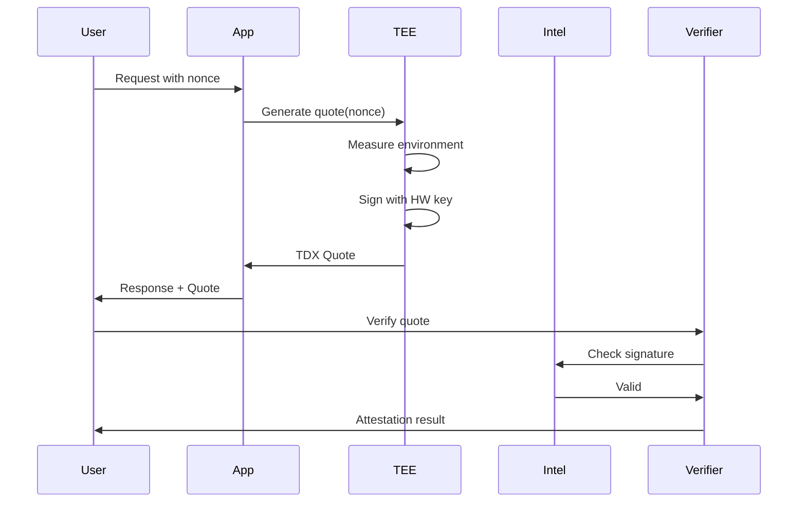
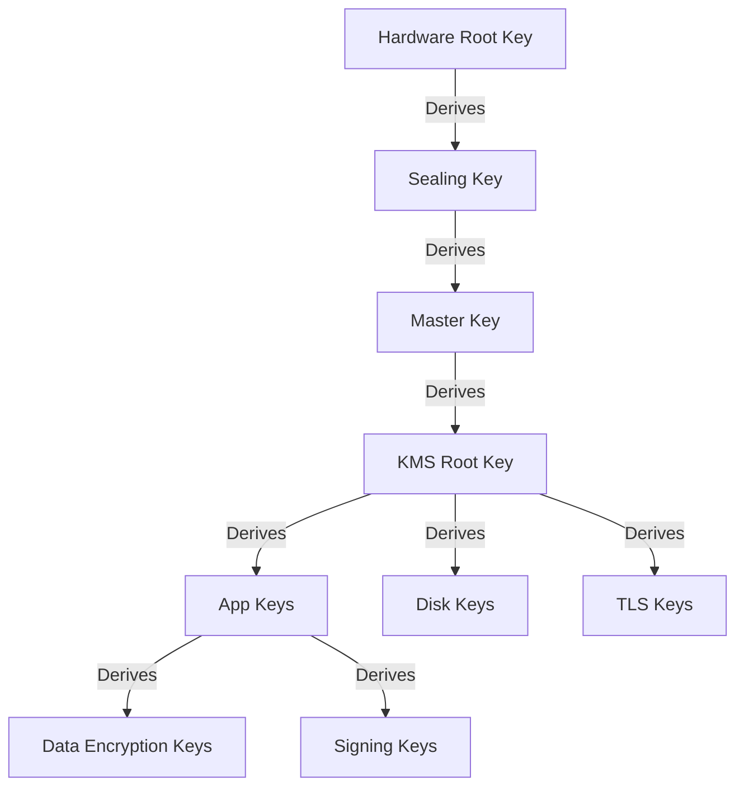
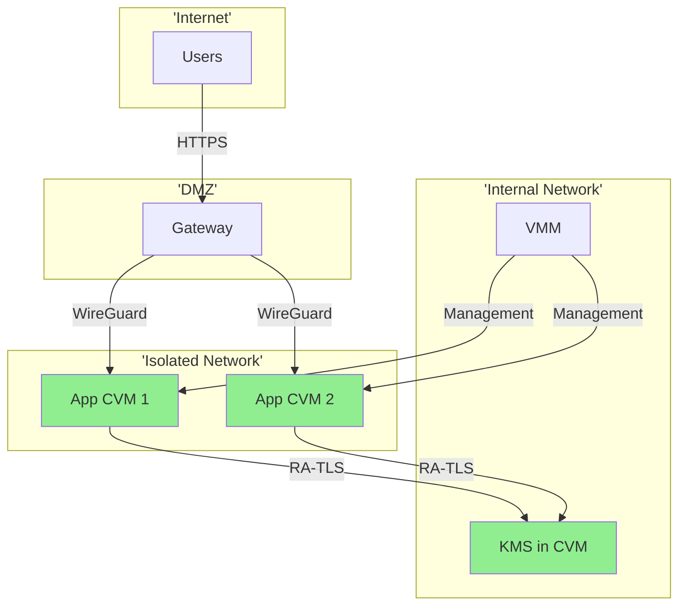

# Security Model

dstack implements a defense-in-depth security architecture leveraging hardware-based Trusted Execution Environments (TEEs), cryptographic attestation, and zero-trust principles. This page explains how these technologies work together to protect your applications and data.

## Security Principles

<div className="grid grid-cols-1 md:grid-cols-3 gap-4 my-6">
  <div className="bg-blue-50 p-6 rounded-lg">
    <div className="text-3xl mb-3">🔒</div>
    <h3 className="font-semibold mb-2">Hardware Root of Trust</h3>

    <p className="text-sm">
      Security starts at the silicon level with TEE hardware that provides cryptographic guarantees
    </p>
  </div>

  <div className="bg-green-50 p-6 rounded-lg">
    <div className="text-3xl mb-3">🛡️</div>
    <h3 className="font-semibold mb-2">Zero Trust Architecture</h3>

    <p className="text-sm">
      Nothing is trusted by default - every component must prove its integrity before interaction
    </p>
  </div>

  <div className="bg-purple-50 p-6 rounded-lg">
    <div className="text-3xl mb-3">🔐</div>
    <h3 className="font-semibold mb-2">End-to-End Encryption</h3>

    <p className="text-sm">
      Data is encrypted at rest, in transit, and during processing within the TEE
    </p>
  </div>
</div>

## Trust Boundaries

dstack clearly defines what is inside and outside the trust boundary:

<div className="bg-gray-50 p-6 rounded-lg my-6">
  <h3 className="font-semibold mb-4">Trust Model Visualization</h3>

  ```mermaid
  graph TB
      subgraph 'Trusted Zone'
          TEE[TEE Hardware]
          CVM[Confidential VM]
          APP[Your Application]
          KEYS[Encryption Keys]
      end
      
      subgraph 'Untrusted Zone'
          HOST[Host OS]
          HV[Hypervisor]
          NET[Network]
          ADMIN[Administrators]
          STORAGE[Storage]
      end
      
      TEE --> CVM
      CVM --> APP
      CVM --> KEYS
      
      HOST -.X.-> CVM
      HV -.X.-> CVM
      NET -.X.-> APP
      ADMIN -.X.-> CVM
      
      classDef trusted fill:#90EE90
      class CVM,APP,KEYS,TEE trusted
  ```
</div>

### Inside the Trust Boundary

✅ **What We Trust:**

* TEE hardware (verified via attestation)
* Code running inside the CVM
* Cryptographic proofs and signatures
* Blockchain consensus mechanisms
* Keys derived within the TEE

### Outside the Trust Boundary

❌ **What We Don't Trust:**

* Host operating system
* Hypervisor (outside TEE mode)
* Physical infrastructure
* Network equipment
* System administrators
* Cloud provider personnel
* Other tenants on shared hardware

## Hardware Security Features

### Intel TDX (Trust Domain Extensions)

dstack primarily uses Intel TDX for hardware-based security:

<table className="w-full my-4">
  <thead>
    <tr className="bg-gray-100">
      <th className="p-3 text-left">Feature</th>
      <th className="p-3 text-left">Protection Provided</th>
      <th className="p-3 text-left">Attack Mitigated</th>
    </tr>
  </thead>

  <tbody>
    <tr>
      <td className="p-3 font-semibold">Memory Encryption</td>
      <td className="p-3">AES-128 encryption of VM memory</td>
      <td className="p-3">Memory snooping, cold boot attacks</td>
    </tr>

    <tr className="bg-gray-50">
      <td className="p-3 font-semibold">CPU State Isolation</td>
      <td className="p-3">Dedicated key per Trust Domain</td>
      <td className="p-3">Cross-VM attacks, hypervisor compromise</td>
    </tr>

    <tr>
      <td className="p-3 font-semibold">Integrity Protection</td>
      <td className="p-3">Memory integrity with MAC</td>
      <td className="p-3">Memory replay, corruption attacks</td>
    </tr>

    <tr className="bg-gray-50">
      <td className="p-3 font-semibold">Remote Attestation</td>
      <td className="p-3">Hardware-signed measurements</td>
      <td className="p-3">Code tampering, impersonation</td>
    </tr>
  </tbody>
</table>

### Hardware Attack Mitigation

<div className="bg-red-50 p-6 rounded-lg my-4">
  <h4 className="font-semibold mb-3">Attacks Prevented by TEE:</h4>

  <div className="grid grid-cols-2 gap-4">
    <ul className="space-y-2">
      <li>• <strong>Memory Attacks:</strong> DMA, cold boot, bus snooping</li>
      <li>• <strong>Software Attacks:</strong> Hypervisor exploits, kernel rootkits</li>
      <li>• <strong>Side Channels:</strong> Cache timing, power analysis (mitigated)</li>
    </ul>

    <ul className="space-y-2">
      <li>• <strong>Physical Access:</strong> Memory probing, JTAG debugging</li>
      <li>• <strong>Supply Chain:</strong> Hardware implants (detectable)</li>
      <li>• <strong>Insider Threats:</strong> Malicious administrators</li>
    </ul>
  </div>
</div>

## Remote Attestation

Remote attestation is the cornerstone of dstack's security model, providing cryptographic proof that code is running unmodified in a genuine TEE.

### Attestation Process



### Quote Components

A TDX attestation quote contains:

<div className="bg-blue-50 p-4 rounded-lg my-4">
  <h4 className="font-semibold mb-3">Quote Structure:</h4>

  <pre className="bg-white p-3 rounded text-sm overflow-x-auto">
    ```js
    {
      "header": {
        "version": 4,
        "attestation_key_type": "ECDSA_P256",
        "tee_type": "TDX"
      },
      "td_quote_body": {
        "mr_config_id": "sha384:abc123...",    // Configuration
        "mr_owner": "sha384:def456...",        // Owner identity
        "mr_owner_config": "sha384:ghi789...", // Owner config
        "mr_td": "sha384:jkl012...",          // TD measurement
        "rtmr_0": "sha384:mno345...",         // Runtime measurement 0
        "rtmr_1": "sha384:pqr678...",         // Runtime measurement 1
        "rtmr_2": "sha384:stu901...",         // Runtime measurement 2
        "rtmr_3": "sha384:vwx234..."          // Runtime measurement 3
      },
      "signature": "0x..."  // ECDSA signature
    }
    ```
  </pre>
</div>

### Measurement Chain

<table className="w-full my-4">
  <thead>
    <tr className="bg-gray-100">
      <th className="p-3 text-left">Register</th>
      <th className="p-3 text-left">Measures</th>
      <th className="p-3 text-left">Verified By</th>
    </tr>
  </thead>

  <tbody>
    <tr>
      <td className="p-3 font-semibold">MRTD</td>
      <td className="p-3">Initial TD build (kernel, initrd)</td>
      <td className="p-3">Build reproducibility</td>
    </tr>

    <tr className="bg-gray-50">
      <td className="p-3 font-semibold">RTMR\[0]</td>
      <td className="p-3">UEFI, bootloader, kernel</td>
      <td className="p-3">Secure boot chain</td>
    </tr>

    <tr>
      <td className="p-3 font-semibold">RTMR\[1]</td>
      <td className="p-3">Kernel command line, initrd</td>
      <td className="p-3">Boot configuration</td>
    </tr>

    <tr className="bg-gray-50">
      <td className="p-3 font-semibold">RTMR\[2]</td>
      <td className="p-3">Root filesystem, dstack-os</td>
      <td className="p-3">System integrity</td>
    </tr>

    <tr>
      <td className="p-3 font-semibold">RTMR\[3]</td>
      <td className="p-3">Application containers</td>
      <td className="p-3">App integrity</td>
    </tr>
  </tbody>
</table>

## Encryption Architecture

dstack implements multiple layers of encryption:

### Encryption Layers

<div className="bg-green-50 p-6 rounded-lg my-4">
  <h4 className="font-semibold mb-3">Defense in Depth Encryption:</h4>

  ```mermaid
  graph TD
      A[Application Data] -->|App Encryption| B[Encrypted App Data]
      B -->|TLS 1.3| C[Network Encryption]
      C -->|WireGuard VPN| D[Tunnel Encryption]
      D -->|Storage Encryption| E[LUKS/dm-crypt]
      E -->|Memory Encryption| F[TDX AES-128]
      
      style A fill:#ffcccc
      style F fill:#ccffcc
  ```
</div>

### Key Management Hierarchy



### Encryption Standards

| Layer           | Algorithm         | Key Size | Purpose                 |
| --------------- | ----------------- | -------- | ----------------------- |
| **Memory**      | AES-XTS           | 128-bit  | TEE memory encryption   |
| **Storage**     | AES-XTS           | 256-bit  | Full disk encryption    |
| **Network**     | ChaCha20-Poly1305 | 256-bit  | WireGuard tunnels       |
| **TLS**         | AES-256-GCM       | 256-bit  | HTTPS traffic           |
| **Application** | User choice       | Variable | App-specific encryption |

## Key Management

### Decentralized KMS

dstack's KMS avoids single points of failure:

<div className="grid grid-cols-1 md:grid-cols-2 gap-6 my-6">
  <div className="bg-blue-50 p-4 rounded-lg">
    <h4 className="font-semibold mb-2">Traditional KMS Issues</h4>

    <ul className="text-sm space-y-1">
      <li>❌ Central key storage</li>
      <li>❌ Vendor lock-in</li>
      <li>❌ Single point of failure</li>
      <li>❌ Trust in provider required</li>
    </ul>
  </div>

  <div className="bg-green-50 p-4 rounded-lg">
    <h4 className="font-semibold mb-2">dstack KMS Benefits</h4>

    <ul className="text-sm space-y-1">
      <li>✅ Keys derived deterministically</li>
      <li>✅ Portable across providers</li>
      <li>✅ Blockchain-based authorization</li>
      <li>✅ No key storage needed</li>
    </ul>
  </div>
</div>

### Key Derivation Process

```python
# Conceptual key derivation
def derive_app_key(app_id, measurement):
    # Hardware root key (never exposed)
    hw_key = get_hardware_sealing_key()
    
    # Derive master key from hardware
    master_key = kdf(hw_key, "dstack-master")
    
    # Derive app-specific key
    app_key = kdf(master_key, app_id || measurement)
    
    # Key is deterministic but unique
    return app_key
```

## Certificate Management

### TLS Certificate Hierarchy

<div className="bg-gray-50 p-6 rounded-lg my-4">
  <h4 className="font-semibold mb-3">Certificate Chain:</h4>

  ```
  Let's Encrypt Root CA
  └── Let's Encrypt Intermediate
      └── Gateway Domain Certificate (*.app.example.com)

  dstack Root CA (in KMS)
  └── Service Certificates
      ├── KMS RA-TLS Certificate
      ├── VMM Service Certificate
      └── Guest Agent Certificates
  ```
</div>

### Certificate Transparency

All certificates are monitored for security:

| Certificate Type  | Monitoring       | Action on Anomaly     |
| ----------------- | ---------------- | --------------------- |
| **Domain Certs**  | CT logs          | Alert + investigation |
| **Service Certs** | Internal audit   | Automatic revocation  |
| **RA-TLS Certs**  | Quote validation | Reject connection     |

## Network Security

### Defense Against Network Attacks

<table className="w-full my-4">
  <thead>
    <tr className="bg-gray-100">
      <th className="p-3 text-left">Attack Vector</th>
      <th className="p-3 text-left">Protection</th>
      <th className="p-3 text-left">Implementation</th>
    </tr>
  </thead>

  <tbody>
    <tr>
      <td className="p-3 font-semibold">Man-in-the-Middle</td>
      <td className="p-3">TLS + RA-TLS</td>
      <td className="p-3">Certificate pinning, attestation</td>
    </tr>

    <tr className="bg-gray-50">
      <td className="p-3 font-semibold">Traffic Analysis</td>
      <td className="p-3">WireGuard VPN</td>
      <td className="p-3">Encrypted tunnels, minimal metadata</td>
    </tr>

    <tr>
      <td className="p-3 font-semibold">DDoS</td>
      <td className="p-3">Rate limiting</td>
      <td className="p-3">Gateway-level protection</td>
    </tr>

    <tr className="bg-gray-50">
      <td className="p-3 font-semibold">DNS Hijacking</td>
      <td className="p-3">DNSSEC + CAA</td>
      <td className="p-3">Signed DNS, cert restrictions</td>
    </tr>
  </tbody>
</table>

### Network Isolation



## Blockchain Security

### Smart Contract Security

dstack uses blockchain for decentralized trust:

<div className="bg-purple-50 p-6 rounded-lg my-4">
  <h4 className="font-semibold mb-3">Contract Security Measures:</h4>

  <ul className="space-y-2">
    <li>• <strong>Audited Contracts:</strong> All contracts professionally audited</li>
    <li>• <strong>Upgrade Mechanism:</strong> Time-locked upgrades with governance</li>
    <li>• <strong>Access Control:</strong> Role-based permissions</li>
    <li>• <strong>Emergency Pause:</strong> Circuit breaker for security incidents</li>
  </ul>
</div>

### Authorization Flow

```solidity
// Simplified authorization check
function authorizeApp(
    bytes32 appId,
    bytes32 measurement,
    address requester
) external view returns (bool) {
    // Check KMS is registered
    require(kmsRegistry[requester].active, "KMS not registered");
    
    // Check app is whitelisted
    require(appWhitelist[appId].active, "App not whitelisted");
    
    // Verify measurement matches
    require(
        appWhitelist[appId].measurement == measurement,
        "Invalid measurement"
    );
    
    return true;
}
```

## Security Best Practices

### For Developers

<div className="bg-blue-50 p-6 rounded-lg my-4">
  <h4 className="font-semibold mb-3">Development Security Checklist:</h4>

  <ul className="space-y-2">
    <li>☐ Use official base images from trusted registries</li>
    <li>☐ Scan containers for vulnerabilities before deployment</li>
    <li>☐ Implement least privilege principles in containers</li>
    <li>☐ Use secrets management instead of hardcoded values</li>
    <li>☐ Enable health checks and monitoring</li>
    <li>☐ Implement proper input validation</li>
    <li>☐ Use strong encryption for sensitive data</li>
    <li>☐ Regular security updates and patches</li>
  </ul>
</div>

### For Operations

<div className="bg-green-50 p-6 rounded-lg my-4">
  <h4 className="font-semibold mb-3">Operational Security Guidelines:</h4>

  <ul className="space-y-2">
    <li>☐ Verify attestation before trusting any CVM</li>
    <li>☐ Monitor certificate transparency logs</li>
    <li>☐ Implement network segmentation</li>
    <li>☐ Use hardware security modules for key ceremony</li>
    <li>☐ Regular security audits and penetration testing</li>
    <li>☐ Incident response plan for TEE compromises</li>
    <li>☐ Secure backup and recovery procedures</li>
    <li>☐ Access logging and anomaly detection</li>
  </ul>
</div>

## Compliance & Standards

dstack's security model helps meet various compliance requirements:

<table className="w-full my-4">
  <thead>
    <tr className="bg-gray-100">
      <th className="p-3 text-left">Standard</th>
      <th className="p-3 text-left">Requirement</th>
      <th className="p-3 text-left">How dstack Helps</th>
    </tr>
  </thead>

  <tbody>
    <tr>
      <td className="p-3 font-semibold">HIPAA</td>
      <td className="p-3">Data encryption, access control</td>
      <td className="p-3">Hardware encryption, attestation-based access</td>
    </tr>

    <tr className="bg-gray-50">
      <td className="p-3 font-semibold">PCI-DSS</td>
      <td className="p-3">Secure key storage, network isolation</td>
      <td className="p-3">TEE key protection, network segmentation</td>
    </tr>

    <tr>
      <td className="p-3 font-semibold">GDPR</td>
      <td className="p-3">Data protection, right to deletion</td>
      <td className="p-3">Encryption by default, cryptographic deletion</td>
    </tr>

    <tr className="bg-gray-50">
      <td className="p-3 font-semibold">SOC 2</td>
      <td className="p-3">Security controls, monitoring</td>
      <td className="p-3">Hardware-based controls, audit logs</td>
    </tr>
  </tbody>
</table>

## Security Monitoring

### What to Monitor

<div className="grid grid-cols-1 md:grid-cols-3 gap-4 my-6">
  <div className="border rounded-lg p-4">
    <h4 className="font-semibold mb-2">Attestation Events</h4>

    <ul className="text-sm space-y-1">
      <li>• Quote generation frequency</li>
      <li>• Failed verifications</li>
      <li>• Measurement changes</li>
    </ul>
  </div>

  <div className="border rounded-lg p-4">
    <h4 className="font-semibold mb-2">Key Operations</h4>

    <ul className="text-sm space-y-1">
      <li>• Key derivation requests</li>
      <li>• Failed authorizations</li>
      <li>• Unusual access patterns</li>
    </ul>
  </div>

  <div className="border rounded-lg p-4">
    <h4 className="font-semibold mb-2">Network Security</h4>

    <ul className="text-sm space-y-1">
      <li>• TLS handshake failures</li>
      <li>• Certificate anomalies</li>
      <li>• Traffic patterns</li>
    </ul>
  </div>
</div>

## Summary

dstack's security model provides:

* **Hardware-based protection** through TEEs
* **Cryptographic verification** via attestation
* **Defense in depth** with multiple security layers
* **Zero trust architecture** with no implicit trust
* **Decentralized trust** through blockchain
* **End-to-end encryption** for all data
* **Compliance support** for regulated industries

## Next Steps

<CardGroup cols={3}>
  <Card title="Deploy Securely" icon="shield" href="/docs/deployment-guides/deploying-applications">
    Learn deployment best practices
  </Card>

  {/* Key management guide coming soon:
    <Card title="Manage Keys" icon="key" href="/deployment-guides/managing-keys-and-secrets">
      Configure key management
    </Card>
    <Card title="Monitor Security" icon="chart-line" href="/deployment-guides/monitoring-and-logging">
      Set up security monitoring
    </Card>
    */}
</CardGroup>

For deployment guides and security best practices, see our [deployment documentation](/docs/deployment-guides/deploying-applications).

### Implementation in dstack

dstack integrates with blockchain smart contracts for:

* Application registration and updates
* Device ID management
* Measurement verification
* Access control policies

For deployment details, see [Deploying Applications](/docs/deployment-guides/deploying-applications).

## Getting Started with Secure Deployments

To deploy your first secure application:

1. Set up your environment following the [installation guide](/docs/getting-started/installation)
2. Deploy the KMS and gateway components
3. Register your application with the blockchain
4. Deploy your containerized application

For detailed instructions, see our [deployment guide](/docs/deployment-guides/deploying-applications).
