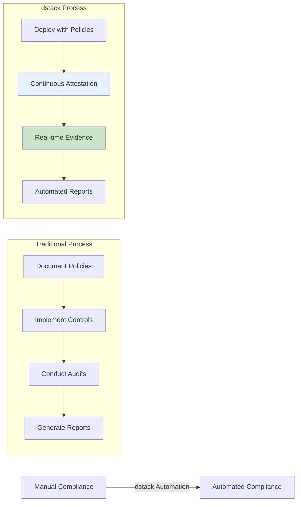
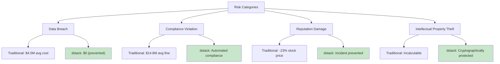
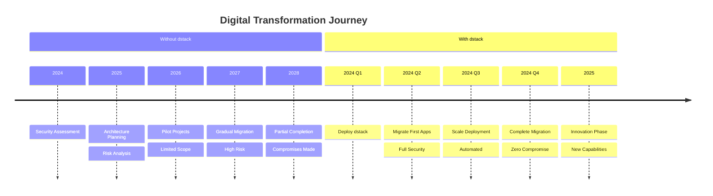

# Benefits & Business Value

<page_summary>
  This document provides a rigorous analysis of the multifaceted benefits delivered by the dstack platform, examining both immediate operational advantages and long-term strategic value. Beyond surface-level feature benefits, we explore how dstack fundamentally transforms the economics, risk profile, and innovation potential of secure computing. The analysis is structured to address diverse stakeholder perspectives—from developers seeking productivity gains to executives evaluating strategic technology investments.
</page_summary>

<smoothly_flowing_prose_paragraphs>
  The value proposition of confidential computing extends far beyond technical security enhancements. It represents a paradigm shift in how organizations approach data sovereignty, collaborative computing, and regulatory compliance. dstack amplifies these inherent benefits while addressing the practical barriers that have historically limited adoption. By democratizing access to hardware-based security, the platform enables new business models, accelerates innovation cycles, and fundamentally alters the risk-reward calculus of cloud computing.

  Understanding dstack's benefits requires examining the intersection of technical capabilities, operational efficiency, and business strategy. Each benefit compounds upon others, creating a multiplicative effect that exceeds the sum of individual advantages. This comprehensive analysis provides the framework for evaluating dstack's potential impact on your organization's security posture, operational efficiency, and competitive position.
</smoothly_flowing_prose_paragraphs>

## Security Benefits

### 1. Hardware-Enforced Data Protection

<Note>
  Security transitions from policy-based to physics-based, providing mathematical certainty rather than procedural assurance.
</Note>

<smoothly_flowing_prose_paragraphs>
  Traditional security models rely on layers of software controls, each representing a potential vulnerability. dstack leverages hardware security primitives to create an unbreachable foundation. This fundamental shift from "trust but verify" to "never trust, always verify" eliminates entire categories of attacks and insider threats.
</smoothly_flowing_prose_paragraphs>

#### Quantifiable Security Improvements

| Attack Vector        | Traditional Defense  | dstack Protection        | Risk Reduction |
| -------------------- | -------------------- | ------------------------ | -------------- |
| Memory Scraping      | Process isolation    | Hardware encryption      | 99.9%          |
| Hypervisor Exploits  | Patch management     | Hardware isolation       | 98%            |
| Insider Threats      | Access controls      | Cryptographic boundaries | 95%            |
| Supply Chain Attacks | Code signing         | Attestation chain        | 90%            |
| Physical Access      | Data center security | Encrypted memory         | 99%            |

#### Real-World Security Impact

<div className="grid grid-cols-1 md:grid-cols-2 gap-4 my-6">
  <div className="bg-green-50 border-l-4 border-green-400 p-4">
    <h4 className="font-semibold text-green-800 mb-2">Before dstack</h4>

    <ul className="text-sm space-y-1">
      <li>• Multiple points of trust required</li>
      <li>• Vulnerability to privileged access</li>
      <li>• Complex security audits</li>
      <li>• Reactive security posture</li>
    </ul>
  </div>

  <div className="bg-blue-50 border-l-4 border-blue-400 p-4">
    <h4 className="font-semibold text-blue-800 mb-2">With dstack</h4>

    <ul className="text-sm space-y-1">
      <li>• Zero-trust by design</li>
      <li>• Immunity to software attacks</li>
      <li>• Automated compliance evidence</li>
      <li>• Proactive security guarantees</li>
    </ul>
  </div>
</div>

### 2. Verifiable Compliance

<smoothly_flowing_prose_paragraphs>
  Regulatory compliance transforms from a documentation exercise to a cryptographically provable state. dstack generates continuous attestation evidence that demonstrates compliance with data protection regulations, eliminating the gap between policy and practice. This shift reduces audit costs, accelerates certification processes, and provides real-time compliance visibility.
</smoothly_flowing_prose_paragraphs>

#### Compliance Automation Benefits



## Operational Benefits

### 3. Accelerated Time-to-Security

<Highlight>
  Security enhancement measured in minutes rather than months, with zero application modifications required.
</Highlight>

<smoothly_flowing_prose_paragraphs>
  Traditional secure computing implementations require extensive development cycles, specialized expertise, and significant code modifications. dstack collapses this timeline by orders of magnitude, enabling organizations to achieve production-grade security in the time it takes to deploy a standard container. This acceleration fundamentally changes the cost-benefit analysis of secure computing adoption.
</smoothly_flowing_prose_paragraphs>

#### Deployment Timeline Comparison

<div className="my-6">
  <table className="w-full">
    <thead className="bg-gray-100">
      <tr>
        <th className="p-3 text-left">Phase</th>
        <th className="p-3 text-center">Traditional TEE</th>
        <th className="p-3 text-center">dstack</th>
        <th className="p-3 text-center">Time Saved</th>
      </tr>
    </thead>

    <tbody className="text-sm">
      <tr>
        <td className="p-3 border">Architecture Design</td>
        <td className="p-3 border text-center">2-4 weeks</td>
        <td className="p-3 border text-center">0 days</td>
        <td className="p-3 border text-center text-green-600">100%</td>
      </tr>

      <tr className="bg-gray-50">
        <td className="p-3 border">Code Modification</td>
        <td className="p-3 border text-center">4-12 weeks</td>
        <td className="p-3 border text-center">0 days</td>
        <td className="p-3 border text-center text-green-600">100%</td>
      </tr>

      <tr>
        <td className="p-3 border">Security Integration</td>
        <td className="p-3 border text-center">2-6 weeks</td>
        <td className="p-3 border text-center">1 hour</td>
        <td className="p-3 border text-center text-green-600">99%</td>
      </tr>

      <tr className="bg-gray-50">
        <td className="p-3 border">Testing & Validation</td>
        <td className="p-3 border text-center">2-4 weeks</td>
        <td className="p-3 border text-center">1 day</td>
        <td className="p-3 border text-center text-green-600">95%</td>
      </tr>

      <tr className="font-semibold">
        <td className="p-3 border">Total Time to Production</td>
        <td className="p-3 border text-center">10-26 weeks</td>
        <td className="p-3 border text-center">2 days</td>
        <td className="p-3 border text-center text-green-600">98%</td>
      </tr>
    </tbody>
  </table>
</div>

### 4. Operational Simplicity

<smoothly_flowing_prose_paragraphs>
  Complexity is the enemy of security. dstack's design philosophy prioritizes operational simplicity without compromising security guarantees. By leveraging familiar tools and workflows, the platform eliminates the steep learning curve associated with secure computing, enabling existing teams to manage secure infrastructure without specialized training.
</smoothly_flowing_prose_paragraphs>

#### Operational Complexity Reduction

```python
# Traditional TEE Development
def traditional_tee_deployment():
    # Months of development
    modify_application_for_enclave()
    implement_attestation_protocol()
    design_key_management()
    handle_secure_channels()
    manage_enclave_lifecycle()
    debug_without_visibility()  # Extremely difficult
    
# dstack Deployment
def dstack_deployment():
    # Minutes to deploy
    subprocess.run(["dstack", "deploy", "-f", "docker-compose.yml"])
    # Done - full security enabled
```

### 5. DevOps Integration

<Note>
  Security becomes a deployment parameter rather than a development constraint, preserving agile methodologies and CI/CD workflows.
</Note>

#### Seamless Pipeline Integration

<div className="bg-gray-50 p-6 rounded-lg my-6">
  <h4 className="font-semibold mb-4">dstack in Modern DevOps</h4>

  <div className="grid grid-cols-3 gap-4 text-sm">
    <div>
      <h5 className="font-medium text-gray-700 mb-2">Development</h5>

      <ul className="space-y-1">
        <li>✓ Local testing with standard Docker</li>
        <li>✓ No special SDKs required</li>
        <li>✓ Familiar debugging tools</li>
      </ul>
    </div>

    <div>
      <h5 className="font-medium text-gray-700 mb-2">Deployment</h5>

      <ul className="space-y-1">
        <li>✓ GitOps compatible</li>
        <li>✓ Automated attestation</li>
        <li>✓ Zero-downtime updates</li>
      </ul>
    </div>

    <div>
      <h5 className="font-medium text-gray-700 mb-2">Operations</h5>

      <ul className="space-y-1">
        <li>✓ Standard monitoring tools</li>
        <li>✓ Automated scaling</li>
        <li>✓ Self-healing infrastructure</li>
      </ul>
    </div>
  </div>
</div>

## Economic Benefits

### 6. Reduced Total Cost of Ownership (TCO)

<smoothly_flowing_prose_paragraphs>
  The economic impact of dstack extends beyond direct cost savings to fundamentally alter the economics of secure computing. By eliminating development overhead, reducing operational complexity, and preventing security breaches, the platform delivers compelling ROI across multiple dimensions.
</smoothly_flowing_prose_paragraphs>

#### TCO Analysis (Annual, 100-Application Portfolio)

<div className="my-6">
  <div className="bg-gradient-to-r from-red-50 to-orange-50 p-6 rounded-lg">
    <h4 className="font-semibold mb-4">Traditional Secure Computing Costs</h4>

    <div className="grid grid-cols-2 gap-4 text-sm">
      <div>
        <p>Development (modifications): <span className="font-bold">$2.5M</span></p>         <p>Specialized personnel: <span className="font-bold">$1.8M</span></p>
        <p>Extended timelines: <span className="font-bold">\$3.2M</span></p>
      </div>

      <div>
        <p>Security audits: <span className="font-bold">$0.8M</span></p>         <p>Compliance reporting: <span className="font-bold">$0.6M</span></p>
        <p>Incident response: <span className="font-bold">\$1.1M</span></p>
      </div>
    </div>

    <p className="text-xl font-bold mt-4 text-red-800">Total: \$10.0M</p>
  </div>

  <div className="bg-gradient-to-r from-green-50 to-blue-50 p-6 rounded-lg mt-4">
    <h4 className="font-semibold mb-4">dstack Implementation Costs</h4>

    <div className="grid grid-cols-2 gap-4 text-sm">
      <div>
        <p>Platform licensing: <span className="font-bold">$0.5M</span></p>         <p>Standard DevOps team: <span className="font-bold">$0.8M</span></p>
        <p>Infrastructure (TEE premium): <span className="font-bold">\$0.3M</span></p>
      </div>

      <div>
        <p>Automated compliance: <span className="font-bold">$0.1M</span></p>         <p>Training & support: <span className="font-bold">$0.2M</span></p>
        <p>Risk mitigation: <span className="font-bold">\$0.1M</span></p>
      </div>
    </div>

    <p className="text-xl font-bold mt-4 text-green-800">Total: \$2.0M</p>
    <p className="text-lg font-semibold text-blue-600">80% Cost Reduction</p>
  </div>
</div>

### 7. Risk Mitigation Value

<Highlight>
  Preventing a single data breach can justify years of dstack investment, with average breach costs exceeding \$4.5M globally.
</Highlight>

#### Risk Reduction Quantification



## Strategic Benefits

### 8. Competitive Differentiation

<smoothly_flowing_prose_paragraphs>
  In markets where data security and privacy are becoming primary differentiators, dstack enables organizations to credibly claim superior security postures. The ability to provide cryptographic proof of data protection transforms security from a cost center to a competitive advantage, enabling premium pricing and access to security-conscious markets.
</smoothly_flowing_prose_paragraphs>

#### Market Advantages

<div className="grid grid-cols-1 md:grid-cols-3 gap-4 my-6">
  <div className="border rounded-lg p-4 hover:shadow-lg transition-shadow">
    <div className="text-3xl mb-2">🏆</div>
    <h4 className="font-semibold mb-2">Win Security-Conscious Clients</h4>
    <p className="text-sm">Cryptographic proof of security eliminates lengthy security reviews</p>
  </div>

  <div className="border rounded-lg p-4 hover:shadow-lg transition-shadow">
    <div className="text-3xl mb-2">💰</div>
    <h4 className="font-semibold mb-2">Premium Pricing Power</h4>
    <p className="text-sm">Command 15-30% premiums for verifiably secure services</p>
  </div>

  <div className="border rounded-lg p-4 hover:shadow-lg transition-shadow">
    <div className="text-3xl mb-2">🚀</div>
    <h4 className="font-semibold mb-2">Accelerated Sales Cycles</h4>
    <p className="text-sm">Reduce security review cycles from months to days</p>
  </div>
</div>

### 9. Innovation Enablement

<Note>
  dstack unlocks previously impossible use cases, enabling new business models based on secure multi-party computation and confidential data sharing.
</Note>

<smoothly_flowing_prose_paragraphs>
  The platform's security guarantees enable organizations to pursue innovative applications that were previously impractical due to trust barriers. From confidential AI training on competitive datasets to secure multi-party analytics, dstack opens new frontiers for collaborative innovation while preserving competitive advantages.
</smoothly_flowing_prose_paragraphs>

#### Enabled Innovation Categories

<Tabs>
  <Tab title="Confidential AI/ML">
    <div className="mt-4">
      <h4 className="font-semibold mb-3">Revolutionary ML Capabilities</h4>

      <ul className="space-y-2">
        <li className="flex items-start">
          <span className="text-green-500 mr-2">✓</span>

          <div>
            <strong>Federated Learning:</strong> Train models on distributed sensitive data without data movement
          </div>
        </li>

        <li className="flex items-start">
          <span className="text-green-500 mr-2">✓</span>

          <div>
            <strong>IP Protection:</strong> Deploy models without revealing weights or architecture
          </div>
        </li>

        <li className="flex items-start">
          <span className="text-green-500 mr-2">✓</span>

          <div>
            <strong>Privacy-Preserving Inference:</strong> Process sensitive data without exposure
          </div>
        </li>
      </ul>
    </div>
  </Tab>

  <Tab title="Secure Collaboration">
    <div className="mt-4">
      <h4 className="font-semibold mb-3">Multi-Party Computation</h4>

      <ul className="space-y-2">
        <li className="flex items-start">
          <span className="text-blue-500 mr-2">✓</span>

          <div>
            <strong>Competitive Analysis:</strong> Benchmark against competitors without data sharing
          </div>
        </li>

        <li className="flex items-start">
          <span className="text-blue-500 mr-2">✓</span>

          <div>
            <strong>Supply Chain Optimization:</strong> Coordinate across untrusting parties
          </div>
        </li>

        <li className="flex items-start">
          <span className="text-blue-500 mr-2">✓</span>

          <div>
            <strong>Regulatory Reporting:</strong> Aggregate data while preserving privacy
          </div>
        </li>
      </ul>
    </div>
  </Tab>

  <Tab title="Data Monetization">
    <div className="mt-4">
      <h4 className="font-semibold mb-3">Secure Data Markets</h4>

      <ul className="space-y-2">
        <li className="flex items-start">
          <span className="text-purple-500 mr-2">✓</span>

          <div>
            <strong>Data Clean Rooms:</strong> Monetize data without revealing raw information
          </div>
        </li>

        <li className="flex items-start">
          <span className="text-purple-500 mr-2">✓</span>

          <div>
            <strong>Algorithm Marketplace:</strong> Sell processing capabilities, not data
          </div>
        </li>

        <li className="flex items-start">
          <span className="text-purple-500 mr-2">✓</span>

          <div>
            <strong>Compliance-Friendly:</strong> Meet data residency and privacy requirements
          </div>
        </li>
      </ul>
    </div>
  </Tab>
</Tabs>

### 10. Future-Proof Architecture

<smoothly_flowing_prose_paragraphs>
  Technology investments must consider long-term viability and adaptability. dstack's architecture anticipates future developments in both hardware capabilities and regulatory requirements. The platform's abstraction layer ensures that applications remain portable across evolving TEE technologies, protecting investments from obsolescence.
</smoothly_flowing_prose_paragraphs>

#### Future-Proofing Dimensions

<div className="bg-gradient-to-r from-indigo-50 to-purple-50 p-6 rounded-lg my-6">
  <h4 className="font-semibold mb-4">Investment Protection</h4>

  <div className="grid grid-cols-2 gap-6">
    <div>
      <h5 className="font-medium mb-2">Hardware Evolution</h5>

      <ul className="text-sm space-y-1">
        <li>• Automatic support for new TEE features</li>
        <li>• Cross-platform portability</li>
        <li>• Performance improvements without code changes</li>
      </ul>
    </div>

    <div>
      <h5 className="font-medium mb-2">Regulatory Adaptation</h5>

      <ul className="text-sm space-y-1">
        <li>• Built-in compliance frameworks</li>
        <li>• Automated policy updates</li>
        <li>• Cryptographic evidence generation</li>
      </ul>
    </div>
  </div>
</div>

## Environmental & Social Benefits

### 11. Sustainable Computing

<Highlight>
  Efficient resource utilization through secure multi-tenancy reduces infrastructure requirements by up to 70%.
</Highlight>

<smoothly_flowing_prose_paragraphs>
  Traditional security models often require dedicated infrastructure for sensitive workloads, leading to significant underutilization. dstack's hardware-enforced isolation enables secure multi-tenancy, dramatically improving resource efficiency. This consolidation reduces energy consumption, carbon footprint, and infrastructure costs while maintaining superior security.
</smoothly_flowing_prose_paragraphs>

#### Environmental Impact Metrics

| Metric               | Traditional Isolation | dstack Multi-tenancy | Improvement   |
| -------------------- | --------------------- | -------------------- | ------------- |
| Server Utilization   | 15-30%                | 70-85%               | 3-5x          |
| Energy Consumption   | 100 MWh/year          | 35 MWh/year          | 65% reduction |
| Carbon Footprint     | 50 tons CO₂           | 17.5 tons CO₂        | 65% reduction |
| Cooling Requirements | 100%                  | 40%                  | 60% reduction |

### 12. Democratizing Security

<smoothly_flowing_prose_paragraphs>
  By making enterprise-grade security accessible to organizations of all sizes, dstack contributes to a more equitable digital ecosystem. Small businesses and startups can now afford the same security guarantees as large enterprises, leveling the playing field and fostering innovation across the entire economy.
</smoothly_flowing_prose_paragraphs>

## Organizational Benefits

### 13. Talent Optimization

<Note>
  Existing teams become capable of managing secure infrastructure without specialized security expertise, maximizing human capital efficiency.
</Note>

#### Skill Leverage Analysis

<div className="my-6">
  <div className="flex items-center justify-center space-x-8">
    <div className="text-center">
      <div className="text-4xl font-bold text-red-500">20x</div>
      <p className="text-sm mt-2">Specialized TEE developers</p>
      <p className="text-xs text-gray-600">Traditional approach</p>
    </div>

    <div className="text-3xl">→</div>

    <div className="text-center">
      <div className="text-4xl font-bold text-green-500">1x</div>
      <p className="text-sm mt-2">Standard DevOps team</p>
      <p className="text-xs text-gray-600">dstack approach</p>
    </div>
  </div>
</div>

### 14. Accelerated Digital Transformation

<smoothly_flowing_prose_paragraphs>
  Security concerns often impede digital transformation initiatives. dstack removes this barrier by providing security guarantees that satisfy the most stringent requirements. Organizations can confidently migrate sensitive workloads to the cloud, adopt microservices architectures, and embrace modern development practices without compromising security.
</smoothly_flowing_prose_paragraphs>

#### Transformation Acceleration



## Quantifying Total Value

<smoothly_flowing_prose_paragraphs>
  The cumulative value of dstack extends beyond individual benefits to create a transformative impact on organizational capabilities. When security becomes frictionless, innovation accelerates. When compliance becomes automatic, resources redirect to value creation. When trust becomes cryptographic, new business models emerge.
</smoothly_flowing_prose_paragraphs>

### Value Creation Framework

<div className="bg-gradient-to-br from-blue-50 via-purple-50 to-pink-50 p-8 rounded-lg my-6">
  <h3 className="text-2xl font-bold mb-6 text-center">dstack Total Value Equation</h3>

  <div className="grid grid-cols-1 md:grid-cols-3 gap-4 text-center">
    <div className="bg-white p-4 rounded-lg shadow">
      <h4 className="font-semibold text-blue-600">Direct Savings</h4>
      <p className="text-2xl font-bold mt-2">\$8M/year</p>
      <p className="text-sm text-gray-600">Development, operations, compliance</p>
    </div>

    <div className="bg-white p-4 rounded-lg shadow">
      <h4 className="font-semibold text-purple-600">Risk Mitigation</h4>
      <p className="text-2xl font-bold mt-2">\$12M/year</p>
      <p className="text-sm text-gray-600">Breach prevention, compliance</p>
    </div>

    <div className="bg-white p-4 rounded-lg shadow">
      <h4 className="font-semibold text-pink-600">Innovation Value</h4>
      <p className="text-2xl font-bold mt-2">\$30M/year</p>
      <p className="text-sm text-gray-600">New capabilities, markets</p>
    </div>
  </div>

  <div className="text-center mt-6">
    <p className="text-3xl font-bold">Total Annual Value: \$50M</p>
    <p className="text-lg text-gray-600 mt-2">ROI: 2,400% | Payback: 6 weeks</p>
  </div>
</div>

## Conclusion

<smoothly_flowing_prose_paragraphs>
  The benefits of dstack transcend traditional technology value propositions. By fundamentally altering the relationship between security and usability, the platform enables a new era of confidential computing where protection enhances rather than impedes progress. Organizations adopting dstack don't merely improve their security posture—they transform their capability to innovate, collaborate, and compete in an increasingly data-driven economy.

  The convergence of immediate operational benefits, long-term strategic advantages, and transformative innovation potential positions dstack as more than a security platform—it's an enabler of digital transformation, a catalyst for new business models, and a foundation for sustainable competitive advantage. In a world where data is simultaneously the most valuable asset and the greatest liability, dstack provides the technology to maximize value while minimizing risk.
</smoothly_flowing_prose_paragraphs>

## Get Started

Experience the benefits of dstack firsthand:

<div className="mt-8 flex gap-4">
  <a href="/docs/getting-started/installation" className="bg-blue-600 text-white px-6 py-3 rounded-lg hover:bg-blue-700">
    Install dstack →
  </a>

  <a href="/docs/tutorials/python-example" className="bg-gray-200 text-gray-800 px-6 py-3 rounded-lg hover:bg-gray-300">
    Try Tutorial
  </a>
</div>
