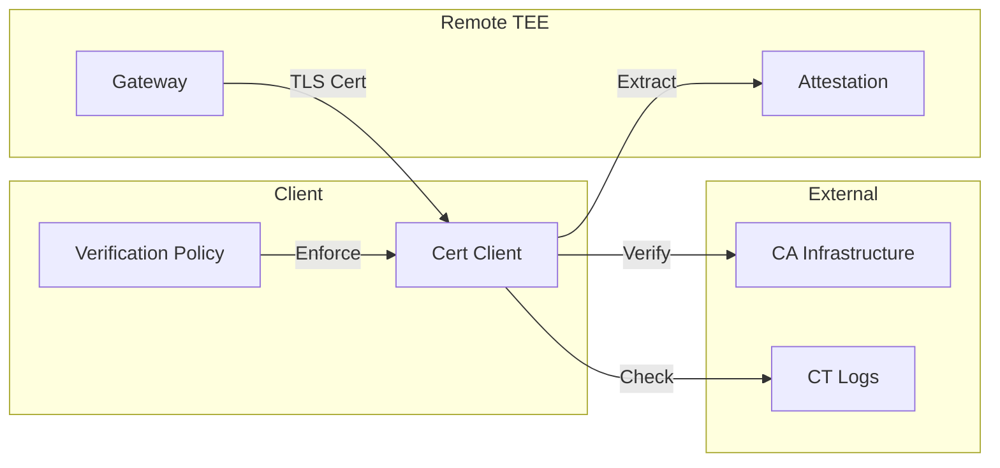

# Certificate Client Security Analysis

<Callout type="info" icon="certificate-check">
  **Component**: `cert-client` | [View Source](https://github.com/Dstack-TEE/dstack/tree/master/cert-client)
</Callout>

<page_summary>
  The cert-client component implements client-side certificate verification and attestation binding for dstack. It validates certificate chains, extracts TEE attestation from certificate extensions, and ensures all TLS connections are authenticated against hardware measurements.
</page_summary>

## Overview

The cert-client provides:

* **Certificate chain validation**: Full X.509 path verification
* **Attestation extraction**: Parses TEE quotes from certificate extensions
* **Policy enforcement**: Configurable trust requirements
* **Revocation checking**: OCSP and CRL support

## Security Architecture

### Trust Flow



### Key Security Properties

<SecurityInsight>
  The cert-client enforces:

  1. Complete certificate chain validation to trusted roots
  2. TEE attestation verification from certificate extensions
  3. Certificate transparency log inclusion checks
  4. Configurable policy constraints on measurements
</SecurityInsight>

## Implementation Details

### Certificate Verification

Core verification logic ([source](https://github.com/Dstack-TEE/dstack/blob/master/cert-client/src/verify.rs)):

```rust
// From cert-client/src/verify.rs
pub struct CertificateVerifier {
    // Trusted root certificates
    trust_store: TrustStore,
    // Attestation policy
    attestation_policy: AttestationPolicy,
    // CT log verifiers
    ct_verifiers: Vec<CtLogVerifier>,
}

impl CertificateVerifier {
    pub async fn verify_certificate_chain(
        &self,
        chain: &[Certificate],
        hostname: &str,
    ) -> Result<VerificationResult> {
        // 1. Basic X.509 path validation
        self.verify_chain_signatures(chain)?;
        
        // 2. Hostname verification
        self.verify_hostname(chain[0], hostname)?;
        
        // 3. Extract and verify attestation
        let attestation = self.extract_attestation(&chain[0])?;
        self.verify_attestation(&attestation)?;
        
        // 4. Certificate transparency checks
        self.verify_ct_inclusion(&chain[0]).await?;
        
        Ok(VerificationResult {
            attestation,
            ct_timestamps: self.get_scts(&chain[0]),
        })
    }
}
```

### Attestation Extraction

TEE attestation from X.509 extensions ([source](https://github.com/Dstack-TEE/dstack/blob/master/cert-client/src/attestation.rs)):

```rust
// From cert-client/src/attestation.rs
const ATTESTATION_OID: &str = "1.3.6.1.4.1.54392.5.1984.1";

pub fn extract_attestation_quote(cert: &Certificate) -> Result<AttestationQuote> {
    // Find attestation extension
    let ext = cert.extensions()
        .find(|e| e.oid == ATTESTATION_OID)
        .ok_or(Error::NoAttestationExtension)?;
    
    // Decode quote from extension value
    let quote_bytes = ext.value()?;
    let quote = AttestationQuote::from_bytes(&quote_bytes)?;
    
    // Verify quote signature
    quote.verify_signature()?;
    
    Ok(quote)
}
```

### Policy Enforcement

Configurable trust policies ([source](https://github.com/Dstack-TEE/dstack/blob/master/cert-client/src/policy.rs)):

```rust
// From cert-client/src/policy.rs
#[derive(Deserialize, Clone)]
pub struct AttestationPolicy {
    // Required measurements
    pub allowed_measurements: Vec<Measurement>,
    // Minimum TCB versions
    pub min_tcb_version: TcbVersion,
    // Required features
    pub required_features: Vec<TdxFeature>,
    // Max quote age
    pub max_quote_age_seconds: u64,
}

impl AttestationPolicy {
    pub fn evaluate(&self, quote: &AttestationQuote) -> PolicyResult {
        // Check measurements
        if !self.allowed_measurements.contains(&quote.measurements) {
            return PolicyResult::Deny("Measurement not allowed");
        }
        
        // Check TCB version
        if quote.tcb_version < self.min_tcb_version {
            return PolicyResult::Deny("TCB version too old");
        }
        
        // Check quote freshness
        let age = SystemTime::now()
            .duration_since(quote.timestamp)?
            .as_secs();
        if age > self.max_quote_age_seconds {
            return PolicyResult::Deny("Quote too old");
        }
        
        PolicyResult::Allow
    }
}
```

## Certificate Transparency Integration

### SCT Verification

Signed Certificate Timestamp validation ([source](https://github.com/Dstack-TEE/dstack/blob/master/cert-client/src/ct.rs)):

```rust
// From cert-client/src/ct.rs
pub struct CtVerifier {
    log_list: LogList,
}

impl CtVerifier {
    pub fn verify_scts(
        &self,
        cert: &Certificate,
        scts: &[SignedCertificateTimestamp],
    ) -> Result<()> {
        // Require minimum number of SCTs
        if scts.len() < 2 {
            return Err(Error::InsufficientScts);
        }
        
        // Verify each SCT
        for sct in scts {
            let log = self.log_list.find_log(&sct.log_id)?;
            log.verify_sct(cert, sct)?;
        }
        
        Ok(())
    }
}
```

## Revocation Checking

### OCSP Support

Online Certificate Status Protocol ([source](https://github.com/Dstack-TEE/dstack/blob/master/cert-client/src/ocsp.rs)):

```rust
// From cert-client/src/ocsp.rs
pub async fn check_ocsp_status(
    cert: &Certificate,
    issuer: &Certificate,
) -> Result<OcspStatus> {
    // Extract OCSP responder URL
    let ocsp_url = cert.ocsp_responders()
        .first()
        .ok_or(Error::NoOcspResponder)?;
    
    // Build OCSP request
    let request = OcspRequestBuilder::new()
        .certificate(cert)
        .issuer(issuer)
        .build()?;
    
    // Send request and verify response
    let response = send_ocsp_request(ocsp_url, request).await?;
    verify_ocsp_response(&response, cert, issuer)?;
    
    Ok(response.cert_status)
}
```

## Performance Optimization

### Connection Caching

Reuse verified connections ([source](https://github.com/Dstack-TEE/dstack/blob/master/cert-client/src/cache.rs)):

```rust
// From cert-client/src/cache.rs
pub struct ConnectionCache {
    // Verified connections by endpoint
    connections: Arc<RwLock<HashMap<String, VerifiedConnection>>>,
    // Maximum cache duration
    max_age: Duration,
}

impl ConnectionCache {
    pub fn get_verified_connection(
        &self,
        endpoint: &str,
    ) -> Option<VerifiedConnection> {
        let connections = self.connections.read().unwrap();
        
        connections.get(endpoint)
            .filter(|conn| !conn.is_expired())
            .cloned()
    }
}
```

## Error Handling

### Security-Critical Failures

```rust
// From cert-client/src/errors.rs
#[derive(Debug, Error)]
pub enum VerificationError {
    #[error("Invalid certificate chain")]
    InvalidChain,
    
    #[error("Attestation verification failed: {0}")]
    AttestationFailed(String),
    
    #[error("Policy violation: {0}")]
    PolicyViolation(String),
    
    #[error("Certificate revoked")]
    CertificateRevoked,
    
    #[error("CT verification failed")]
    CtVerificationFailed,
}
```

## Configuration

### Client Configuration Options

```toml
# cert-client.toml
[verification]
# Require attestation in all certificates
require_attestation = true

# Maximum certificate chain length
max_chain_length = 3

# OCSP timeout
ocsp_timeout_seconds = 5

[policy]
# Allowed enclave measurements
allowed_measurements = [
    "0x1234567890abcdef...",
    "0xfedcba0987654321..."
]

# Minimum TCB version
min_tcb_version = "1.5.0"

# Maximum quote age
max_quote_age_seconds = 300

[ct]
# Minimum SCTs required
min_scts = 2

# Trusted CT logs
trusted_logs = [
    "Google 'Argon2023'",
    "Cloudflare 'Nimbus2023'"
]
```

## Security Best Practices

<Tabs>
  <Tab title="Implementation">
    * Always verify full certificate chains
    * Check revocation status for critical connections
    * Implement certificate pinning for known endpoints
    * Cache verification results appropriately
  </Tab>

  <Tab title="Configuration">
    * Use strict attestation policies
    * Require multiple CT SCTs
    * Set appropriate quote age limits
    * Monitor policy violations
  </Tab>
</Tabs>

## Integration Examples

### Basic Usage

```rust
// Example usage
use cert_client::{CertificateVerifier, AttestationPolicy};

async fn verify_tls_connection(
    stream: TlsStream,
    expected_hostname: &str,
) -> Result<AttestationQuote> {
    // Create verifier with policy
    let policy = AttestationPolicy::from_file("policy.toml")?;
    let verifier = CertificateVerifier::new(policy);
    
    // Get peer certificates
    let certs = stream.peer_certificates()?;
    
    // Verify chain and extract attestation
    let result = verifier.verify_certificate_chain(
        &certs,
        expected_hostname,
    ).await?;
    
    Ok(result.attestation)
}
```

## Threat Model

| Attack Vector            | Protection                     | Notes                  |
| ------------------------ | ------------------------------ | ---------------------- |
| Certificate substitution | Chain validation               | Requires CA compromise |
| Attestation forgery      | Quote signature verification   | Hardware-backed        |
| Downgrade attacks        | Policy enforcement             | No fallback allowed    |
| Privacy leaks            | No external queries by default | OCSP optional          |

## References

* [X.509 Certificate Extensions](https://datatracker.ietf.org/doc/html/rfc5280)
* [Certificate Transparency](https://datatracker.ietf.org/doc/html/rfc6962)
* [OCSP Protocol](https://datatracker.ietf.org/doc/html/rfc6960)
* [dstack Cert Client Design](https://github.com/Dstack-TEE/dstack/blob/master/cert-client/DESIGN.md)

<div className="mt-8 p-4 bg-indigo-50 rounded-lg border border-indigo-200">
  <p className="text-sm text-indigo-800">
    <strong>Next Component:</strong> Learn about certificate transparency monitoring in <a href="/docs/security-research/ct-monitor-security" className="underline">CT monitor security</a>.
  </p>
</div>
