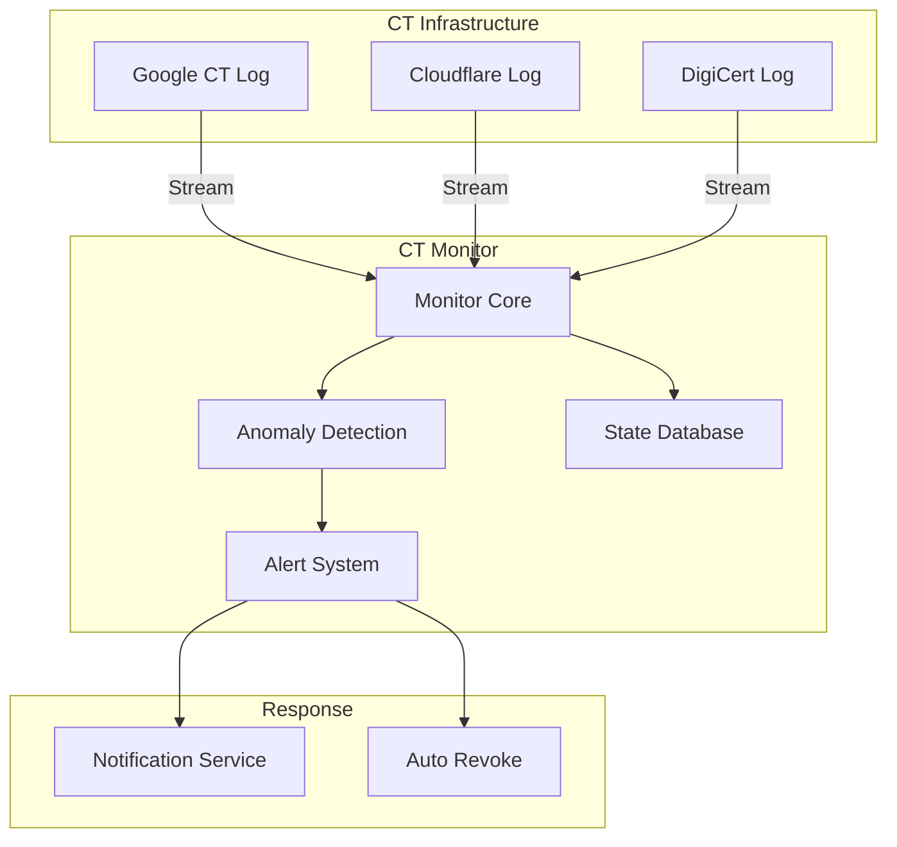

# Certificate Transparency Monitor Security Analysis

<Callout type="info" icon="magnifying-glass">
  **Component**: `ct-monitor` | [View Source](https://github.com/Dstack-TEE/dstack/tree/master/ct-monitor)
</Callout>

<page_summary>
  The ct-monitor component provides continuous monitoring of Certificate Transparency logs to detect unauthorized certificate issuance for dstack domains. It implements real-time alerting, anomaly detection, and automated response capabilities to protect against certificate misissuance attacks.
</page_summary>

## Overview

The CT monitor provides:

* **Real-time log monitoring**: Watches multiple CT logs for new certificates
* **Domain pattern matching**: Detects certificates for protected domains
* **Anomaly detection**: Identifies suspicious issuance patterns
* **Automated alerting**: Immediate notification of unauthorized certificates

## Security Architecture

### Monitoring Architecture



### Security Model

<SecurityInsight>
  The CT monitor provides defense-in-depth by:

  1. Detecting certificate misissuance within minutes
  2. Correlating issuance patterns across multiple logs
  3. Automatically triggering revocation for unauthorized certificates
  4. Maintaining immutable audit trails of all certificates
</SecurityInsight>

## Implementation Details

### Log Monitoring Core

Real-time CT log monitoring ([source](https://github.com/Dstack-TEE/dstack/blob/master/ct-monitor/src/monitor.rs)):

```rust
// From ct-monitor/src/monitor.rs
pub struct CtMonitor {
    // Active log connections
    log_clients: Vec<CtLogClient>,
    // Domain patterns to monitor
    watched_domains: DomainPatternSet,
    // Alert dispatcher
    alert_dispatcher: AlertDispatcher,
    // State persistence
    state_store: StateStore,
}

impl CtMonitor {
    pub async fn start_monitoring(&mut self) -> Result<()> {
        // Start monitoring each log
        let mut streams = vec![];
        
        for client in &self.log_clients {
            let stream = client.stream_entries(
                self.state_store.get_last_index(&client.log_id)?
            );
            streams.push(stream);
        }
        
        // Process entries from all logs
        loop {
            tokio::select! {
                Some(entry) = streams.select_next_some() => {
                    self.process_log_entry(entry).await?;
                }
            }
        }
    }
    
    async fn process_log_entry(&mut self, entry: LogEntry) -> Result<()> {
        // Extract certificate
        let cert = entry.extract_certificate()?;
        
        // Check if monitored domain
        if self.is_monitored_certificate(&cert) {
            // Verify legitimacy
            match self.verify_certificate_legitimacy(&cert).await {
                Ok(()) => self.record_authorized_cert(&cert),
                Err(e) => self.handle_unauthorized_cert(&cert, e).await?,
            }
        }
        
        // Update state
        self.state_store.update_index(&entry.log_id, entry.index)?;
        
        Ok(())
    }
}
```

### Domain Pattern Matching

Efficient domain monitoring ([source](https://github.com/Dstack-TEE/dstack/blob/master/ct-monitor/src/patterns.rs)):

```rust
// From ct-monitor/src/patterns.rs
pub struct DomainPatternSet {
    // Exact domains
    exact_domains: HashSet<String>,
    // Wildcard patterns
    wildcard_patterns: Vec<WildcardPattern>,
    // Subdomain monitoring
    monitored_roots: Vec<String>,
}

impl DomainPatternSet {
    pub fn matches_certificate(&self, cert: &Certificate) -> bool {
        // Check all SANs
        for san in cert.subject_alternative_names() {
            if self.matches_domain(&san) {
                return true;
            }
        }
        
        false
    }
    
    fn matches_domain(&self, domain: &str) -> bool {
        // Exact match
        if self.exact_domains.contains(domain) {
            return true;
        }
        
        // Wildcard pattern match
        for pattern in &self.wildcard_patterns {
            if pattern.matches(domain) {
                return true;
            }
        }
        
        // Subdomain check
        for root in &self.monitored_roots {
            if domain.ends_with(&format!(".{}", root)) {
                return true;
            }
        }
        
        false
    }
}
```

### Anomaly Detection

Pattern-based anomaly detection ([source](https://github.com/Dstack-TEE/dstack/blob/master/ct-monitor/src/anomaly.rs)):

```rust
// From ct-monitor/src/anomaly.rs
pub struct AnomalyDetector {
    // Historical issuance data
    history: IssuanceHistory,
    // Detection rules
    rules: Vec<Box<dyn AnomalyRule>>,
}

pub trait AnomalyRule: Send + Sync {
    fn evaluate(&self, cert: &Certificate, history: &IssuanceHistory) -> AnomalyScore;
}

// Example: Unusual CA detection
pub struct UnusualCaRule;

impl AnomalyRule for UnusualCaRule {
    fn evaluate(&self, cert: &Certificate, history: &IssuanceHistory) -> AnomalyScore {
        let issuer = cert.issuer();
        let ca_frequency = history.ca_frequency(&issuer);
        
        if ca_frequency == 0 {
            // Never seen this CA before
            AnomalyScore::High(0.9)
        } else if ca_frequency < 0.01 {
            // Rarely used CA
            AnomalyScore::Medium(0.6)
        } else {
            AnomalyScore::Low(0.1)
        }
    }
}
```

### Alert Generation

Multi-channel alerting ([source](https://github.com/Dstack-TEE/dstack/blob/master/ct-monitor/src/alerts.rs)):

```rust
// From ct-monitor/src/alerts.rs
pub struct AlertDispatcher {
    channels: Vec<Box<dyn AlertChannel>>,
    rate_limiter: RateLimiter,
}

impl AlertDispatcher {
    pub async fn send_alert(&mut self, alert: Alert) -> Result<()> {
        // Check rate limits
        if !self.rate_limiter.allow(&alert.domain) {
            return Ok(());
        }
        
        // Send to all channels
        for channel in &mut self.channels {
            if let Err(e) = channel.send(&alert).await {
                error!("Alert channel failed: {}", e);
            }
        }
        
        // Log for audit
        self.log_alert(&alert)?;
        
        Ok(())
    }
}

#[derive(Clone, Serialize)]
pub struct Alert {
    pub severity: Severity,
    pub domain: String,
    pub certificate: CertificateInfo,
    pub anomaly_score: f64,
    pub details: String,
    pub timestamp: SystemTime,
}
```

## Certificate Validation

### Legitimacy Verification

Verify certificates are authorized ([source](https://github.com/Dstack-TEE/dstack/blob/master/ct-monitor/src/validation.rs)):

```rust
// From ct-monitor/src/validation.rs
pub struct CertificateValidator {
    // Known good certificate database
    authorized_certs: AuthorizedCertStore,
    // TEE attestation verifier
    attestation_verifier: AttestationVerifier,
}

impl CertificateValidator {
    pub async fn verify_legitimacy(
        &self,
        cert: &Certificate,
    ) -> Result<LegitimacyStatus> {
        // Check if pre-authorized
        if self.authorized_certs.contains(cert.fingerprint()) {
            return Ok(LegitimacyStatus::Authorized);
        }
        
        // Check attestation extension
        if let Some(attestation) = extract_attestation(cert) {
            if self.attestation_verifier.verify(&attestation).is_ok() {
                return Ok(LegitimacyStatus::ValidAttestation);
            }
        }
        
        // Check CAA records
        if !self.verify_caa_compliance(cert).await? {
            return Ok(LegitimacyStatus::Unauthorized("CAA violation"));
        }
        
        // Unknown certificate
        Ok(LegitimacyStatus::Unknown)
    }
}
```

## Response Automation

### Automated Revocation

Trigger certificate revocation ([source](https://github.com/Dstack-TEE/dstack/blob/master/ct-monitor/src/revocation.rs)):

```rust
// From ct-monitor/src/revocation.rs
pub struct RevocationManager {
    // ACME client for revocation
    acme_client: AcmeClient,
    // Policy engine
    revocation_policy: RevocationPolicy,
}

impl RevocationManager {
    pub async fn handle_unauthorized_cert(
        &self,
        cert: &Certificate,
        reason: &str,
    ) -> Result<()> {
        // Check policy
        if !self.revocation_policy.should_revoke(cert, reason) {
            return Ok(());
        }
        
        // Attempt revocation
        match self.acme_client.revoke_certificate(cert).await {
            Ok(()) => {
                info!("Revoked unauthorized certificate: {}", cert.serial());
            }
            Err(e) => {
                error!("Revocation failed: {}", e);
                // Escalate to manual intervention
                self.escalate_to_security_team(cert, &e)?;
            }
        }
        
        Ok(())
    }
}
```

## Performance & Scalability

### Stream Processing

Efficient log entry processing:

| Metric                | Value              | Notes                    |
| --------------------- | ------------------ | ------------------------ |
| Entry processing rate | 10K/sec            | Per monitor instance     |
| Detection latency     | \<5 seconds        | From log entry to alert  |
| Memory usage          | \~500MB            | For 1M monitored domains |
| State checkpoint      | Every 1000 entries | Resumable monitoring     |

### Horizontal Scaling

```rust
// From ct-monitor/src/scaling.rs
pub struct MonitorCluster {
    // Monitors assigned to specific logs
    monitors: HashMap<LogId, CtMonitor>,
    // Coordinator for deduplication
    coordinator: ClusterCoordinator,
}
```

## Configuration

### Monitor Configuration

```toml
# ct-monitor.toml
[monitoring]
# Domains to monitor
watched_domains = [
    "*.dstack.dev",
    "example.com",
    "*.example.com"
]

# CT logs to monitor
ct_logs = [
    { name = "Google 'Argon2023'", url = "https://ct.googleapis.com/logs/argon2023/" },
    { name = "Cloudflare 'Nimbus2023'", url = "https://ct.cloudflare.com/logs/nimbus2023/" }
]

[anomaly_detection]
# Enable ML-based detection
enable_ml = true

# Anomaly threshold
alert_threshold = 0.7

[alerts]
# Alert channels
channels = [
    { type = "email", to = "security@example.com" },
    { type = "slack", webhook = "https://hooks.slack.com/..." },
    { type = "pagerduty", key = "..." }
]

# Rate limiting
max_alerts_per_hour = 10

[response]
# Auto-revocation
enable_auto_revoke = false
revocation_delay_minutes = 30
```

## Security Considerations

<Tabs>
  <Tab title="Threat Model">
    * **Log poisoning**: Verify SCT signatures
    * **DoS attacks**: Rate limit log connections
    * **False positives**: Multi-factor verification
    * **Alert fatigue**: Smart deduplication
  </Tab>

  <Tab title="Best Practices">
    * Monitor multiple diverse CT logs
    * Implement gradual response escalation
    * Maintain certificate allowlists
    * Regular anomaly rule tuning
  </Tab>
</Tabs>

## Integration Examples

### Basic Monitoring Setup

```rust
// Example setup
use ct_monitor::{CtMonitor, DomainPatternSet, AlertChannel};

async fn setup_monitoring() -> Result<()> {
    // Configure domains
    let domains = DomainPatternSet::new()
        .add_exact("example.com")
        .add_wildcard("*.example.com")
        .add_subdomain_monitoring("example.org");
    
    // Setup alerts
    let email_alerts = EmailAlertChannel::new("security@example.com");
    
    // Create monitor
    let mut monitor = CtMonitor::builder()
        .watch_domains(domains)
        .add_alert_channel(Box::new(email_alerts))
        .add_ct_log("https://ct.googleapis.com/logs/argon2023/")
        .build()?;
    
    // Start monitoring
    monitor.start_monitoring().await
}
```

## Metrics & Observability

### Key Metrics

```rust
// From ct-monitor/src/metrics.rs
pub struct MonitorMetrics {
    // Certificates processed
    certs_processed: Counter,
    // Alerts generated
    alerts_sent: Counter,
    // Processing latency
    processing_latency: Histogram,
    // Log lag time
    log_lag_seconds: Gauge,
}
```

## References

* [Certificate Transparency RFC 6962](https://datatracker.ietf.org/doc/html/rfc6962)
* [CT Log Operations](https://certificate-transparency.org/)
* [Google CT Policy](https://github.com/google/certificate-transparency-community-site/blob/master/docs/google-ct-policy.md)
* [dstack CT Monitor Design](https://github.com/Dstack-TEE/dstack/blob/master/ct-monitor/DESIGN.md)

<div className="mt-8 p-4 bg-orange-50 rounded-lg border border-orange-200">
  <p className="text-sm text-orange-800">
    <strong>Next Component:</strong> Explore TEE host management in <a href="/docs/security-research/host-api-security" className="underline">Host API security</a>.
  </p>
</div>
