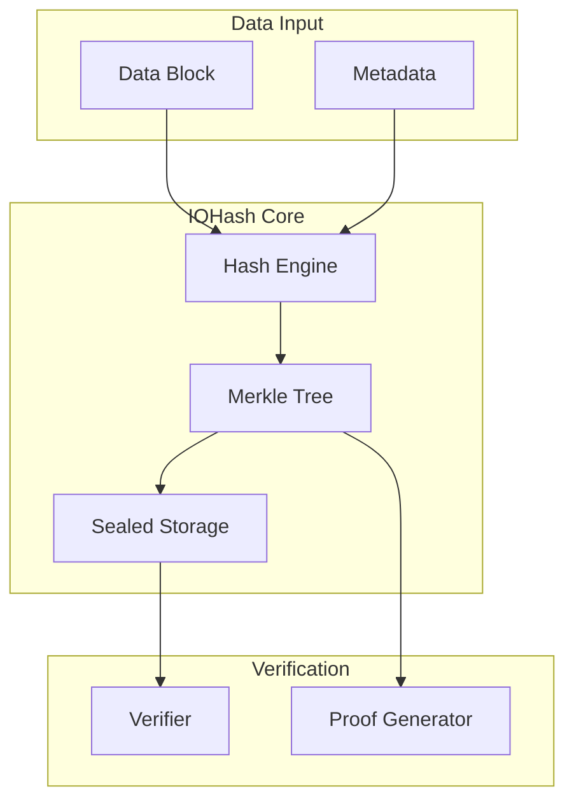

# IOHash Security Architecture

<Callout type="info" icon="hashtag">
  **Component**: `iohash` | [View Source](https://github.com/Dstack-TEE/dstack/tree/master/iohash)
</Callout>

<page_summary>
  The iohash component implements content-addressed storage with cryptographic integrity verification for dstack. It provides tamper-proof data storage, efficient deduplication, and verifiable data provenance through merkle trees and hardware-sealed hashes.
</page_summary>

## Overview

IOHash provides:

* **Content addressing**: Data identified by cryptographic hashes
* **Integrity verification**: Automatic corruption detection
* **Deduplication**: Efficient storage through content hashing
* **Merkle proofs**: Verifiable data inclusion proofs

## Security Architecture

### Content Addressing Model



### Security Properties

<SecurityInsight>
  IOHash ensures data integrity through:

  1. Content-based addressing prevents reference manipulation
  2. Hardware-sealed root hashes protect against tampering
  3. Merkle trees enable efficient verification of large datasets
  4. Attestation binding links data to specific TEE instances
</SecurityInsight>

## Implementation Details

### Hash Engine

Core hashing implementation ([source](https://github.com/Dstack-TEE/dstack/blob/master/iohash/src/hash_engine.rs)):

```rust
// From iohash/src/hash_engine.rs
pub struct HashEngine {
    // Hasher configuration
    algorithm: HashAlgorithm,
    // Block size for chunking
    block_size: usize,
    // Hardware sealing key
    sealing_key: SealingKey,
}

impl HashEngine {
    pub fn hash_data(&self, data: &[u8]) -> ContentHash {
        match self.algorithm {
            HashAlgorithm::Blake3 => {
                let mut hasher = Blake3::new();
                
                // Process in chunks for large data
                for chunk in data.chunks(self.block_size) {
                    hasher.update(chunk);
                }
                
                // Include domain separation
                hasher.update(b"dstack.iohash.v1");
                
                ContentHash(hasher.finalize())
            }
            HashAlgorithm::Sha3_256 => {
                // Alternative hash function
                ContentHash(Sha3_256::digest(data).into())
            }
        }
    }
    
    pub fn seal_hash(&self, hash: &ContentHash) -> SealedHash {
        // Seal to hardware
        self.sealing_key.seal(hash.as_bytes())
    }
}
```

### Merkle Tree Construction

Efficient merkle tree implementation ([source](https://github.com/Dstack-TEE/dstack/blob/master/iohash/src/merkle.rs)):

```rust
// From iohash/src/merkle.rs
pub struct MerkleTree {
    // Tree nodes by level
    levels: Vec<Vec<TreeNode>>,
    // Leaf count
    leaf_count: usize,
}

impl MerkleTree {
    pub fn build(blocks: Vec<DataBlock>) -> Self {
        let mut tree = MerkleTree {
            levels: vec![],
            leaf_count: blocks.len(),
        };
        
        // Build leaf level
        let leaves: Vec<TreeNode> = blocks
            .into_iter()
            .map(|block| TreeNode::leaf(block.hash()))
            .collect();
        
        tree.levels.push(leaves);
        
        // Build internal levels
        while tree.levels.last().unwrap().len() > 1 {
            let prev_level = tree.levels.last().unwrap();
            let mut next_level = vec![];
            
            for pair in prev_level.chunks(2) {
                let left = &pair[0];
                let right = pair.get(1).unwrap_or(left);
                
                let parent = TreeNode::internal(
                    hash_pair(left.hash(), right.hash())
                );
                next_level.push(parent);
            }
            
            tree.levels.push(next_level);
        }
        
        tree
    }
    
    pub fn root(&self) -> &ContentHash {
        &self.levels.last().unwrap()[0].hash()
    }
}
```

### Proof Generation

Merkle proof generation and verification ([source](https://github.com/Dstack-TEE/dstack/blob/master/iohash/src/proof.rs)):

```rust
// From iohash/src/proof.rs
pub struct MerkleProof {
    // Hashes from leaf to root
    path: Vec<ProofNode>,
    // Leaf index
    leaf_index: usize,
}

impl MerkleTree {
    pub fn generate_proof(&self, leaf_index: usize) -> Result<MerkleProof> {
        if leaf_index >= self.leaf_count {
            return Err(Error::InvalidLeafIndex);
        }
        
        let mut path = vec![];
        let mut current_index = leaf_index;
        
        // Traverse from leaf to root
        for level in &self.levels[..self.levels.len() - 1] {
            let sibling_index = current_index ^ 1;
            
            if sibling_index < level.len() {
                path.push(ProofNode {
                    hash: level[sibling_index].hash().clone(),
                    position: if current_index % 2 == 0 { 
                        Position::Right 
                    } else { 
                        Position::Left 
                    },
                });
            }
            
            current_index /= 2;
        }
        
        Ok(MerkleProof { path, leaf_index })
    }
}

pub fn verify_proof(
    leaf: &ContentHash,
    proof: &MerkleProof,
    root: &ContentHash,
) -> bool {
    let mut current = leaf.clone();
    
    for node in &proof.path {
        current = match node.position {
            Position::Left => hash_pair(&node.hash, &current),
            Position::Right => hash_pair(&current, &node.hash),
        };
    }
    
    current == *root
}
```

### Storage Backend

Secure storage implementation ([source](https://github.com/Dstack-TEE/dstack/blob/master/iohash/src/storage.rs)):

```rust
// From iohash/src/storage.rs
pub struct SecureStorage {
    // Backend storage
    backend: Box<dyn StorageBackend>,
    // Encryption key
    encryption_key: EncryptionKey,
    // Integrity metadata
    metadata_store: MetadataStore,
}

impl SecureStorage {
    pub async fn store_block(
        &self,
        data: &[u8],
    ) -> Result<ContentHash> {
        // 1. Hash the data
        let hash = self.hash_engine.hash_data(data);
        
        // 2. Check if already exists (deduplication)
        if self.backend.exists(&hash).await? {
            return Ok(hash);
        }
        
        // 3. Encrypt data
        let encrypted = self.encrypt_block(data, &hash)?;
        
        // 4. Store encrypted block
        self.backend.put(&hash, &encrypted).await?;
        
        // 5. Update metadata
        self.metadata_store.record_block(&hash, data.len()).await?;
        
        Ok(hash)
    }
    
    pub async fn retrieve_block(
        &self,
        hash: &ContentHash,
    ) -> Result<Vec<u8>> {
        // 1. Fetch encrypted data
        let encrypted = self.backend.get(hash).await?;
        
        // 2. Decrypt
        let data = self.decrypt_block(&encrypted, hash)?;
        
        // 3. Verify hash
        let computed_hash = self.hash_engine.hash_data(&data);
        if computed_hash != *hash {
            return Err(Error::IntegrityViolation);
        }
        
        Ok(data)
    }
}
```

## Deduplication System

### Content-Based Deduplication

Efficient storage through deduplication:

```rust
// From iohash/src/dedup.rs
pub struct Deduplicator {
    // Block index
    block_index: Arc<RwLock<HashMap<ContentHash, BlockMetadata>>>,
    // Reference counting
    ref_counts: Arc<RwLock<HashMap<ContentHash, usize>>>,
}

impl Deduplicator {
    pub async fn deduplicate_file(
        &self,
        file_data: &[u8],
    ) -> Result<FileDescriptor> {
        // 1. Chunk file into blocks
        let chunks = self.chunk_file(file_data);
        
        // 2. Process each chunk
        let mut block_refs = vec![];
        
        for chunk in chunks {
            let hash = hash_data(&chunk);
            
            // Check if block exists
            let mut ref_counts = self.ref_counts.write().unwrap();
            
            if let Some(count) = ref_counts.get_mut(&hash) {
                // Increment reference
                *count += 1;
                block_refs.push(hash);
            } else {
                // New block, store it
                self.storage.store_block(&chunk).await?;
                ref_counts.insert(hash.clone(), 1);
                block_refs.push(hash);
            }
        }
        
        Ok(FileDescriptor {
            blocks: block_refs,
            total_size: file_data.len(),
        })
    }
}
```

## Attestation Integration

### Binding Data to TEE

Link data to hardware attestation ([source](https://github.com/Dstack-TEE/dstack/blob/master/iohash/src/attestation.rs)):

```rust
// From iohash/src/attestation.rs
pub struct AttestedStorage {
    storage: SecureStorage,
    attestation: AttestationQuote,
}

impl AttestedStorage {
    pub async fn store_with_attestation(
        &self,
        data: &[u8],
        metadata: StorageMetadata,
    ) -> Result<AttestedBlock> {
        // 1. Store data
        let hash = self.storage.store_block(data).await?;
        
        // 2. Create attestation binding
        let binding = AttestationBinding {
            data_hash: hash.clone(),
            attestation_quote: self.attestation.clone(),
            timestamp: SystemTime::now(),
            metadata,
        };
        
        // 3. Sign binding
        let signature = self.sign_binding(&binding)?;
        
        Ok(AttestedBlock {
            hash,
            binding,
            signature,
        })
    }
}
```

## Performance Optimization

### Parallel Processing

Optimize for multi-core systems:

```rust
// From iohash/src/parallel.rs
pub struct ParallelHasher {
    thread_pool: ThreadPool,
    chunk_size: usize,
}

impl ParallelHasher {
    pub async fn hash_large_file(
        &self,
        file_path: &Path,
    ) -> Result<FileHash> {
        let file = File::open(file_path)?;
        let file_size = file.metadata()?.len();
        
        // Parallel chunk processing
        let chunks = (0..file_size)
            .step_by(self.chunk_size)
            .map(|offset| {
                let handle = self.thread_pool.spawn(move || {
                    hash_file_chunk(file_path, offset, self.chunk_size)
                });
                handle
            })
            .collect::<Vec<_>>();
        
        // Collect results
        let chunk_hashes = chunks
            .into_iter()
            .map(|h| h.join().unwrap())
            .collect::<Result<Vec<_>>>()?;
        
        // Build merkle tree from chunks
        let tree = MerkleTree::build(chunk_hashes);
        
        Ok(FileHash {
            root: tree.root().clone(),
            chunk_count: tree.leaf_count,
        })
    }
}
```

## Security Considerations

### Threat Model

| Threat              | Mitigation             | Notes                 |
| ------------------- | ---------------------- | --------------------- |
| Data tampering      | Cryptographic hashing  | Detected on retrieval |
| Hash collisions     | Strong hash functions  | Blake3/SHA3-256       |
| Storage corruption  | Error correction codes | Optional redundancy   |
| Unauthorized access | Encryption at rest     | Per-block encryption  |
| Rollback attacks    | Attestation timestamps | Verifiable ordering   |

### Best Practices

<Tabs>
  <Tab title="Implementation">
    * Use hardware acceleration when available
    * Implement proper key rotation
    * Monitor for hash collisions
    * Regular integrity checks
  </Tab>

  <Tab title="Configuration">
    * Choose appropriate block sizes
    * Configure deduplication policies
    * Set retention periods
    * Enable audit logging
  </Tab>
</Tabs>

## Configuration

### IOHash Configuration

```toml
# iohash.toml
[hashing]
# Hash algorithm
algorithm = "blake3"

# Block size for chunking
block_size_kb = 64

[storage]
# Backend type
backend = "filesystem"

# Encryption
encryption = true
encryption_algorithm = "aes-256-gcm"

[deduplication]
# Enable dedup
enabled = true

# Minimum block size for dedup
min_block_size = 4096

[performance]
# Parallel workers
worker_threads = 8

# Memory cache size
cache_size_mb = 256
```

## Monitoring & Metrics

### Performance Metrics

```rust
// From iohash/src/metrics.rs
pub struct IOHashMetrics {
    // Operations
    blocks_stored: Counter,
    blocks_retrieved: Counter,
    dedup_ratio: Gauge,
    
    // Performance
    hash_duration: Histogram,
    store_duration: Histogram,
    retrieve_duration: Histogram,
    
    // Errors
    integrity_failures: Counter,
}
```

## Integration Examples

### Basic Usage

```rust
// Example usage
use iohash::{IOHash, MerkleProof};

async fn store_and_verify() -> Result<()> {
    // Initialize IOHash
    let iohash = IOHash::new()
        .with_algorithm(HashAlgorithm::Blake3)
        .with_encryption(true)
        .build()?;
    
    // Store data
    let data = b"Important data";
    let hash = iohash.store(data).await?;
    
    // Generate proof
    let proof = iohash.generate_proof(&hash).await?;
    
    // Verify independently
    let root = iohash.get_root().await?;
    assert!(verify_proof(&hash, &proof, &root));
    
    // Retrieve and verify
    let retrieved = iohash.retrieve(&hash).await?;
    assert_eq!(data, &retrieved[..]);
    
    Ok(())
}
```

## References

* [Blake3 Specification](https://github.com/BLAKE3-team/BLAKE3-specs)
* [Merkle Tree Design](https://en.wikipedia.org/wiki/Merkle_tree)
* [Content-Addressed Storage](https://en.wikipedia.org/wiki/Content-addressable_storage)
* [dstack IOHash Design](https://github.com/Dstack-TEE/dstack/blob/master/iohash/DESIGN.md)

<div className="mt-8 p-4 bg-gray-100 rounded-lg border border-gray-300">
  <p className="text-sm text-gray-700">
    <strong>Summary:</strong> IOHash provides the cryptographic foundation for tamper-proof data storage in dstack, ensuring data integrity through content addressing and hardware-backed attestation.
  </p>
</div>
