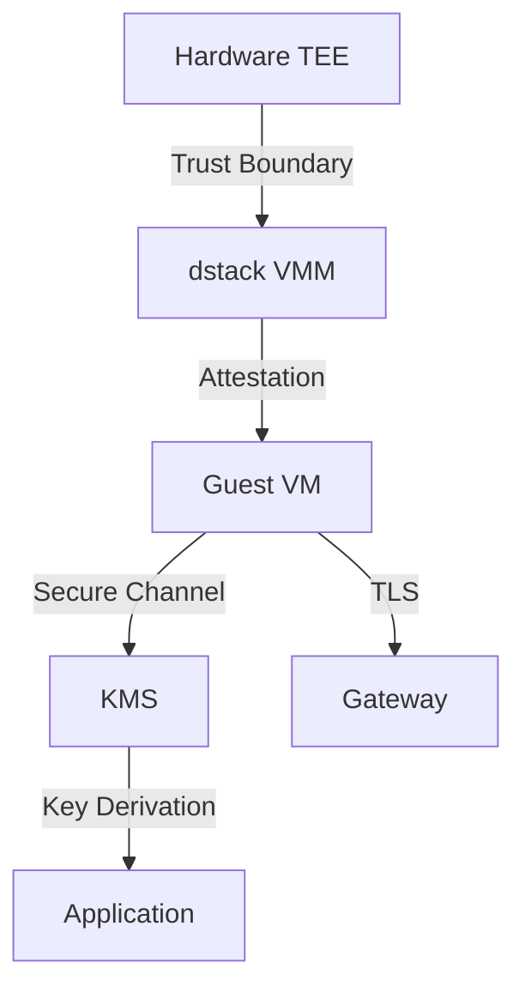

# Security & Research

<Callout type="info" icon="shield-halved">
  This section provides expert-level security analysis of dstack's TEE implementation. For general documentation, see our [Core Concepts](/docs/concepts/overview) section.
</Callout>

## For Security Researchers

dstack is built on a foundation of hardware-enforced security primitives. This section provides detailed technical analysis of each security-critical component, including:

* **Source code references** with direct links to implementation
* **Cryptographic protocol analysis** and trust boundaries
* **Attestation flow diagrams** and verification procedures
* **Key management architecture** and secure storage mechanisms

## Core Security Components

<CardGroup cols={2}>
  <Card title="TDX Attestation" icon="fingerprint" href="/docs/security-research/tdx-attestation">
    Remote attestation implementation using Intel TDX hardware primitives
  </Card>

  <Card title="VMM Security" icon="server" href="/docs/security-research/vmm-security">
    Virtual Machine Manager security boundaries and isolation guarantees
  </Card>

  <Card title="KMS Architecture" icon="key" href="/docs/security-research/kms-security">
    Decentralized key management with hardware-backed secure storage
  </Card>

  <Card title="Gateway Protection" icon="shield" href="/docs/security-research/gateway-security">
    Secure ingress/egress with automated certificate management
  </Card>
</CardGroup>

## Verification Tools

```bash
# Verify attestation quote
tdx-attest verify --quote <quote-file>

# Inspect CVM measurements
dstack cvm measure --vm-id <id>

# Audit key derivation
kms audit --show-derivation
```

## Security Primitives

### Hardware Root of Trust

* Intel TDX provides CPU-based attestation
* Memory encryption with AES-NI hardware acceleration
* Secure boot chain from hardware to application

### Cryptographic Guarantees

* **Confidentiality**: AES-256-GCM for data at rest and in transit
* **Integrity**: SHA-384 for measurement and verification
* **Attestation**: ECDSA P-384 for quote signatures

### Trust Boundaries



## Component Deep Dives

Each component page includes:

* **Implementation analysis** with code walkthrough
* **Security properties** and threat model
* **Verification procedures** for auditors
* **GitHub source links** for direct code inspection

<Note>
  All security-critical code is open source and available at [github.com/Dstack-TEE/dstack](https://github.com/Dstack-TEE/dstack).
</Note>

## Research Papers & References

### TEE Foundations

* [Intel TDX Architecture Specification](https://www.intel.com/content/www/us/en/developer/articles/technical/intel-trust-domain-extensions.html)
* [Confidential Computing Consortium Standards](https://confidentialcomputing.io/)

### dstack Security Model

* Remote Attestation Protocol Analysis
* Decentralized Key Management Architecture
* Zero-Trust Network Implementation

## Security Audit Trail

<Steps>
  <Step title="Code Review">
    All security components undergo peer review before merge
  </Step>

  <Step title="Automated Testing">
    Continuous fuzzing and property-based testing
  </Step>

  <Step title="Third-Party Audits">
    Periodic security assessments by external firms
  </Step>
</Steps>

## Responsible Disclosure

Found a security issue? Please report it responsibly:

* Email: [security@dstack.dev](mailto:security@dstack.dev)
* PGP Key: [Download](https://dstack.dev/security.asc)
* Bug Bounty: [Program Details](https://dstack.dev/security/bounty)

<div className="mt-8 p-6 bg-gray-50 rounded-lg border border-gray-200">
  <h3 className="text-lg font-semibold mb-3">Start Your Security Analysis</h3>

  <p className="text-gray-700 mb-4">
    Begin with our TDX attestation implementation to understand the hardware root of trust.
  </p>

  <a href="/docs/security-research/tdx-attestation" className="bg-gray-800 text-white px-6 py-2 rounded-lg hover:bg-gray-900 transition-colors inline-block">
    Explore TDX Attestation →
  </a>
</div>
