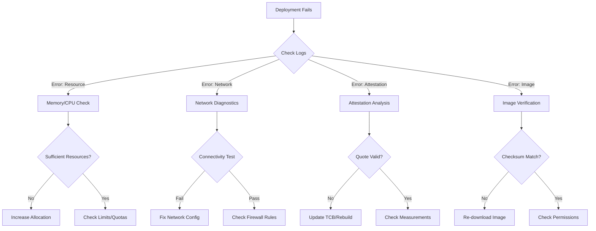

# Troubleshooting & Diagnostics

<page_summary>
  This comprehensive troubleshooting guide provides systematic diagnostic methodologies for resolving issues across the dstack platform. Drawing from production deployment experiences and security research, it offers both immediate solutions and deeper analytical approaches to problem resolution. The guide is structured hierarchically—from common operational issues to complex security diagnostics—enabling efficient problem resolution while building understanding of the underlying systems.
</page_summary>

<smoothly_flowing_prose_paragraphs>
  The complexity inherent in confidential computing platforms necessitates sophisticated troubleshooting approaches that extend beyond traditional debugging methodologies. When applications execute within hardware-enforced security boundaries, conventional diagnostic tools often prove inadequate or impossible to use. This guide addresses this challenge by providing structured approaches that respect security boundaries while enabling effective problem resolution.

  Effective troubleshooting in dstack requires understanding the interplay between hardware security features, platform orchestration, and application behavior. Each layer introduces unique failure modes and diagnostic challenges. By adopting the systematic approaches outlined here, operators can efficiently isolate issues to specific components and apply targeted remediation strategies.
</smoothly_flowing_prose_paragraphs>

## Diagnostic Philosophy

<Note>
  Troubleshooting secure systems requires balancing diagnostic visibility with security guarantees. Our approach prioritizes non-invasive techniques that preserve confidentiality.
</Note>

### Core Diagnostic Principles

1. **Layered Analysis**: Start with external observations before examining internal state
2. **Security-Preserving**: Use attestation-aware diagnostic tools that respect TEE boundaries
3. **Evidence-Based**: Collect measurable data rather than relying on assumptions
4. **Systematic Progression**: Follow defined escalation paths from simple to complex
5. **Root Cause Focus**: Address underlying issues, not just symptoms

## Diagnostic Toolchain

<smoothly_flowing_prose_paragraphs>
  Before addressing specific issues, familiarize yourself with the diagnostic tools available in the dstack ecosystem. These tools are designed to provide insights while maintaining security properties.
</smoothly_flowing_prose_paragraphs>

### Essential Diagnostic Commands

```bash
# Platform Health Overview
dstack-cli health --verbose
# Shows: Component status, attestation state, resource usage

# Component-Specific Diagnostics
dstack-vmm diagnose --component all
dstack-gateway status --detailed
dstack-kms verify --attestation

# Log Analysis (Security-Filtered)
dstack-logs --component vmm --level debug --since 1h
# Note: Sensitive data is automatically redacted

# Network Diagnostics
dstack-net trace --cvm-id <id> --protocol vsock
dstack-net verify --wireguard --detailed

# Attestation Verification
dstack-attest verify --quote-file <path> --verbose
dstack-attest compare --baseline <path> --current <path>
```

## Common Issues & Solutions

### Service Initialization Failures

<div className="bg-red-50 border-l-4 border-red-400 p-4 my-4">
  <h4 className="font-semibold text-red-800 mb-2">Issue: Services Won't Start</h4>
  <p className="text-sm text-red-700">Components fail to initialize or immediately exit after startup</p>
</div>

**Systematic Diagnosis:**

```bash
# Step 1: Check system prerequisites
sudo systemctl status tdx-module
lsmod | grep -E "kvm_intel|tdx"
dmesg | grep -i "tdx.*error" | tail -20

# Step 2: Verify port availability
sudo netstat -tlnp | grep -E '8000|9080|443'
# Ports: 8000 (KMS), 9080 (VMM API), 443 (Gateway)

# Step 3: Examine service logs
sudo journalctl -u dstack-vmm -n 100 --no-pager
sudo journalctl -u dstack-gateway -n 100 --no-pager
sudo journalctl -u dstack-kms -n 100 --no-pager

# Step 4: Validate configuration syntax
dstack-vmm --config vmm.toml --validate
dstack-gateway --config gateway.toml --validate
dstack-kms --config kms.toml --validate
```

**Resolution Matrix:**

| Symptom               | Root Cause              | Solution                                     |
| --------------------- | ----------------------- | -------------------------------------------- |
| "TDX not available"   | Hardware/BIOS config    | Enable TDX in UEFI, update microcode         |
| "Port already in use" | Conflicting service     | Identify with `lsof -i :PORT` and stop       |
| "Permission denied"   | Insufficient privileges | Run with sudo or adjust systemd unit         |
| "Config parse error"  | TOML syntax issue       | Validate with `toml-cli` or online validator |
| "Attestation failed"  | TCB out of date         | Update Intel SGX/TDX packages                |

### CVM Deployment Failures

<div className="bg-orange-50 border-l-4 border-orange-400 p-4 my-4">
  <h4 className="font-semibold text-orange-800 mb-2">Issue: Confidential VMs Fail to Launch</h4>
  <p className="text-sm text-orange-700">Applications deploy but CVMs don't start or crash immediately</p>
</div>

**Advanced Diagnostics:**

```bash
# Step 1: Check CID allocation
grep "CID.*exhausted\|already in use" /var/log/dstack/vmm.log

# Step 2: Verify guest image integrity
sha256sum /var/lib/dstack/images/dstack-guest-*.img
# Compare with official checksums

# Step 3: Examine QEMU/KVM logs
tail -f /var/log/libvirt/qemu/dstack-cvm-*.log

# Step 4: Resource availability
free -h  # Memory check
df -h /var/lib/dstack  # Storage check
nproc  # CPU cores available

# Step 5: TEE-specific diagnostics
tdx-attest-tool --self-test
cat /sys/firmware/tdx/tdx_module/status
```

**Systematic Resolution:**

<Tabs>
  <Tab title="CID Conflicts">
    ```toml
    # vmm.toml adjustment
    [resources]
    cid_start = 40000  # Increase if conflicting with other services
    cid_pool_size = 5000  # Expand pool size
    cid_reclaim_interval = "5m"  # Faster CID recycling
    ```
  </Tab>

  <Tab title="Memory Issues">
    ```bash
    # Calculate memory requirements
    # Per CVM: Base (512MB) + App memory + 20% overhead

    # Example for 10 CVMs with 2GB apps:
    # (512 + 2048 + 410) * 10 = 29.7 GB

    # Adjust system settings
    echo 'vm.overcommit_memory = 1' | sudo tee -a /etc/sysctl.conf
    sudo sysctl -p
    ```
  </Tab>

  <Tab title="Image Corruption">
    ```bash
    # Re-download guest image
    ./build.sh dl 0.5.1 --verify --force

    # Or build from source with verification
    ./build.sh guest --reproducible
    ```
  </Tab>
</Tabs>

### Attestation Verification Failures

<div className="bg-purple-50 border-l-4 border-purple-400 p-4 my-4">
  <h4 className="font-semibold text-purple-800 mb-2">Issue: Remote Attestation Fails</h4>
  <p className="text-sm text-purple-700">Applications deploy but attestation verification rejects quotes</p>
</div>

<smoothly_flowing_prose_paragraphs>
  Attestation failures represent some of the most complex diagnostic challenges in confidential computing. These failures can stem from hardware configuration, software measurement mismatches, or cryptographic validation errors. A systematic approach is essential.
</smoothly_flowing_prose_paragraphs>

**Deep Diagnostic Workflow:**

```python
#!/usr/bin/env python3
"""
Attestation Diagnostic Script
Systematically analyzes attestation failures
"""

import json
import subprocess
import sys

def check_hardware_support():
    """Verify TEE hardware capabilities"""
    checks = {
        "TDX Module": "cat /sys/firmware/tdx/tdx_module/status",
        "SEAMCALL": "dmesg | grep -i seamcall | tail -1",
        "TD Preserving": "cat /sys/firmware/tdx/tdreport/version"
    }
    
    for check, cmd in checks.items():
        result = subprocess.run(cmd, shell=True, capture_output=True, text=True)
        print(f"{check}: {result.stdout.strip() or 'NOT FOUND'}")

def analyze_quote(quote_file):
    """Parse and analyze attestation quote structure"""
    with open(quote_file, 'rb') as f:
        quote_data = f.read()
    
    # TDX Quote structure analysis
    print(f"Quote size: {len(quote_data)} bytes")
    print(f"Header: {quote_data[:48].hex()}")
    # Additional parsing logic here

def verify_measurements(expected_file, actual_file):
    """Compare expected vs actual measurements"""
    with open(expected_file) as f:
        expected = json.load(f)
    with open(actual_file) as f:
        actual = json.load(f)
    
    mismatches = []
    for key in expected:
        if expected[key] != actual.get(key):
            mismatches.append({
                'register': key,
                'expected': expected[key],
                'actual': actual.get(key, 'MISSING')
            })
    
    return mismatches

if __name__ == "__main__":
    print("=== dstack Attestation Diagnostics ===\n")
    check_hardware_support()
    # Additional diagnostic steps
```

**Common Attestation Issues:**

| Issue                | Symptoms                   | Resolution                                   |
| -------------------- | -------------------------- | -------------------------------------------- |
| TCB Out of Date      | "TCB\_OUT\_OF\_DATE" error | Update microcode and TDX module              |
| Measurement Mismatch | Quote rejected by KMS      | Rebuild guest image, verify no modifications |
| Clock Skew           | "QUOTE\_EXPIRED" error     | Sync time: `sudo ntpdate -s time.nist.gov`   |
| Certificate Chain    | "CERT\_CHAIN\_INVALID"     | Update Intel SGX certificates                |

### Network Connectivity Issues

<div className="bg-blue-50 border-l-4 border-blue-400 p-4 my-4">
  <h4 className="font-semibold text-blue-800 mb-2">Issue: CVM Network Isolation</h4>
  <p className="text-sm text-blue-700">CVMs cannot communicate with external services or each other</p>
</div>

**Network Diagnostic Framework:**

```bash
# Step 1: Verify WireGuard configuration
sudo wg show
# Expected: Interface with peers listed

# Step 2: Check routing tables
ip route show table all | grep -E "wg0|cvm"

# Step 3: Test VSOCK connectivity
vsock-ping --cid <CVM_CID> --port 8080

# Step 4: Examine iptables rules
sudo iptables -L -n -v | grep -E "FORWARD|dstack"

# Step 5: Packet capture (limited by security)
sudo tcpdump -i wg0 -n -c 100 -w cvm-traffic.pcap
# Analyze with: tshark -r cvm-traffic.pcap -Y "ip.addr==10.9.0.0/16"
```

**Network Configuration Matrix:**

<div className="overflow-x-auto my-4">
  <table className="min-w-full">
    <thead className="bg-gray-100">
      <tr>
        <th className="p-2 text-left">Component</th>
        <th className="p-2 text-left">Network Type</th>
        <th className="p-2 text-left">Default Range</th>
        <th className="p-2 text-left">Configuration Key</th>
      </tr>
    </thead>

    <tbody className="text-sm">
      <tr>
        <td className="p-2 border">Host ↔ CVM</td>
        <td className="p-2 border">TAP + Bridge</td>
        <td className="p-2 border">10.8.8.0/24</td>
        <td className="p-2 border">`KVM_TAP_NETWORK`</td>
      </tr>

      <tr className="bg-gray-50">
        <td className="p-2 border">CVM ↔ Gateway</td>
        <td className="p-2 border">WireGuard</td>
        <td className="p-2 border">10.9.0.0/16</td>
        <td className="p-2 border">`GATEWAY_WG_NETWORK`</td>
      </tr>

      <tr>
        <td className="p-2 border">CVM ↔ CVM</td>
        <td className="p-2 border">VSOCK</td>
        <td className="p-2 border">CID-based</td>
        <td className="p-2 border">`CID_START`</td>
      </tr>

      <tr className="bg-gray-50">
        <td className="p-2 border">External</td>
        <td className="p-2 border">NAT/Proxy</td>
        <td className="p-2 border">Public IP</td>
        <td className="p-2 border">`gateway.public_ip`</td>
      </tr>
    </tbody>
  </table>
</div>

## Advanced Troubleshooting

### Performance Degradation Analysis

<smoothly_flowing_prose_paragraphs>
  Performance issues in confidential computing environments require specialized analysis techniques that account for the overhead of encryption and attestation. Traditional performance tools often provide misleading results when applied to TEE workloads.
</smoothly_flowing_prose_paragraphs>

**Performance Diagnostic Suite:**

```bash
#!/bin/bash
# dstack-perf-diagnose.sh - Comprehensive performance analysis

echo "=== dstack Performance Diagnostics ==="
echo "Started at: $(date)"

# 1. System-level metrics
echo -e "\n[System Metrics]"
uptime
free -h
df -h /var/lib/dstack
iostat -x 1 5

# 2. TEE-specific overhead
echo -e "\n[TEE Overhead Analysis]"
time dstack-vmm benchmark --workload crypto --iterations 1000
time dstack-vmm benchmark --workload attestation --iterations 100

# 3. Network performance
echo -e "\n[Network Performance]"
iperf3 -c localhost -p 5201 -t 10 --json > network-perf.json

# 4. CVM resource usage
echo -e "\n[CVM Resource Usage]"
for cid in $(dstack-cli list --format json | jq -r '.[].cid'); do
    echo "CVM $cid:"
    dstack-cli stats --cid $cid --format table
done

# 5. Generate performance report
dstack-perf-report --input . --output perf-report.html
```

### Security Incident Response

<Warning>
  Security incidents require immediate attention and careful handling to preserve evidence while maintaining confidentiality.
</Warning>

**Incident Response Protocol:**

<Tabs>
  <Tab title="1. Immediate Actions">
    ```bash
    # Isolate affected CVMs
    dstack-cli isolate --cvm-id <affected_id> --reason "security incident"

    # Capture attestation evidence
    dstack-attest snapshot --all --output incident-$(date +%s).tar.gz

    # Enable enhanced logging
    dstack-vmm loglevel --set trace
    dstack-gateway loglevel --set trace
    ```
  </Tab>

  <Tab title="2. Evidence Collection">
    ```bash
    # Secure evidence collection script
    #!/bin/bash
    INCIDENT_ID=$(uuidgen)
    EVIDENCE_DIR="/secure/incidents/$INCIDENT_ID"

    mkdir -p $EVIDENCE_DIR

    # Collect system state
    dstack-cli dump-state --full > $EVIDENCE_DIR/system-state.json

    # Export attestation quotes
    dstack-attest export --all --format detailed > $EVIDENCE_DIR/attestation.log

    # Network connections snapshot
    ss -tupan > $EVIDENCE_DIR/network-state.txt

    # Create tamper-evident archive
    tar czf $EVIDENCE_DIR.tar.gz $EVIDENCE_DIR
    sha256sum $EVIDENCE_DIR.tar.gz > $EVIDENCE_DIR.sha256
    ```
  </Tab>

  <Tab title="3. Analysis">
    ```python
    # Incident analysis framework
    import json
    from datetime import datetime

    class IncidentAnalyzer:
        def __init__(self, evidence_path):
            self.evidence_path = evidence_path
            self.timeline = []
        
        def analyze_attestation_anomalies(self):
            """Detect unexpected measurement changes"""
            # Analysis logic here
            pass
        
        def trace_network_flows(self):
            """Reconstruct network communication patterns"""
            # Network analysis logic
            pass
        
        def generate_report(self):
            """Create comprehensive incident report"""
            report = {
                'incident_id': self.incident_id,
                'timestamp': datetime.utcnow().isoformat(),
                'findings': self.findings,
                'recommendations': self.recommendations
            }
            return report
    ```
  </Tab>
</Tabs>

## Diagnostic Decision Trees

<smoothly_flowing_prose_paragraphs>
  Complex issues often require systematic decision-making processes. These diagnostic trees guide operators through logical troubleshooting sequences, ensuring comprehensive coverage of potential root causes.
</smoothly_flowing_prose_paragraphs>

### Deployment Failure Decision Tree



## Best Practices for Troubleshooting

### Proactive Monitoring

<Highlight>
  Prevention is superior to remediation. Implement comprehensive monitoring to detect issues before they impact operations.
</Highlight>

**Monitoring Stack Configuration:**

```yaml
# prometheus-dstack.yml
global:
  scrape_interval: 15s
  evaluation_interval: 15s

scrape_configs:
  - job_name: 'dstack-vmm'
    static_configs:
      - targets: ['localhost:9090']
    metric_relabel_configs:
      - source_labels: [__name__]
        regex: 'dstack_vmm_.*'
        action: keep

  - job_name: 'dstack-gateway'
    static_configs:
      - targets: ['localhost:9091']
      
  - job_name: 'dstack-kms'
    static_configs:
      - targets: ['localhost:9092']

alerting:
  alertmanagers:
    - static_configs:
        - targets: ['localhost:9093']

rule_files:
  - 'dstack-alerts.yml'
```

### Documentation Requirements

Maintain comprehensive documentation of:

1. **Configuration Baselines**: Known-good configurations for reference
2. **Measurement Inventories**: Expected attestation measurements for each component
3. **Network Topologies**: Detailed network diagrams including security boundaries
4. **Incident History**: Previous issues and their resolutions
5. **Performance Baselines**: Normal operating parameters for comparison

## Escalation Procedures

<smoothly_flowing_prose_paragraphs>
  When standard troubleshooting approaches fail to resolve issues, structured escalation ensures efficient problem resolution while maintaining security protocols. The escalation framework balances the need for deeper system access with security requirements.
</smoothly_flowing_prose_paragraphs>

### Escalation Levels

1. **Level 1 - Operations Team**: Standard diagnostics using provided tools
2. **Level 2 - Platform Team**: Advanced diagnostics with elevated permissions
3. **Level 3 - Security Team**: Security-impacting issues requiring attestation analysis
4. **Level 4 - Vendor Support**: Hardware-specific or cryptographic issues

### Support Resources

<CardGroup cols={2}>
  <Card title="Community Support" icon="users" href="https://discord.gg/phala">
    <p className="text-sm mt-2">Real-time assistance from the dstack community</p>
  </Card>

  <Card title="Enterprise Support" icon="headset" href="mailto:support@dstack.dev">
    <p className="text-sm mt-2">Priority support for production deployments</p>
  </Card>

  <Card title="Security Issues" icon="shield-alt" href="mailto:security@dstack.dev">
    <p className="text-sm mt-2">Private reporting for security vulnerabilities</p>
  </Card>

  <Card title="Documentation" icon="book" href="/docs">
    <p className="text-sm mt-2">Comprehensive technical documentation</p>
  </Card>
</CardGroup>

## Conclusion

<smoothly_flowing_prose_paragraphs>
  Effective troubleshooting in confidential computing environments demands a sophisticated understanding of the interplay between security guarantees and operational requirements. This guide provides the foundational knowledge and systematic approaches necessary for maintaining robust dstack deployments.

  The methodologies presented here will evolve as the platform matures and new diagnostic capabilities emerge. We encourage operators to contribute their experiences and refinements to these procedures, strengthening the collective knowledge of the dstack community.
</smoothly_flowing_prose_paragraphs>

<div className="mt-8 p-6 bg-gradient-to-br from-green-50 to-blue-50 rounded-lg border border-green-200">
  <h3 className="text-lg font-semibold mb-2">Remember: Every Problem is a Learning Opportunity</h3>

  <p className="text-gray-700">
    Each issue you resolve deepens your understanding of confidential computing. Document your discoveries, share your solutions, and help build a more resilient ecosystem for secure computation.
  </p>
</div>
