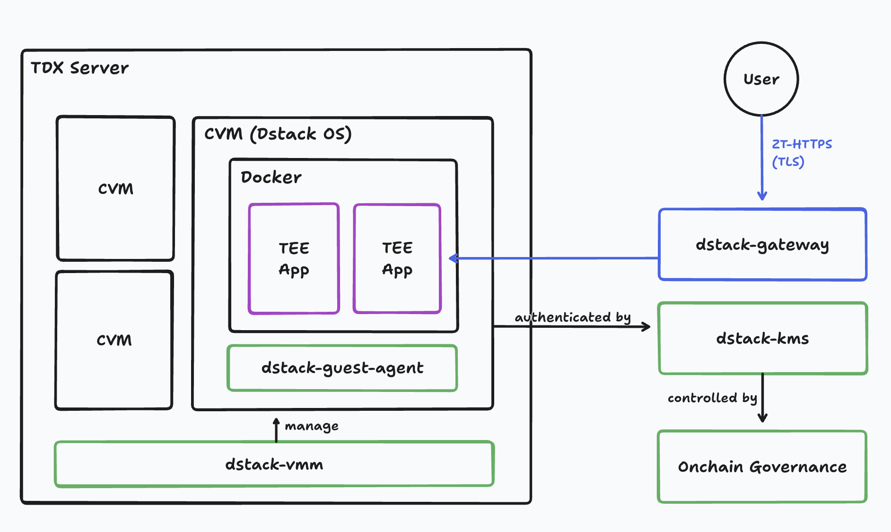

<div align="center">


### The open framework for confidential AI.

[](https://github.com/Dstack-TEE/dstack/stargazers)
[](https://github.com/Dstack-TEE/dstack/blob/master/LICENSE)
[](https://api.reuse.software/info/github.com/Dstack-TEE/dstack)
[](https://deepwiki.com/Dstack-TEE/dstack)
[](https://t.me/+UO4bS4jflr45YmUx)

[Documentation](https://docs.phala.com/dstack) · [Examples](https://github.com/Dstack-TEE/dstack-examples) · [Community](https://t.me/+UO4bS4jflr45YmUx)

</div>

---

## What is dstack?

dstack is the open framework for confidential AI - deploy AI applications with cryptographic privacy guarantees.

AI providers ask users to trust them with sensitive data. But trust doesn't scale, and trust can't be verified. With dstack, your containers run inside confidential VMs (Intel TDX) with native support for NVIDIA Confidential Computing (H100, Blackwell). Users can cryptographically verify exactly what's running: private AI with your existing Docker workflow.

### Features

**Zero friction onboarding**
- **Docker Compose native**: Bring your docker-compose.yaml as-is. No SDK, no code changes.
- **Encrypted by default**: Network traffic and disk storage encrypted out of the box.

**Hardware-rooted security**
- **Private by hardware**: Data encrypted in memory, inaccessible even to the host.
- **Reproducible OS**: Deterministic builds mean anyone can verify the OS image hash.
- **Workload identity**: Every app gets an attested identity users can verify cryptographically.
- **Confidential GPUs**: Native support for NVIDIA Confidential Computing (H100, Blackwell).

**Trustless operations**
- **Isolated keys**: Per-app keys derived in TEE. Survives hardware failure. Never exposed to operators.
- **Code governance**: Updates follow predefined rules (e.g., multi-party approval). Operators can't swap code or access secrets.

## Getting Started

**Try it now:** Chat with LLMs running in TEE at [chat.redpill.ai](https://chat.redpill.ai). Click the shield icon to verify attestations from Intel TDX and NVIDIA GPUs.

**Deploy your own:**

```yaml
# docker-compose.yaml
services:
  vllm:
    image: vllm/vllm-openai:latest
    runtime: nvidia
    command: --model Qwen/Qwen2.5-7B-Instruct
    ports:
      - "8000:8000"
```

Deploy to any TDX host with the `dstack-nvidia-0.5.x` base image, or use [Phala Cloud](https://cloud.phala.network) for managed infrastructure.

Want to deploy a self hosted dstack? Check our [full deployment guide →](./docs/deployment.md)

## Architecture



Your container runs inside a Confidential VM (Intel TDX) with optional GPU isolation via NVIDIA Confidential Computing. The CPU TEE protects application logic; the GPU TEE protects model weights and inference data.

**Core components:**

- **Guest Agent**: Runs inside each CVM. Generates TDX attestation quotes so users can verify exactly what's running. Provisions per-app cryptographic keys from KMS. Encrypts local storage. Apps interact via `/var/run/dstack.sock`.

- **KMS**: Runs in its own TEE. Verifies TDX quotes before releasing keys. Enforces authorization policies defined in on-chain smart contracts — operators cannot bypass these checks. Derives deterministic keys bound to each app's attested identity.

- **Gateway**: Terminates TLS at the edge and provisions ACME certificates automatically. Routes traffic to CVMs. All internal communication uses RA-TLS for mutual attestation.

- **VMM**: Runs on bare-metal TDX hosts. Parses docker-compose files directly — no app changes needed. Boots CVMs from a reproducible OS image. Allocates CPU, memory, and confidential GPU resources.

[Full security model →](./docs/security-model.md)

## SDKs

Apps communicate with the guest agent via HTTP over `/var/run/dstack.sock`. Use the [HTTP API](./sdk/curl/api.md) directly with curl, or use a language SDK:

| Language | Install | Docs |
|----------|---------|------|
| Python | `pip install dstack-sdk` | [README](./sdk/python/README.md) |
| TypeScript | `npm install @phala/dstack-sdk` | [README](./sdk/js/README.md) |
| Rust | `cargo add dstack-sdk` | [README](./sdk/rust/README.md) |
| Go | `go get github.com/Dstack-TEE/dstack/sdk/go` | [README](./sdk/go/README.md) |

## Documentation

**Use Cases**
- [Confidential AI](./docs/confidential-ai.md) - Inference, agents, and training with hardware privacy

**Guides**
- [Usage Guide](./docs/usage.md) - Deploying and managing apps
- [Deployment](./docs/deployment.md) - Self-hosting on TDX hardware
- [On-Chain Governance](./docs/onchain-governance.md) - Smart contract-based authorization
- [VMM CLI Guide](./docs/vmm-cli-user-guide.md) - Command-line deployment

**Reference**
- [Security Model](./docs/security-model.md) - Threat model and trust boundaries
- [Security Best Practices](./docs/security-best-practices.md) - Production hardening
- [CVM Boundaries](./docs/cvm-boundaries.md) - Information exchange and isolation
- [App Compose Format](./docs/normalized-app-compose.md) - Compose file specification
- [Gateway](./docs/dstack-gateway.md) - Gateway configuration
- [Design Decisions](./docs/design-and-hardening-decisions.md) - Architecture rationale
- [FAQ](./docs/faq.md) - Frequently asked questions

## Community

[Telegram](https://t.me/+UO4bS4jflr45YmUx) · [GitHub Discussions](https://github.com/Dstack-TEE/dstack/discussions) · [Examples](https://github.com/Dstack-TEE/dstack-examples)

[](https://github.com/Dstack-TEE/dstack/pulse)

## Media Kit

The dstack logo and branding assets are available in the [media kit](./docs/assets/Dstack%20Logo%20Kit/):

- **Horizontal logos**: Primary and dark versions in PNG/SVG formats
- **Vertical logos**: Primary and dark versions in PNG/SVG formats
- **Icons**: Primary and dark versions in PNG/SVG formats

## License

Apache 2.0
