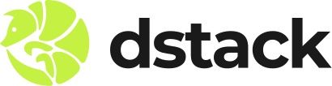
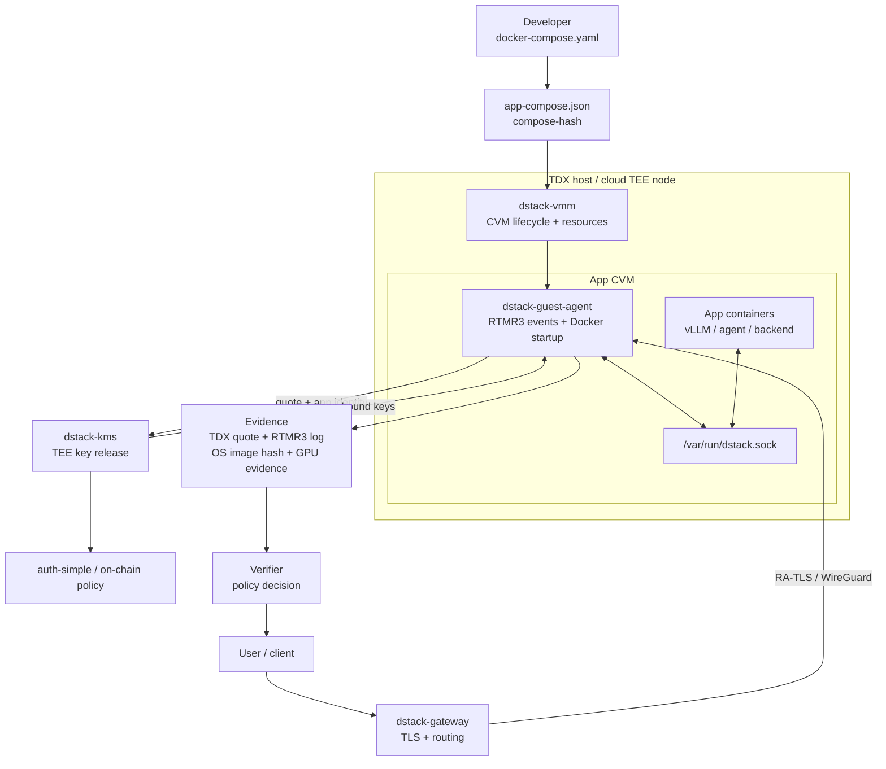

<div align="center">



### Run private AI services with verifiable app identity.

[](https://github.com/Dstack-TEE/dstack/stargazers)
[](https://github.com/Dstack-TEE/dstack/blob/master/LICENSE)
[](https://api.reuse.software/info/github.com/Dstack-TEE/dstack)
[](https://deepwiki.com/Dstack-TEE/dstack)
[](https://t.me/+UO4bS4jflr45YmUx)

[Documentation](https://docs.phala.com/dstack) · [Examples](https://github.com/Dstack-TEE/dstack-examples) · [Community](https://t.me/+UO4bS4jflr45YmUx)

</div>

---

## What is dstack?

dstack turns a Docker Compose app into a verifiable Confidential VM deployment.

It is useful when a service must prove more than "it runs in a TEE." dstack
binds the application config, guest OS image, KMS key release, and hardware
evidence into one identity that users or auditors can verify.

```text
docker-compose.yaml
  -> app-compose.json
  -> compose-hash
  -> RTMR3 measurement
  -> attestation quote
  -> KMS key release / verifier decision
```

The main use case is private AI inference: run an OpenAI-compatible endpoint in
a TEE, keep prompts and credentials protected from operators, and give customers
proof of the workload that handled their request.

## Why dstack?

Most confidential-computing tools solve one layer: VM isolation, attestation,
secret release, or a fixed inference appliance. dstack connects those layers
into an application stack.

| Need | dstack provides |
| --- | --- |
| Run custom services | Docker Compose deployment into Confidential VMs |
| Prove the app, not only the machine | `compose-hash`, `app-id`, `instance-id`, and KMS binding in RTMR3 |
| Release secrets to the right workload | KMS verifies evidence before deriving app-bound keys |
| Serve production traffic | Gateway routing, TLS, and attested service channels |
| Use TEE features from code | SDK access to keys, quotes, certs, and signing over `/var/run/dstack.sock` |
| Verify AI hardware boundaries | CPU TEE evidence plus NVIDIA confidential GPU evidence where supported |

Best fit: private inference endpoints, confidential AI agents, and verifiable
backends where the proof must cover app config, keys, endpoint, and hardware.

## Best-practice use case: private inference

Start with an OpenAI-compatible model server:

```yaml
services:
  vllm:
    image: vllm/vllm-openai:latest
    runtime: nvidia
    command: --model Qwen/Qwen2.5-7B-Instruct
    ports:
      - "8000:8000"
```

Production shape:

1. Pin container images by digest.
2. Generate `app-compose.json`; its `compose-hash` becomes the workload identity.
3. Put model credentials, API keys, TLS material, and signing keys behind
   KMS-gated release.
4. Run the service in a TDX CVM, with NVIDIA confidential GPU evidence when GPU
   inference is used.
5. Expose the endpoint through the gateway or your own TLS path.
6. Let customers verify quote signature, TCB status, OS image hash, RTMR3 replay,
   `compose-hash`, KMS binding, and GPU evidence.

This is the difference between a private endpoint and a response tied to a
measured workload with app-bound keys.

## How it works


```mermaid
flowchart TB
    Dev["Developer<br/>docker-compose.yaml"] --> Compose["app-compose.json<br/>compose-hash"]
    Compose --> VMM["dstack-vmm<br/>CVM lifecycle + resources"]

    subgraph Host["TDX host / cloud TEE node"]
        VMM
        subgraph CVM["App CVM"]
            Agent["dstack-guest-agent<br/>RTMR3 events + Docker startup"]
            App["App containers<br/>vLLM / agent / backend"]
            Socket["/var/run/dstack.sock"]
            Agent <--> Socket
            App <--> Socket
        end
    end

    VMM --> Agent
    Agent -->|"quote + app identity"| KMS["dstack-kms<br/>TEE key release"]
    KMS --> Auth["auth-simple / on-chain policy"]
    KMS -->|"app-bound keys"| Agent

    User["User / client"] --> Gateway["dstack-gateway<br/>TLS + routing"]
    Gateway -->|"RA-TLS / WireGuard"| Agent

    Agent --> Evidence["Evidence<br/>TDX quote + RTMR3 log<br/>OS image hash + GPU evidence"]
    Evidence --> Verifier["Verifier<br/>policy decision"]
    Verifier --> User
```

| Component | Role |
| --- | --- |
| `dstack-vmm` | Boots and manages CVMs with QEMU, resources, disks, networking, and optional GPU passthrough. |
| `dstack-guest-agent` | Runs inside the CVM, extends runtime measurements, requests keys, starts containers, and exposes the app API. |
| `dstack-kms` | Runs in a TEE and releases app-bound keys only after evidence and policy checks. |
| `dstack-gateway` | Routes public traffic and connects to CVMs through attested channels. |
| SDKs | Let app code request keys, quotes, RA-TLS certs, and signatures. |
| Verifier | Checks quote signatures, OS measurements, RTMR3 replay, app identity, and TCB status. |

Source areas: `vmm/`, `guest-agent/`, `kms/`, `gateway/`, `dstack-attest/`,
`ra-tls/`, `verifier/`, and `sdk/`.

## Key technical primitives

- **`app-compose.json`**: normalized deployment config derived from Docker Compose.
- **`compose-hash`**: SHA256 of `app-compose.json`, measured into RTMR3.
- **RTMR3 event log replay**: verifier recomputes runtime measurements and
  compares them with the hardware-signed quote.
- **KMS-gated key release**: app-bound keys are derived only after quote and
  policy verification.
- **RA-TLS**: attestation material is embedded in X.509 extensions under the
  `1.3.6.1.4.1.62397.1.*` OID arc.
- **GPU confidential computing**: supported NVIDIA H100, H200, and Blackwell
  deployments can include confidential GPU evidence.

## Supported platforms

| Platform | Status | Attestation |
| --- | --- | --- |
| Bare metal Intel TDX | Available | TDX |
| [Phala Cloud](https://cloud.phala.network) | Available | TDX |
| GCP Confidential VMs | Available | TDX + TPM |
| AWS Nitro Enclaves | Available | NSM |

## Start here

| Goal | Link |
| --- | --- |
| Deploy on GCP | [Quickstart](./docs/quickstart.md) |
| Self-host on TDX hardware | [Deployment Guide](./docs/deployment.md) |
| Build a confidential AI app | [Confidential AI Guide](./docs/confidential-ai.md) |
| Verify a deployment | [Verification Guide](./docs/verification.md) |
| Read the security model | [Security Model](./docs/security/security-model.md) |
| See examples | [dstack-examples](https://github.com/Dstack-TEE/dstack-examples) |

Try a live private AI deployment at [chat.redpill.ai](https://chat.redpill.ai)
and open the shield icon to inspect attestation evidence.

## SDKs

Applications talk to the guest agent over HTTP on `/var/run/dstack.sock`.

| Language | Install | Docs |
| --- | --- | --- |
| Python | `pip install dstack-sdk` | [README](./sdk/python/README.md) |
| TypeScript | `npm install @phala/dstack-sdk` | [README](./sdk/js/README.md) |
| Rust | `cargo add dstack-sdk` | [README](./sdk/rust/README.md) |
| Go | `go get github.com/Dstack-TEE/dstack/sdk/go` | [README](./sdk/go/README.md) |
| HTTP | Any Unix-socket-capable HTTP client | [API](./sdk/curl/api.md) |

## Verification

A relying party should be able to check:

- quote signature and TCB status;
- approved OS image hash and expected MRTD / RTMR0-2 measurements;
- RTMR3 replay, including `compose-hash`, `app-id`, `instance-id`, and
  key-provider binding;
- KMS identity and policy decision;
- NVIDIA confidential GPU evidence for GPU workloads.

Tools and docs:

- [dstack verifier](./verifier/)
- [Verification Guide](./docs/verification.md)
- [Attestation Verification Tutorial](./docs/tutorials/attestation-verification.md)

## Security

dstack has been audited by [zkSecurity](./docs/security/dstack-audit.pdf).

Attestation proves which hardware and measured software produced the evidence.
It does not prove application code is bug-free. For production, pin container
images by digest, audit code that handles secrets, and define a policy for
accepted OS images, compose hashes, KMS instances, and GPU evidence.

Security docs:

- [Security Overview](./docs/security/)
- [Security Model](./docs/security/security-model.md)
- [Security Best Practices](./docs/security/security-best-practices.md)
- [CVM Boundaries](./docs/security/cvm-boundaries.md)

## Production use

dstack powers confidential AI infrastructure for:

- [OpenRouter](https://openrouter.ai/provider/phala)
- [NEAR AI](https://x.com/ilblackdragon/status/1962920246148268235)

dstack is a Linux Foundation
[Confidential Computing Consortium](https://confidentialcomputing.io/2025/10/02/welcoming-phala-to-the-confidential-computing-consortium/)
open source project.

## Community

[Telegram](https://t.me/+UO4bS4jflr45YmUx) · [GitHub Discussions](https://github.com/Dstack-TEE/dstack/discussions) · [Examples](https://github.com/Dstack-TEE/dstack-examples)

For enterprise support, [book a call](https://cal.com/team/phala/founders) or
email support@phala.network.

## Cite

If you use dstack in your research, please cite:

```bibtex
@article{zhou2025dstack,
  title={Dstack: A Zero Trust Framework for Confidential Containers},
  author={Zhou, Shunfan and Wang, Kevin and Yin, Hang},
  journal={arXiv preprint arXiv:2509.11555},
  year={2025}
}
```

## License

Apache 2.0
