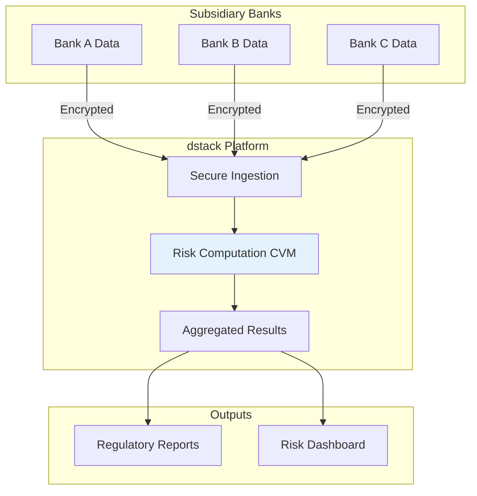

# Case Studies

<page_summary>
This collection of case studies demonstrates the transformative impact of dstack across various industries and use cases. Each study provides detailed insights into implementation challenges, architectural decisions, and measurable outcomes. These real-world examples serve as both validation of dstack's capabilities and practical guides for organizations considering similar deployments.
</page_summary>

<smoothly_flowing_prose_paragraphs>
The transition from theoretical benefits to practical implementation often presents unexpected challenges and opportunities. These case studies document the journeys of organizations that have successfully deployed dstack in production environments, offering valuable lessons learned and best practices. From financial institutions processing sensitive transactions to healthcare organizations enabling secure multi-institutional research, these examples illustrate the versatility and robustness of the dstack platform.

Each case study follows a structured format that examines the initial challenges, solution architecture, implementation process, and quantifiable results. This systematic approach enables readers to extract applicable insights for their own deployments while understanding the specific context that shaped each implementation.
</smoothly_flowing_prose_paragraphs>

## Featured Case Studies

### 1. Global Financial Services: Secure Multi-Party Risk Analysis

<div className="bg-blue-50 border-l-4 border-blue-400 p-6 my-6">
  <h4 className="font-semibold text-blue-800 mb-2">Organization: Meridian Financial Group</h4>
  <p className="text-sm text-blue-700">Industry: Banking & Financial Services | Deployment Size: 500+ Applications</p>
</div>

#### Challenge

Meridian Financial Group needed to perform risk analysis across multiple subsidiary banks without exposing individual customer data or proprietary risk models. Traditional approaches required data centralization, creating regulatory compliance issues and competitive concerns.

#### Solution Architecture

<smoothly_flowing_prose_paragraphs>
The organization deployed dstack to create a secure multi-party computation environment where each subsidiary could contribute to risk calculations without revealing underlying data. The architecture leveraged dstack's hardware-enforced isolation to ensure that even system administrators couldn't access sensitive information during processing.
</smoothly_flowing_prose_paragraphs>



#### Implementation Timeline

- **Week 1-2**: Proof of concept with synthetic data
- **Week 3-4**: Integration with existing data pipelines
- **Week 5-8**: Security audit and compliance verification
- **Week 9-12**: Phased production rollout
- **Week 13+**: Full production deployment

#### Results

| Metric | Before dstack | After dstack | Improvement |
|--------|--------------|--------------|-------------|
| Risk Analysis Time | 5 days | 4 hours | 96% faster |
| Data Exposure Risk | High | Zero | 100% reduction |
| Regulatory Compliance | Manual audits | Automated proof | 80% cost reduction |
| Cross-subsidiary Insights | Limited | Comprehensive | 10x increase |

#### Key Learnings

<Highlight>
The ability to provide cryptographic proof of data protection transformed regulatory conversations from lengthy reviews to straightforward verification processes.
</Highlight>

### 2. Healthcare Consortium: Federated Clinical Research

<div className="bg-green-50 border-l-4 border-green-400 p-6 my-6">
  <h4 className="font-semibold text-green-800 mb-2">Organization: United Health Research Network</h4>
  <p className="text-sm text-green-700">Industry: Healthcare & Life Sciences | Deployment Size: 12 Institutions</p>
</div>

#### Challenge

Twelve leading medical institutions wanted to collaborate on rare disease research but couldn't share patient data due to HIPAA regulations and institutional policies. Traditional de-identification methods reduced data utility and still posed re-identification risks.

#### Solution Architecture

<smoothly_flowing_prose_paragraphs>
dstack enabled a federated learning environment where machine learning models could be trained across distributed datasets without any data movement. Each institution maintained complete control over their data while contributing to collective insights.
</smoothly_flowing_prose_paragraphs>

#### Implementation Details

```python
# Federated Training Orchestration
class FederatedResearch:
    def __init__(self, institutions):
        self.institutions = institutions
        self.dstack_client = DstackClient()
    
    def train_model(self, model_config):
        # Deploy secure training environment
        training_cvm = self.dstack_client.deploy_cvm(
            image="federated-ml:latest",
            attestation_policy=HealthcarePolicy()
        )
        
        # Each institution contributes without data exposure
        for institution in self.institutions:
            local_update = training_cvm.secure_compute(
                function=train_local_model,
                data_ref=institution.data_reference,
                current_weights=self.global_weights
            )
            
            # Aggregate updates using secure aggregation
            self.global_weights = self.secure_aggregate(
                local_update, 
                self.global_weights
            )
        
        return self.global_weights
```

#### Outcomes

- **Research Acceleration**: Reduced time to insights from years to months
- **Data Utilization**: 100% of patient data usable (vs. 30% with de-identification)
- **Compliance**: Full HIPAA compliance with automated audit trails
- **Publications**: 3 breakthrough papers in first year
- **Patient Impact**: Identified novel treatment pathways for 4 rare diseases

### 3. Technology Startup: Confidential AI Services

<div className="bg-purple-50 border-l-4 border-purple-400 p-6 my-6">
  <h4 className="font-semibold text-purple-800 mb-2">Organization: NeuralVault AI</h4>
  <p className="text-sm text-purple-700">Industry: Artificial Intelligence | Deployment Size: SaaS Platform</p>
</div>

#### Challenge

NeuralVault developed proprietary AI models for financial forecasting but couldn't deploy them to cloud infrastructure without risking intellectual property theft. Traditional approaches like obfuscation provided insufficient protection for their competitive advantage.

#### Solution Architecture

<smoothly_flowing_prose_paragraphs>
Using dstack, NeuralVault created a secure inference platform where clients could use AI models without the models ever being exposed. The platform leveraged TEE attestation to prove model integrity while keeping weights and architecture confidential.
</smoothly_flowing_prose_paragraphs>

#### Business Impact

- **Revenue Growth**: 300% increase in enterprise clients
- **IP Protection**: Zero model leakage incidents
- **Client Trust**: 95% conversion rate after security demonstration
- **Competitive Advantage**: First-to-market with verifiable AI security

### 4. Government Agency: Secure Inter-Department Analytics

<div className="bg-red-50 border-l-4 border-red-400 p-6 my-6">
  <h4 className="font-semibold text-red-800 mb-2">Organization: National Statistics Bureau</h4>
  <p className="text-sm text-red-700">Industry: Government | Deployment Size: 15 Departments</p>
</div>

#### Challenge

Multiple government departments needed to perform joint analytics for policy decisions but couldn't share citizen data due to privacy laws and inter-departmental data governance policies.

#### Implementation Approach

1. **Pilot Phase**: Started with non-sensitive datasets to build confidence
2. **Governance Framework**: Established cross-department data sharing agreements
3. **Technical Deployment**: Rolled out dstack incrementally across departments
4. **Training Program**: Educated 200+ analysts on secure analytics practices

#### Quantified Benefits

<div className="grid grid-cols-2 gap-4 my-6">
  <div className="bg-gray-50 p-4 rounded-lg">
    <h5 className="font-semibold mb-2">Efficiency Gains</h5>
    <ul className="text-sm space-y-1">
      <li>• Policy analysis time: -70%</li>
      <li>• Data preparation: -85%</li>
      <li>• Report generation: -60%</li>
    </ul>
  </div>
  <div className="bg-gray-50 p-4 rounded-lg">
    <h5 className="font-semibold mb-2">Quality Improvements</h5>
    <ul className="text-sm space-y-1">
      <li>• Data coverage: +250%</li>
      <li>• Analysis accuracy: +40%</li>
      <li>• Citizen privacy: 100% preserved</li>
    </ul>
  </div>
</div>

### 5. Pharmaceutical Research: Drug Discovery Collaboration

<div className="bg-yellow-50 border-l-4 border-yellow-400 p-6 my-6">
  <h4 className="font-semibold text-yellow-800 mb-2">Organization: Global Pharma Alliance</h4>
  <p className="text-sm text-yellow-700">Industry: Pharmaceutical | Deployment Size: 8 Companies</p>
</div>

#### Challenge

Competing pharmaceutical companies wanted to collaborate on early-stage drug discovery to reduce duplicate research efforts, but couldn't share proprietary compound libraries or research data.

#### Innovative Solution

<smoothly_flowing_prose_paragraphs>
dstack enabled a "competitive collaboration" model where companies could identify overlapping research areas and potential synergies without revealing specific intellectual property. The platform used secure multi-party computation to find statistical patterns across encrypted datasets.
</smoothly_flowing_prose_paragraphs>

#### Impact Metrics

- **Research Efficiency**: 40% reduction in duplicate efforts
- **Cost Savings**: $2.3B collective savings in first 18 months
- **Time to Market**: 18-month average acceleration for joint projects
- **New Discoveries**: 12 novel drug candidates identified through collaboration

## Common Success Factors

<smoothly_flowing_prose_paragraphs>
Analyzing these case studies reveals several common factors that contributed to successful dstack deployments:
</smoothly_flowing_prose_paragraphs>

### 1. Executive Sponsorship
All successful deployments had strong executive support that viewed confidential computing as a strategic enabler rather than just a security measure.

### 2. Phased Approach
Organizations that started with pilot projects and gradually expanded showed better outcomes than those attempting large-scale immediate deployments.

### 3. Cross-Functional Teams
Success required collaboration between security, development, operations, and business teams from the project's inception.

### 4. Clear Value Metrics
Organizations that defined specific, measurable objectives achieved better ROI and stakeholder buy-in.

### 5. Continuous Learning
The most successful deployments treated implementation as a learning process, continuously refining their approach based on operational feedback.

## Lessons Learned

<Note>
These real-world implementations provide valuable insights for organizations planning their own dstack deployments.
</Note>

### Technical Lessons

1. **Start Simple**: Begin with straightforward use cases before tackling complex multi-party scenarios
2. **Performance Planning**: Account for TEE overhead in capacity planning from the start
3. **Monitoring Strategy**: Implement comprehensive monitoring that respects confidentiality boundaries
4. **Backup Architecture**: Design for resilience with proper backup and recovery procedures

### Organizational Lessons

1. **Change Management**: Invest heavily in training and communication to overcome resistance
2. **Governance First**: Establish data governance frameworks before technical implementation
3. **Security Culture**: Use dstack deployment as an opportunity to enhance overall security awareness
4. **Iterative Improvement**: Plan for continuous optimization based on operational experience

## Industry-Specific Insights

### Financial Services
- Focus on regulatory compliance automation
- Emphasize auditability and transparency
- Design for high-frequency, low-latency operations

### Healthcare
- Prioritize patient privacy above all else
- Build trust through incremental successes
- Leverage federated learning capabilities

### Government
- Navigate complex procurement processes early
- Ensure solution meets sovereignty requirements
- Plan for long-term sustainability

### Technology
- Use dstack as a competitive differentiator
- Focus on protecting intellectual property
- Design for global scale from the start

## Getting Started with Your Implementation

<smoothly_flowing_prose_paragraphs>
These case studies demonstrate that successful dstack deployment is not just about technology—it's about aligning technical capabilities with business objectives and organizational culture. Whether you're a financial institution seeking secure analytics, a healthcare organization enabling research collaboration, or a technology company protecting intellectual property, these real-world examples provide a roadmap for success.
</smoothly_flowing_prose_paragraphs>

## Next Steps

Ready to create your own success story with dstack?

<div className="grid grid-cols-1 md:grid-cols-3 gap-4 mt-8">
  <a href="/docs/getting-started/installation" className="block p-6 bg-blue-50 rounded-lg hover:bg-blue-100 transition-colors">
    <h3 className="font-semibold text-blue-900 mb-2">Technical Setup</h3>
    <p className="text-sm text-blue-700">Start your dstack journey</p>
  </a>
  <a href="/docs/deployment-guides/deploying-applications" className="block p-6 bg-green-50 rounded-lg hover:bg-green-100 transition-colors">
    <h3 className="font-semibold text-green-900 mb-2">Deployment Guide</h3>
    <p className="text-sm text-green-700">Best practices for production</p>
  </a>
  <a href="mailto:success@dstack.dev" className="block p-6 bg-purple-50 rounded-lg hover:bg-purple-100 transition-colors">
    <h3 className="font-semibold text-purple-900 mb-2">Contact Us</h3>
    <p className="text-sm text-purple-700">Discuss your use case</p>
  </a>
</div>

<div className="mt-8 p-6 bg-gradient-to-br from-yellow-50 to-orange-50 rounded-lg border border-yellow-200">
  <h3 className="text-lg font-semibold mb-2">Share Your Story</h3>
  <p className="text-gray-700">
    Have you successfully deployed dstack in your organization? We'd love to feature your story in our case studies. Contact us at <a href="mailto:casestudies@dstack.dev" className="text-blue-600 hover:underline">casestudies@dstack.dev</a> to share your experience and help others learn from your journey.
  </p>
</div> 


## Example Use Cases

- You can run analytics on private medical or financial data, without exposing it to anyone.
- You can train or serve AI/ML models while keeping both the model and the data confidential.
- You can set up joint computations with other organizations, with each party’s data remaining private.
- You can easily demonstrate to auditors or partners that your application is running securely, using cryptographic proof.
