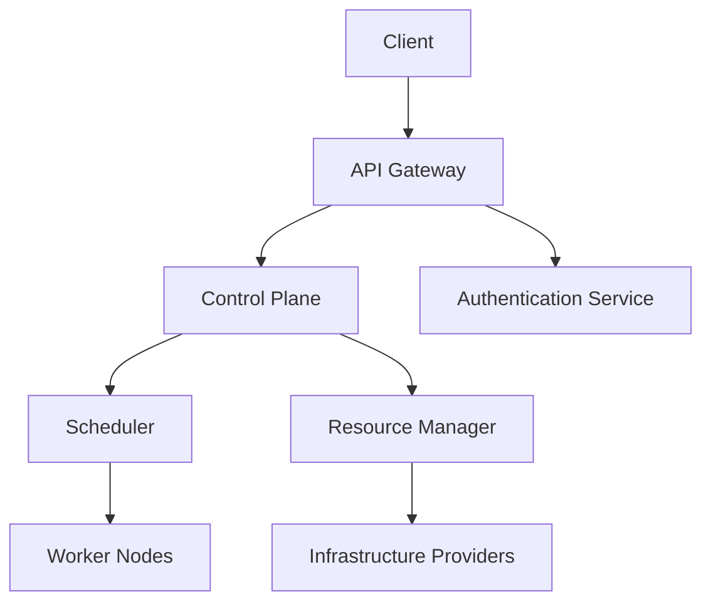

# dstack Architecture

This page provides an overview of dstack's architecture and how the different components work together.

## System Architecture

dstack follows a modern, distributed architecture with several key components:

## Components

### Client Layer

- **CLI**: Command-line interface for interacting with dstack
- **Web UI**: Graphical user interface for managing resources
- **API Clients**: SDKs for programmatic access

### Control Plane

The control plane is responsible for:

- Handling API requests
- Managing user authentication and authorization
- Orchestrating resources
- Scheduling workloads

### Data Plane

The data plane includes:

- Worker nodes that run your applications
- Storage systems for persistent data
- Networking infrastructure

## Deployment Models

dstack supports multiple deployment models:

1. **Cloud-based**: Deploy on major cloud providers
2. **On-premises**: Deploy in your own data center
3. **Hybrid**: Combine cloud and on-premises resources

## Next Steps

To learn how to use dstack's API, check out our [API Reference](/api-reference/overview).

