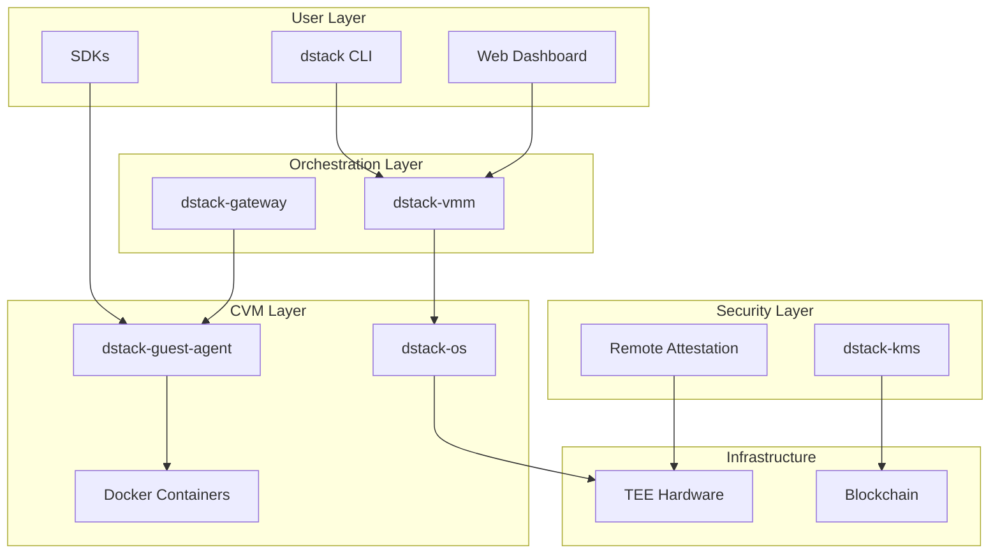
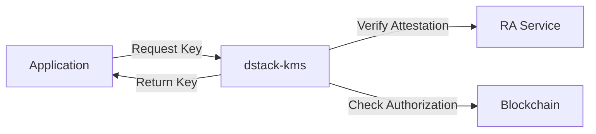
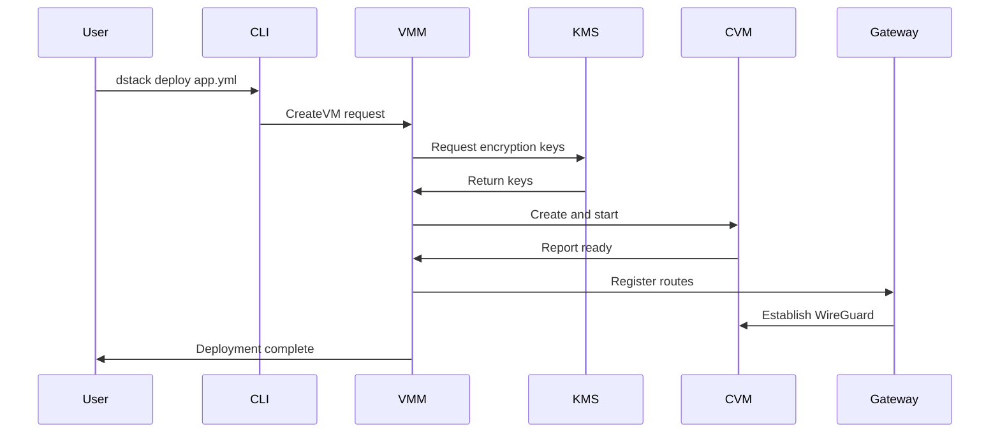
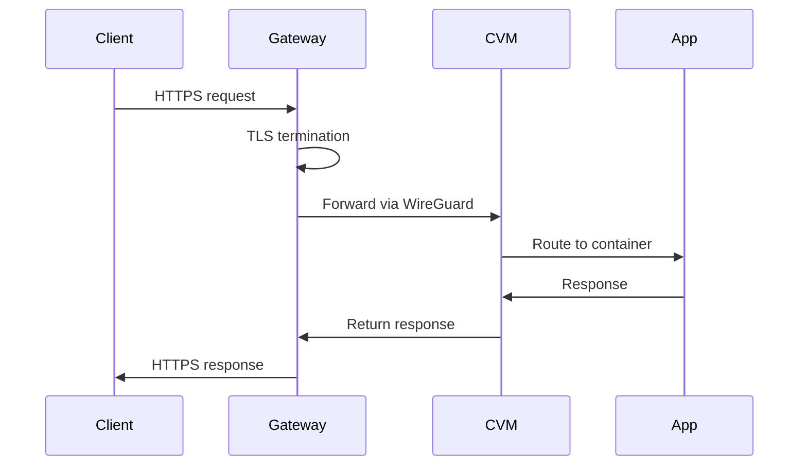
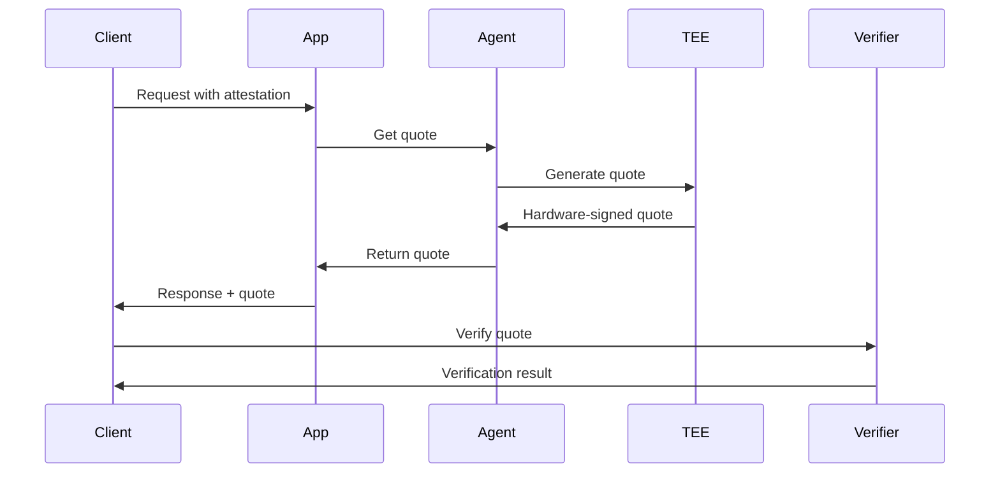
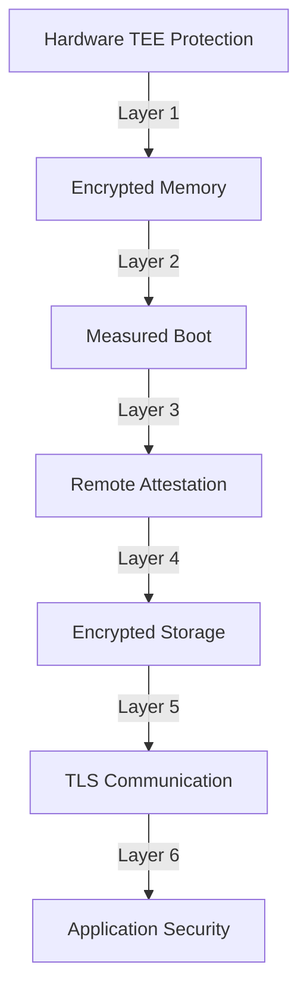

# System Architecture

dstack follows a modern, distributed architecture designed for security, scalability, and portability. This page provides a comprehensive overview of how the different components work together to provide secure application deployment in TEEs.

## Architecture Overview

dstack's architecture is organized into distinct layers, each responsible for specific functionality while maintaining security boundaries.



## Layered Architecture

### 1. User Interface Layer

The topmost layer provides multiple ways for users to interact with dstack:

<table className="w-full my-4">
  <thead>
    <tr className="bg-gray-100">
      <th className="p-3 text-left">Component</th>
      <th className="p-3 text-left">Purpose</th>
      <th className="p-3 text-left">Key Features</th>
    </tr>
  </thead>
  <tbody>
    <tr>
      <td className="p-3 font-semibold">dstack CLI</td>
      <td className="p-3">Command-line interface for deployment and management</td>
      <td className="p-3">
        • Deploy applications<br/>
        • Manage CVMs<br/>
        • View logs and metrics<br/>
        • Verify attestation
      </td>
    </tr>
    <tr className="bg-gray-50">
      <td className="p-3 font-semibold">Web Dashboard</td>
      <td className="p-3">Browser-based management interface</td>
      <td className="p-3">
        • Visual deployment<br/>
        • Real-time monitoring<br/>
        • Resource management<br/>
        • Security verification
      </td>
    </tr>
    <tr>
      <td className="p-3 font-semibold">SDKs</td>
      <td className="p-3">Language-specific libraries for integration</td>
      <td className="p-3">
        • Python, JavaScript, Go<br/>
        • Key derivation<br/>
        • Attestation verification<br/>
        • Secure communication
      </td>
    </tr>
  </tbody>
</table>

### 2. Orchestration Layer

This layer manages the lifecycle and coordination of secure applications:

#### dstack-vmm (Virtual Machine Manager)

The VMM is the core orchestrator that manages Confidential VMs:

<div className="bg-blue-50 p-6 rounded-lg my-4">
  <h4 className="font-semibold mb-3">Key Responsibilities:</h4>
  <ul className="space-y-2">
    <li>• <strong>CVM Lifecycle:</strong> Create, start, stop, and destroy CVMs</li>
    <li>• <strong>Resource Allocation:</strong> Manage CPU, memory, storage, and network resources</li>
    <li>• <strong>API Server:</strong> Expose management APIs for CLI and web UI</li>
    <li>• <strong>State Management:</strong> Track deployment status and configurations</li>
  </ul>
</div>

**API Endpoints:**
```
/prpc          - RPC API for internal communication
/api           - Host management API
/guest         - Guest agent communication
/              - Web dashboard
```

#### dstack-gateway

The gateway provides secure network access to applications:

<div className="bg-green-50 p-6 rounded-lg my-4">
  <h4 className="font-semibold mb-3">Core Functions:</h4>
  <ul className="space-y-2">
    <li>• <strong>HTTPS Termination:</strong> Automatic TLS with Let's Encrypt</li>
    <li>• <strong>Traffic Routing:</strong> Route requests to appropriate CVMs</li>
    <li>• <strong>WireGuard VPN:</strong> Secure tunnels between components</li>
    <li>• <strong>Certificate Management:</strong> Automated certificate lifecycle</li>
  </ul>
</div>

**Routing Patterns:**
```
app.example.com         → Default app routing
custom.domain.com       → Custom domain via DNS TXT
app-id.srv.domain.com   → Direct CVM access
```

### 3. Security Layer

Security is enforced through multiple components:

#### dstack-kms (Key Management Service)

The KMS manages all cryptographic operations:



**Key Types Managed:**
- Root CA certificates
- Application-specific ECDSA keys
- Disk encryption keys
- TLS certificates

#### Remote Attestation (RA)

Ensures code integrity and TEE authenticity:

<div className="bg-purple-50 p-6 rounded-lg my-4">
  <h4 className="font-semibold mb-3">Attestation Flow:</h4>
  <ol className="space-y-2">
    <li>1. TEE generates hardware-signed quote</li>
    <li>2. Quote includes measurements of code and configuration</li>
    <li>3. RA service verifies quote using Intel DCAP</li>
    <li>4. Application receives attestation certificate</li>
  </ol>
</div>

### 4. CVM Layer

Inside each Confidential VM:

#### dstack-os

A minimal, hardened Linux distribution:
- Based on Yocto/OpenEmbedded
- Includes only essential components
- Measured boot for attestation
- Read-only root filesystem

#### dstack-guest-agent

Manages containers within the CVM:

```go
// Guest agent responsibilities
type GuestAgent struct {
    ContainerManager  // Docker container lifecycle
    KeyManager       // Local key derivation
    AttestationSvc   // Generate quotes
    MetricsCollector // Resource monitoring
}
```

### 5. Infrastructure Layer

The foundation that dstack builds upon:

<table className="w-full my-4">
  <thead>
    <tr className="bg-gray-100">
      <th className="p-3 text-left">Component</th>
      <th className="p-3 text-left">Current Support</th>
      <th className="p-3 text-left">Future Support</th>
    </tr>
  </thead>
  <tbody>
    <tr>
      <td className="p-3 font-semibold">TEE Hardware</td>
      <td className="p-3">Intel TDX</td>
      <td className="p-3">AMD SEV-SNP, ARM CCA</td>
    </tr>
    <tr className="bg-gray-50">
      <td className="p-3 font-semibold">Blockchain</td>
      <td className="p-3">Ethereum-compatible</td>
      <td className="p-3">Multi-chain support</td>
    </tr>
    <tr>
      <td className="p-3 font-semibold">Storage</td>
      <td className="p-3">Local encrypted volumes</td>
      <td className="p-3">Distributed storage</td>
    </tr>
  </tbody>
</table>

## Component Interaction Flows

### Deployment Flow

When deploying an application, components interact in a specific sequence:



### Request Handling Flow

How external requests reach your application:



### Attestation Flow

Verifying application integrity:



## Network Architecture

dstack uses multiple network layers for security and isolation:

<div className="bg-gray-50 p-6 rounded-lg my-4">
  <h4 className="font-semibold mb-3">Network Layers:</h4>
  <table className="w-full">
    <tr>
      <td className="p-2 font-semibold">Public Network</td>
      <td className="p-2">Internet-facing HTTPS (ports 80/443)</td>
    </tr>
    <tr className="bg-white">
      <td className="p-2 font-semibold">Management Network</td>
      <td className="p-2">VMM ↔ Gateway communication (internal)</td>
    </tr>
    <tr>
      <td className="p-2 font-semibold">WireGuard VPN</td>
      <td className="p-2">Encrypted tunnels Gateway ↔ CVMs</td>
    </tr>
    <tr className="bg-white">
      <td className="p-2 font-semibold">CVM Internal</td>
      <td className="p-2">Container-to-container communication</td>
    </tr>
  </table>
</div>

## Security Architecture

Security is enforced at every layer:

### Defense in Depth



### Trust Model

<div className="grid grid-cols-1 md:grid-cols-2 gap-6 my-6">
  <div className="bg-green-50 p-4 rounded-lg">
    <h4 className="font-semibold text-green-800 mb-2">Trusted Components</h4>
    <ul className="space-y-1 text-sm">
      <li>✓ TEE hardware (Intel TDX)</li>
      <li>✓ Cryptographic proofs</li>
      <li>✓ Blockchain consensus</li>
      <li>✓ Open-source code</li>
    </ul>
  </div>
  <div className="bg-red-50 p-4 rounded-lg">
    <h4 className="font-semibold text-red-800 mb-2">Untrusted Components</h4>
    <ul className="space-y-1 text-sm">
      <li>✗ Host operating system</li>
      <li>✗ Hypervisor (outside TEE)</li>
      <li>✗ Network infrastructure</li>
      <li>✗ Storage systems</li>
    </ul>
  </div>
</div>

## Scalability Considerations

dstack is designed to scale horizontally:

### Component Scaling

| Component | Scaling Method | Considerations |
|-----------|----------------|----------------|
| **dstack-vmm** | Multiple instances | Shared state via etcd/consul |
| **dstack-gateway** | Load balancer | Synchronized certificates |
| **dstack-kms** | Active-passive HA | Blockchain consistency |
| **CVMs** | Horizontal scaling | Resource limits per host |

### Performance Characteristics

<div className="bg-blue-50 p-4 rounded-lg my-4">
  <h4 className="font-semibold mb-2">Typical Performance Metrics:</h4>
  <ul className="space-y-1">
    <li>• CVM boot time: 2-3 minutes (first boot with attestation)</li>
    <li>• Container start: 5-10 seconds</li>
    <li>• Attestation verification: 100-200ms</li>
    <li>• Key derivation: 50-100ms</li>
    <li>• Network latency overhead: 5-10ms (WireGuard)</li>
  </ul>
</div>

## Deployment Topologies

dstack supports various deployment patterns:

### Single Host

Ideal for development and testing:
```
┌─────────────────────────────┐
│         Host Server         │
├─────────────────────────────┤
│  VMM │ Gateway │ KMS │ CVMs │
└─────────────────────────────┘
```

### Multi-Host Cluster

Production deployment with high availability:
```
┌──────────────┐  ┌──────────────┐  ┌──────────────┐
│   Host 1     │  │   Host 2     │  │   Host 3     │
│ VMM │ CVMs   │  │ Gateway│CVMs │  │ KMS │ CVMs   │
└──────────────┘  └──────────────┘  └──────────────┘
        └─────────────┬─────────────┘
                Load Balancer
```

### Hybrid Cloud

Span across multiple providers:
```
┌─────────────┐     ┌─────────────┐     ┌─────────────┐
│  On-Premise │     │  AWS TDX    │     │ Azure CVM   │
│   Cluster   │ ←→  │  Instances  │ ←→  │ Instances   │
└─────────────┘     └─────────────┘     └─────────────┘
                          ↓
                    Blockchain KMS
```

## Next Steps

Now that you understand the architecture:

<div className="mt-8 flex gap-4">
  <a href="/docs/concepts/core-components" className="bg-blue-600 text-white px-6 py-3 rounded-lg hover:bg-blue-700">
    Explore Components →
  </a>
  <a href="/docs/concepts/security-model" className="bg-gray-200 text-gray-800 px-6 py-3 rounded-lg hover:bg-gray-300">
    Learn Security Model
  </a>
</div>

For a detailed breakdown of each component's functionality and configuration, see the [Core Components](/docs/concepts/core-components) page.

dstack's security model is built on several key principles:
- **Hardware-based isolation**: Using TEE features for memory encryption and process isolation
- **Remote attestation**: Cryptographic proof of the execution environment
- **Zero-trust networking**: All communication is encrypted and authenticated
- **Decentralized trust**: No single point of failure in the trust chain

Learn more about our [Security Model](/docs/concepts/security-model).

