# DStack System Architecture

This page provides a technical overview of dstack’s system architecture—detailing how each component contributes to secure, scalable, and verifiable container deployments. dstack is designed to transform standard containers into confidential workloads using hardware-backed isolation, decentralized trust, and zero-trust networking.

Here, you’ll find a breakdown of how dstack’s components interact: from user interfaces and orchestration layers to security services and confidential VMs. The architecture emphasizes cryptographic verification at every stage, secure VM orchestration, and robust management of secrets and network boundaries.

### We started off by Establishing Trusted vs Untrusted Boundaries

In this architecture, trust boundaries are established to clearly delineate which components are considered secure and which are not. Trusted systems are those whose integrity and confidentiality are maintained through hardware-based security features, such as Intel TDX, cryptographic verification, and measured boot processes. These mechanisms ensure that only authorized and verified code is executed, and that sensitive operations and data remain protected. In contrast, untrusted systems include elements like the host operating system, the hypervisor outside the trusted execution environment, network infrastructure, storage systems (regardless of encryption at rest), and external services such as DNS or certificate authorities. These components are considered untrusted because they operate outside the hardware-enforced security perimeter and may be susceptible to compromise or manipulation. The architecture is intentionally designed so that, even in the event of a breach or compromise of untrusted systems, the security and confidentiality of trusted components and their data are preserved.

  

    {/* Trusted */}
    

      <h4 className="font-bold text-green-800 text-lg mb-4">Trusted Components</h4>
      <ul className="space-y-3 text-green-900 text-[15px] list-none">
        <ul className="flex items-center">
          
            <svg className="w-4 h-4 text-green-700" fill="none" stroke="currentColor" strokeWidth="3" viewBox="0 0 24 24">
              <path strokeLinecap="round" strokeLinejoin="round" d="M5 13l4 4L19 7" />
            </svg>
          
          Intel TDX Hardware Attestation
        </ul>
        <ul className="flex items-center">
          
            <svg className="w-4 h-4 text-green-700" fill="none" stroke="currentColor" strokeWidth="3" viewBox="0 0 24 24">
              <path strokeLinecap="round" strokeLinejoin="round" d="M5 13l4 4L19 7" />
            </svg>
          
          Cryptographic Quote Verification
        </ul>
        <ul className="flex items-center">
          
            <svg className="w-4 h-4 text-green-700" fill="none" stroke="currentColor" strokeWidth="3" viewBox="0 0 24 24">
              <path strokeLinecap="round" strokeLinejoin="round" d="M5 13l4 4L19 7" />
            </svg>
          
          Blockchain Smart Contract Consensus
        </ul>
        <ul className="flex items-center">
          
            <svg className="w-4 h-4 text-green-700" fill="none" stroke="currentColor" strokeWidth="3" viewBox="0 0 24 24">
              <path strokeLinecap="round" strokeLinejoin="round" d="M5 13l4 4L19 7" />
            </svg>
          
          Hardware-derived Key Material
        </ul>
        <ul className="flex items-center">
          
            <svg className="w-4 h-4 text-green-700" fill="none" stroke="currentColor" strokeWidth="3" viewBox="0 0 24 24">
              <path strokeLinecap="round" strokeLinejoin="round" d="M5 13l4 4L19 7" />
            </svg>
          
          Measured Boot and Code Integrity
        </ul>
      </ul>
    

    {/* Untrusted */}
    

      <h4 className="font-bold text-red-800 text-lg mb-4">Untrusted Components</h4>
      <ul className="space-y-3 text-red-900 text-[15px] list-none">
        <ul className="flex items-center">
          
            <svg className="w-4 h-4 text-red-700" fill="none" stroke="currentColor" strokeWidth="3" viewBox="0 0 24 24">
              <path strokeLinecap="round" strokeLinejoin="round" d="M6 18L18 6M6 6l12 12" />
            </svg>
          
          Host Operating System
        </ul>
        <ul className="flex items-center">
          
            <svg className="w-4 h-4 text-red-700" fill="none" stroke="currentColor" strokeWidth="3" viewBox="0 0 24 24">
              <path strokeLinecap="round" strokeLinejoin="round" d="M6 18L18 6M6 6l12 12" />
            </svg>
          
          Hypervisor (outside TEE boundary)
        </ul>
        <ul className="flex items-center">
          
            <svg className="w-4 h-4 text-red-700" fill="none" stroke="currentColor" strokeWidth="3" viewBox="0 0 24 24">
              <path strokeLinecap="round" strokeLinejoin="round" d="M6 18L18 6M6 6l12 12" />
            </svg>
          
          Network Infrastructure
        </ul>
        <ul className="flex items-center">
          
            <svg className="w-4 h-4 text-red-700" fill="none" stroke="currentColor" strokeWidth="3" viewBox="0 0 24 24">
              <path strokeLinecap="round" strokeLinejoin="round" d="M6 18L18 6M6 6l12 12" />
            </svg>
          
          Storage Systems (encrypted at rest)
        </ul>
        <ul className="flex items-center">
          
            <svg className="w-4 h-4 text-red-700" fill="none" stroke="currentColor" strokeWidth="3" viewBox="0 0 24 24">
              <path strokeLinecap="round" strokeLinejoin="round" d="M6 18L18 6M6 6l12 12" />
            </svg>
          
          External DNS and Certificate Authorities
        </ul>
      </ul>
    

  

## Now let's Deep Dive into the dstack Architecture

dstack’s architecture is organized into distinct layers, each with a specific role and strict security boundaries. User tools, orchestration engines, security services, and confidential VMs work together to deliver secure, auditable deployments at scale. The following sections and diagrams explain the responsibilities and interactions of each layer in detail.

*This diagram illustrates the layered architecture of the dstack system, showing how user-facing interfaces, orchestration and security services, confidential VM components, and core infrastructure all interact. Each arrow represents a direct communication or integration path between components, from the user's CLI, dashboard, and SDKs at the top, down to trusted hardware, secure networking, and blockchain integration at the base. The design emphasizes separation of concerns and trusted execution across every layer of the stack.*

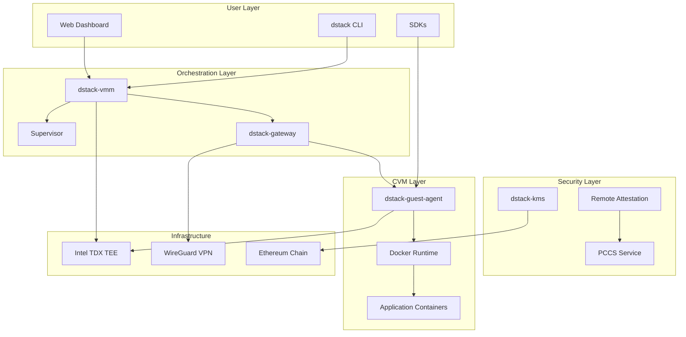

## [VMM (Virtual Machine Manager) Architecture](https://github.com/Dstack-TEE/dstack/blob/45ebd05a/vmm/src/main.rs)

The VMM is the core orchestrator implemented in Rust that manages the complete lifecycle of Confidential VMs.

*This expandable diagram details the internal architecture of the VMM system, highlighting the main layers and service groupings. Each component is colored by function: core VMM subsystems use varying shades of green to emphasize their role within the trusted execution environment, while external interfaces and integrations are rendered in gray or blue for visual distinction. The diagram captures key data flows and relationships—from user-facing entry points, through orchestration and resource management, to integration with external key management and API endpoints—making the hierarchy and scope of each subsystem clear at a glance.*

**Key VMM Services** ([VMM RPC API](https://github.com/Dstack-TEE/dstack/blob/45ebd05a/vmm/rpc/proto/vmm_rpc.proto)):  
The VMM exposes a comprehensive suite of services through its RPC API, enabling robust management of Confidential Virtual Machines (CVMs) throughout their entire lifecycle. This includes the ability to create, start, stop, remove, and upgrade VMs with fine-grained control, ensuring operational flexibility and reliability. The VMM continuously monitors and allocates system resources, dynamically adjusting CPU, memory, disk, and GPU assignments to meet workload demands while maintaining optimal performance and isolation. Advanced networking capabilities are provided through seamless port mapping and configurable network topologies, supporting both user-mode and bridge networking scenarios. GPU management is fully integrated, allowing for efficient discovery, allocation, and sharing of GPU resources across VMs. Additionally, the VMM handles image and configuration management, streamlining the deployment and maintenance of VM environments with consistent and reproducible settings.

**VMM Configuration** ([vmm.toml reference](https://github.com/Dstack-TEE/dstack/blob/45ebd05a/vmm/vmm.toml)):  
VMM configuration is defined in a flexible TOML file that governs all operational parameters, allowing administrators to tailor the environment to specific requirements. The configuration supports both user-mode and bridge networking, enabling versatile connectivity options for guest VMs. It manages CID pools to facilitate secure and efficient guest communication, and provides configurable resource limits for CPU, memory, and disk to ensure fair allocation and prevent resource contention. GPU discovery and allocation are natively supported, allowing the VMM to automatically detect available GPUs and assign them to VMs as needed. To enhance reliability, the configuration also includes auto-restart capabilities, ensuring that failed VMs are automatically recovered and service continuity is maintained without manual intervention.

## [Gateway Architecture](https://github.com/Dstack-TEE/dstack/blob/45ebd05a/gateway/src/main.rs)

The Gateway provides secure network access and traffic routing with automatic TLS certificate management.

### Gateway Internal Architecture  

*This diagram presents the internal architecture of the Gateway service, organizing its core functions, networking components, and security mechanisms into distinct layers. Each service block is visually grouped according to its domain—core services, network layer, and security—to highlight separation of responsibilities. The directional arrows depict key data flows and operational dependencies, from service proxies and RPC handlers through network management (including TLS, VPN, and load balancing), to certificate automation and authentication controls. The visual layout clarifies how the Gateway orchestrates secure, reliable, and scalable connectivity across the system.*
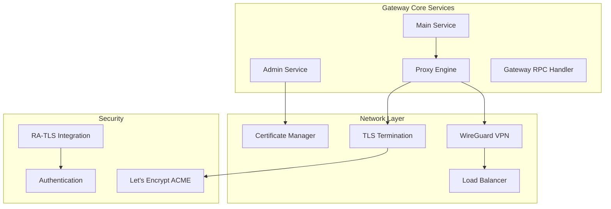

**[Gateway RPC Services](https://github.com/Dstack-TEE/dstack/blob/45ebd05a/gateway/rpc/proto/gateway_rpc.proto):**  
The Gateway exposes a set of RPC services that enable core networking and management functionality. These services facilitate the registration of Confidential Virtual Machines (CVMs) and the automated setup of WireGuard tunnels, ensuring secure and authenticated connectivity between components. The RPC interface also orchestrates traffic routing and load balancing, dynamically distributing network flows to optimize resource utilization and maintain high availability. Integrated ACME certificate management automates the lifecycle of TLS certificates, leveraging Let's Encrypt to provision, renew, and revoke certificates as needed for secure communications. Additionally, the Gateway provides real-time status and health monitoring endpoints, allowing for continuous observability and proactive management of gateway operations.

### Gateway Service and Traffic Flow Diagram

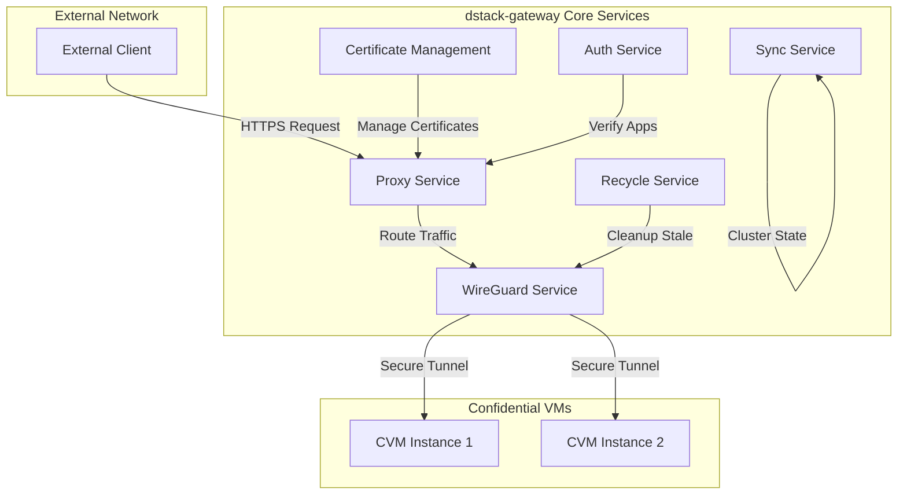

**Gateway Configuration** ([gateway.toml reference](https://github.com/Dstack-TEE/dstack/blob/45ebd05a/gateway/gateway.toml)):  
Gateway configuration is defined in a TOML file that specifies all operational parameters. This includes detailed WireGuard VPN tunnel settings, enabling secure encrypted channels for inter-node communication. The configuration supports automatic certificate provisioning through Let's Encrypt, streamlining the deployment and renewal of TLS certificates without manual intervention. Administrators can fine-tune proxy behavior by adjusting timeouts and buffer sizes to match workload requirements and network conditions. Furthermore, the configuration supports multi-gateway synchronization, allowing multiple gateway instances to coordinate state and provide seamless, resilient service across distributed environments.

## [KMS (Key Management Service) Architecture](https://github.com/Dstack-TEE/dstack/blob/45ebd05a/kms/src/main.rs)

The KMS handles all cryptographic operations and integrates with blockchain for decentralized authorization.

### KMS Internal Architecture

*This diagram outlines the internal architecture of the KMS (Key Management Service), clearly organizing its core logic, key management components, and external integrations. Each section is grouped to reflect functional boundaries: the KMS core oversees primary operations and state, the key management layer handles a variety of cryptographic keys and certificates, and the integration layer connects with external systems like blockchains and remote attestation services. The directional arrows illustrate the flow of key material and control signals between modules, clarifying how onboarding, crypto operations, and state management all interact to securely provision, store, and expose keys across the trusted environment.*

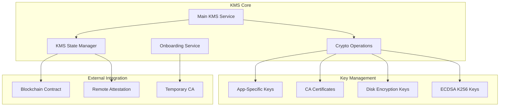

**KMS RPC Services:** ([see service definition in kms_rpc.proto](https://github.com/Dstack-TEE/dstack/blob/45ebd05a25ad4ffacce3b8f003e4f5a8b609b2e2/kms/rpc/proto/kms_rpc.proto#L84))

The KMS exposes a comprehensive suite of RPC services designed to facilitate secure cryptographic operations and system integration. One of the core services is application key derivation, which is tightly coupled with remote attestation to ensure that keys are only provisioned to verified and trusted environments. This process leverages attestation evidence to validate the integrity and authenticity of the requesting entity before any key material is derived or released. The KMS also provides robust certificate signing and chain management capabilities, enabling automated issuance, renewal, and revocation of certificates, as well as the maintenance of certificate chains to establish trust hierarchies within the system. For secure handling of sensitive configuration data, the KMS manages environment variable encryption keys, allowing applications to encrypt and decrypt environment variables at runtime without exposing raw secrets. Integration with blockchain technology is another critical service, where the KMS interacts with smart contracts to enforce decentralized authorization policies, ensuring that only entities with valid on-chain permissions can access protected resources or perform sensitive operations. Additionally, the KMS oversees image cache management, which involves the secure storage, retrieval, and validation of container or VM images, ensuring that only attested and authorized images are deployed within the infrastructure.

**Key Types Managed:**  
(see [kms_rpc.proto message struct definition](https://github.com/Dstack-TEE/dstack/blob/45ebd05a25ad4ffacce3b8f003e4f5a8b609b2e2/kms/rpc/proto/kms_rpc.proto#L21))

The KMS is responsible for managing a diverse set of cryptographic key types, each tailored to specific security requirements within the platform. It maintains the TLS CA certificate chain, which forms the foundation of trust for all TLS communications by enabling the issuance and validation of server and client certificates. For data-at-rest protection, the KMS generates and stores disk encryption keys that are used to implement full disk encryption, safeguarding sensitive data even if physical storage is compromised. To support secure environment variable handling, the KMS provisions X25519 keys, which are used for encrypting and decrypting environment variables, ensuring that secrets remain protected throughout their lifecycle. The system also manages ECDSA K256 keys, which are essential for performing Ethereum-compatible cryptographic operations, such as signing blockchain transactions or verifying signatures in decentralized applications. Finally, the KMS orchestrates the creation and management of signed key chains, which are used for trust verification across distributed components, enabling secure delegation and validation of cryptographic authority within the ecosystem.

## Guest Agent Architecture

[See main.rs implementation reference](https://github.com/Dstack-TEE/dstack/blob/45ebd05a25ad4ffacce3b8f003e4f5a8b609b2e2/guest-agent/src/main.rs#L200)

The Guest Agent runs inside each CVM and provides the runtime environment for applications.

### Guest Agent Internal Architecture

*This diagram depicts the internal architecture of the Guest Agent, which operates inside each confidential VM (CVM) to orchestrate application runtime, container lifecycle, and security services. Core service groupings show how external and internal APIs interact with the state manager, which coordinates both application execution and cryptographic operations. Container management subsystems oversee Docker runtime, monitoring, and system health, while the security layer handles key derivation, attestation, and event logging. The flow of data and control across these modules demonstrates how the Guest Agent maintains both robust runtime orchestration and a strong security posture within the confidential computing environment.*

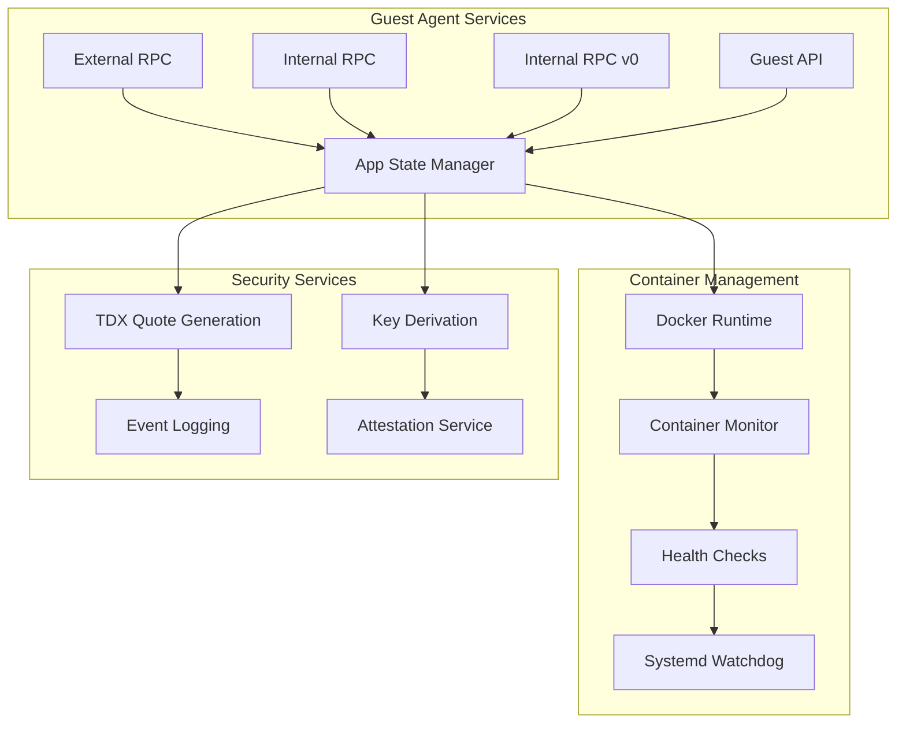

**Guest Agent RPC Services:**  
[See the service definition in agent_rpc.proto](https://github.com/Dstack-TEE/dstack/blob/45ebd05a25ad4ffacce3b8f003e4f5a8b609b2e2/guest-agent/rpc/proto/agent_rpc.proto#L31)

The Guest Agent exposes a set of RPC services that enable secure and flexible management of cryptographic and attestation operations within the CVM environment. These services include the derivation of TLS keys along with the automated generation of certificates, ECDSA key generation for cryptographic signing, and the production of TDX quotes with support for custom report data. Additionally, the Guest Agent is capable of emitting events to extend RTMR3 measurements, thereby supporting advanced attestation workflows, and provides comprehensive application information and status reporting to facilitate monitoring and integration with external systems.

**Supported Key Operations**  
[See full list in agent_rpc.proto &rarr;](https://github.com/Dstack-TEE/dstack/blob/45ebd05a25ad4ffacce3b8f003e4f5a8b609b2e2/guest-agent/rpc/proto/agent_rpc.proto#L50)

The Guest Agent supports a range of key management operations, including path-based key derivation for hierarchical key management, certificate generation with configurable subject and alternative names, and integration with RA-TLS for remote attestation. It can issue both server and client authentication certificates as required by the application, and supports random seed-based key generation to ensure cryptographic strength and flexibility in key provisioning workflows.

## Supervisor Architecture

[See the main Supervisor implementation in main.rs](https://github.com/Dstack-TEE/dstack/blob/45ebd05a25ad4ffacce3b8f003e4f5a8b609b2e2/supervisor/src/main.rs#L112)

The Supervisor is responsible for orchestrating the lifecycle of VM processes and provides a web-based management interface for operational control. It features robust process lifecycle management with PID tracking, facilitates communication through Unix domain sockets, and exposes a web API for VM control operations. The Supervisor also supports configurable logging and daemonization to suit various deployment environments, and enforces resource limits to ensure reliable and secure operation of managed virtual machines.

## Component Interaction Flows

### VM Deployment Flow

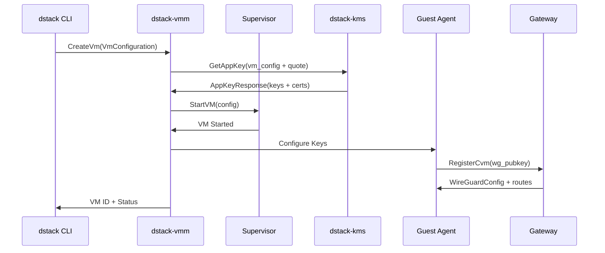

### Request Routing Flow

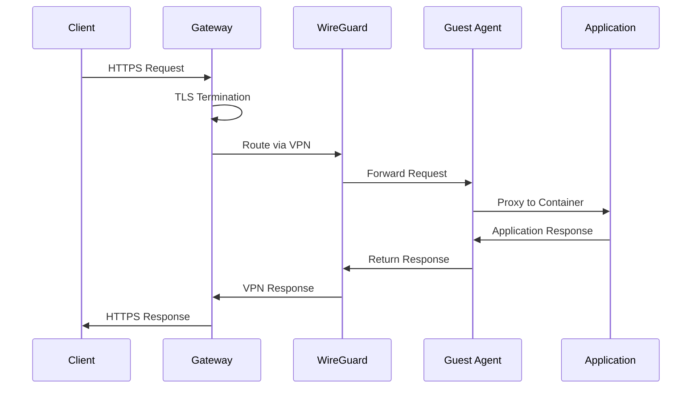

### Remote Attestation Flow

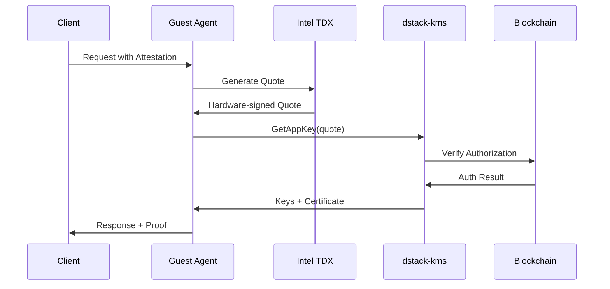

## Network Architecture

### Multi-Layer Network Security

([gateway config](https://github.com/Dstack-TEE/dstack/blob/45ebd05a25ad4ffacce3b8f003e4f5a8b609b2e2/gateway/gateway.toml#L38)) ([vmm config](https://github.com/Dstack-TEE/dstack/blob/45ebd05a25ad4ffacce3b8f003e4f5a8b609b2e2/vmm/vmm.toml#L12))

*This diagram provides a detailed view of the dstack multi-layer network architecture, emphasizing the layered security controls that protect communication from the public internet down to confidential workloads. Each layer is visually differentiated by shades of green, representing increasing trust and isolation as traffic flows inward. The structure ensures strict separation between external access, secure tunnels, and internal virtualized resources, while maintaining strong cryptographic guarantees at every boundary. The architecture demonstrates how network segmentation, encrypted tunneling, automated certificate management, and container-level isolation work together to create a robust and defense-in-depth security posture.*

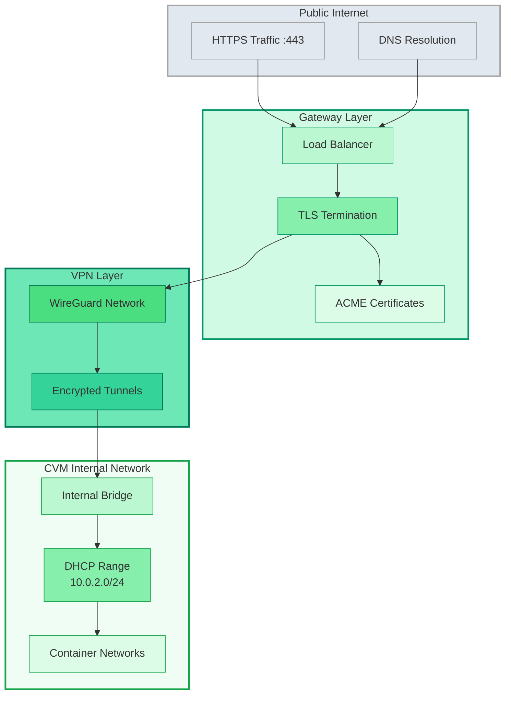

---

### Network Configuration Layers

* **Public Layer:**
  Handles all ingress from the public internet. HTTPS and DNS traffic are first received and terminated at the load balancer. This layer enforces TLS encryption at the network edge and acts as the first point of defense against external threats.

* **Gateway Layer:**
  Consists of the load balancer, TLS termination, and automated certificate management using ACME. Here, connections are securely routed and encrypted certificates are managed dynamically. The gateway strictly enforces security boundaries and forwards only authenticated, encrypted traffic deeper into the stack.

* **VPN Layer:**
  All internal traffic passes through a dedicated WireGuard VPN overlay. Encrypted tunnels are automatically provisioned for both host-to-host and host-to-VM traffic, providing confidential communication even across untrusted networks. This adds a strong cryptographic layer, ensuring that no data traverses the underlying infrastructure unprotected.

* **CVM Internal Network:**
  At the heart of the system, the internal network segments VM and container workloads via isolated virtual bridges and DHCP-managed subnets. Each confidential VM (CVM) and its containers receive unique, securely allocated addresses, minimizing lateral movement and further compartmentalizing resources. Communication between workloads is strictly controlled and isolated from public and management networks.

* **Security:**
  All network segments are encrypted and authenticated, with certificates managed automatically and VPN keys rotated regularly. Only explicitly authorized endpoints can communicate, and all management, orchestration, and application data flows are cryptographically verified at each boundary.

---

**The layered network architecture implements mandatory isolation between public, management, and confidential computing environments. Each segment is cryptographically protected, with no direct access permitted across boundaries. Only authenticated and authorized traffic is allowed to traverse between layers, minimizing attack surface and enforcing defense-in-depth.**

---

## Security Architecture

### Defense in Depth Model

1. Foundational Trust Chain

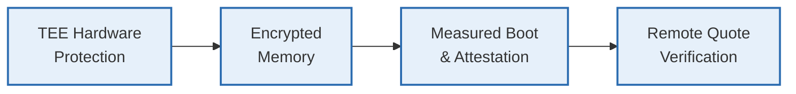

2. Derived Controls & Runtime Protections

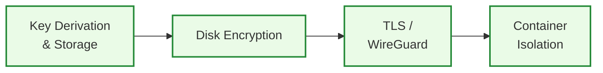

## Deployment Topologies

### Single Host Development

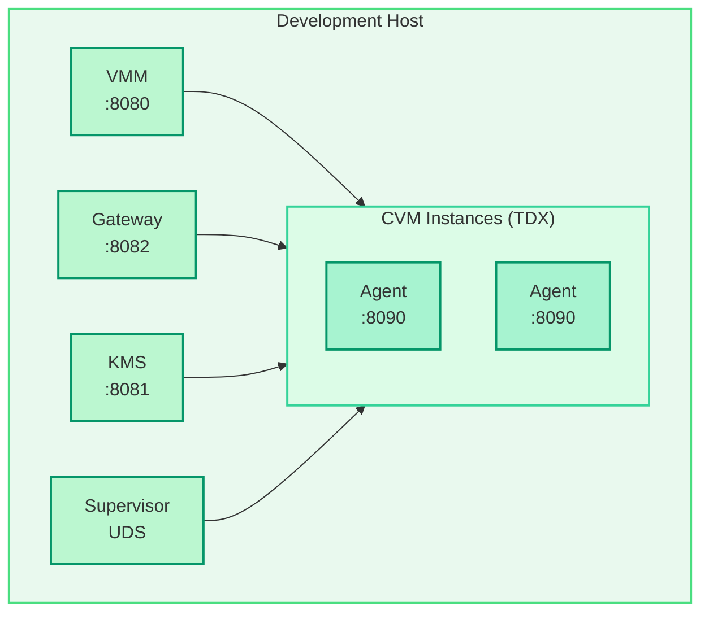

### Production Multi-Host Cluster

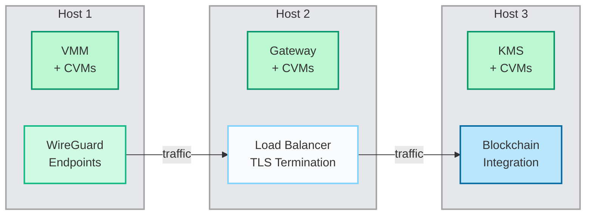

## Performance Characteristics & Resource Management

*Understanding the performance and resource constraints of the dstack platform is essential for capacity planning, debugging, and cost modeling. This section summarizes the most important real-world timings and system limits, so operators and users know what to expect and where scaling thresholds or bottlenecks might arise. All configuration and reference links are included for full transparency and reproducibility.*

---

  

    <h4 className="font-semibold mb-3 text-blue-900">Typical Performance Metrics</h4>
    <ul className="space-y-2 text-sm text-blue-900 list-disc ml-6">
      <li>CVM boot time: 30–60s (with TDX attestation)</li>
      <li>Container start: 2–5s (Docker runtime)</li>
      <li>Quote generation: 50–100ms (TDX hardware)</li>
      <li>Key derivation: 10–50ms (KMS operations)</li>
      <li>Network latency: 1–5ms (WireGuard overhead)</li>
      <li>TLS handshake: 100–200ms (with RA-TLS verification)</li>
    </ul>
  

  

    <h4 className="font-semibold mb-3 text-gray-800">Key Resource Limits & Scaling</h4>
    <ul className="space-y-2 text-sm text-gray-900 list-none">
      <li><b>vCPU limit</b>: <a href="https://github.com/Dstack-TEE/dstack/blob/main/vmm/vmm.toml#L28" target="_blank" rel="noopener">20 per host</a></li>
      <li><b>Memory limit</b>: <a href="https://github.com/Dstack-TEE/dstack/blob/main/vmm/vmm.toml#L29" target="_blank" rel="noopener">100GB per host</a></li>
      <li><b>Disk size</b>: <a href="https://github.com/Dstack-TEE/dstack/blob/main/vmm/vmm.toml#L25" target="_blank" rel="noopener">500GB per VM</a></li>
      <li><b>CID pool</b>: <a href="https://github.com/Dstack-TEE/dstack/blob/main/vmm/vmm.toml#L27" target="_blank" rel="noopener">1000 concurrent CVMs</a></li>
      <li><b>Auto-restart</b>: <a href="https://github.com/Dstack-TEE/dstack/blob/main/vmm/vmm.toml#L45" target="_blank" rel="noopener">20 seconds</a></li>
      <li className="mt-4"><b>Gateway scaling</b>: <a href="https://github.com/Dstack-TEE/dstack/blob/main/gateway/gateway.toml#L85-L92" target="_blank" rel="noopener">gateway.toml</a></li>
      <li className="ml-4">Connection recycling: <a href="https://github.com/Dstack-TEE/dstack/blob/main/gateway/gateway.toml#L85" target="_blank" rel="noopener">5 min</a></li>
      <li className="ml-4">Node timeout: <a href="https://github.com/Dstack-TEE/dstack/blob/main/gateway/gateway.toml#L87" target="_blank" rel="noopener">10 min</a></li>
      <li className="ml-4">State sync: <a href="https://github.com/Dstack-TEE/dstack/blob/main/gateway/gateway.toml#L91" target="_blank" rel="noopener">30 sec</a></li>
      <li className="ml-4">Multi-gateway broadcast: <a href="https://github.com/Dstack-TEE/dstack/blob/main/gateway/gateway.toml#L92" target="_blank" rel="noopener">10 min</a></li>
    </ul>
  

---

### Why This Matters

* **Operational predictability:** These figures help set user expectations for startup, scaling, and workload responsiveness.
* **Capacity planning:** Knowing resource ceilings and timing enables efficient host sizing and better cost modeling for clusters.
* **Debugging and troubleshooting:** Outliers and anomalies are easier to spot when typical timings and quotas are known upfront.
* **Transparent configuration:** Direct links to source config files ensure reproducibility and clarity for security and compliance review.

> *Reviewing these characteristics is essential for operators, architects, and developers to make informed choices about deploying, scaling, and troubleshooting confidential workloads on dstack.*

  
## Next Steps

Now that you understand the comprehensive architecture:

  <a href="/docs/concepts/core-components" className="bg-blue-600 text-white px-6 py-3 rounded-lg hover:bg-blue-700">
    Explore Components →
  </a>
  <a href="/docs/concepts/security-model" className="bg-gray-200 text-gray-800 px-6 py-3 rounded-lg hover:bg-gray-300">
    Learn Security Model
  </a>

The dstack architecture provides enterprise-grade security through:
- **Hardware-based Isolation**: Intel TDX for memory encryption and attestation
- **Cryptographic Verification**: End-to-end quote verification and key derivation  
- **Zero-trust Networking**: WireGuard VPN with TLS termination
- **Decentralized Trust**: Blockchain-based authorization without central authority
- **Container Security**: Isolated execution environments within TEEs

Learn more about our [Security Model](/docs/concepts/security-model) and [Core Components](/docs/concepts/core-components).

