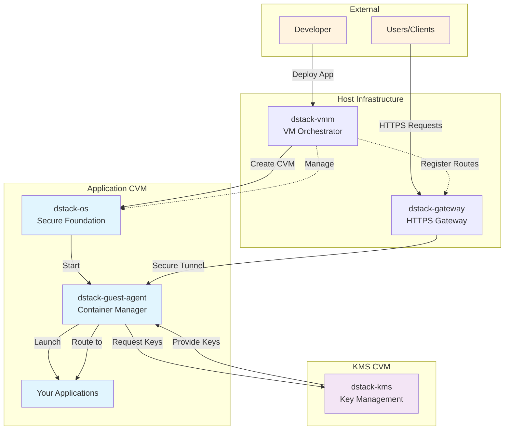

# The Basic Components of dstack

The **dstack** framework is composed of several core components that work in concert to deliver a secure, confidential cloud runtime. Each component plays a distinct role in establishing a Trusted Execution Environment (TEE) for containerized applications. Together, these pieces form a layered architecture that enables deploying Docker-based workloads into Intel TDX-powered Confidential VMs (CVMs) with strong isolation, attestation, and encrypted I/O by default. (For a deeper architectural overview, see the [architecture concepts](/docs/concepts/architecture) documentation.) Below we describe each fundamental component in turn, highlighting how they integrate to achieve a zero-trust deployment platform:

**dstack-vmm** – a virtualization manager that runs on a bare-metal Intel TDX host, responsible for launching and managing CVMs (Confidential VMs). The VMM leverages the hardware TEE features of Intel TDX to instantiate each CVM as an isolated trust domain: all memory within a CVM is encrypted and inaccessible to the host OS or hypervisor, and the CVM's boot process is cryptographically measured to produce an attestation of its integrity. In effect, **dstack-vmm** orchestrates secure VM life-cycle operations, ensuring that every deployed application VM starts in a known-good state and can provide proof of its TEE-backed integrity.

**dstack-gateway** – a network gateway (reverse proxy) that exposes services running inside CVMs to the outside world via secure connections. It forwards incoming TLS (HTTPS) connections from clients to the appropriate CVM, acting as a conduit that upholds end-to-end confidentiality. The **dstack-gateway** automatically handles TLS termination using certificates that are **cryptographically bound to the attestation identity of the CVM**, a mechanism often referred to as RA-TLS or "attestation-constrained" TLS. In practice, each deployed application is accessible at a unique address (for example, `0xABCD.dstack.host`), and the gateway ensures that only the intended TEE-resident service can present a valid certificate for that address. This design gives clients a built-in assurance that they are communicating with a genuine confidential service, not an impersonator, effectively bringing Zero Trust principles to incoming traffic.

**dstack-kms** – a Key Management Service that derives and provides cryptographic keys for CVMs in a decentralized, trust-minimized way. Rather than storing static secrets, **dstack-kms** generates a unique *Root Key* for each application instance based on the application's identity (such as its code, configuration, or image hash). From this root, the KMS deterministically derives all other necessary keys (for data encryption, integrity checks, random number generation, etc.), delivering them on-demand to the requesting CVM after verifying that the VM is running on authentic TEE hardware. Notably, dstack-kms is designed to operate independently of any single piece of hardware or host—this **decoupling of secret generation from specific TEE instances** means that an application's encrypted state can be safely migrated across different physical machines or cloud providers without losing access to its data. In addition, the KMS can implement key rotation and versioning policies (acknowledging that TEEs are not infallible) to preserve forward and backward secrecy if a node is ever suspected of compromise. As the root-of-trust for the entire platform, **dstack-kms** is typically hardened and distributed to avoid any central point of failure in the security architecture.

**dstack-guest-agent** – a lightweight agent process that runs inside each CVM, serving as the trusted overseer for the application's runtime. The guest agent (internally sometimes called `tappd`) is responsible for setting up the in-VM environment and mediating all security-sensitive requests from the application containers. In particular, **dstack-guest-agent** handles **remote attestation** and secret retrieval: when a CVM boots, the agent gathers the attestation quote from the TEE (proving the integrity of the VM's software stack) and uses it to request keys from dstack-kms. It then supplies those derived keys to the container processes (for example, to decrypt an application's filesystem or secrets) without ever exposing them outside the enclave. The guest agent also interfaces with the networking stack to assist the dstack-gateway in establishing RA-TLS connections, by generating attestation-bound TLS key material and certificates from within the enclave (using internal utilities in the VM to create a certificate signing request that includes the TEE proof). Overall, **dstack-guest-agent** acts as the in-enclave security coordinator, ensuring the application inside the CVM can attest its trustworthiness and securely obtain the resources it needs to run.

**meta-dstack** – a Yocto-based build layer that produces the minimal, secure guest OS image used inside the CVM. Rather than relying on a general-purpose VM image, **meta-dstack** provides a purpose-built, hardened environment for confidential containers. It includes only the essential kernel, system libraries, and dstack runtime components (such as the guest agent and attestation libraries), thereby minimizing the attack surface. The resulting OS (sometimes referred to as **dstack-os**) serves as a **hardware abstraction layer** between the application containers and the TEE hardware. Importantly, this base image is configured with security best practices out of the box: it establishes a secure boot chain from the TDX hardware up through the kernel and container runtime, has no default administrative backdoors, and supports reproducible builds for verifiability. By using meta-dstack, every CVM launched by dstack-vmm starts with a vetted, trustable software stack, so developers don't need to craft or audit their own entire OS for compliance with TEE requirements. This significantly reduces the complexity of building confidential apps, since one can simply provide container images and let dstack's components handle the low-level secure plumbing.

---

# Basic Component Flow 

*The above Mermaid diagram illustrates how the basic components interconnect during an application deployment.* Starting from the **developer's application code** (packaged as one or more containers), dstack's tooling builds a specialized CVM image and hands it off to the **dstack-vmm**, which launches the Confidential VM on a TDX-enabled host. Inside the CVM, the **dstack-guest-agent** takes control: it performs a remote attestation of the new VM and orchestrates the startup of the user's **application containers**. The guest agent communicates with the **dstack-kms** to obtain the necessary secrets (such as encryption keys), proving the CVM's trustworthiness before any sensitive material is released. Meanwhile, the **dstack-gateway** on the host is configured to forward external client requests into the CVM. When a client initiates an HTTPS connection to the service (for example, via the unique `*.dstack.host` domain for that deployment), the gateway verifies the CVM's attestation and then routes the traffic over a TLS channel that terminates inside the enclave. In this way, the application's users interact with it as they would any web service, but under the hood every request and response is confined within a secure enclave context. The diagram shows the end-to-end flow: from building the confidential image, to launching the CVM, attesting and provisioning keys, and finally serving client traffic—ensuring at each step that the code running is exactly what it should be and that data remains confidential and tamper-proof.

## Enhanced Deployment Flow

With the core components in place, deploying an application with dstack involves a sequence of steps that **enhance the traditional cloud deployment flow with additional security checkpoints**. In a typical scenario, a developer begins with a containerized application (for example, a set of Docker containers defined via Docker Compose) and ends up with that application running in a confidential environment accessible to end-users. The process below describes this flow in a narrative form, demonstrating how dstack automates secure deployment:

**Image Preparation and CVM Launch:** The journey starts by converting the developer's container image(s) into a Confidential VM image. Using the dstack CLI and the meta-dstack build system, the containers are bundled with the minimal OS and TEE runtime to produce a sealed CVM disk image. This image includes the application payload along with all dstack-enabling components (attestation libraries, guest agent, etc.), ready to run on a TDX-capable machine. The **dstack-vmm** then boots up a new CVM instance from this image on a bare-metal host. During this boot, the Intel TDX hardware creates a measured environment: it validates the integrity of the VM's firmware, kernel, and software stack, and generates a cryptographic quote (attestation) that reflects this exact state. By the time the CVM is live, we have a fully isolated virtual machine that is cryptographically bound to the expected software—essentially, the application is now running inside an enclave whose identity can be verified by external parties.

**In-TEE Initialization and Attestation:** Once the Confidential VM is running, the **dstack-guest-agent** inside it springs into action. The guest agent first performs a remote attestation handshake: it collects the attestation quote from the TDX module (which proves the CVM's identity and secure state) and prepares it for consumption by external services. It then registers the new enclave instance with the rest of the dstack system. At this stage, the guest agent is effectively vouching for the VM, asserting to the outside world (and to other dstack components) that "this VM is indeed running the intended code inside a genuine TEE." With a valid quote in hand, the **dstack-guest-agent** proceeds to launch the user's application containers within the CVM. These containers now operate in a protected memory space, using the pared-down OS provided by meta-dstack, and are unable to break TEE isolation or access anything outside the enclave. The guest agent manages the container lifecycle (similar to how a container runtime or init system would), ensuring the application services come online within the secure environment.

**Key Provisioning and Secret Injection:** A critical part of the flow involves provisioning secrets to the newly started application. As the containers initialize, they may need encryption keys (for sealing data to disk, encrypting communications, or other sensitive config like API keys). Rather than embedding secrets beforehand, dstack retrieves them on the fly from its KMS. The **dstack-guest-agent**, using the attestation evidence, sends a request to **dstack-kms** for the application's keys. The KMS service verifies the attestation report—checking that the request truly comes from an enclave running the expected code—and then uses the application's identity (such as a hash of the container image or a deployment ID) to deterministically derive the required secrets. These secrets (for example, a disk encryption key and any runtime credentials) are **never exposed in plaintext outside the TEE**: the KMS transfers them over an encrypted channel directly into the CVM's guest agent. Upon receiving the keys, the guest agent loads them into the appropriate places: it might unlock an encrypted volume inside the VM, mount a filesystem, or pass a key to the application via an environment variable or file, all within the enclave's confines. This on-demand key derivation means that even if the image or host were intercepted earlier, it contained no useful secret – the keys materialize only after the enclave proves itself. Moreover, because the keys are derived and not arbitrarily chosen, the same application code will always get the same secret on any host (facilitating features like data migration and multi-region deployment), yet an attacker cannot guess or misuse those secrets without the correct attestation.

**Secure Service Exposure:** At this point, the application is up and running inside a CVM, with its data protected at rest and its integrity vouched for. The final step in the deployment flow is making the application accessible to users in a secure manner. This is where **dstack-gateway** comes into play. As soon as the CVM is launched and attested, the dstack system coordinates with the gateway to configure a public endpoint for the application. Each deployed service is typically assigned a unique subdomain (for example, an auto-generated hash or ID under the `dstack.host` domain) so that it can be reached via the internet. The **dstack-gateway** either obtains a TLS certificate for that domain or uses an ephemeral certificate generated by the enclave, embedding the CVM's attestation into the certificate via RA-TLS. In either case, the gateway ensures that any client connecting over HTTPS will negotiate a TLS session that is cryptographically linked to the CVM's identity. In practical terms, when a user visits the application's URL, the gateway will forward the incoming TLS connection directly into the CVM (either by acting as an SNI router in TLS passthrough mode, or by terminating TLS after verifying the enclave's certificate). The result is that the TLS handshake itself attests the enclave: a client can be presented with a certificate chain proving the server is a legitimate TEE instance, and the gateway will only route traffic to the CVM if that verification passes. All HTTP requests from the user are thus handled by the application inside the enclave, and responses travel back the same way, with the gateway simply relaying encrypted data. This **RA-HTTPS flow** gives end-to-end encryption with confidentiality and integrity guarantees that extend into the application's runtime. The user experiences a standard HTTPS connection, but behind the scenes dstack has layered in additional trust verification.

**Completion and Continuous Trust:** After the above steps, the deployment is complete: the developer's application is running as a confidential service. From the developer's perspective, they wrote a containerized app and specified it should run on dstack; dstack then automated everything else—provisioning a secure VM, attesting it, injecting secrets, and exposing a secure endpoint. The "enhanced" nature of this deployment flow lies in the invisible security measures taken throughout. At no point does untrusted code execute, and at no point can data be accessed without proper attestation. Even after deployment, these guarantees continue: the dstack-gateway can periodically or continuously verify attestation quotes from the CVM (for instance, if the VM restarts or after a certain time interval, new quotes can be checked) and the dstack-kms can issue rotated keys if needed. If the application or the CVM needs to be updated, the process can be repeated, with the assurance that any change in code will produce a different measurement, and thus would not be trusted by KMS or gateway until explicitly approved. In summary, the deployment flow not only launches your application but does so in a way that **each stage is fortified by cryptographic trust** – from build time, to boot time, to run time, and to user access.

## Built-In Security Subsystems in Dstack Components

Beyond the overall flow, it's important to understand how **each dstack component incorporates its own secure sub-components or mechanisms** to enforce the platform's stringent security model. Dstack's architecture follows a defense-in-depth strategy: every layer, from hardware up to the application, includes features to mitigate threats and ensure that no single compromise breaks the chain of trust. Below, we delve into how each component is designed with security in mind:

**dstack-vmm (Secure Enclave Orchestration):** The VMM that controls CVMs is tightly coupled with Intel's TDX technology to provide hardware-enforced isolation. When **dstack-vmm** creates a new CVM, it utilizes Intel TDX to configure the VM as a Trust Domain (TD), meaning the CPU will automatically encrypt all memory pages of the CVM and isolate them from any other software on the host. This protects the enclave's runtime state from a malicious or compromised host OS/hypervisor. Additionally, the VMM initiates the TDX measured launch process, which records hashes of the CVM's firmware, bootloader, kernel, and application stack into TDX's secure registers (RTMRs). These measurements form the basis of the CVM's attestation report. Only if the measurements match expected values (i.e. the VM is running an approved software stack) will the attestation verification succeed. By anchoring trust in the CPU's silicon and microcode, **dstack-vmm** ensures that even if an attacker had root access on the host, they could not inspect or tamper with the confidential workload inside the CVM. The VMM itself is kept as minimal as possible and runs with hardened settings on the host; it primarily just launches and tears down VMs, deferring all business logic to in-VM agents so as to minimize its own attack surface.

**meta-dstack (Hardened Base Image):** The security of the entire system also hinges on the integrity of the guest OS that runs inside the enclave. **meta-dstack** addresses this by producing a **minimal, read-only base image** that is pre-configured for security. This image (dstack's custom OS) is built using a reproducible process (Yocto), allowing its binaries to be independently verified and preventing supply-chain tampering. It includes a custom init process that immediately starts the dstack-guest-agent and application containers, and it excludes unnecessary services or drivers that could introduce vulnerabilities. There are no default login shells or SSH servers running in the CVM, eliminating the risk of an attacker gaining interactive access. Critical binaries and scripts in the image are measured as part of the TDX attestation, so if anyone altered the OS or dstack-agent, the change would be detected. Furthermore, **meta-dstack** enables full disk encryption within the CVM using keys from dstack-kms, so even if an attacker somehow obtained a snapshot of the VM's disk, it would be unintelligible. By controlling the contents of the guest OS, meta-dstack establishes a trusted computing base inside the enclave. The design philosophy is that the OS layer should be **"intrinsically secure and verifiable, with no administrative backdoors"**, which significantly reduces the chance of misconfiguration and ensures that the CVM's software environment remains trustable.

**dstack-guest-agent (Enclave Attestation & Enforcement):** Running withinside the secure confines of the CVM, the **guest agent** is effectively the **brains of in-enclave security**. It is built with components like the TDX attestation libraries (`tdx-attest`) and RA-TLS support (`ra-tls`, `ra-rpc`), which allow it to perform cryptographic operations tied to the enclave's identity. One of the key secure sub-components of the guest agent is the attestation quote generator: it interfaces with the TDX module to produce an attestation report that is cryptographically signed

by the CPU (via the Intel EPID or DCAP attestation scheme). The agent then formats this report for consumption by external services, bundling it into requests to dstack-kms or presenting it via TLS certificates to clients. The **RA-TLS certificate module** within the guest agent deserves special mention: it generates a private key and X.509 certificate signing request (CSR) inside the enclave and embeds the attestation quote into a certificate extension. This CSR can be used to obtain a certificate from a CA (which in Phala's system is automated by a built-in Certbot service for the gateway), or for a self-signed certificate that clients explicitly trust. In either case, the result is that the enclave proves ownership of a keypair that's bound to its secure state. The guest agent's design ensures that **no sensitive operation occurs without attestation**. For instance, if the application container tries to fetch a secret, the agent will only fulfill that request after it has attested to KMS and obtained the key. If the application tries to open a listening socket, the agent can enforce that only TLS connections with the proper certificate are used (or coordinate with the gateway to do so). Additionally, the guest agent runs with the least privilege necessary inside the VM and is isolated from the application's workload (for example, running as a separate process, possibly with stronger privileges to interact with TEE device drivers, but not exposed to external network except through defined channels). This separation means even if the application were compromised by an exploit, the attacker would still have to bypass the guest agent's controls to extract secrets or break TEE bounds.

**dstack-gateway (Zero-Trust Networking):** The **gateway** component is the guardian at the network frontier, embedding Zero Trust principles into external connectivity. One of its core security sub-components is the **RA-TLS verification engine**. When the gateway proxies a connection to a CVM, it uses an RA-TLS library to validate the TLS certificate presented by the CVM's enclave (or it presents an attestation-bound certificate to the client on the CVM's behalf, depending on the mode). Essentially, the gateway will only establish or forward a connection if it can confirm the server on the other end is an attested enclave matching the expected measurement. To facilitate this, dstack-gateway works hand-in-hand with the guest agent: for example, the guest agent might supply a signed certificate to the gateway, and the gateway's job is to advertise that cert to clients (via standard TLS) and/or to verify it continuously. The gateway also incorporates a **certificate management sub-component** (built atop Let's Encrypt's ACME protocol via an internal Certbot tool) which automates obtaining TLS certificates for the human-friendly domain names of services. These certificates are issued only after the gateway proves to the CA that it controls the domain, and they might be short-lived. The combination of attestation-backed internal certificates and public CA-issued certificates means that even traditional web browsers (which require standard CAs) can be used to access enclaves securely, without custom plugins. Additionally, the gateway is hardened to prevent common web entry-point attacks: it can enforce host-based routing (ensuring one deployment can't impersonate another's domain), it terminates or forwards connections in a way that an eavesdropper on the host cannot man-in-the-middle the traffic, and it exposes only a minimal API (just forwarding) to the outside. In dstack's security model, the gateway is not fully trusted by the enclaves—it's more of a broker that must itself verify attestation. Should the gateway be compromised, it could not silently connect users to a fake service because it wouldn't have a valid enclave certificate to use. In summary, **dstack-gateway** embeds a policy of *"never trust, always verify"* for network traffic, ensuring that clients and enclaves are mutually authenticated at the cryptographic level before any data flows.

**dstack-kms (Distributed Trust Anchor):** As the provider of keys and secrets, **dstack-kms** is arguably the most security-critical component, and it's architected with multiple safeguards accordingly. First, the KMS never stores plaintext keys long-term; instead, it employs a **deterministic key derivation** scheme. The secret derivation function (a secure cryptographic hash or KDF) takes inputs like the application's identity, possibly a deployment-specific seed, and (if policy dictates) recent blockchain randomness or other entropy, to yield the Root Key. This means that if the KMS service is down, it can recreate keys on restart exactly as before, but if an attacker steals the KMS database, they get no usable secret material (since the keys aren't simply sitting there). Second, dstack-kms is often backed or controlled by a blockchain or decentralized consensus (in Phala's implementation, the key derivation may involve on-chain governance or seed distribution). This adds resilience: no single party, not even the cloud provider hosting the KMS, can arbitrarily issue keys to an enclave that isn't authorized. The KMS checks the enclave's attestation against a ledger of legitimate deployments – for example, it might verify that the enclave's measurement corresponds to a hash that was registered on-chain when the developer deployed the app. Only if this check passes will it derive and release keys. Third, the KMS supports **key rotation and revocation**. If a vulnerability is discovered in the application or the TEE firmware, new keys can be derived (by changing the input parameters or using an updated derivation epoch), and the old keys can be scheduled for revocation, effectively re-securing data under new secrets going forward. This feature is vital for **censorship resistance and compromise recovery**: even if an attacker somehow got hold of an old key (say by breaching a TEE at one point), they cannot decrypt new data after a rotation, nor can they easily fake a new enclave to obtain keys because the attestation verification would fail. Finally, dstack-kms is typically run in a redundant, fault-tolerant manner (and could itself potentially run in TEEs for additional security, though the current design treats it as a highly trusted external service). The protocols between KMS and the guest agent are encrypted and authenticated, and the KMS logs can be audited to detect any irregular access attempts. In essence, **dstack-kms** functions as a **decentralized root-of-trust** for the system, and its internal mechanisms ensure that secrets are only handed to the right enclaves under the right conditions, with a clear audit trail and the ability to adapt if the threat landscape changes.

Together, these built-in security subsystems ensure that each part of dstack's infrastructure reinforces the others. The hardware-level isolation and attestation from dstack-vmm/TDX provide the foundation, the minimal OS and guest agent inside the CVM maintain the enclave's integrity and mediate access to secrets, the gateway links external interactions to internal attestation, and the KMS anchors the trust chain and manages secrets without ever creating a single point of failure. This **defense-in-depth approach** means that even if one layer were to be breached or misconfigured, the other layers would continue to protect the confidentiality and integrity of the application. For developers and users, the end result is a cloud deployment platform where strong security is not an afterthought but an intrinsic quality of the runtime. Every request, every byte of data, and every management operation is checked and secured at multiple levels. For further details on the security rationale and threat model behind these components, please refer to the [dstack security model](/docs/concepts/security-model) documentation, which delves into how trust is established and maintained throughout the system.

