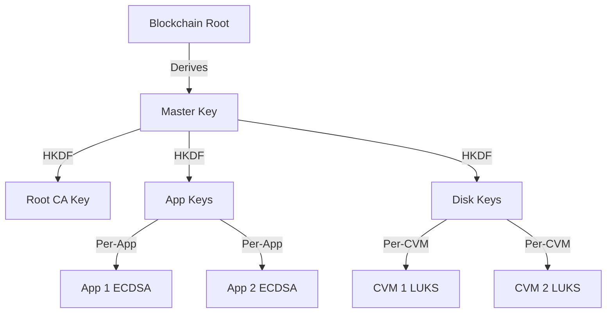
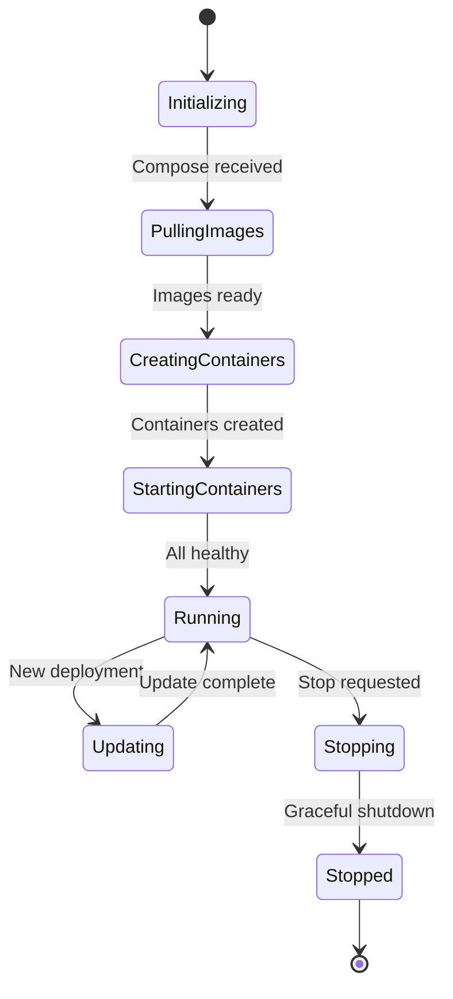
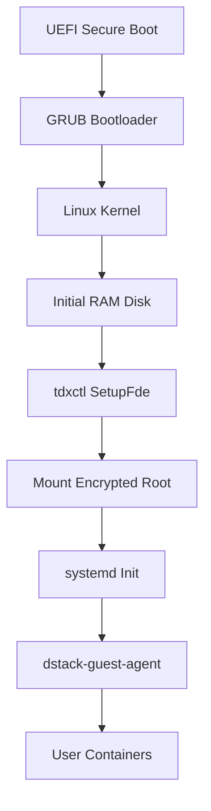

# DStack Core Components and their technical implementation

This page dives into the technical implementation of dstack's core components, providing configuration examples, API references, and integration patterns.  
If you're looking for a high-level overview of what each component does, start with [Basic Components](/docs/concepts/basic-components).


## dstack-kms Implementation

The KMS provides enterprise-grade cryptographic services with blockchain integration:

#### Key Hierarchy and Management



#### Configuration Example

```toml
# kms.toml
[general]
name = "kms-01"
log_level = "info"

[rpc]
listen = "0.0.0.0:8000"
max_connections = 1000
tls_cert = "/etc/dstack/kms/cert.pem"
tls_key = "/etc/dstack/kms/key.pem"

[blockchain]
rpc_url = "https://eth-mainnet.example.com"
chain_id = 1
kms_auth_contract = "0x1234567890123456789012345678901234567890"
app_auth_contract = "0x0987654321098765432109876543210987654321"
wallet_private_key_path = "/etc/dstack/kms/wallet.key"

[attestation]
verify_mode = "strict"
allowed_tcb_levels = ["up-to-date", "sw-hardening-needed"]
quote_verification_timeout = "30s"

[keys]
derivation_path = "m/44'/60'/0'/0"
root_ca_validity_days = 3650
app_key_validity_days = 365
key_rotation_interval = "90d"
```

#### RPC Service Interface

The KMS exposes a comprehensive RPC API:

```go
service DstackKms {
    // Core key operations
    rpc GetAppKey(AppKeyRequest) returns (AppKeyResponse);
    rpc GetTempCaCert(TempCaRequest) returns (TempCaResponse);
    rpc SignCert(SignRequest) returns (SignResponse);
    
    // Attestation and verification
    rpc VerifyAttestation(AttestRequest) returns (AttestResponse);
    rpc GetQuote(QuoteRequest) returns (QuoteResponse);
    
    // Administrative operations
    rpc RegisterApp(RegisterRequest) returns (RegisterResponse);
    rpc RevokeKey(RevokeRequest) returns (RevokeResponse);
    rpc RotateKeys(RotateRequest) returns (RotateResponse);
}
```

### dstack-guest-agent Implementation

The guest agent provides runtime services and security integration:

#### Service Interface

```go
type GuestAgent interface {
    // Container management
    DeployCompose(compose []byte) error
    StartContainers() error
    StopContainers() error
    GetContainerLogs(name string) ([]byte, error)
    
    // Security services
    GetAttestation() (*Quote, error)
    DeriveKey(path string) (*Key, error)
    GetTLSCert(domain string) (*Certificate, error)
    
    // Monitoring and health
    GetMetrics() (*Metrics, error)
    GetHealth() (*Health, error)
    StreamLogs(follow bool) (<-chan LogEntry, error)
}
```

#### Configuration Example

```toml
# guest-agent.toml
[general]
log_level = "info"
data_dir = "/var/lib/dstack"

[container_runtime]
socket_path = "/var/run/containerd/containerd.sock"
namespace = "dstack"
registry_config_path = "/etc/containerd/certs.d"

[security]
kms_endpoint = "https://kms.dstack.internal:8000"
attestation_cache_ttl = "5m"
key_cache_ttl = "1h"

[monitoring]
metrics_port = 9090
health_port = 8080
log_buffer_size = 1000
```

#### Container Lifecycle Management

The agent manages containers through a sophisticated state machine:



### dstack-os Implementation

The operating system provides a secure, minimal foundation:

#### Boot Process



#### System Configuration

Key system configurations for security:

```bash
# /etc/systemd/system/dstack-guest-agent.service
[Unit]
Description=dstack Guest Agent
After=network.target
Requires=network.target

[Service]
Type=simple
User=dstack
Group=dstack
ExecStart=/usr/bin/dstack-guest-agent
Restart=always
RestartSec=5
Environment=RUST_LOG=info

[Install]
WantedBy=multi-user.target
```

### tdxctl Implementation

The TDX control utility provides secure boot and encryption services:

#### Commands Reference

<table className="w-full my-4">
  <thead>
    <tr className="bg-gray-100">
      <th className="p-3 text-left">Command</th>
      <th className="p-3 text-left">Purpose</th>
      <th className="p-3 text-left">Parameters</th>
    </tr>
  </thead>
  <tbody>
    <tr>
      <td className="p-3 font-mono">SetupFde</td>
      <td className="p-3">Initialize full disk encryption</td>
      <td className="p-3">--root-device, --key-source, --app-id</td>
    </tr>
    <tr className="bg-gray-50">
      <td className="p-3 font-mono">Tboot</td>
      <td className="p-3">Secure boot with measurements</td>
      <td className="p-3">--kernel, --initrd, --cmdline</td>
    </tr>
    <tr>
      <td className="p-3 font-mono">ExtendRTMR</td>
      <td className="p-3">Extend Runtime Measurement Register</td>
      <td className="p-3">--rtmr-index, --data</td>
    </tr>
    <tr className="bg-gray-50">
      <td className="p-3 font-mono">SealSecret</td>
      <td className="p-3">Seal data to current PCR state</td>
      <td className="p-3">--input, --output, --pcrs</td>
    </tr>
  </tbody>
</table>

#### Full Disk Encryption Setup

```bash
# Complete FDE setup command
tdxctl SetupFde \
    --root-device /dev/vda2 \
    --key-source kms \
    --app-id $APP_ID \
    --kms-endpoint https://kms.internal:8000 \
    --integrity-check \
    --luks-cipher aes-xts-plain64 \
    --luks-key-size 512
```

## Component Communication Patterns

### Internal Communication Matrix

<table className="w-full my-4 text-sm">
  <thead>
    <tr className="bg-gray-100">
      <th className="p-2">From ↓ To →</th>
      <th className="p-2">VMM</th>
      <th className="p-2">Gateway</th>
      <th className="p-2">KMS</th>
      <th className="p-2">Guest Agent</th>
    </tr>
  </thead>
  <tbody>
    <tr>
      <td className="p-2 font-semibold">VMM</td>
      <td className="p-2 bg-gray-100">-</td>
      <td className="p-2">HTTP/gRPC</td>
      <td className="p-2">RA-TLS</td>
      <td className="p-2">HTTP API</td>
    </tr>
    <tr className="bg-gray-50">
      <td className="p-2 font-semibold">Gateway</td>
      <td className="p-2">WebHook Events</td>
      <td className="p-2 bg-gray-100">-</td>
      <td className="p-2">RA-TLS</td>
      <td className="p-2">WireGuard + HTTP</td>
    </tr>
    <tr>
      <td className="p-2 font-semibold">KMS</td>
      <td className="p-2">Registration</td>
      <td className="p-2">Certificate Requests</td>
      <td className="p-2 bg-gray-100">-</td>
      <td className="p-2">RA-TLS</td>
    </tr>
    <tr className="bg-gray-50">
      <td className="p-2 font-semibold">Guest Agent</td>
      <td className="p-2">Health/Status</td>
      <td className="p-2">Registration</td>
      <td className="p-2">Key Requests</td>
      <td className="p-2 bg-gray-100">-</td>
    </tr>
  </tbody>
</table>

## Production Configuration Guidelines

### High Availability Setup

For production deployments, consider these configurations:

```toml
# Multi-instance VMM configuration
[cluster]
enabled = true
members = ["vmm-01:9080", "vmm-02:9080", "vmm-03:9080"]
election_timeout = "5s"
heartbeat_interval = "1s"
```

### Security Hardening

Essential security configurations:

```toml
# Security hardening options
[security]
tls_min_version = "1.3"
cipher_suites = ["TLS_AES_256_GCM_SHA384", "TLS_CHACHA20_POLY1305_SHA256"]
require_client_certs = true
max_request_size = "10MB"
rate_limit_burst = 50
```

### Monitoring Integration

Integration with monitoring systems:

```toml
# Monitoring configuration
[monitoring]
prometheus_enabled = true
prometheus_port = 9091
jaeger_endpoint = "http://jaeger:14268/api/traces"
log_format = "json"
metrics_namespace = "dstack"
```

## Performance Optimization

### Resource Tuning

Optimize performance based on workload characteristics:

```toml
# Performance tuning
[performance]
worker_threads = 8
max_concurrent_deploys = 10
io_uring_enabled = true
memory_pool_size = "1GB"
connection_pool_size = 100
```

## Troubleshooting Common Issues

### Component Health Checks

Monitor component health using these endpoints:

```bash
# VMM health check
curl http://localhost:9080/health

# Gateway status
curl https://gateway.example.com:9443/status

# KMS service status  
curl --cert client.crt --key client.key https://kms:8000/health

# Guest agent health
curl http://localhost:8080/health
```

### Log Analysis

Key log patterns to monitor:

```bash
# VMM deployment issues
journalctl -u dstack-vmm | grep "ERROR.*deploy"

# Gateway certificate problems
journalctl -u dstack-gateway | grep "certificate"

# KMS attestation failures
journalctl -u dstack-kms | grep "attestation.*failed"
```

For detailed deployment instructions and operational guidance, see [Deploying Applications](/docs/deployment-guides/deploying-applications).

## Next Steps

<div className="mt-8 flex gap-4">
  <a href="/docs/concepts/networking" className="bg-blue-600 text-white px-6 py-3 rounded-lg hover:bg-blue-700">
    Explore Networking →
  </a>
  <a href="/docs/deployment-guides/deploying-applications" className="bg-gray-200 text-gray-800 px-6 py-3 rounded-lg hover:bg-gray-300">
    Deploy Applications
  </a>
</div>

{/* Component configuration guide coming soon:
For more information about configuring these components, see the [deployment guide](/deployment-guides/configuring-components).
*/} 