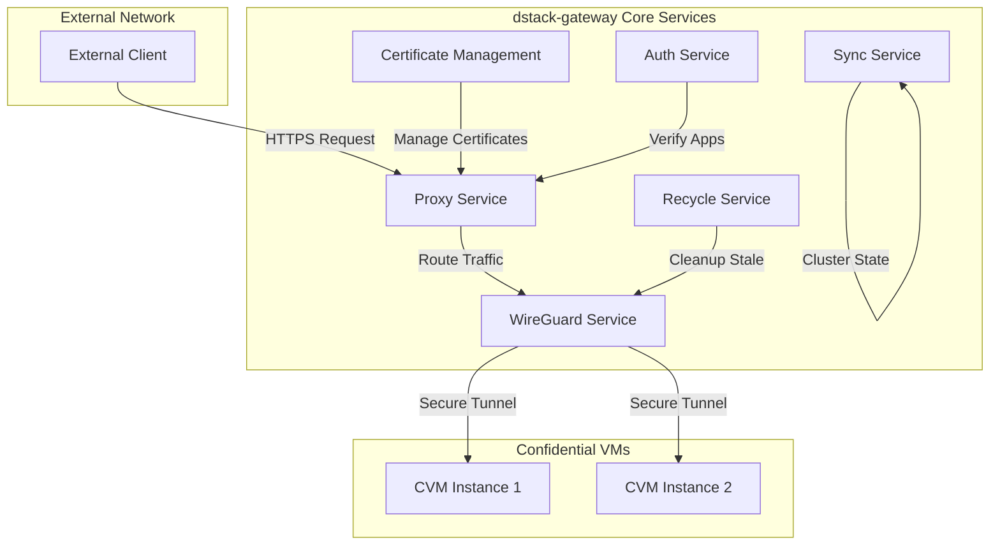
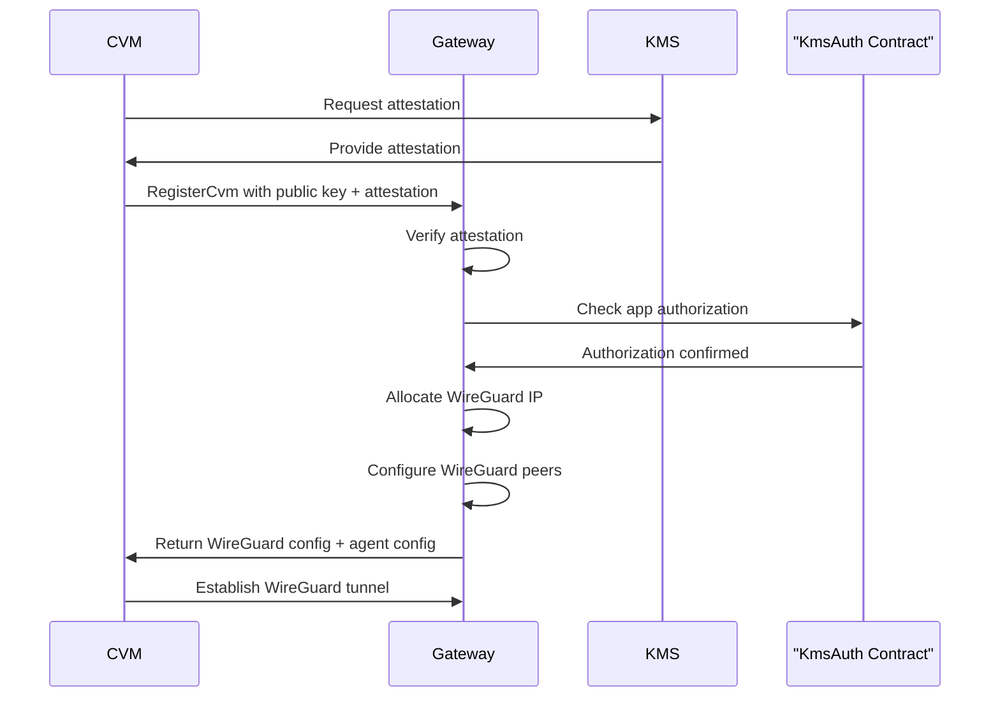
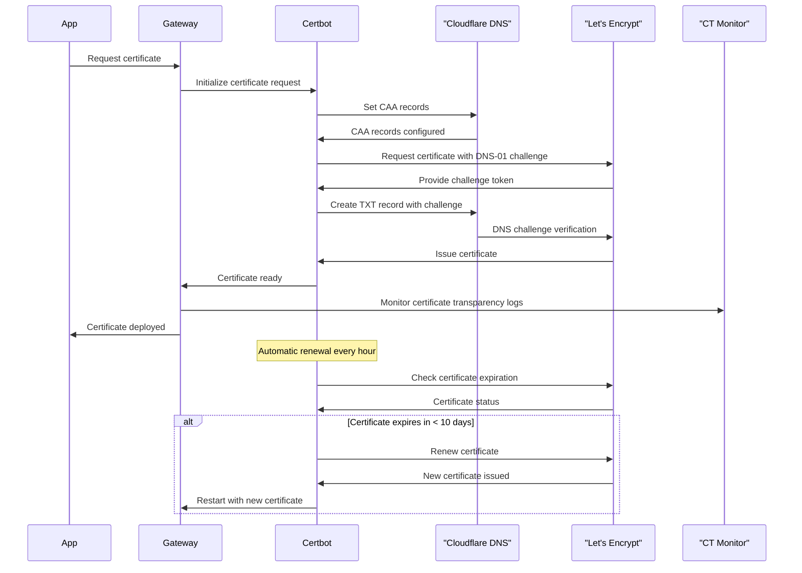
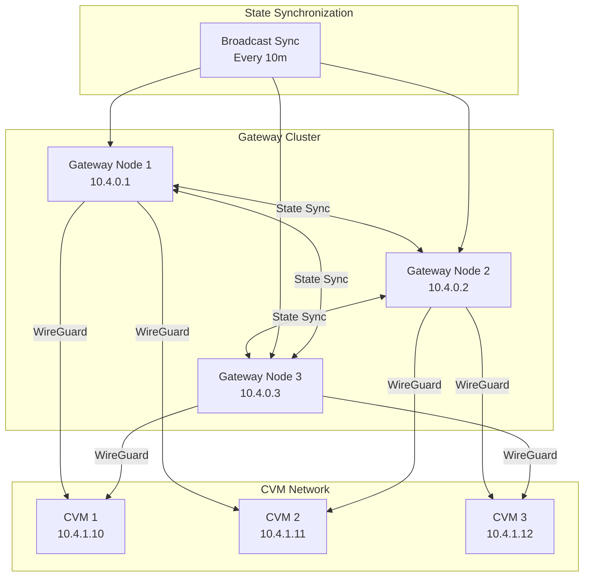
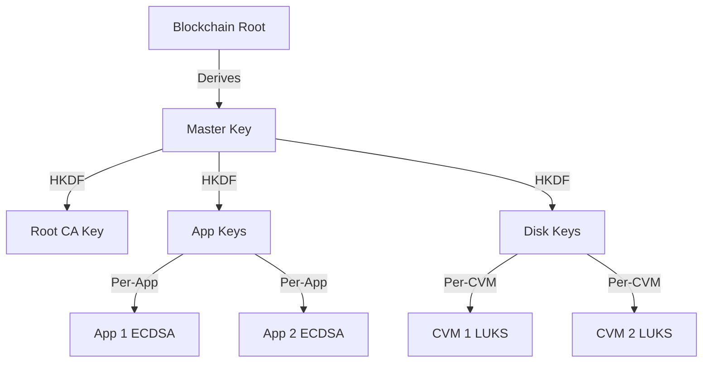
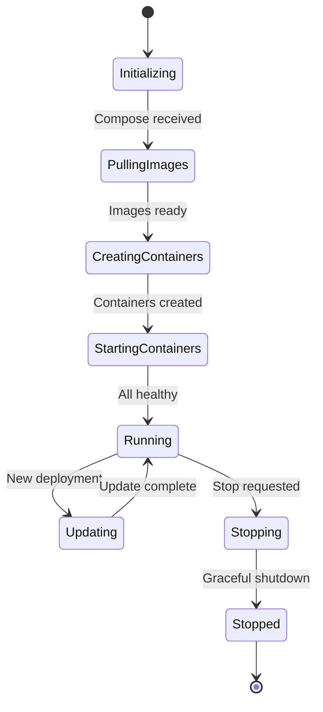
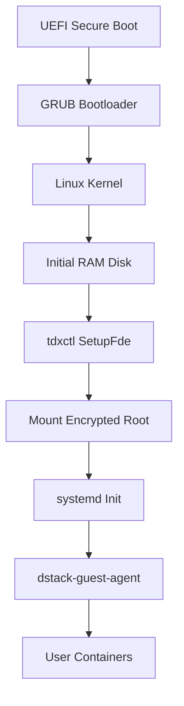

# DStack Core Components and their technical implementation

This page dives into the technical implementation of dstack's core components, providing configuration examples, API references, and integration patterns.  
If you're looking for a high-level overview of what each component does, start with [Basic Components](/docs/concepts/basic-components).

---

## dstack-vmm

The VMM provides orchestration capabilities through several service interfaces:

| **Service** | **Endpoint** | **Purpose** |
|-------------|-------------|-------------|
| RPC API     | `/prpc`     | VM lifecycle management and operations |
| Host API    | `/api`      | CVM notifications and host information |
| Guest API   | `/guest`    | Proxied access to CVM guest agents     |
| Web UI      | `/`         | HTML console for browser-based management |

  #### vmm Configuration
  [See full VMM configuration reference](https://deepwiki.com/Dstack-TEE/dstack/2.1-dstack-vmm)


```toml
# vmm.toml - Configuration for Dstack VMM

# --------- General VMM Parameters ---------
workers = 8                    # Number of worker threads for task execution
max_blocking = 64              # Maximum number of blocking tasks allowed
ident = "Dstack VMM"           # Identifier/name for the VMM instance
temp_dir = "/tmp"              # Directory for temporary files (e.g., sockets, images)
keep_alive = 10                # Time (in seconds) to keep idle resources alive
log_level = "info"             # Logging verbosity: trace, debug, info, warn, error
address = "unix:./vmm.sock"    # Unix socket address for VMM communication
reuse = true                   # Reuse the socket if already exists (avoids conflicts)
kms_url = "http://127.0.0.1:8081"    # URL for Key Management Service (KMS)
image_path = "/var/lib/dstack/images"    # Directory to store VM/container images
run_path = "/var/lib/dstack/vms"        # Directory to store running VM state and files

# --------- Networking Configuration ---------
[networking]
mode = "user"                  # Networking mode: user, bridge, host, etc.
net = "10.0.2.0/24"            # Subnet for VMs/containers
dhcp_start = "10.0.2.10"       # Starting IP for DHCP-assigned addresses
restrict = false               # Restrict networking for isolation (false = open)

# --------- CVM (Compute Virtual Machine) Parameters ---------
[cvm]
qemu_path = "/usr/bin/qemu-system-x86_64"    # Path to QEMU executable
kms_urls = ["http://127.0.0.1:8081"]         # List of Key Management Service URLs
gateway_urls = ["http://127.0.0.1:8082"]     # URLs for gateway agents/services
pccs_url = ""                                # Optional: SGX PCS URL (empty if unused)
docker_registry = ""                         # Optional: Docker registry for images
max_disk_size = 500                          # Maximum disk size per VM (GB)
cid_start = 1000                             # Starting CID (Container ID) for VMs
cid_pool_size = 1000                         # Number of CIDs available for allocation
max_allocable_vcpu = 20                      # Maximum virtual CPUs allocable per VM
max_allocable_memory_in_mb = 100000           # Maximum RAM per VM (MB)
qmp_socket = false                           # Enable QEMU Machine Protocol socket (for advanced control)
user = ""                                    # Run VMs as this user (empty = default)
use_mrconfigid = true                        # Use measured config ID for attestation

# ----- Port Mapping for CVM -----
[cvm.port_mapping]
enabled = false                              # Enable port mapping between host and guest
address = "127.0.0.1"                        # Host address for mapped ports
range = [
    { protocol = "tcp", from = 1, to = 20000 },  # Range of TCP ports available for mapping
]

# ----- Auto-Restart for CVM -----
[cvm.auto_restart]
enabled = true                               # Automatically restart VMs on failure
interval = 20                                # Interval (seconds) before attempting restart

# ----- GPU Passthrough for CVM -----
[cvm.gpu]
enabled = false                              # Enable GPU passthrough to VMs
listing = ["10de:2335"]                      # List of allowed GPU devices (PCI IDs)
exclude = []                                 # List of GPUs to exclude from passthrough
include = []                                 # List of GPUs to include (overrides 'listing')

# --------- Gateway Service Configuration ---------
[gateway]
base_domain = "localhost"                    # Base domain for gateway routing
port = 8082                                  # Port for gateway HTTP interface
agent_port = 8090                            # Port for gateway agent communication

# --------- Authentication and Tokens ---------
[auth]
enabled = false                              # Enable authentication for API/services
tokens = []                                  # List of valid API tokens (empty = no auth)

# --------- Supervisor Process Configuration ---------
[supervisor]
exe = "./supervisor"                         # Path to supervisor executable
sock = "./run/supervisor.sock"               # Path to supervisor socket file
pid_file = "./run/supervisor.pid"            # Path to supervisor PID file
log_file = "./run/supervisor.log"            # Path to supervisor log file
detached = false                             # Run supervisor in background (daemon)
auto_start = true                            # Start supervisor automatically with VMM

# --------- Host API Endpoint ---------
[host_api]
ident = "Dstack VMM"                         # Identifier for the Host API instance
address = "vsock:2"                          # Address (VSOCK) for host API communication
port = 10000                                 # Port for host API

# --------- Key Provider Configuration ---------
[key_provider]
enabled = true                               # Enable external key provider
address = "127.0.0.1"                        # Address of the key provider service
```


---

#### Gateway Integration with the VMM

The integration of the gateway within the VMM’s configuration reflects the tightly coupled nature of secure, orchestrated deployments in dstack. By defining gateway parameters—such as the base domain, network ports, and agent interface—directly alongside VM and cluster settings, dstack ensures that network exposure, TLS policy, and VPN tunneling are always synchronized with the lifecycle of each Confidential VM. The VMM is responsible not only for creating and maintaining the compute environment, but also for provisioning and updating the gateway, allowing seamless coordination between workload orchestration and secure service exposure. This architecture eliminates configuration drift and centralizes operational control, so that every application endpoint published by the gateway is cryptographically tied to the trusted state managed by the VMM.

--- 

### dstack-gateway Implementation

The dstack-gateway is a reverse proxy and networking component that handles TLS termination, WireGuard VPN connections, and traffic routing between external clients and Confidential Virtual Machines (CVMs). [5](#0-4) 

#### dstack-gateway Service and Traffic Flow Diagram



#### Advanced Routing Configuration

The gateway uses sophisticated domain-based routing with the following patterns: [6](#0-5) 

<table className="w-full my-4">
  <thead>
    <tr className="bg-gray-100">
      <th className="p-3 text-left">Pattern</th>
      <th className="p-3 text-left">Routing Logic</th>
      <th className="p-3 text-left">TLS Mode</th>
      <th className="p-3 text-left">Default Port</th>
    </tr>
  </thead>
  <tbody>
    <tr>
      <td className="p-3 font-mono">&lt;app-id&gt;.domain.com</td>
      <td className="p-3">Direct app routing</td>
      <td className="p-3">TLS Termination</td>
      <td className="p-3">80</td>
    </tr>
    <tr className="bg-gray-50">
      <td className="p-3 font-mono">&lt;app-id&gt;-&lt;port&gt;.domain.com</td>
      <td className="p-3">Custom port routing</td>
      <td className="p-3">TLS Termination</td>
      <td className="p-3">Specified port</td>
    </tr>
    <tr>
      <td className="p-3 font-mono">&lt;app-id&gt;s.domain.com</td>
      <td className="p-3">TLS passthrough</td>
      <td className="p-3">TLS Passthrough</td>
      <td className="p-3">443</td>
    </tr>
    <tr className="bg-gray-50">
      <td className="p-3 font-mono">&lt;app-id&gt;-&lt;port&gt;s.domain.com</td>
      <td className="p-3">Custom port with TLS passthrough</td>
      <td className="p-3">TLS Passthrough</td>
      <td className="p-3">Specified port</td>
    </tr>
    <tr>
      <td className="p-3 font-mono">custom.domain.com</td>
      <td className="p-3">DNS TXT lookup: `_dstack-app-address`</td>
      <td className="p-3">TLS Passthrough</td>
      <td className="p-3">From TXT record</td>
    </tr>
  </tbody>
</table>

#### CVM Registration Process



#### Production Configuration Example
```toml
# gateway.toml - Production Configuration for dstack-gateway
# The dstack-gateway is a reverse proxy and networking component that handles
# TLS termination, WireGuard VPN connections, and traffic routing between
# external clients and Confidential Virtual Machines (CVMs)

# Rocket web server configuration - controls the HTTP server that handles requests
workers = 8                    # Number of worker threads for handling HTTP requests
max_blocking = 64             # Maximum number of blocking tasks that can run concurrently
keep_alive = 10               # HTTP keep-alive timeout in seconds
log_level = "info"            # Logging level (trace, debug, info, warn, error)
port = 8000                   # Port for the main HTTP server (RPC and management interface)

[core]
# Core gateway configuration settings
state_path = "/data/gateway-state.json"  # Path to store gateway state and CVM registrations
set_ulimit = true                        # Automatically set soft ulimit to hard ulimit for file descriptors
rpc_domain = "gateway.example.com"       # Domain name for this gateway instance (used for RPC communication)
run_in_dstack = true                     # Whether this gateway is running as a dstack application in a CVM

[core.auth]
# Application authorization settings - integrates with KmsAuth contract
enabled = true                           # Enable application authorization checks
url = "https://kms.example.com/app-auth" # URL of the KmsAuth service for verifying app permissions
timeout = "5s"                          # Timeout for authorization requests

[core.admin]
# Admin interface configuration - provides management dashboard and API
enabled = true                          # Enable the admin interface
port = 8001                            # Port for the admin interface (separate from main port)

[core.certbot]
# Automatic TLS certificate management using Let's Encrypt and Cloudflare DNS
enabled = true                                                      # Enable automatic certificate management
workdir = "/data/rproxy/certs"                                     # Working directory for certificate storage
acme_url = "https://acme-v02.api.letsencrypt.org/directory"       # ACME server URL (production Let's Encrypt)
cf_api_token = "your_cloudflare_token"                            # Cloudflare API token for DNS-01 challenges
cf_zone_id = "your_zone_id"                                       # Cloudflare zone ID for the domain
auto_set_caa = true                                               # Automatically set CAA DNS records to restrict certificate issuance
domain = "*.app.example.com"                                      # Wildcard domain for certificate issuance
renew_interval = "1h"                                             # How often to check for certificate renewal
renew_before_expiration = "10d"                                   # Renew certificates this many days before expiration
renew_timeout = "5m"                                              # Timeout for certificate renewal operations

[core.wg]
# WireGuard VPN configuration - creates secure tunnels to CVMs
public_key = "gateway_public_key"         # WireGuard public key for this gateway
private_key = "gateway_private_key"       # WireGuard private key for this gateway
listen_port = 51820                       # UDP port for WireGuard to listen on
ip = "10.4.0.1/16"                       # IP address and network for this gateway in the VPN
reserved_net = ["10.4.0.0/27"]           # IP ranges reserved for gateway infrastructure (gateway IP must be in this range)
client_ip_range = "10.4.0.0/20"          # IP range available for CVM clients (must be within the main network)
config_path = "/data/wireguard/wg-ds-gw.conf"  # Path to WireGuard configuration file
interface = "wg-ds-gw"                    # Name of the WireGuard network interface
endpoint = "203.0.113.10:51820"          # Public endpoint (IP:port) where this gateway can be reached

[core.proxy]
# TLS proxy configuration - handles HTTPS termination and routing
cert_chain = "/data/rproxy/certs/live/cert.pem"  # Path to TLS certificate chain file
cert_key = "/data/rproxy/certs/live/key.pem"     # Path to TLS private key file
base_domain = "app.example.com"                   # Base domain for application routing (apps accessible as <app-id>.app.example.com)
listen_addr = "0.0.0.0"                          # IP address to bind the HTTPS proxy to
listen_port = 443                                # Port for HTTPS traffic (standard HTTPS port)
agent_port = 8090                                # Port used by CVM agents for communication
connect_top_n = 3                                # Number of CVM instances to try connecting to (for load balancing)
app_address_ns_prefix = "_dstack-app-address"    # DNS TXT record prefix for service discovery

[core.proxy.timeouts]
# Timeout configuration for proxy connections - affects performance and reliability
connect = "5s"              # Timeout for establishing connection to target CVM
handshake = "5s"            # Timeout for TLS handshake or SNI extraction
cache_top_n = "30s"         # How long to cache the list of top N CVM instances
data_timeout_enabled = true # Enable data transfer timeouts (may impact performance if disabled)
idle = "10m"                # Timeout for connections without data transfer
write = "5s"                # Timeout for writing data to CVM or client
shutdown = "5s"             # Timeout for gracefully shutting down connections
total = "5h"                # Maximum total duration for any single connection

[core.sync]
# Cluster synchronization configuration - enables high availability with multiple gateways
enabled = true                                    # Enable cluster synchronization
interval = "30s"                                 # How often to sync state with other gateways
broadcast_interval = "10m"                       # How often to broadcast full state to cluster
timeout = "2s"                                   # Timeout for sync operations
my_url = "https://gateway1.example.com:8001"     # This gateway's admin URL for cluster communication
bootnode = "https://bootnode.example.com:8001"   # Bootstrap node URL for joining the cluster

[core.recycle]
# Resource cleanup configuration - manages lifecycle of CVM connections
enabled = true        # Enable automatic cleanup of inactive resources
interval = "5m"       # How often to run cleanup operations
timeout = "10h"       # How long to keep inactive resources before cleanup
node_timeout = "10m"  # Timeout for individual node cleanup operations
```


#### Advanced Certificate Management

The gateway implements comprehensive certificate management with automatic renewal and monitoring:



#### Gateway Cluster Topology and State Synchronization

The gateway supports clustering for redundancy and load balancing: 



#### Gateway Connection Strategies and Load Balancing Algorithms

The gateway implements intelligent connection management with health monitoring:

<table className="w-full my-4">
  <thead>
    <tr className="bg-gray-100">
      <th className="p-3 text-left">Strategy</th>
      <th className="p-3 text-left">Algorithm</th>
      <th className="p-3 text-left">Health Check</th>
      <th className="p-3 text-left">Fallback</th>
    </tr>
  </thead>
  <tbody>
    <tr>
      <td className="p-3 font-mono">top_n_selection</td>
      <td className="p-3">Latest handshake priority</td>
      <td className="p-3">WireGuard handshake time</td>
      <td className="p-3">Random selection</td>
    </tr>
    <tr className="bg-gray-50">
      <td className="p-3 font-mono">direct_instance</td>
      <td className="p-3">Instance ID lookup</td>
      <td className="p-3">Connection counter</td>
      <td className="p-3">App-level routing</td>
    </tr>
    <tr>
      <td className="p-3 font-mono">localhost_mode</td>
      <td className="p-3">Local development</td>
      <td className="p-3">TCP connection</td>
      <td className="p-3">127.0.0.1:port</td>
    </tr>
    <tr className="bg-gray-50">
      <td className="p-3 font-mono">dns_resolution</td>
      <td className="p-3">TXT record lookup</td>
      <td className="p-3">DNS availability</td>
      <td className="p-3">Connection timeout</td>
    </tr>
  </tbody>
</table>


#### dstack-gateway Operational Features  
  
The dstack-gateway component includes comprehensive operational capabilities designed to maintain robust security, automatic cleanup, and enhanced observability within dstack deployments. For automated cleanup and maintenance, the gateway continuously monitors WireGuard handshake activity to efficiently **remove stale CVM instances**, ensuring optimal resource usage.

It proactively manages **gateway node cleanup** to maintain seamless synchronization across distributed clusters. WireGuard configurations are automatically updated, providing stable networking without manual intervention, and connections are systematically recycled every five minutes, enforcing a maximum timeout limit of 10 hours to preserve both security and system efficiency. 
  
Security and authorization within the gateway are rigorously enforced. It mandates **remote attestation verification for CVM registration**, verifying the integrity and identity of each confidential VM instance at launch.

Additionally, integration with the **KmsAuth contract** strengthens application authorization cryptographically, guaranteeing that only legitimate deployments receive necessary keys and credentials. Active **TLS certificate transparency monitoring** prevents unauthorized certificate issuance, while the management of **CAA records** restricts certificate authorities, significantly mitigating risks associated with unauthorized or compromised certificates.
  
For effective monitoring and observability, the gateway provides real-time tracking of connection statistics, offering immediate insights into network health and usage patterns. CVM instance health is assessed through regular WireGuard handshake checks, enabling rapid identification and resolution of potential connectivity issues. Additionally, the system monitors certificate expiration closely, issuing proactive alerts to avoid service disruptions due to expired certificates. Continuous monitoring of cluster synchronization status further ensures that distributed deployments remain reliable, coordinated, and resilient across diverse operational scenarios.


---


### dstack-kms Implementation

The KMS provides enterprise-grade cryptographic services with blockchain integration:

#### Key Hierarchy and Management



#### Configuration Example

```toml
# kms.toml
[general]
name = "kms-01"
log_level = "info"

[rpc]
listen = "0.0.0.0:8000"
max_connections = 1000
tls_cert = "/etc/dstack/kms/cert.pem"
tls_key = "/etc/dstack/kms/key.pem"

[blockchain]
rpc_url = "https://eth-mainnet.example.com"
chain_id = 1
kms_auth_contract = "0x1234567890123456789012345678901234567890"
app_auth_contract = "0x0987654321098765432109876543210987654321"
wallet_private_key_path = "/etc/dstack/kms/wallet.key"

[attestation]
verify_mode = "strict"
allowed_tcb_levels = ["up-to-date", "sw-hardening-needed"]
quote_verification_timeout = "30s"

[keys]
derivation_path = "m/44'/60'/0'/0"
root_ca_validity_days = 3650
app_key_validity_days = 365
key_rotation_interval = "90d"
```

#### RPC Service Interface

The KMS exposes a comprehensive RPC API:

```go
service DstackKms {
    // Core key operations
    rpc GetAppKey(AppKeyRequest) returns (AppKeyResponse);
    rpc GetTempCaCert(TempCaRequest) returns (TempCaResponse);
    rpc SignCert(SignRequest) returns (SignResponse);
    
    // Attestation and verification
    rpc VerifyAttestation(AttestRequest) returns (AttestResponse);
    rpc GetQuote(QuoteRequest) returns (QuoteResponse);
    
    // Administrative operations
    rpc RegisterApp(RegisterRequest) returns (RegisterResponse);
    rpc RevokeKey(RevokeRequest) returns (RevokeResponse);
    rpc RotateKeys(RotateRequest) returns (RotateResponse);
}
```

### dstack-guest-agent Implementation

The guest agent provides runtime services and security integration:

#### Service Interface

```go
type GuestAgent interface {
    // Container management
    DeployCompose(compose []byte) error
    StartContainers() error
    StopContainers() error
    GetContainerLogs(name string) ([]byte, error)
    
    // Security services
    GetAttestation() (*Quote, error)
    DeriveKey(path string) (*Key, error)
    GetTLSCert(domain string) (*Certificate, error)
    
    // Monitoring and health
    GetMetrics() (*Metrics, error)
    GetHealth() (*Health, error)
    StreamLogs(follow bool) (<-chan LogEntry, error)
}
```

#### Configuration Example

```toml
# guest-agent.toml
[general]
log_level = "info"
data_dir = "/var/lib/dstack"

[container_runtime]
socket_path = "/var/run/containerd/containerd.sock"
namespace = "dstack"
registry_config_path = "/etc/containerd/certs.d"

[security]
kms_endpoint = "https://kms.dstack.internal:8000"
attestation_cache_ttl = "5m"
key_cache_ttl = "1h"

[monitoring]
metrics_port = 9090
health_port = 8080
log_buffer_size = 1000
```

#### Container Lifecycle Management

The agent manages containers through a sophisticated state machine:



### dstack-os Implementation

The operating system provides a secure, minimal foundation:

#### Boot Process



#### System Configuration

Key system configurations for security:

```bash
# /etc/systemd/system/dstack-guest-agent.service
[Unit]
Description=dstack Guest Agent
After=network.target
Requires=network.target

[Service]
Type=simple
User=dstack
Group=dstack
ExecStart=/usr/bin/dstack-guest-agent
Restart=always
RestartSec=5
Environment=RUST_LOG=info

[Install]
WantedBy=multi-user.target
```

### tdxctl Implementation

The TDX control utility provides secure boot and encryption services:

#### Commands Reference

<table className="w-full my-4">
  <thead>
    <tr className="bg-gray-100">
      <th className="p-3 text-left">Command</th>
      <th className="p-3 text-left">Purpose</th>
      <th className="p-3 text-left">Parameters</th>
    </tr>
  </thead>
  <tbody>
    <tr>
      <td className="p-3 font-mono">SetupFde</td>
      <td className="p-3">Initialize full disk encryption</td>
      <td className="p-3">--root-device, --key-source, --app-id</td>
    </tr>
    <tr className="bg-gray-50">
      <td className="p-3 font-mono">Tboot</td>
      <td className="p-3">Secure boot with measurements</td>
      <td className="p-3">--kernel, --initrd, --cmdline</td>
    </tr>
    <tr>
      <td className="p-3 font-mono">ExtendRTMR</td>
      <td className="p-3">Extend Runtime Measurement Register</td>
      <td className="p-3">--rtmr-index, --data</td>
    </tr>
    <tr className="bg-gray-50">
      <td className="p-3 font-mono">SealSecret</td>
      <td className="p-3">Seal data to current PCR state</td>
      <td className="p-3">--input, --output, --pcrs</td>
    </tr>
  </tbody>
</table>

#### Full Disk Encryption Setup

```bash
# Complete FDE setup command
tdxctl SetupFde \
    --root-device /dev/vda2 \
    --key-source kms \
    --app-id $APP_ID \
    --kms-endpoint https://kms.internal:8000 \
    --integrity-check \
    --luks-cipher aes-xts-plain64 \
    --luks-key-size 512
```

## Component Communication Patterns

### Internal Communication Matrix

<table className="w-full my-4 text-sm">
  <thead>
    <tr className="bg-gray-100">
      <th className="p-2">From ↓ To →</th>
      <th className="p-2">VMM</th>
      <th className="p-2">Gateway</th>
      <th className="p-2">KMS</th>
      <th className="p-2">Guest Agent</th>
    </tr>
  </thead>
  <tbody>
    <tr>
      <td className="p-2 font-semibold">VMM</td>
      <td className="p-2 bg-gray-100">-</td>
      <td className="p-2">HTTP/gRPC</td>
      <td className="p-2">RA-TLS</td>
      <td className="p-2">HTTP API</td>
    </tr>
    <tr className="bg-gray-50">
      <td className="p-2 font-semibold">Gateway</td>
      <td className="p-2">WebHook Events</td>
      <td className="p-2 bg-gray-100">-</td>
      <td className="p-2">RA-TLS</td>
      <td className="p-2">WireGuard + HTTP</td>
    </tr>
    <tr>
      <td className="p-2 font-semibold">KMS</td>
      <td className="p-2">Registration</td>
      <td className="p-2">Certificate Requests</td>
      <td className="p-2 bg-gray-100">-</td>
      <td className="p-2">RA-TLS</td>
    </tr>
    <tr className="bg-gray-50">
      <td className="p-2 font-semibold">Guest Agent</td>
      <td className="p-2">Health/Status</td>
      <td className="p-2">Registration</td>
      <td className="p-2">Key Requests</td>
      <td className="p-2 bg-gray-100">-</td>
    </tr>
  </tbody>
</table>

## Production Configuration Guidelines

### High Availability Setup

For production deployments, consider these configurations:

```toml
# Multi-instance VMM configuration
[cluster]
enabled = true
members = ["vmm-01:9080", "vmm-02:9080", "vmm-03:9080"]
election_timeout = "5s"
heartbeat_interval = "1s"
```

### Security Hardening

Essential security configurations:

```toml
# Security hardening options
[security]
tls_min_version = "1.3"
cipher_suites = ["TLS_AES_256_GCM_SHA384", "TLS_CHACHA20_POLY1305_SHA256"]
require_client_certs = true
max_request_size = "10MB"
rate_limit_burst = 50
```

### Monitoring Integration

Integration with monitoring systems:

```toml
# Monitoring configuration
[monitoring]
prometheus_enabled = true
prometheus_port = 9091
jaeger_endpoint = "http://jaeger:14268/api/traces"
log_format = "json"
metrics_namespace = "dstack"
```

## Performance Optimization

### Resource Tuning

Optimize performance based on workload characteristics:

```toml
# Performance tuning
[performance]
worker_threads = 8
max_concurrent_deploys = 10
io_uring_enabled = true
memory_pool_size = "1GB"
connection_pool_size = 100
```

## Troubleshooting Common Issues

### Component Health Checks

Monitor component health using these endpoints:

```bash
# VMM health check
curl http://localhost:9080/health

# Gateway status
curl https://gateway.example.com:9443/status

# KMS service status  
curl --cert client.crt --key client.key https://kms:8000/health

# Guest agent health
curl http://localhost:8080/health
```

### Log Analysis

Key log patterns to monitor:

```bash
# VMM deployment issues
journalctl -u dstack-vmm | grep "ERROR.*deploy"

# Gateway certificate problems
journalctl -u dstack-gateway | grep "certificate"

# KMS attestation failures
journalctl -u dstack-kms | grep "attestation.*failed"
```

For detailed deployment instructions and operational guidance, see [Deploying Applications](/docs/deployment-guides/deploying-applications).

## Next Steps

<div className="mt-8 flex gap-4">
  <a href="/docs/concepts/networking" className="bg-blue-600 text-white px-6 py-3 rounded-lg hover:bg-blue-700">
    Explore Networking →
  </a>
  <a href="/docs/deployment-guides/deploying-applications" className="bg-gray-200 text-gray-800 px-6 py-3 rounded-lg hover:bg-gray-300">
    Deploy Applications
  </a>
</div>

{/* Component configuration guide coming soon:
For more information about configuring these components, see the [deployment guide](/deployment-guides/configuring-components).
*/} 