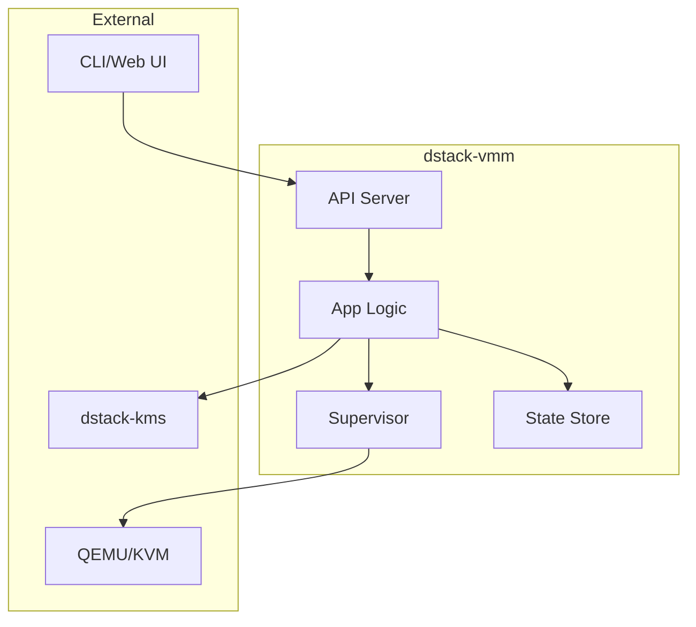
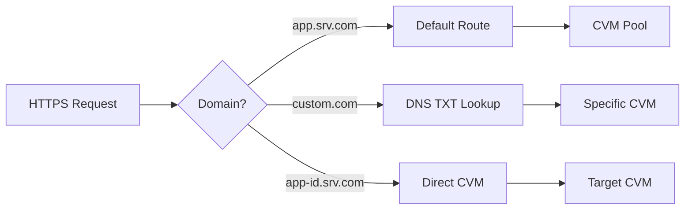
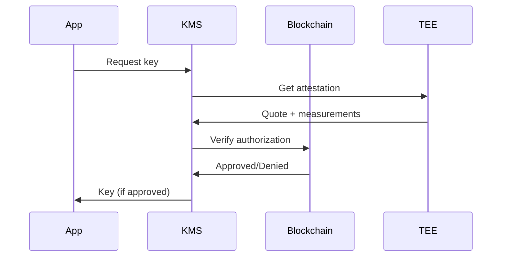
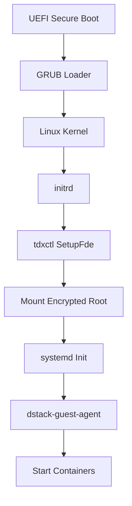
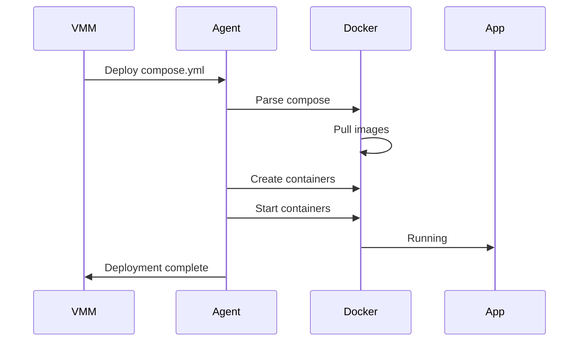

# Core Components

dstack consists of several specialized components that work together to provide secure application deployment. This page provides detailed information about each component, its responsibilities, and how it interacts with the rest of the system.

## Component Overview

<div className="bg-gray-50 p-6 rounded-lg my-4">
  <table className="w-full">
    <thead>
      <tr className="border-b">
        <th className="text-left p-2">Component</th>
        <th className="text-left p-2">Role</th>
        <th className="text-left p-2">Runs Where</th>
      </tr>
    </thead>
    <tbody>
      <tr className="border-b">
        <td className="p-2 font-semibold">dstack-vmm</td>
        <td className="p-2">Virtual Machine Manager</td>
        <td className="p-2">Host server</td>
      </tr>
      <tr className="border-b">
        <td className="p-2 font-semibold">dstack-gateway</td>
        <td className="p-2">HTTPS gateway and router</td>
        <td className="p-2">Host server</td>
      </tr>
      <tr className="border-b">
        <td className="p-2 font-semibold">dstack-kms</td>
        <td className="p-2">Key Management Service</td>
        <td className="p-2">Inside CVM</td>
      </tr>
      <tr className="border-b">
        <td className="p-2 font-semibold">dstack-os</td>
        <td className="p-2">Minimal secure OS</td>
        <td className="p-2">Inside CVM</td>
      </tr>
      <tr className="border-b">
        <td className="p-2 font-semibold">dstack-guest-agent</td>
        <td className="p-2">Container manager</td>
        <td className="p-2">Inside CVM</td>
      </tr>
      <tr>
        <td className="p-2 font-semibold">tdxctl</td>
        <td className="p-2">Boot and FDE utility</td>
        <td className="p-2">Inside CVM</td>
      </tr>
    </tbody>
  </table>
</div>

## dstack-vmm (Virtual Machine Manager)

The VMM is the heart of dstack, orchestrating the creation and management of Confidential VMs.

### Architecture



### Key Features

<div className="grid grid-cols-1 md:grid-cols-2 gap-4 my-4">
  <div className="bg-blue-50 p-4 rounded-lg">
    <h4 className="font-semibold mb-2">Resource Management</h4>
    <ul className="text-sm space-y-1">
      <li>• CPU and memory allocation</li>
      <li>• Storage provisioning</li>
      <li>• Network configuration</li>
      <li>• GPU passthrough</li>
    </ul>
  </div>
  <div className="bg-green-50 p-4 rounded-lg">
    <h4 className="font-semibold mb-2">Lifecycle Management</h4>
    <ul className="text-sm space-y-1">
      <li>• Create/destroy CVMs</li>
      <li>• Start/stop operations</li>
      <li>• Health monitoring</li>
      <li>• Automatic recovery</li>
    </ul>
  </div>
</div>

### API Endpoints

| Endpoint | Method | Purpose |
|----------|--------|---------|
| `/api/vms` | POST | Create new CVM |
| `/api/vms/{id}` | GET | Get VM status |
| `/api/vms/{id}/start` | POST | Start VM |
| `/api/vms/{id}/stop` | POST | Stop VM |
| `/api/vms/{id}/logs` | GET | Stream logs |

### Configuration Example

```toml
# vmm.toml
[general]
name = "vmm-01"
log_level = "info"

[resources]
cid_start = 33000
cid_pool_size = 1000
max_vms = 50
default_memory_mb = 4096
default_vcpus = 2

[network]
mode = "user"  # or "tap" for bridged
bridge_name = "br0"

[storage]
image_path = "/var/lib/dstack/images"
vm_data_path = "/var/lib/dstack/vms"

[api]
listen = "127.0.0.1:9080"
tls_cert = "/etc/dstack/certs/vmm.crt"
tls_key = "/etc/dstack/certs/vmm.key"
```

## dstack-gateway

The gateway provides secure HTTPS access to applications running in CVMs.

### Architecture

<div className="bg-gray-50 p-6 rounded-lg my-4">
  <h4 className="font-semibold mb-3">Gateway Components:</h4>
  <div className="grid grid-cols-2 gap-4">
    <div>
      <h5 className="font-semibold">Certificate Manager</h5>
      <ul className="text-sm space-y-1">
        <li>• Let's Encrypt integration</li>
        <li>• Automatic renewal</li>
        <li>• DNS-01 challenges</li>
        <li>• Certificate transparency</li>
      </ul>
    </div>
    <div>
      <h5 className="font-semibold">Traffic Router</h5>
      <ul className="text-sm space-y-1">
        <li>• Domain-based routing</li>
        <li>• Load balancing</li>
        <li>• WebSocket support</li>
        <li>• HTTP/2 and HTTP/3</li>
      </ul>
    </div>
  </div>
</div>

### Routing Rules



### Features

<table className="w-full my-4">
  <thead>
    <tr className="bg-gray-100">
      <th className="p-3 text-left">Feature</th>
      <th className="p-3 text-left">Description</th>
      <th className="p-3 text-left">Configuration</th>
    </tr>
  </thead>
  <tbody>
    <tr>
      <td className="p-3 font-semibold">TLS Termination</td>
      <td className="p-3">Automatic HTTPS for all apps</td>
      <td className="p-3">`tls.mode = "auto"`</td>
    </tr>
    <tr className="bg-gray-50">
      <td className="p-3 font-semibold">Custom Domains</td>
      <td className="p-3">Use your own domains</td>
      <td className="p-3">DNS TXT: `_dstack-app-address`</td>
    </tr>
    <tr>
      <td className="p-3 font-semibold">WireGuard VPN</td>
      <td className="p-3">Secure CVM communication</td>
      <td className="p-3">`wg.endpoint = "IP:PORT"`</td>
    </tr>
    <tr className="bg-gray-50">
      <td className="p-3 font-semibold">Rate Limiting</td>
      <td className="p-3">DDoS protection</td>
      <td className="p-3">`rate_limit.rps = 100`</td>
    </tr>
  </tbody>
</table>

### Configuration Example

```toml
# gateway.toml
[general]
name = "gateway-01"
log_level = "info"

[network]
public_ip = "203.0.113.10"
listen_https = "0.0.0.0:443"
listen_http = "0.0.0.0:80"

[domain]
srv_domain = "app.example.com"
acme_email = "admin@example.com"
acme_staging = false

[wireguard]
endpoint = "203.0.113.10:51820"
network = "10.9.0.0/16"

[gateway]
app_id = "gateway-app-id"
max_connections = 10000
timeout_seconds = 300
```

## dstack-kms (Key Management Service)

The KMS manages all cryptographic operations and runs inside its own CVM for security.

### Key Hierarchy

<div className="bg-purple-50 p-6 rounded-lg my-4">
  <h4 className="font-semibold mb-3">Key Types and Purposes:</h4>
  <table className="w-full">
    <tr className="border-b">
      <td className="p-2 font-semibold">Root CA</td>
      <td className="p-2">Signs all other certificates</td>
    </tr>
    <tr className="border-b">
      <td className="p-2 font-semibold">App Keys</td>
      <td className="p-2">Application-specific ECDSA keys</td>
    </tr>
    <tr className="border-b">
      <td className="p-2 font-semibold">Disk Keys</td>
      <td className="p-2">Full disk encryption keys</td>
    </tr>
    <tr className="border-b">
      <td className="p-2 font-semibold">TLS Keys</td>
      <td className="p-2">Service communication keys</td>
    </tr>
    <tr>
      <td className="p-2 font-semibold">Temp CA</td>
      <td className="p-2">Bootstrap authentication</td>
    </tr>
  </table>
</div>

### RPC Interface

```go
// Key KMS service methods
service DstackKms {
    // Get application key
    rpc GetAppKey(AppKeyRequest) returns (AppKeyResponse);
    
    // Get temporary CA certificate
    rpc GetTempCaCert(TempCaRequest) returns (TempCaResponse);
    
    // Sign certificate request
    rpc SignCert(SignRequest) returns (SignResponse);
    
    // Verify attestation
    rpc VerifyAttestation(AttestRequest) returns (AttestResponse);
}
```

### Blockchain Integration

The KMS integrates with smart contracts for authorization:



### Configuration Example

```toml
# kms.toml
[general]
name = "kms-01"
log_level = "info"

[rpc]
listen = "0.0.0.0:8000"
max_connections = 1000

[blockchain]
rpc_url = "https://eth-mainnet.example.com"
chain_id = 1
kms_auth_contract = "0x1234..."
app_auth_contract = "0x5678..."

[attestation]
verify_mode = "strict"
allowed_tcb_levels = ["up-to-date", "sw-hardening-needed"]

[keys]
derivation_path = "m/44'/60'/0'/0"
root_ca_validity_days = 3650
app_key_validity_days = 365
```

## dstack-os

A minimal, security-hardened Linux distribution specifically built for running inside CVMs.

### Design Principles

<div className="grid grid-cols-1 md:grid-cols-3 gap-4 my-4">
  <div className="border rounded-lg p-4">
    <div className="text-2xl mb-2">🔒</div>
    <h4 className="font-semibold">Minimal Attack Surface</h4>
    <p className="text-sm text-gray-600">
      Only essential components included
    </p>
  </div>
  <div className="border rounded-lg p-4">
    <div className="text-2xl mb-2">📏</div>
    <h4 className="font-semibold">Measured Boot</h4>
    <p className="text-sm text-gray-600">
      Every component measured for attestation
    </p>
  </div>
  <div className="border rounded-lg p-4">
    <div className="text-2xl mb-2">🚫</div>
    <h4 className="font-semibold">Read-Only Root</h4>
    <p className="text-sm text-gray-600">
      Immutable system partition
    </p>
  </div>
</div>

### Components Included

| Component | Purpose | Version |
|-----------|---------|---------|
| **Linux Kernel** | Core OS | 6.x with TDX patches |
| **systemd** | Init system | Latest stable |
| **containerd** | Container runtime | 1.7.x |
| **dstack-guest-agent** | Container management | Bundled |
| **tdxctl** | Boot security | Bundled |

### Boot Process



## dstack-guest-agent

Runs inside each CVM to manage Docker containers and provide runtime services.

### Responsibilities

<div className="bg-blue-50 p-6 rounded-lg my-4">
  <h4 className="font-semibold mb-3">Core Functions:</h4>
  <div className="grid grid-cols-2 gap-4">
    <ul className="space-y-2">
      <li>• Pull and manage Docker images</li>
      <li>• Start/stop containers per compose file</li>
      <li>• Monitor container health</li>
      <li>• Collect and stream logs</li>
    </ul>
    <ul className="space-y-2">
      <li>• Generate attestation quotes</li>
      <li>• Derive application keys</li>
      <li>• Expose guest API endpoints</li>
      <li>• Handle secure updates</li>
    </ul>
  </div>
</div>

### API Services

```go
// Guest agent provides these services
type GuestAgent interface {
    // Container management
    DeployCompose(compose []byte) error
    StartContainers() error
    StopContainers() error
    GetContainerLogs(name string) ([]byte, error)
    
    // Security services
    GetAttestation() (*Quote, error)
    DeriveKey(path string) (*Key, error)
    GetTLSCert(domain string) (*Certificate, error)
    
    // Monitoring
    GetMetrics() (*Metrics, error)
    GetHealth() (*Health, error)
}
```

### Container Management Flow



## tdxctl

A specialized utility for secure boot and full disk encryption in TEE environments.

### Commands

<table className="w-full my-4">
  <thead>
    <tr className="bg-gray-100">
      <th className="p-3 text-left">Command</th>
      <th className="p-3 text-left">Purpose</th>
      <th className="p-3 text-left">When Used</th>
    </tr>
  </thead>
  <tbody>
    <tr>
      <td className="p-3 font-mono">SetupFde</td>
      <td className="p-3">Initialize full disk encryption</td>
      <td className="p-3">First boot</td>
    </tr>
    <tr className="bg-gray-50">
      <td className="p-3 font-mono">Tboot</td>
      <td className="p-3">Secure boot with measurements</td>
      <td className="p-3">Every boot</td>
    </tr>
    <tr>
      <td className="p-3 font-mono">ExtendRTMR</td>
      <td className="p-3">Add measurements to registers</td>
      <td className="p-3">Boot process</td>
    </tr>
    <tr className="bg-gray-50">
      <td className="p-3 font-mono">SealSecret</td>
      <td className="p-3">Seal data to current state</td>
      <td className="p-3">Key storage</td>
    </tr>
  </tbody>
</table>

### Full Disk Encryption Setup

```bash
# During first boot
tdxctl SetupFde \
    --root-device /dev/vda2 \
    --key-source kms \
    --app-id $APP_ID \
    --integrity-check
```

### Boot Measurement Chain

<div className="bg-gray-50 p-4 rounded-lg my-4">
  <h4 className="font-semibold mb-2">Measurement Process:</h4>
  <ol className="space-y-2">
    <li>1. <strong>UEFI:</strong> Measures bootloader → RTMR[0]</li>
    <li>2. <strong>GRUB:</strong> Measures kernel → RTMR[0]</li>
    <li>3. <strong>Kernel:</strong> Measures initrd → RTMR[1]</li>
    <li>4. <strong>tdxctl:</strong> Measures rootfs → RTMR[2]</li>
    <li>5. <strong>Agent:</strong> Measures containers → RTMR[3]</li>
  </ol>
</div>

## Component Communication

### Internal Communication Matrix

<table className="w-full my-4 text-sm">
  <thead>
    <tr className="bg-gray-100">
      <th className="p-2">From ↓ To →</th>
      <th className="p-2">VMM</th>
      <th className="p-2">Gateway</th>
      <th className="p-2">KMS</th>
      <th className="p-2">Guest</th>
    </tr>
  </thead>
  <tbody>
    <tr>
      <td className="p-2 font-semibold">VMM</td>
      <td className="p-2 bg-gray-100">-</td>
      <td className="p-2">gRPC</td>
      <td className="p-2">RA-TLS</td>
      <td className="p-2">HTTP API</td>
    </tr>
    <tr className="bg-gray-50">
      <td className="p-2 font-semibold">Gateway</td>
      <td className="p-2">Events</td>
      <td className="p-2 bg-gray-100">-</td>
      <td className="p-2">RA-TLS</td>
      <td className="p-2">WireGuard</td>
    </tr>
    <tr>
      <td className="p-2 font-semibold">KMS</td>
      <td className="p-2">-</td>
      <td className="p-2">-</td>
      <td className="p-2 bg-gray-100">-</td>
      <td className="p-2">RA-TLS</td>
    </tr>
    <tr className="bg-gray-50">
      <td className="p-2 font-semibold">Guest</td>
      <td className="p-2">Status</td>
      <td className="p-2">-</td>
      <td className="p-2">RA-TLS</td>
      <td className="p-2 bg-gray-100">-</td>
    </tr>
  </tbody>
</table>

## Installation and Setup

To deploy dstack components:

1. **System Requirements**: Ensure you have a TEE-capable server (Intel TDX)
2. **Install Dependencies**: Follow our [Installation Guide](/docs/getting-started/installation)
3. **Configure Components**: Set up configuration files for each component
4. **Deploy Services**: Start services in the correct order (KMS → Gateway → VMM)

For detailed deployment instructions, see [Deploying Applications](/docs/deployment-guides/deploying-applications).

## Next Steps

<div className="mt-8 flex gap-4">
  <a href="/docs/getting-started/installation" className="bg-blue-600 text-white px-6 py-3 rounded-lg hover:bg-blue-700">
    Install dstack →
  </a>
  <a href="/docs/deployment-guides/deploying-applications" className="bg-gray-200 text-gray-800 px-6 py-3 rounded-lg hover:bg-gray-300">
    Deploy Applications
  </a>
</div>

{/* Component configuration guide coming soon:
For more information about configuring these components, see the [deployment guide](/deployment-guides/configuring-components).
*/} 