# DStack Core Components Overview

This page provides an overview of dstack's core components and guides you through understanding their technical implementation. Each component plays a crucial role in creating secure, confidential computing environments.

For a high-level conceptual overview, start with [Basic Components](/docs/concepts/basic-components). This page focuses on the technical implementation details and how components interact.

---

## Component Architecture Overview

dstack consists of six core components working together to provide confidential computing:

```mermaid
graph TB
    subgraph "Host Environment"
        VMM["🔧 VMM<br/>(Virtual Machine Manager)"]
        Gateway["🌐 Gateway<br/>(Network Proxy)"]
        KMS["🔐 KMS<br/>(Key Management)"]
    end
    
    subgraph "Confidential VM"
        OS["💽 dstack-os<br/>(Operating System)"]
        TDXctl["⚙️ tdxctl<br/>(TDX Control)"]
        Agent["🤖 Guest Agent<br/>(Runtime Services)"]
    end
    
    VMM -->|"Orchestrates"| OS
    Gateway -->|"Routes Traffic"| Agent
    KMS -->|"Provides Keys"| Agent
    OS -->|"Boots with"| TDXctl
    TDXctl -->|"Initializes"| Agent
    
    Agent -->|"Registers with"| Gateway
    Agent -->|"Requests Keys"| KMS
    VMM -->|"Manages"| Gateway
```



## Component Communication Matrix

Understanding how components communicate is essential for troubleshooting and configuration:

<table className="w-full my-4 text-sm">
  <thead>
    <tr className="bg-gray-100">
      <th className="p-2">From ↓ To →</th>
      <th className="p-2">VMM</th>
      <th className="p-2">Gateway</th>
      <th className="p-2">KMS</th>
      <th className="p-2">Guest Agent</th>
    </tr>
  </thead>
  <tbody>
    <tr>
      <td className="p-2 font-semibold">VMM</td>
      <td className="p-2 bg-gray-100">-</td>
      <td className="p-2">HTTP/gRPC</td>
      <td className="p-2">RA-TLS</td>
      <td className="p-2">HTTP API</td>
    </tr>
    <tr className="bg-gray-50">
      <td className="p-2 font-semibold">Gateway</td>
      <td className="p-2">WebHook Events</td>
      <td className="p-2 bg-gray-100">-</td>
      <td className="p-2">RA-TLS</td>
      <td className="p-2">WireGuard + HTTP</td>
    </tr>
    <tr>
      <td className="p-2 font-semibold">KMS</td>
      <td className="p-2">Registration</td>
      <td className="p-2">Certificate Requests</td>
      <td className="p-2 bg-gray-100">-</td>
      <td className="p-2">RA-TLS</td>
    </tr>
    <tr className="bg-gray-50">
      <td className="p-2 font-semibold">Guest Agent</td>
      <td className="p-2">Health/Status</td>
      <td className="p-2">Registration</td>
      <td className="p-2">Key Requests</td>
      <td className="p-2 bg-gray-100">-</td>
    </tr>
  </tbody>
</table>

## Component Responsibilities

### Host Components (Run on Physical Host)

**VMM (Virtual Machine Manager)**
- Orchestrates CVM lifecycle and resource allocation
- Provides RPC API, Host API, Guest API, and Web UI interfaces
- Manages VM networking, storage, and GPU passthrough
- Integrates with KMS for secure boot processes

**Gateway (Network Proxy)**  
- Handles TLS termination and WireGuard VPN connections
- Routes external traffic to CVMs using domain-based routing
- Manages certificate provisioning and renewal via Let's Encrypt
- Provides cluster synchronization for high availability

**KMS (Key Management Service)**
- Provides enterprise-grade cryptographic services with blockchain integration
- Supports three boot modes: Non-KMS, Local-Key-Provider, and KMS
- Handles remote attestation and key distribution
- Manages certificate authority and signing operations

### CVM Components (Run Inside Confidential VMs)

**dstack-os (Operating System)**
- Minimal, secure Linux foundation with TDX attestation
- Provides secure boot process with UEFI and measured boot
- Handles full disk encryption initialization
- Manages system services and container runtime

**tdxctl (TDX Control Utility)**
- Provides secure boot and encryption utilities
- Handles full disk encryption setup with LUKS
- Manages Runtime Measurement Register (RTMR) extensions
- Supports data sealing and attestation operations

**Guest Agent (Runtime Services)**
- Manages container lifecycle using containerd
- Provides security services including attestation and key derivation
- Exposes REST API via Unix socket for application integration
- Handles registration with Gateway and KMS services

## Deployment Flow and Initialization

Understanding the startup sequence helps with troubleshooting:


## Configuration Management

Each component requires specific configuration for production environments:

### Security Hardening
```toml
# Common security settings across components
[security]
tls_min_version = "1.3"
cipher_suites = ["TLS_AES_256_GCM_SHA384", "TLS_CHACHA20_POLY1305_SHA256"]
require_client_certs = true
max_request_size = "10MB"
rate_limit_burst = 50
```

### High Availability
```toml
# Cluster configuration for redundancy
[cluster]
enabled = true
members = ["node-01:9080", "node-02:9080", "node-03:9080"]
election_timeout = "5s"
heartbeat_interval = "1s"
```

## Monitoring and Health Checks

Monitor component health using these endpoints:

```bash
# VMM health check
curl http://localhost:9080/health

# Gateway status  
curl https://gateway.example.com:9443/status

# KMS service status
curl --cert client.crt --key client.key https://kms:8000/health

# Guest agent health
curl http://localhost:8080/health
```

## Learning Path

To understand dstack's implementation in detail, follow this recommended reading order:

1. **[VMM Core](/docs/concepts/core-vmm)** - Start here to understand VM orchestration and lifecycle management
2. **[Gateway Core](/docs/concepts/core-gateway)** - Learn about network routing, TLS, and WireGuard VPN
3. **[KMS Core](/docs/concepts/core-kms)** - Dive into key management, attestation, and cryptographic services  
4. **[Guest Agent Core](/docs/concepts/core-guest-agent)** - Understand container management and runtime services
5. **[TDXctl Core](/docs/concepts/core-tdxctl)** - Explore TDX utilities and secure boot processes
6. **[OS Core](/docs/concepts/core-os)** - Learn about the minimal secure operating system foundation

Each component page provides detailed configuration examples, API references, and operational guidance.

## Next Steps

<div className="mt-8 flex gap-4">
  <a href="/docs/concepts/core-vmm" className="bg-blue-600 text-white px-6 py-3 rounded-lg hover:bg-blue-700">
    Start with VMM Core →
  </a>
  <a href="/docs/concepts/networking" className="bg-gray-200 text-gray-800 px-6 py-3 rounded-lg hover:bg-gray-300">
    Explore Networking
  </a>
</div>
