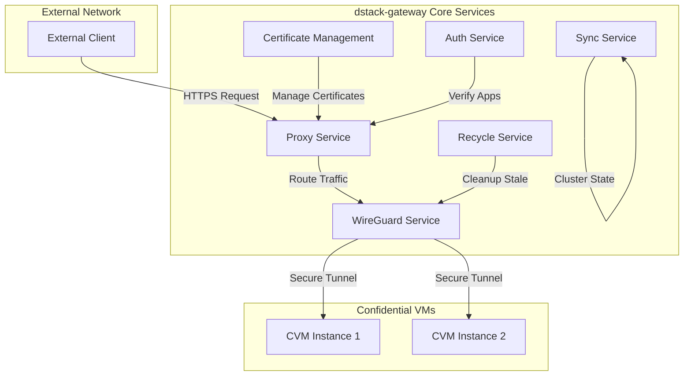
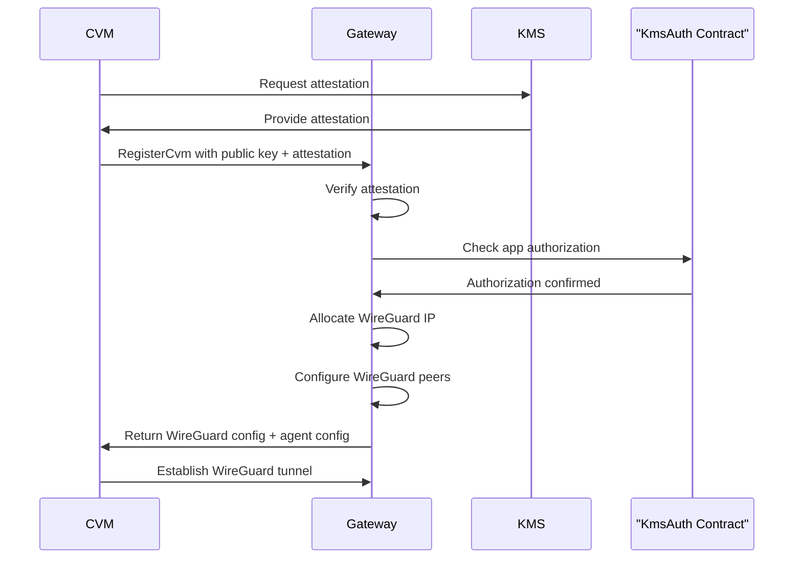
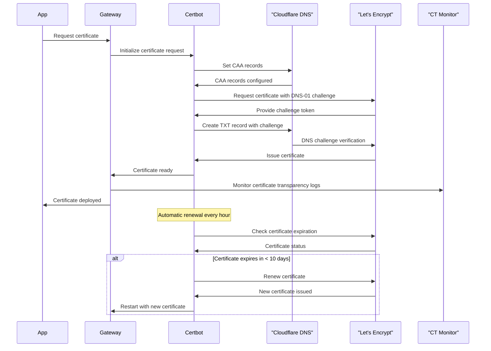
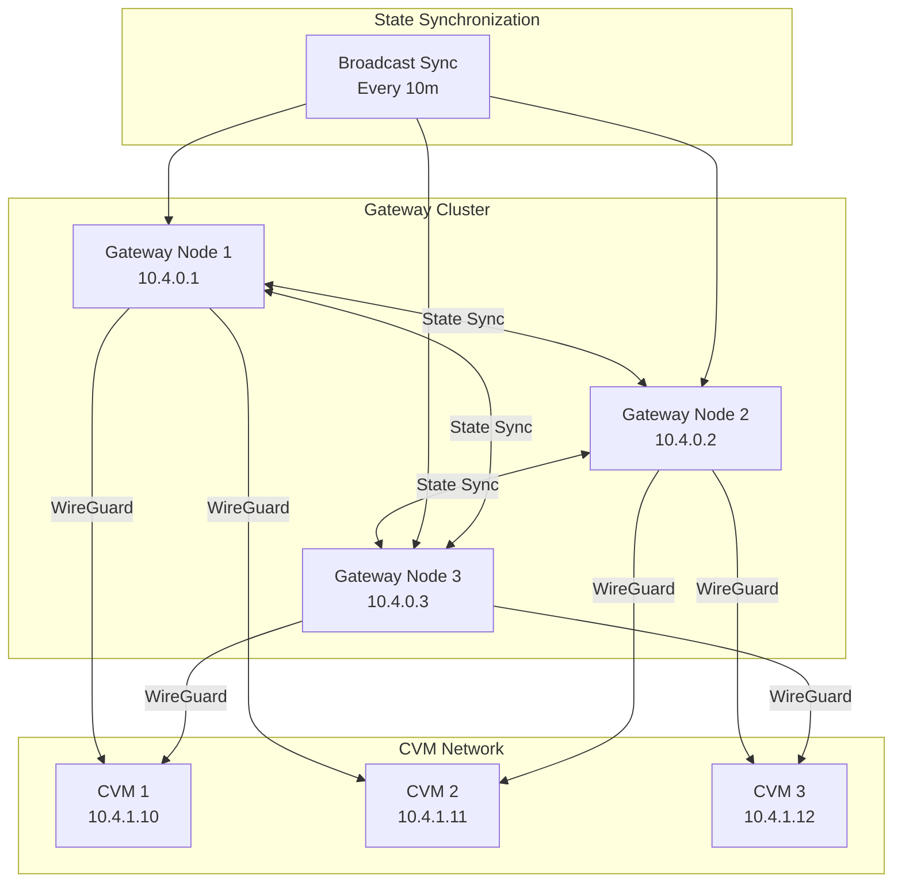

# dstack-gateway Implementation

The dstack-gateway is a reverse proxy and networking component that handles TLS termination, WireGuard VPN connections, and traffic routing between external clients and Confidential Virtual Machines (CVMs). [5](#0-4) 

## dstack-gateway Service and Traffic Flow Diagram



### Advanced Routing Configuration

The gateway uses sophisticated domain-based routing with the following patterns: [6](#0-5) 

<table className="w-full my-4">
  <thead>
    <tr className="bg-gray-100">
      <th className="p-3 text-left">Pattern</th>
      <th className="p-3 text-left">Routing Logic</th>
      <th className="p-3 text-left">TLS Mode</th>
      <th className="p-3 text-left">Default Port</th>
    </tr>
  </thead>
  <tbody>
    <tr>
      <td className="p-3 font-mono">&lt;app-id&gt;.domain.com</td>
      <td className="p-3">Direct app routing</td>
      <td className="p-3">TLS Termination</td>
      <td className="p-3">80</td>
    </tr>
    <tr className="bg-gray-50">
      <td className="p-3 font-mono">&lt;app-id&gt;-&lt;port&gt;.domain.com</td>
      <td className="p-3">Custom port routing</td>
      <td className="p-3">TLS Termination</td>
      <td className="p-3">Specified port</td>
    </tr>
    <tr>
      <td className="p-3 font-mono">&lt;app-id&gt;s.domain.com</td>
      <td className="p-3">TLS passthrough</td>
      <td className="p-3">TLS Passthrough</td>
      <td className="p-3">443</td>
    </tr>
    <tr className="bg-gray-50">
      <td className="p-3 font-mono">&lt;app-id&gt;-&lt;port&gt;s.domain.com</td>
      <td className="p-3">Custom port with TLS passthrough</td>
      <td className="p-3">TLS Passthrough</td>
      <td className="p-3">Specified port</td>
    </tr>
    <tr>
      <td className="p-3 font-mono">custom.domain.com</td>
      <td className="p-3">DNS TXT lookup: `_dstack-app-address`</td>
      <td className="p-3">TLS Passthrough</td>
      <td className="p-3">From TXT record</td>
    </tr>
  </tbody>
</table>

### CVM Registration Process



#### Production Configuration Example
```toml
# gateway.toml - Production Configuration for dstack-gateway
# The dstack-gateway is a reverse proxy and networking component that handles
# TLS termination, WireGuard VPN connections, and traffic routing between
# external clients and Confidential Virtual Machines (CVMs)

# Rocket web server configuration - controls the HTTP server that handles requests
workers = 8                    # Number of worker threads for handling HTTP requests
max_blocking = 64             # Maximum number of blocking tasks that can run concurrently
keep_alive = 10               # HTTP keep-alive timeout in seconds
log_level = "info"            # Logging level (trace, debug, info, warn, error)
port = 8000                   # Port for the main HTTP server (RPC and management interface)

[core]
# Core gateway configuration settings
state_path = "/data/gateway-state.json"  # Path to store gateway state and CVM registrations
set_ulimit = true                        # Automatically set soft ulimit to hard ulimit for file descriptors
rpc_domain = "gateway.example.com"       # Domain name for this gateway instance (used for RPC communication)
run_in_dstack = true                     # Whether this gateway is running as a dstack application in a CVM

[core.auth]
# Application authorization settings - integrates with KmsAuth contract
enabled = true                           # Enable application authorization checks
url = "https://kms.example.com/app-auth" # URL of the KmsAuth service for verifying app permissions
timeout = "5s"                          # Timeout for authorization requests

[core.admin]
# Admin interface configuration - provides management dashboard and API
enabled = true                          # Enable the admin interface
port = 8001                            # Port for the admin interface (separate from main port)

[core.certbot]
# Automatic TLS certificate management using Let's Encrypt and Cloudflare DNS
enabled = true                                                      # Enable automatic certificate management
workdir = "/data/rproxy/certs"                                     # Working directory for certificate storage
acme_url = "https://acme-v02.api.letsencrypt.org/directory"       # ACME server URL (production Let's Encrypt)
cf_api_token = "your_cloudflare_token"                            # Cloudflare API token for DNS-01 challenges
cf_zone_id = "your_zone_id"                                       # Cloudflare zone ID for the domain
auto_set_caa = true                                               # Automatically set CAA DNS records to restrict certificate issuance
domain = "*.app.example.com"                                      # Wildcard domain for certificate issuance
renew_interval = "1h"                                             # How often to check for certificate renewal
renew_before_expiration = "10d"                                   # Renew certificates this many days before expiration
renew_timeout = "5m"                                              # Timeout for certificate renewal operations

[core.wg]
# WireGuard VPN configuration - creates secure tunnels to CVMs
public_key = "gateway_public_key"         # WireGuard public key for this gateway
private_key = "gateway_private_key"       # WireGuard private key for this gateway
listen_port = 51820                       # UDP port for WireGuard to listen on
ip = "10.4.0.1/16"                       # IP address and network for this gateway in the VPN
reserved_net = ["10.4.0.0/27"]           # IP ranges reserved for gateway infrastructure (gateway IP must be in this range)
client_ip_range = "10.4.0.0/20"          # IP range available for CVM clients (must be within the main network)
config_path = "/data/wireguard/wg-ds-gw.conf"  # Path to WireGuard configuration file
interface = "wg-ds-gw"                    # Name of the WireGuard network interface
endpoint = "203.0.113.10:51820"          # Public endpoint (IP:port) where this gateway can be reached

[core.proxy]
# TLS proxy configuration - handles HTTPS termination and routing
cert_chain = "/data/rproxy/certs/live/cert.pem"  # Path to TLS certificate chain file
cert_key = "/data/rproxy/certs/live/key.pem"     # Path to TLS private key file
base_domain = "app.example.com"                   # Base domain for application routing (apps accessible as <app-id>.app.example.com)
listen_addr = "0.0.0.0"                          # IP address to bind the HTTPS proxy to
listen_port = 443                                # Port for HTTPS traffic (standard HTTPS port)
agent_port = 8090                                # Port used by CVM agents for communication
connect_top_n = 3                                # Number of CVM instances to try connecting to (for load balancing)
app_address_ns_prefix = "_dstack-app-address"    # DNS TXT record prefix for service discovery

[core.proxy.timeouts]
# Timeout configuration for proxy connections - affects performance and reliability
connect = "5s"              # Timeout for establishing connection to target CVM
handshake = "5s"            # Timeout for TLS handshake or SNI extraction
cache_top_n = "30s"         # How long to cache the list of top N CVM instances
data_timeout_enabled = true # Enable data transfer timeouts (may impact performance if disabled)
idle = "10m"                # Timeout for connections without data transfer
write = "5s"                # Timeout for writing data to CVM or client
shutdown = "5s"             # Timeout for gracefully shutting down connections
total = "5h"                # Maximum total duration for any single connection

[core.sync]
# Cluster synchronization configuration - enables high availability with multiple gateways
enabled = true                                    # Enable cluster synchronization
interval = "30s"                                 # How often to sync state with other gateways
broadcast_interval = "10m"                       # How often to broadcast full state to cluster
timeout = "2s"                                   # Timeout for sync operations
my_url = "https://gateway1.example.com:8001"     # This gateway's admin URL for cluster communication
bootnode = "https://bootnode.example.com:8001"   # Bootstrap node URL for joining the cluster

[core.recycle]
# Resource cleanup configuration - manages lifecycle of CVM connections
enabled = true        # Enable automatic cleanup of inactive resources
interval = "5m"       # How often to run cleanup operations
timeout = "10h"       # How long to keep inactive resources before cleanup
node_timeout = "10m"  # Timeout for individual node cleanup operations
```


## Advanced Certificate Management

The gateway implements comprehensive certificate management with automatic renewal and monitoring:



## Gateway Cluster Topology and State Synchronization

The gateway supports clustering for redundancy and load balancing: 



## Gateway Connection Strategies and Load Balancing Algorithms

The gateway implements intelligent connection management with health monitoring:

<table className="w-full my-4">
  <thead>
    <tr className="bg-gray-100">
      <th className="p-3 text-left">Strategy</th>
      <th className="p-3 text-left">Algorithm</th>
      <th className="p-3 text-left">Health Check</th>
      <th className="p-3 text-left">Fallback</th>
    </tr>
  </thead>
  <tbody>
    <tr>
      <td className="p-3 font-mono">top_n_selection</td>
      <td className="p-3">Latest handshake priority</td>
      <td className="p-3">WireGuard handshake time</td>
      <td className="p-3">Random selection</td>
    </tr>
    <tr className="bg-gray-50">
      <td className="p-3 font-mono">direct_instance</td>
      <td className="p-3">Instance ID lookup</td>
      <td className="p-3">Connection counter</td>
      <td className="p-3">App-level routing</td>
    </tr>
    <tr>
      <td className="p-3 font-mono">localhost_mode</td>
      <td className="p-3">Local development</td>
      <td className="p-3">TCP connection</td>
      <td className="p-3">127.0.0.1:port</td>
    </tr>
    <tr className="bg-gray-50">
      <td className="p-3 font-mono">dns_resolution</td>
      <td className="p-3">TXT record lookup</td>
      <td className="p-3">DNS availability</td>
      <td className="p-3">Connection timeout</td>
    </tr>
  </tbody>
</table>


# dstack-gateway Operational Features  
  
The dstack-gateway component includes comprehensive operational capabilities designed to maintain robust security, automatic cleanup, and enhanced observability within dstack deployments. For automated cleanup and maintenance, the gateway continuously monitors WireGuard handshake activity to efficiently **remove stale CVM instances**, ensuring optimal resource usage.

It proactively manages **gateway node cleanup** to maintain seamless synchronization across distributed clusters. WireGuard configurations are automatically updated, providing stable networking without manual intervention, and connections are systematically recycled every five minutes, enforcing a maximum timeout limit of 10 hours to preserve both security and system efficiency. 
  
Security and authorization within the gateway are rigorously enforced. It mandates **remote attestation verification for CVM registration**, verifying the integrity and identity of each confidential VM instance at launch.

Additionally, integration with the **KmsAuth contract** strengthens application authorization cryptographically, guaranteeing that only legitimate deployments receive necessary keys and credentials. Active **TLS certificate transparency monitoring** prevents unauthorized certificate issuance, while the management of **CAA records** restricts certificate authorities, significantly mitigating risks associated with unauthorized or compromised certificates.
  
For effective monitoring and observability, the gateway provides real-time tracking of connection statistics, offering immediate insights into network health and usage patterns. CVM instance health is assessed through regular WireGuard handshake checks, enabling rapid identification and resolution of potential connectivity issues. Additionally, the system monitors certificate expiration closely, issuing proactive alerts to avoid service disruptions due to expired certificates. Continuous monitoring of cluster synchronization status further ensures that distributed deployments remain reliable, coordinated, and resilient across diverse operational scenarios.


