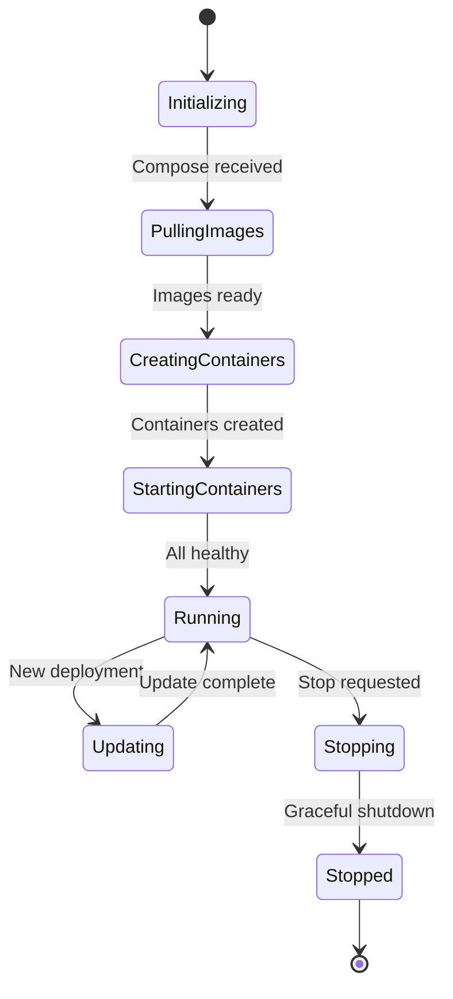

# dstack-guest-agent Implementation

The guest agent provides runtime services and security integration:

## Guest Agent Service Interface

```go
type GuestAgent interface {
    // Container management
    DeployCompose(compose []byte) error
    StartContainers() error
    StopContainers() error
    GetContainerLogs(name string) ([]byte, error)
    
    // Security services
    GetAttestation() (*Quote, error)
    DeriveKey(path string) (*Key, error)
    GetTLSCert(domain string) (*Certificate, error)
    
    // Monitoring and health
    GetMetrics() (*Metrics, error)
    GetHealth() (*Health, error)
    StreamLogs(follow bool) (<-chan LogEntry, error)
}
```

### Guest Agent Configuration Example

```toml
# guest-agent.toml
[general]
log_level = "info"
data_dir = "/var/lib/dstack"

[container_runtime]
socket_path = "/var/run/containerd/containerd.sock"
namespace = "dstack"
registry_config_path = "/etc/containerd/certs.d"

[security]
kms_endpoint = "https://kms.dstack.internal:8000"
attestation_cache_ttl = "5m"
key_cache_ttl = "1h"

[monitoring]
metrics_port = 9090
health_port = 8080
log_buffer_size = 1000
```

#### Container Lifecycle Management

The agent manages containers through a sophisticated state machine:

