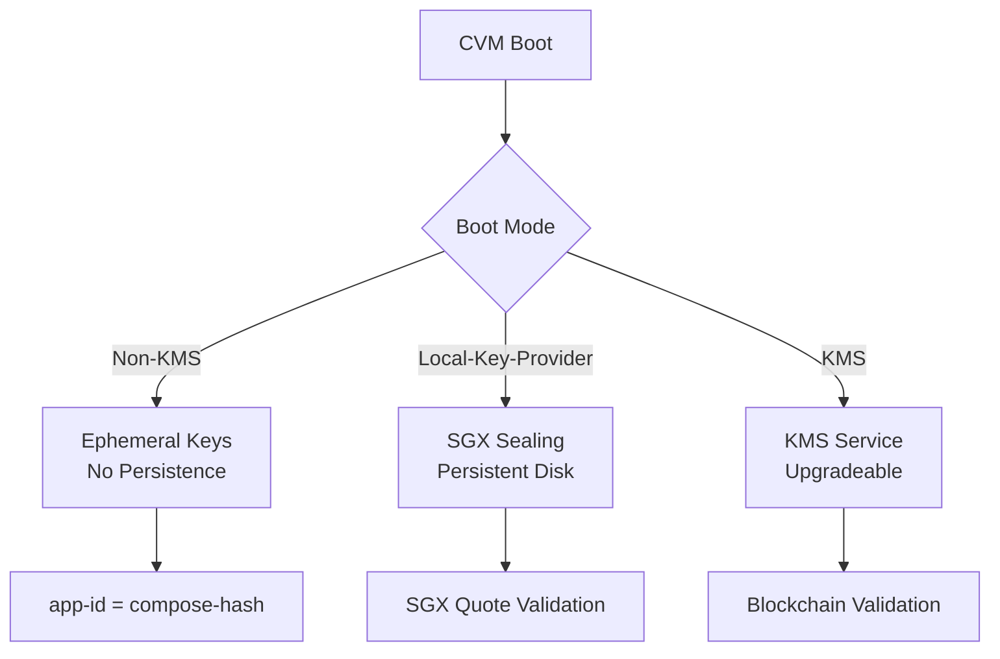
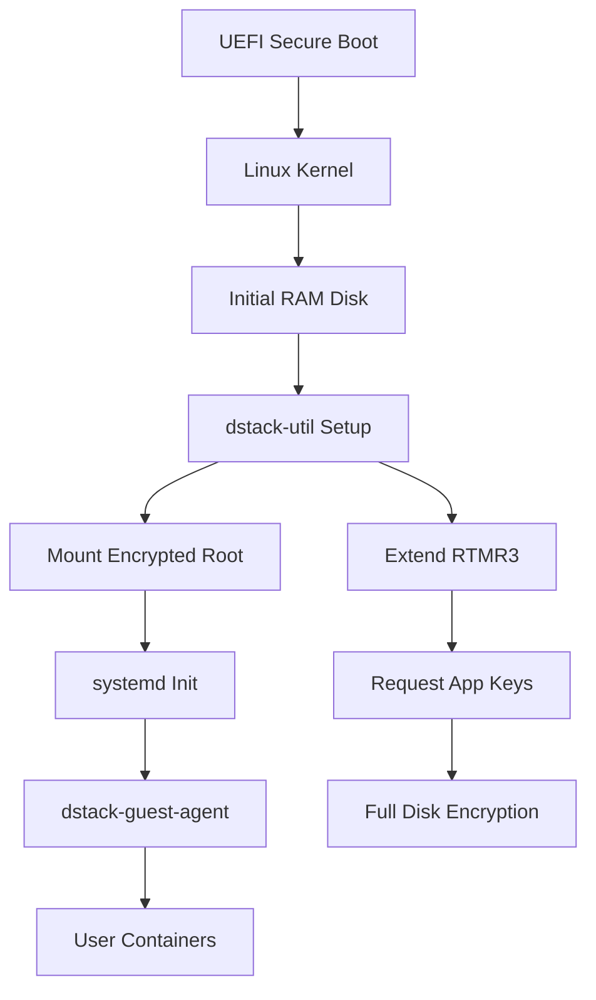

## dstack-kms Implementation

The KMS provides enterprise-grade cryptographic services with blockchain integration and supports three boot modes:

#### Boot Modes



#### Configuration Example

```toml
# kms.toml
[default]
workers = 8
max_blocking = 64
ident = "DStack KMS"
temp_dir = "/tmp"
keep_alive = 10
log_level = "info"

[rpc]
address = "0.0.0.0"
port = 8000

[rpc.tls]
key = "/etc/kms/certs/rpc.key"
certs = "/etc/kms/certs/rpc.crt"

[rpc.tls.mutual]
ca_certs = "/etc/kms/certs/tmp-ca.crt"
mandatory = false

[core]
cert_dir = "/etc/kms/certs"
subject_postfix = ".dstack"

[core.auth_api]
type = "webhook"

[core.auth_api.webhook]
url = "http://auth-api:8000"

[core.onboard]
enabled = true
quote_enabled = true
address = "0.0.0.0"
```

#### RPC Service Interface

The KMS exposes a focused RPC API  
([see source](https://github.com/Dstack-TEE/dstack/blob/45ebd05a/kms/rpc/proto/kms_rpc.proto)):

```go
service KMS {
    // Request the app key given the app id and tdx quote
    rpc GetAppKey(GetAppKeyRequest) returns (AppKeyResponse);
    // KMS key handover for replication
    rpc GetKmsKey(GetKmsKeyRequest) returns (KmsKeyResponse);
    // Request the app environment encryption public key
    rpc GetAppEnvEncryptPubKey(AppId) returns (PublicKeyResponse);
    // Request the KMS instance metadata
    rpc GetMeta(google.protobuf.Empty) returns (GetMetaResponse);
    // Request the temporary CA certificate and key
    rpc GetTempCaCert(google.protobuf.Empty) returns (GetTempCaCertResponse);
    // Sign a certificate
    rpc SignCert(SignCertRequest) returns (SignCertResponse);
}

service Onboard {
    // Bootstrap a new KMS
    rpc Bootstrap(BootstrapRequest) returns (BootstrapResponse);
    // Onboard from existing KMS
    rpc Onboard(OnboardRequest) returns (OnboardResponse);
}
```

### dstack-guest-agent Implementation

The guest agent provides multiple service interfaces for different use cases:

#### Service Interfaces

```go
// Main service for applications
service DstackGuest {
    rpc GetTlsKey(GetTlsKeyArgs) returns (GetTlsKeyResponse);
    rpc GetKey(GetKeyArgs) returns (GetKeyResponse);
    rpc GetQuote(RawQuoteArgs) returns (GetQuoteResponse);
    rpc EmitEvent(EmitEventArgs) returns (google.protobuf.Empty);
    rpc Info(google.protobuf.Empty) returns (AppInfo);
}

// Legacy compatibility service
service Tappd {
    rpc DeriveKey(DeriveKeyArgs) returns (GetTlsKeyResponse);
    rpc DeriveK256Key(GetKeyArgs) returns (DeriveK256KeyResponse);
    rpc TdxQuote(TdxQuoteArgs) returns (TdxQuoteResponse);
    rpc RawQuote(RawQuoteArgs) returns (TdxQuoteResponse);
    rpc Info(google.protobuf.Empty) returns (AppInfo);
}

// External communication service
service Worker {
    rpc Info(google.protobuf.Empty) returns (AppInfo);
    rpc Version(google.protobuf.Empty) returns (WorkerVersion);
}
```

#### Configuration Example

```toml
# dstack.toml
[default]
workers = 8
max_blocking = 64
ident = "Dstack guest agent"
log_level = "info"

[default.core]
keys_file = "/dstack/.host-shared/.appkeys.json"
compose_file = "/dstack/.host-shared/app-compose.json"
sys_config_file = "/dstack/.host-shared/.sys-config.json"
data_disks = ["/"]

[internal-v0]
address = "unix:/var/run/tappd.sock"
reuse = true

[internal]
address = "unix:/var/run/dstack.sock"
reuse = true

[external]
address = "0.0.0.0"
port = 8090

[guest-api]
address = "vsock:0xffffffff"
```

### dstack-os Implementation

The operating system provides secure boot with TDX attestation:

#### Boot Process



### dstack-util Implementation

The system utility provides secure boot and encryption services:

#### Commands Reference

<table className="w-full my-4">
  <thead>
    <tr className="bg-gray-100">
      <th className="p-3 text-left">Command</th>
      <th className="p-3 text-left">Purpose</th>
      <th className="p-3 text-left">Parameters</th>
    </tr>
  </thead>
  <tbody>
    <tr>
      <td className="p-3 font-mono">Setup</td>
      <td className="p-3">Initialize full disk encryption and system</td>
      <td className="p-3">--work-dir, --device, --mount-point</td>
    </tr>
    <tr className="bg-gray-50">
      <td className="p-3 font-mono">Quote</td>
      <td className="p-3">Generate TDX quote from report data</td>
      <td className="p-3">stdin: report_data</td>
    </tr>
    <tr>
      <td className="p-3 font-mono">Extend</td>
      <td className="p-3">Extend Runtime Measurement Register</td>
      <td className="p-3">--event, --payload</td>
    </tr>
    <tr className="bg-gray-50">
      <td className="p-3 font-mono">GenAppKeys</td>
      <td className="p-3">Generate application keys</td>
      <td className="p-3">--output, --ca-level</td>
    </tr>
  </tbody>
</table>

#### Full Disk Encryption Setup

```bash
# Complete system setup command
dstack-util Setup \
    --work-dir /dstack \
    --device /dev/vda2 \
    --mount-point /data
```

## Key Provider Modes

The system supports three distinct key provider modes with different trust models:

### Non-KMS Mode
- Generates ephemeral app keys on startup
- No persistent disk state
- `app-id` must equal `compose-hash`
- Key provider in RTMR: `{"type": "none", "id": ""}`

### Local-Key-Provider Mode  
- Uses SGX sealing key provider for app keys
- Maintains persistent disk state
- Validates key provider via SGX quote
- Key provider in RTMR: `{"type": "local-sgx", "id": "<sgx mrenclave>"}`

### KMS Mode
- Enables flexible app-id validation
- Supports application upgrades
- Requires blockchain contract configuration
- Key provider in RTMR: `{"type": "kms", "id": "<kms-root-pubkey>"}`

## REST API Access

Applications can access guest agent services via Unix socket:

```bash
# Get TLS certificate
curl --unix-socket /var/run/dstack.sock -X POST \
  http://dstack/GetTlsKey \
  -H 'Content-Type: application/json' \
  -d '{"subject": "example.com", "usage_ra_tls": true}'

# Get application info
curl --unix-socket /var/run/dstack.sock http://dstack/Info

# Generate TDX quote
curl --unix-socket /var/run/dstack.sock -X POST \
  http://dstack/GetQuote \
  -d '{"report_data": "1234deadbeaf"}'
```

For detailed API documentation, see the [DStack Guest Agent RPC API Documentation](sdk/curl/api.md).
