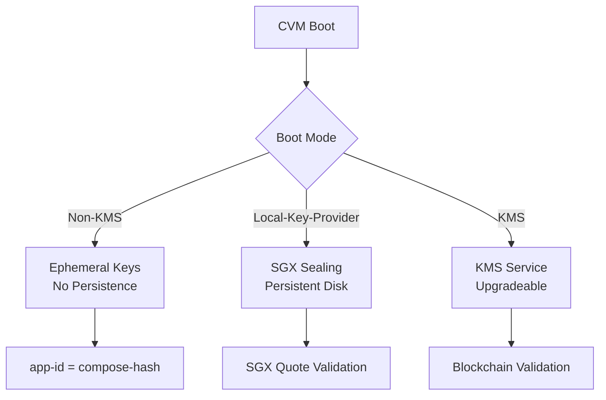

## dstack-kms Implementation

The KMS provides enterprise-grade cryptographic services with blockchain integration and supports three boot modes:

#### Boot Modes



#### Configuration Example

```toml
# kms.toml
[default]
workers = 8
max_blocking = 64
ident = "DStack KMS"
temp_dir = "/tmp"
keep_alive = 10
log_level = "info"

[rpc]
address = "0.0.0.0"
port = 8000

[rpc.tls]
key = "/etc/kms/certs/rpc.key"
certs = "/etc/kms/certs/rpc.crt"

[rpc.tls.mutual]
ca_certs = "/etc/kms/certs/tmp-ca.crt"
mandatory = false

[core]
cert_dir = "/etc/kms/certs"
subject_postfix = ".dstack"

[core.auth_api]
type = "webhook"

[core.auth_api.webhook]
url = "http://auth-api:8000"

[core.onboard]
enabled = true
quote_enabled = true
address = "0.0.0.0"
```

#### RPC Service Interface

The KMS exposes a focused RPC API  
([see source](https://github.com/Dstack-TEE/dstack/blob/45ebd05a/kms/rpc/proto/kms_rpc.proto)):

```go
service KMS {
    // Request the app key given the app id and tdx quote
    rpc GetAppKey(GetAppKeyRequest) returns (AppKeyResponse);
    // KMS key handover for replication
    rpc GetKmsKey(GetKmsKeyRequest) returns (KmsKeyResponse);
    // Request the app environment encryption public key
    rpc GetAppEnvEncryptPubKey(AppId) returns (PublicKeyResponse);
    // Request the KMS instance metadata
    rpc GetMeta(google.protobuf.Empty) returns (GetMetaResponse);
    // Request the temporary CA certificate and key
    rpc GetTempCaCert(google.protobuf.Empty) returns (GetTempCaCertResponse);
    // Sign a certificate
    rpc SignCert(SignCertRequest) returns (SignCertResponse);
}

service Onboard {
    // Bootstrap a new KMS
    rpc Bootstrap(BootstrapRequest) returns (BootstrapResponse);
    // Onboard from existing KMS
    rpc Onboard(OnboardRequest) returns (OnboardResponse);
}
```


## Key Provider Modes

The system supports three distinct key provider modes with different trust models:

### Non-KMS Mode
- Generates ephemeral app keys on startup
- No persistent disk state
- `app-id` must equal `compose-hash`
- Key provider in RTMR: `{"type": "none", "id": ""}`

### Local-Key-Provider Mode  
- Uses SGX sealing key provider for app keys
- Maintains persistent disk state
- Validates key provider via SGX quote
- Key provider in RTMR: `{"type": "local-sgx", "id": "<sgx mrenclave>"}`

### KMS Mode
- Enables flexible app-id validation
- Supports application upgrades
- Requires blockchain contract configuration
- Key provider in RTMR: `{"type": "kms", "id": "<kms-root-pubkey>"}`

## REST API Access

Applications can access guest agent services via Unix socket:

```bash
# Get TLS certificate
curl --unix-socket /var/run/dstack.sock -X POST \
  http://dstack/GetTlsKey \
  -H 'Content-Type: application/json' \
  -d '{"subject": "example.com", "usage_ra_tls": true}'

# Get application info
curl --unix-socket /var/run/dstack.sock http://dstack/Info

# Generate TDX quote
curl --unix-socket /var/run/dstack.sock -X POST \
  http://dstack/GetQuote \
  -d '{"report_data": "1234deadbeaf"}'
```

For detailed API documentation, see the [DStack Guest Agent RPC API Documentation](sdk/curl/api.md).

## Next Steps

Now that you understand KMS key management and attestation, continue learning about dstack's core components:

<div className="mt-8 flex gap-4">
  <a href="/docs/concepts/core-guest-agent" className="bg-blue-600 text-white px-6 py-3 rounded-lg hover:bg-blue-700">
    Next: Guest Agent Core →
  </a>
  <a href="/docs/concepts/core-gateway" className="bg-gray-200 text-gray-800 px-6 py-3 rounded-lg hover:bg-gray-300">
    ← Previous: Gateway Core
  </a>
</div>

### Related Topics
- [Security Model](/docs/concepts/security-model) - Learn about attestation and trust models
- [Architecture](/docs/concepts/architecture) - Understand how KMS fits in the overall system
