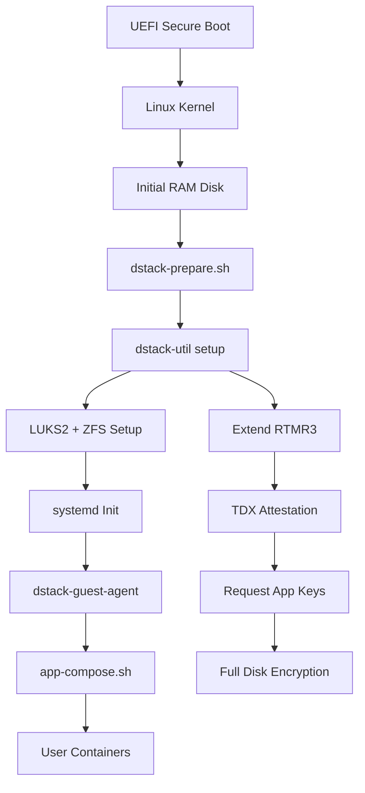

# dstack OS Core Implementation

The dstack operating system provides a secure, minimal foundation built on TDX (Trust Domain Extensions) with comprehensive attestation and full disk encryption capabilities.

## Boot Process Architecture

The dstack OS follows a secure boot chain with TDX attestation at each critical stage:

## Core Components

### dstack-util: System Setup Utility

The `dstack-util` serves as the primary system setup and configuration tool with comprehensive TDX integration: [1](#0-0) 

Key functions include:
- **TDX Operations**: Quote and report generation, RTMR extension
- **Cryptographic Operations**: RA-TLS certificate generation, app key derivation
- **System Setup**: Full disk encryption configuration and mounting
- **Host Communication**: Integration with dstack-vmm for key provisioning

### System Preparation Process

The OS initialization follows a structured preparation sequence: [2](#0-1) 

This process:
1. **Mounts overlay filesystems** for volatile directories
2. **Synchronizes system time** via chrony
3. **Loads TDX guest module** for attestation
4. **Executes dstack-util setup** for system preparation
5. **Configures persistent storage** for Docker

### Full Disk Encryption Setup

The system implements LUKS2 encryption with ZFS for data protection: [3](#0-2) 

Features:
- **LUKS2 encryption** with AES-XTS-Plain64 cipher
- **ZFS filesystem** with Blake3 checksums
- **Automatic pool expansion** and persistent mounting
- **Key derivation** from KMS or local sealing keys

### dstack-guest-agent: Core Runtime Service

The guest agent provides the runtime environment for TEE operations: [4](#0-3) 

The agent runs multiple concurrent services:
- **Internal RPC**: Container attestation and key services
- **External HTTP**: Dashboard and management interface  
- **Guest API**: Direct TEE functionality access
- **Systemd Integration**: Watchdog and health monitoring

## TDX Attestation Integration

### RTMR Measurement Chain

The system maintains a cryptographic measurement chain using RTMR3: [5](#0-4) 

Critical measurements include:
- **System preparation** markers
- **Application ID** and compose file hash
- **Instance ID** for workload isolation
- **Key provider information** for trust establishment

### Application Key Management

The system supports multiple key provisioning modes: [6](#0-5) 

Supported providers:
- **KMS Integration**: Remote key management with RA-TLS
- **Local Sealing**: Hardware-bound key derivation
- **Development Mode**: Temporary key generation

## Container Deployment Process

Application containers are deployed through a controlled workflow: [7](#0-6) 

The deployment process:
1. **Validates runner type** (docker-compose or bash)
2. **Removes orphaned containers** for clean state
3. **Restarts Docker daemon** with proper configuration
4. **Executes compose up** with build and orphan removal
5. **Performs cleanup** of unused images and volumes

## Security Configuration

### Overlay Filesystem Protection

Critical system directories use overlay mounts for protection: [8](#0-7) 

Protected directories:
- `/etc/wireguard` - Network configuration
- `/etc/docker` - Container runtime settings
- `/usr/bin` - System binaries
- `/home/root` - User environment

### Network Security

The system implements WireGuard-based secure networking with iptables rules for access control and integration with dstack-gateway for secure ingress.

## System Configuration Files

The guest agent uses a structured configuration approach: [9](#0-8) 

Key configuration elements:
- **PCCS URL** for quote verification
- **Data disk paths** for persistent storage
- **Network bindings** for service access

## Notes

The dstack OS core represents a comprehensive TEE-enabled operating system designed specifically for confidential computing workloads. The architecture emphasizes:

- **Security-first design** with TDX attestation throughout the boot chain
- **Minimal attack surface** through targeted component selection
- **Flexible key management** supporting both cloud and edge deployment models
- **Container-native approach** with Docker integration and overlay protection
- **Comprehensive monitoring** through systemd integration and health checks

the system provides a robust foundation for deploying confidential applications while maintaining the familiar Docker Compose workflow for developers.

### Continue Learning
- [Core Components Overview](/docs/concepts/core-components) - Review the complete architecture
- [Security Model](/docs/concepts/security-model) - Deep dive into security architecture  
- [Architecture](/docs/concepts/architecture) - Understand the complete system design
- [Getting Started](/docs/getting-started/start) - Begin deploying applications
