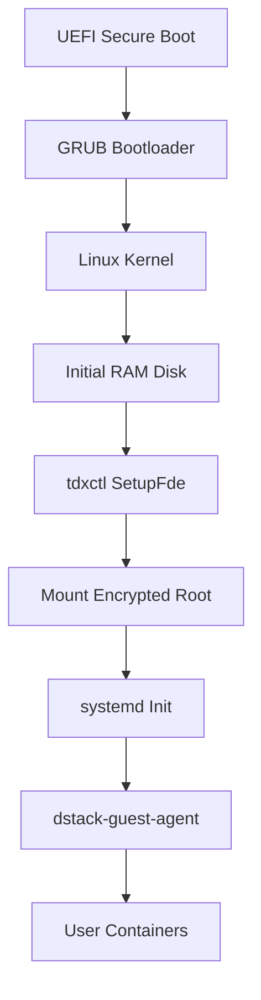

### dstack-os Implementation

The operating system provides a secure, minimal foundation:

#### Boot Process



#### System Configuration

Key system configurations for security:

```bash
# /etc/systemd/system/dstack-guest-agent.service
[Unit]
Description=dstack Guest Agent
After=network.target
Requires=network.target

[Service]
Type=simple
User=dstack
Group=dstack
ExecStart=/usr/bin/dstack-guest-agent
Restart=always
RestartSec=5
Environment=RUST_LOG=info

[Install]
WantedBy=multi-user.target
```