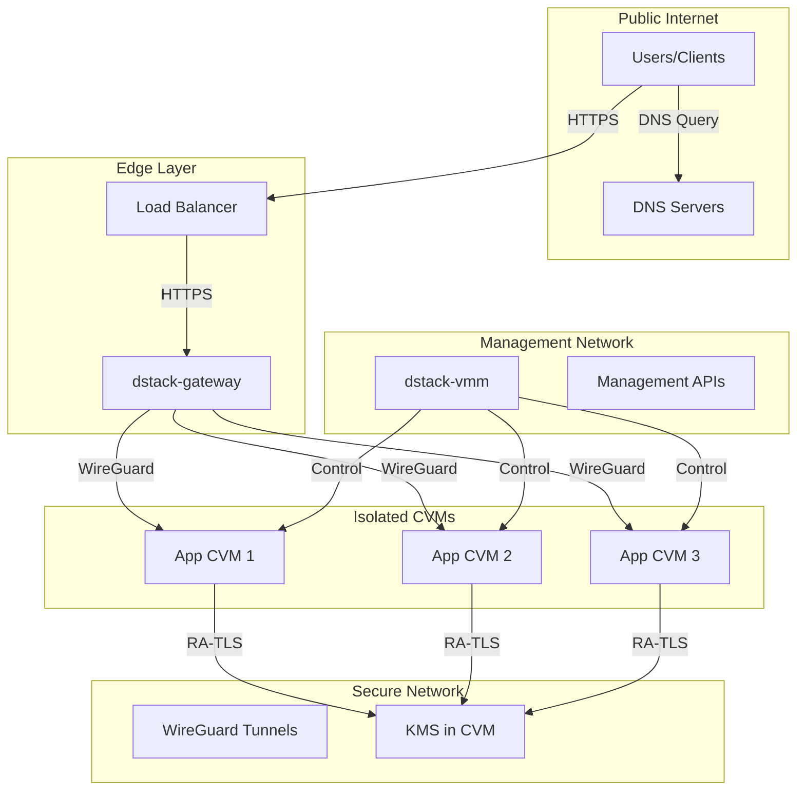
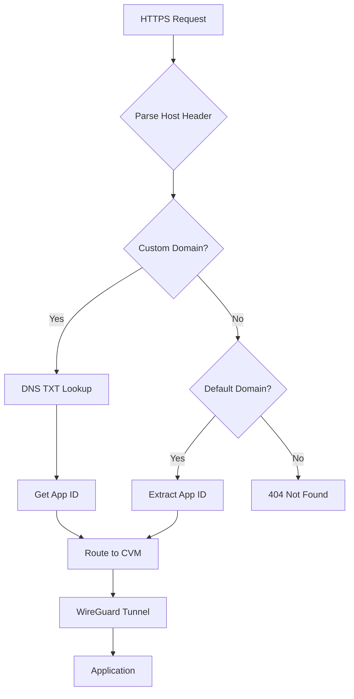
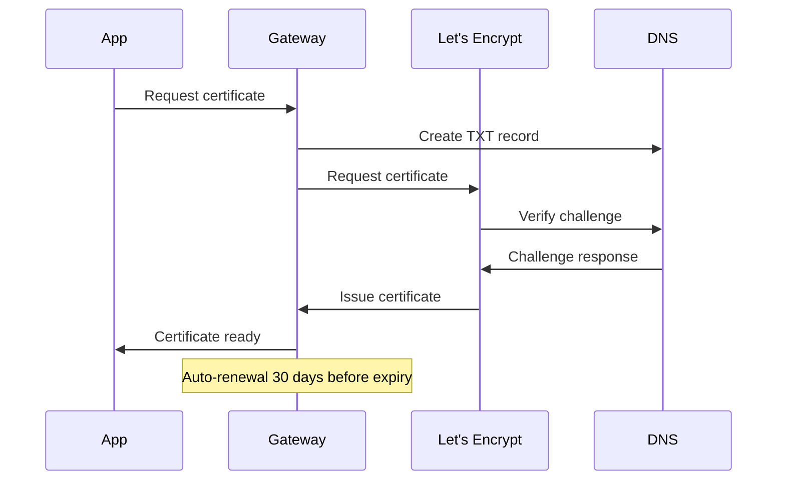
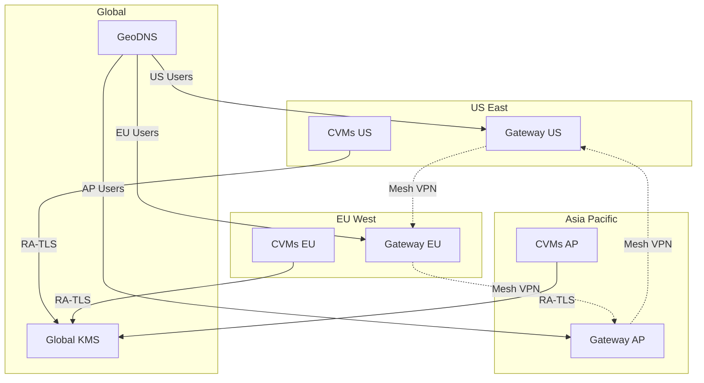

The dstack networking architecture is built on multiple layers, each designed to deliver **security**, **isolation**, and **flexibility** for your deployments. By understanding how these layers interact, you'll be better equipped to optimize performance, maintain strong security boundaries, and quickly resolve any networking issues that arise.

## Network Model Overview



## Network Layers (at a glance)

<div className="grid grid-cols-1 md:grid-cols-3 gap-6 my-6">

  {/* 1. Public Access */}
  <div className="bg-lime-50 border-l-4 border-lime-400 rounded-lg p-5 flex flex-col gap-3">
    <div className="flex items-center gap-3">
      <div className="w-8 h-8 flex items-center justify-center rounded-full bg-lime-100 border-2 border-lime-400">
        <span className="text-lime-800 font-bold">1</span>
      </div>
      <span className="text-lime-800 font-bold text-lg">Public Access</span>
    </div>
    <div className="text-lime-700 text-sm pl-1">
      users connect to your app over HTTPS<br />
      DNS points to your app domain<br />
      (optional) CDN for static files
    </div>
    <div className="text-xs text-lime-600 font-mono mt-2">HTTP/HTTPS, DNS</div>
  </div>

  {/* 2. Gateway Security */}
  <div className="bg-gray-800 rounded-lg p-5 text-white flex flex-col gap-3">
    <div className="flex items-center gap-3">
      <div className="w-8 h-8 flex items-center justify-center rounded-full bg-gray-700 border-2 border-gray-500">
        <span className="font-bold">2</span>
      </div>
      <span className="font-bold text-lg">Gateway Security</span>
    </div>
    <div className="text-gray-200 text-sm pl-1">
      gateway handles TLS (auto certificates)<br />
      blocks attacks (WAF, rate limiting, DDoS protection)<br />
      supports HTTP/2 and HTTP/3
    </div>
  </div>

  {/* 3. Private VPN to CVMs */}
  <div className="bg-lime-50 border-l-4 border-lime-400 rounded-lg p-5 flex flex-col gap-3">
    <div className="flex items-center gap-3">
      <div className="w-8 h-8 flex items-center justify-center rounded-full bg-lime-100 border-2 border-lime-400">
        <span className="text-lime-800 font-bold">3</span>
      </div>
      <span className="text-lime-800 font-bold text-lg">Private VPN to CVMs</span>
    </div>
    <div className="text-lime-700 text-sm mb-2">
      gateway connects to each Confidential VM (CVM) using a secure WireGuard tunnel. this keeps app traffic private and isolated.
    </div>
    <details>
      <summary className="cursor-pointer text-lime-800 font-semibold text-sm">Show WireGuard config example</summary>
      <div className="mt-2 grid grid-cols-1 md:grid-cols-2 gap-3">
        <div>
          <div className="font-semibold text-lime-800 mb-1">Gateway</div>
          <pre className="bg-gray-900 text-lime-400 p-3 rounded text-xs overflow-x-auto">{`[Interface]
Address = 10.9.0.1/24
ListenPort = 51820
PrivateKey = <gateway-private-key>

[Peer]
PublicKey = <cvm-public-key>
AllowedIPs = 10.9.0.2/32`}</pre>
        </div>
        <div>
          <div className="font-semibold text-lime-800 mb-1">CVM</div>
          <pre className="bg-gray-900 text-lime-400 p-3 rounded text-xs overflow-x-auto">{`[Interface]
Address = 10.9.0.2/24
PrivateKey = <cvm-private-key>

[Peer]
PublicKey = <gateway-public-key>
Endpoint = gateway.ip:51820
AllowedIPs = 10.9.0.1/32`}</pre>
        </div>
      </div>
    </details>
  </div>

</div>

### 4. Internal CVM Network

Container-to-container communication within a CVM:

```yaml
# Docker network configuration
networks:
  internal:
    driver: bridge
    ipam:
      config:
        - subnet: 172.20.0.0/16
    internal: true  # No external access

services:
  web:
    networks:
      - internal
      - external
  database:
    networks:
      - internal  # Only internal access
```

## Traffic Routing

### Domain-Based Routing

dstack supports multiple routing patterns:

<div className="bg-lime-50 p-6 rounded-lg my-6">
  <h4 className="font-semibold text-lime-800 mb-4">Routing Patterns:</h4>
  
  <div className="overflow-x-auto">
    <table className="w-full bg-white rounded-lg shadow-sm">
      <thead>
        <tr className="bg-lime-100">
          <th className="text-left p-4 text-lime-800 font-semibold">Pattern</th>
          <th className="text-left p-4 text-lime-800 font-semibold">Example</th>
          <th className="text-left p-4 text-lime-800 font-semibold">Use Case</th>
        </tr>
      </thead>
      <tbody>
        <tr className="border-b border-lime-100">
          <td className="p-4 font-mono text-lime-700">app.srv.domain</td>
          <td className="p-4 text-gray-700">myapp.app.example.com</td>
          <td className="p-4 text-gray-700">Default app routing</td>
        </tr>
        <tr className="border-b border-lime-100">
          <td className="p-4 font-mono text-lime-700">custom.domain</td>
          <td className="p-4 text-gray-700">api.mycompany.com</td>
          <td className="p-4 text-gray-700">Custom domain via DNS TXT</td>
        </tr>
        <tr className="border-b border-lime-100">
          <td className="p-4 font-mono text-lime-700">port-N.srv.domain</td>
          <td className="p-4 text-gray-700">8080.app.example.com</td>
          <td className="p-4 text-gray-700">Direct port access</td>
        </tr>
        <tr>
          <td className="p-4 font-mono text-lime-700">cvm-id.internal</td>
          <td className="p-4 text-gray-700">cvm-abc123.internal</td>
          <td className="p-4 text-gray-700">Internal debugging</td>
        </tr>
      </tbody>
    </table>
  </div>
</div>

### Custom Domain Setup

To use a custom domain, configure DNS records as follows:

<div className="bg-gray-800 p-6 rounded-lg my-6">
  <h4 className="font-semibold text-white mb-4">DNS Configuration:</h4>
  <pre className="bg-gray-900 text-lime-400 p-4 rounded-lg text-sm overflow-x-auto">{`# DNS TXT record
_dstack-app-address.api.mycompany.com TXT "app-id=abc123def456"

# CNAME record
api.mycompany.com CNAME gateway.example.com`}</pre>
</div>

### Request Routing Flow



---

## Network Security Framework

### Port Security Configuration

<div className="bg-gray-800 rounded-lg p-6 my-6">
  <h4 className="font-semibold text-white mb-4">Default Port Configuration:</h4>
  <div className="overflow-x-auto">
    <table className="w-full">
      <thead>
        <tr className="border-b border-gray-600">
          <th className="p-3 text-left text-lime-400">Port</th>
          <th className="p-3 text-left text-lime-400">Service</th>
          <th className="p-3 text-left text-lime-400">Access</th>
          <th className="p-3 text-left text-lime-400">Security</th>
        </tr>
      </thead>
      <tbody className="text-gray-300">
        <tr className="border-b border-gray-700">
          <td className="p-3 font-mono text-lime-400">80</td>
          <td className="p-3">HTTP</td>
          <td className="p-3">Public</td>
          <td className="p-3">Redirect to HTTPS</td>
        </tr>
        <tr className="border-b border-gray-700">
          <td className="p-3 font-mono text-lime-400">443</td>
          <td className="p-3">HTTPS</td>
          <td className="p-3">Public</td>
          <td className="p-3">TLS 1.2+ only</td>
        </tr>
        <tr className="border-b border-gray-700">
          <td className="p-3 font-mono text-lime-400">51820</td>
          <td className="p-3">WireGuard</td>
          <td className="p-3">Public</td>
          <td className="p-3">Key-based auth</td>
        </tr>
        <tr className="border-b border-gray-700">
          <td className="p-3 font-mono text-lime-400">9080</td>
          <td className="p-3">VMM API</td>
          <td className="p-3">Internal</td>
          <td className="p-3">Localhost only</td>
        </tr>
        <tr>
          <td className="p-3 font-mono text-lime-400">8000</td>
          <td className="p-3">KMS RPC</td>
          <td className="p-3">Internal</td>
          <td className="p-3">RA-TLS required</td>
        </tr>
      </tbody>
    </table>
  </div>
</div>

### Firewall Configuration

<div className="bg-lime-50 p-6 rounded-lg my-6">
  <h4 className="font-semibold text-lime-800 mb-4">Recommended Firewall Rules:</h4>
  <pre className="bg-gray-900 text-lime-400 p-4 rounded-lg text-sm overflow-x-auto">{`# Public interface - minimal exposure
iptables -A INPUT -p tcp --dport 80 -j ACCEPT
iptables -A INPUT -p tcp --dport 443 -j ACCEPT
iptables -A INPUT -p udp --dport 51820 -j ACCEPT
iptables -A INPUT -m state --state ESTABLISHED,RELATED -j ACCEPT
iptables -A INPUT -i lo -j ACCEPT
iptables -P INPUT DROP

# Internal interface - management traffic
iptables -A INPUT -i eth1 -s 10.0.0.0/8 -p tcp --dport 9080 -j ACCEPT
iptables -A INPUT -i eth1 -s 10.0.0.0/8 -p tcp --dport 8000 -j ACCEPT`}</pre>
</div>

### Network Isolation Mechanisms

<div className="bg-gray-800 p-6 rounded-lg my-6">
  <h4 className="font-semibold text-white mb-4">Multi-Layer Isolation:</h4>
  <div className="grid grid-cols-1 md:grid-cols-2 gap-4">
    <div className="space-y-3">
      <div className="flex items-center gap-2">
        <span className="w-2 h-2 bg-lime-400 rounded-full"></span>
        <span className="text-gray-300"><strong className="text-white">VLAN Separation:</strong> Different VLANs for management and application traffic</span>
      </div>
      <div className="flex items-center gap-2">
        <span className="w-2 h-2 bg-lime-400 rounded-full"></span>
        <span className="text-gray-300"><strong className="text-white">Network Namespaces:</strong> Each CVM has isolated network stack</span>
      </div>
      <div className="flex items-center gap-2">
        <span className="w-2 h-2 bg-lime-400 rounded-full"></span>
        <span className="text-gray-300"><strong className="text-white">Bridge Isolation:</strong> Separate bridges prevent cross-CVM communication</span>
      </div>
    </div>
    <div className="space-y-3">
      <div className="flex items-center gap-2">
        <span className="w-2 h-2 bg-lime-400 rounded-full"></span>
        <span className="text-gray-300"><strong className="text-white">Firewall Rules:</strong> Default deny with explicit allow rules</span>
      </div>
      <div className="flex items-center gap-2">
        <span className="w-2 h-2 bg-lime-400 rounded-full"></span>
        <span className="text-gray-300"><strong className="text-white">WireGuard Encryption:</strong> All CVM traffic encrypted</span>
      </div>
    </div>
  </div>
</div>

---

## HTTPS & Certificate Management

### Automatic Certificate Provisioning

dstack automatically provisions and renews TLS certificates using Let's Encrypt:



### Certificate Configuration

<div className="bg-lime-50 p-6 rounded-lg my-6">
  <h4 className="font-semibold text-lime-800 mb-4">Gateway Certificate Settings:</h4>
  <pre className="bg-gray-900 text-lime-400 p-4 rounded-lg text-sm overflow-x-auto">{`# gateway.toml certificate settings
[certificate]
# Email for Let's Encrypt notifications
email = "admin@example.com"

# Use staging for testing (avoid rate limits)
staging = false

# DNS provider for DNS-01 challenges
dns_provider = "cloudflare"
dns_api_token = "\${CLOUDFLARE_API_TOKEN}"

# Certificate storage
cert_path = "/etc/dstack/certs"

# Renewal settings
renewal_days = 30
renewal_check_interval = "12h"`}</pre>
</div>

### Certificate Transparency Monitoring

<div className="bg-gray-800 p-6 rounded-lg my-6">
  <h4 className="font-semibold text-white mb-4">CT Log Monitoring:</h4>
  <pre className="bg-gray-900 text-lime-400 p-4 rounded-lg text-sm overflow-x-auto">{`# Check CT logs for your domain
curl "https://crt.sh/?q=%.example.com&output=json" | jq '.'

# Gateway automatic monitoring
[monitoring]
ct_log_check = true
ct_log_interval = "1h"
alert_webhook = "https://alerts.example.com/ct"`}</pre>
</div>

---

## Advanced Networking Features

### Multi-Region Deployment Architecture

Deploy across multiple regions with optimized routing:



### Load Balancing Strategies

<div className="bg-lime-50 p-6 rounded-lg my-6">
  <h4 className="font-semibold text-lime-800 mb-4">Load Balancing Methods:</h4>
  <div className="overflow-x-auto">
    <table className="w-full bg-white rounded-lg shadow-sm">
      <thead>
        <tr className="bg-lime-100">
          <th className="p-4 text-left text-lime-800 font-semibold">Method</th>
          <th className="p-4 text-left text-lime-800 font-semibold">Algorithm</th>
          <th className="p-4 text-left text-lime-800 font-semibold">Use Case</th>
        </tr>
      </thead>
      <tbody>
        <tr className="border-b border-lime-100">
          <td className="p-4 font-semibold text-lime-700">Round Robin</td>
          <td className="p-4 text-gray-700">Sequential distribution</td>
          <td className="p-4 text-gray-700">Equal server capacity</td>
        </tr>
        <tr className="border-b border-lime-100">
          <td className="p-4 font-semibold text-lime-700">Least Connections</td>
          <td className="p-4 text-gray-700">Route to least busy</td>
          <td className="p-4 text-gray-700">Long-lived connections</td>
        </tr>
        <tr className="border-b border-lime-100">
          <td className="p-4 font-semibold text-lime-700">IP Hash</td>
          <td className="p-4 text-gray-700">Consistent routing</td>
          <td className="p-4 text-gray-700">Session affinity needed</td>
        </tr>
        <tr>
          <td className="p-4 font-semibold text-lime-700">Geographic</td>
          <td className="p-4 text-gray-700">Nearest region</td>
          <td className="p-4 text-gray-700">Global deployments</td>
        </tr>
      </tbody>
    </table>
  </div>
</div>

### Service Mesh Integration

For complex microservices deployments:

<div className="bg-gray-800 p-6 rounded-lg my-6">
  <h4 className="font-semibold text-white mb-4">Istio Integration Example:</h4>
  <pre className="bg-gray-900 text-lime-400 p-4 rounded-lg text-sm overflow-x-auto">{`# Istio integration example
apiVersion: networking.istio.io/v1beta1
kind: VirtualService
metadata:
  name: dstack-app
spec:
  hosts:
  - myapp.example.com
  http:
  - match:
    - headers:
        x-dstack-verified:
          exact: "true"
    route:
    - destination:
        host: myapp-service
        port:
          number: 8080`}</pre>
</div>
