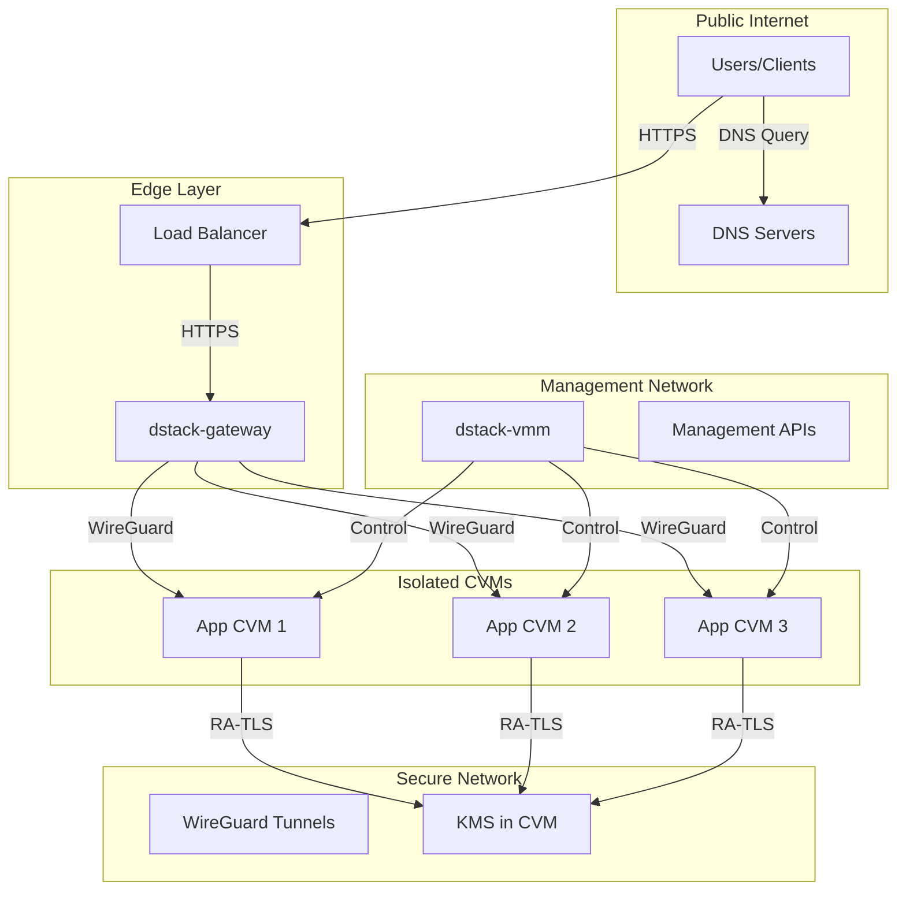
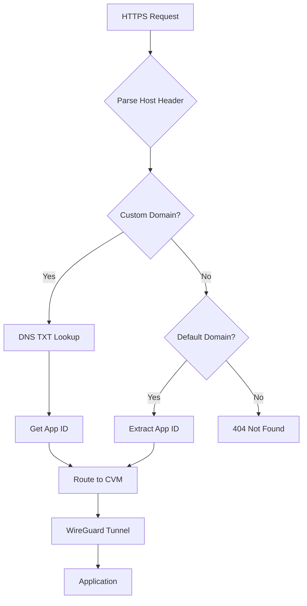
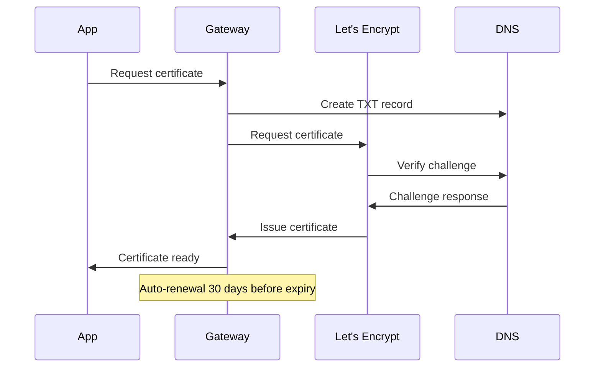
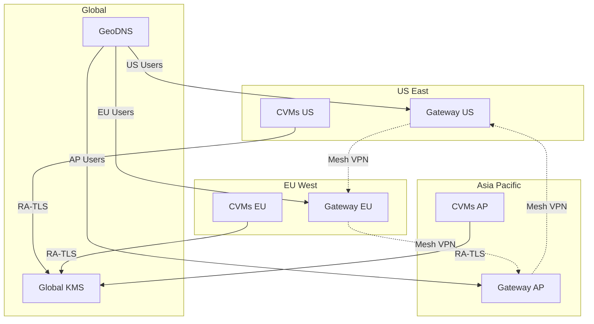

# Networking Architecture

dstack implements a sophisticated networking model that ensures secure communication between components while maintaining isolation and performance. This page explains how networking works in dstack, from HTTPS traffic routing to internal container communication.

## Network Overview

dstack uses multiple network layers to provide security, isolation, and flexibility:



## Network Layers

### 1. Public Network Layer

The outermost layer handling internet-facing traffic:

<div className="bg-blue-50 p-6 rounded-lg my-4">
  <h4 className="font-semibold mb-3">Public Network Components:</h4>
  <table className="w-full">
    <tr className="border-b">
      <td className="p-2 font-semibold">Component</td>
      <td className="p-2">Purpose</td>
      <td className="p-2">Protocols</td>
    </tr>
    <tr className="border-b">
      <td className="p-2">Load Balancer</td>
      <td className="p-2">Distribute traffic, DDoS protection</td>
      <td className="p-2">HTTP/HTTPS, TCP</td>
    </tr>
    <tr className="border-b">
      <td className="p-2">DNS</td>
      <td className="p-2">Domain resolution</td>
      <td className="p-2">DNS, DNSSEC</td>
    </tr>
    <tr>
      <td className="p-2">CDN (Optional)</td>
      <td className="p-2">Static content caching</td>
      <td className="p-2">HTTP/HTTPS</td>
    </tr>
  </table>
</div>

### 2. Gateway Network Layer

The dstack-gateway handles all incoming application traffic:

<table className="w-full my-4">
  <thead>
    <tr className="bg-gray-100">
      <th className="p-3 text-left">Feature</th>
      <th className="p-3 text-left">Implementation</th>
      <th className="p-3 text-left">Security Benefit</th>
    </tr>
  </thead>
  <tbody>
    <tr>
      <td className="p-3 font-semibold">TLS Termination</td>
      <td className="p-3">Let's Encrypt auto-cert</td>
      <td className="p-3">Always encrypted traffic</td>
    </tr>
    <tr className="bg-gray-50">
      <td className="p-3 font-semibold">HTTP/2 & HTTP/3</td>
      <td className="p-3">Modern protocol support</td>
      <td className="p-3">Performance & security</td>
    </tr>
    <tr>
      <td className="p-3 font-semibold">Rate Limiting</td>
      <td className="p-3">Per-IP and per-app limits</td>
      <td className="p-3">DDoS protection</td>
    </tr>
    <tr className="bg-gray-50">
      <td className="p-3 font-semibold">WAF Rules</td>
      <td className="p-3">OWASP Core Rule Set</td>
      <td className="p-3">Application protection</td>
    </tr>
  </tbody>
</table>

### 3. WireGuard VPN Layer

Secure tunnels between gateway and CVMs:

<div className="bg-green-50 p-6 rounded-lg my-4">
  <h4 className="font-semibold mb-3">WireGuard Configuration:</h4>
  <div className="grid grid-cols-2 gap-4">
    <div>
      <h5 className="font-semibold">Gateway Side</h5>
      <pre className="bg-white p-2 rounded text-sm">
[Interface]
Address = 10.9.0.1/24
ListenPort = 51820
PrivateKey = &lt;gateway-private-key&gt;

[Peer]
PublicKey = &lt;cvm-public-key&gt;
AllowedIPs = 10.9.0.2/32
      </pre>
    </div>
    <div>
      <h5 className="font-semibold">CVM Side</h5>
      <pre className="bg-white p-2 rounded text-sm">
[Interface]
Address = 10.9.0.2/24
PrivateKey = &lt;cvm-private-key&gt;

[Peer]
PublicKey = &lt;gateway-public-key&gt;
Endpoint = gateway.ip:51820
AllowedIPs = 10.9.0.1/32
      </pre>
    </div>
  </div>
</div>

### 4. Internal CVM Network

Container-to-container communication within a CVM:

```yaml
# Docker network configuration
networks:
  internal:
    driver: bridge
    ipam:
      config:
        - subnet: 172.20.0.0/16
    internal: true  # No external access

services:
  web:
    networks:
      - internal
      - external
  database:
    networks:
      - internal  # Only internal access
```

## Traffic Routing

### Domain-Based Routing

dstack supports multiple routing patterns:

<div className="bg-gray-50 p-6 rounded-lg my-4">
  <h4 className="font-semibold mb-3">Routing Patterns:</h4>
  
  <table className="w-full">
    <thead>
      <tr className="border-b">
        <th className="text-left p-2">Pattern</th>
        <th className="text-left p-2">Example</th>
        <th className="text-left p-2">Use Case</th>
      </tr>
    </thead>
    <tbody>
      <tr className="border-b">
        <td className="p-2 font-mono">app.srv.domain</td>
        <td className="p-2">myapp.app.example.com</td>
        <td className="p-2">Default app routing</td>
      </tr>
      <tr className="border-b">
        <td className="p-2 font-mono">custom.domain</td>
        <td className="p-2">api.mycompany.com</td>
        <td className="p-2">Custom domain via DNS TXT</td>
      </tr>
      <tr className="border-b">
        <td className="p-2 font-mono">port-N.srv.domain</td>
        <td className="p-2">8080.app.example.com</td>
        <td className="p-2">Direct port access</td>
      </tr>
      <tr>
        <td className="p-2 font-mono">cvm-id.internal</td>
        <td className="p-2">cvm-abc123.internal</td>
        <td className="p-2">Internal debugging</td>
      </tr>
    </tbody>
  </table>
</div>

### Custom Domain Configuration

To use a custom domain, add a DNS TXT record:

```bash
# DNS TXT record
_dstack-app-address.api.mycompany.com TXT "app-id=abc123def456"

# CNAME record
api.mycompany.com CNAME gateway.example.com
```

### Routing Decision Flow



## Network Security

### Port Security

Default port configuration and security:

<table className="w-full my-4">
  <thead>
    <tr className="bg-gray-100">
      <th className="p-3 text-left">Port</th>
      <th className="p-3 text-left">Service</th>
      <th className="p-3 text-left">Access</th>
      <th className="p-3 text-left">Security</th>
    </tr>
  </thead>
  <tbody>
    <tr>
      <td className="p-3 font-mono">80</td>
      <td className="p-3">HTTP</td>
      <td className="p-3">Public</td>
      <td className="p-3">Redirect to HTTPS</td>
    </tr>
    <tr className="bg-gray-50">
      <td className="p-3 font-mono">443</td>
      <td className="p-3">HTTPS</td>
      <td className="p-3">Public</td>
      <td className="p-3">TLS 1.2+ only</td>
    </tr>
    <tr>
      <td className="p-3 font-mono">51820</td>
      <td className="p-3">WireGuard</td>
      <td className="p-3">Public</td>
      <td className="p-3">Key-based auth</td>
    </tr>
    <tr className="bg-gray-50">
      <td className="p-3 font-mono">9080</td>
      <td className="p-3">VMM API</td>
      <td className="p-3">Internal</td>
      <td className="p-3">Localhost only</td>
    </tr>
    <tr>
      <td className="p-3 font-mono">8000</td>
      <td className="p-3">KMS RPC</td>
      <td className="p-3">Internal</td>
      <td className="p-3">RA-TLS required</td>
    </tr>
  </tbody>
</table>

### Firewall Rules

Recommended firewall configuration:

```bash
# Public interface - minimal exposure
iptables -A INPUT -p tcp --dport 80 -j ACCEPT
iptables -A INPUT -p tcp --dport 443 -j ACCEPT
iptables -A INPUT -p udp --dport 51820 -j ACCEPT
iptables -A INPUT -m state --state ESTABLISHED,RELATED -j ACCEPT
iptables -A INPUT -i lo -j ACCEPT
iptables -P INPUT DROP

# Internal interface - management traffic
iptables -A INPUT -i eth1 -s 10.0.0.0/8 -p tcp --dport 9080 -j ACCEPT
iptables -A INPUT -i eth1 -s 10.0.0.0/8 -p tcp --dport 8000 -j ACCEPT
```

### Network Isolation

CVMs are isolated at multiple levels:

<div className="bg-red-50 p-6 rounded-lg my-4">
  <h4 className="font-semibold mb-3">Isolation Mechanisms:</h4>
  <ul className="space-y-2">
    <li>• <strong>VLAN Separation:</strong> Different VLANs for management and application traffic</li>
    <li>• <strong>Network Namespaces:</strong> Each CVM has isolated network stack</li>
    <li>• <strong>Bridge Isolation:</strong> Separate bridges prevent cross-CVM communication</li>
    <li>• <strong>Firewall Rules:</strong> Default deny with explicit allow rules</li>
    <li>• <strong>WireGuard Encryption:</strong> All CVM traffic encrypted</li>
  </ul>
</div>

## HTTPS & Certificate Management

### Automatic HTTPS

dstack automatically provisions and renews TLS certificates:



### Certificate Configuration

```toml
# gateway.toml certificate settings
[certificate]
# Email for Let's Encrypt notifications
email = "admin@example.com"

# Use staging for testing (avoid rate limits)
staging = false

# DNS provider for DNS-01 challenges
dns_provider = "cloudflare"
dns_api_token = "${CLOUDFLARE_API_TOKEN}"

# Certificate storage
cert_path = "/etc/dstack/certs"

# Renewal settings
renewal_days = 30
renewal_check_interval = "12h"
```

### Certificate Transparency Monitoring

Monitor for unauthorized certificates:

<div className="bg-blue-50 p-4 rounded-lg my-4">
  <h4 className="font-semibold mb-2">CT Log Monitoring:</h4>
  <pre className="bg-white p-3 rounded text-sm">
# Check CT logs for your domain
curl "https://crt.sh/?q=%.example.com&output=json" | jq '.'

# Gateway automatic monitoring
[monitoring]
ct_log_check = true
ct_log_interval = "1h"
alert_webhook = "https://alerts.example.com/ct"
  </pre>
</div>

## Advanced Networking

### Multi-Region Deployment

Deploy across regions with optimized routing:



### Load Balancing

Configure load balancing for high availability:

<table className="w-full my-4">
  <thead>
    <tr className="bg-gray-100">
      <th className="p-3 text-left">Method</th>
      <th className="p-3 text-left">Algorithm</th>
      <th className="p-3 text-left">Use Case</th>
    </tr>
  </thead>
  <tbody>
    <tr>
      <td className="p-3 font-semibold">Round Robin</td>
      <td className="p-3">Sequential distribution</td>
      <td className="p-3">Equal server capacity</td>
    </tr>
    <tr className="bg-gray-50">
      <td className="p-3 font-semibold">Least Connections</td>
      <td className="p-3">Route to least busy</td>
      <td className="p-3">Long-lived connections</td>
    </tr>
    <tr>
      <td className="p-3 font-semibold">IP Hash</td>
      <td className="p-3">Consistent routing</td>
      <td className="p-3">Session affinity needed</td>
    </tr>
    <tr className="bg-gray-50">
      <td className="p-3 font-semibold">Geographic</td>
      <td className="p-3">Nearest region</td>
      <td className="p-3">Global deployments</td>
    </tr>
  </tbody>
</table>

### Service Mesh Integration

For complex microservices:

```yaml
# Istio integration example
apiVersion: networking.istio.io/v1beta1
kind: VirtualService
metadata:
  name: dstack-app
spec:
  hosts:
  - myapp.example.com
  http:
  - match:
    - headers:
        x-dstack-verified:
          exact: "true"
    route:
    - destination:
        host: myapp-service
        port:
          number: 8080
```

## Network Performance

### Optimization Techniques

<div className="grid grid-cols-1 md:grid-cols-2 gap-4 my-6">
  <div className="bg-green-50 p-4 rounded-lg">
    <h4 className="font-semibold mb-2">Protocol Optimizations</h4>
    <ul className="text-sm space-y-1">
      <li>• HTTP/2 multiplexing</li>
      <li>• TCP Fast Open</li>
      <li>• BBR congestion control</li>
      <li>• WireGuard fast handshakes</li>
    </ul>
  </div>
  <div className="bg-blue-50 p-4 rounded-lg">
    <h4 className="font-semibold mb-2">Caching Strategies</h4>
    <ul className="text-sm space-y-1">
      <li>• Edge caching for static assets</li>
      <li>• DNS caching</li>
      <li>• Connection pooling</li>
      <li>• TLS session resumption</li>
    </ul>
  </div>
</div>

### Performance Metrics

Monitor these key network metrics:

| Metric | Target | Alert Threshold |
|--------|--------|-----------------|
| **Latency (p99)** | < 100ms | > 200ms |
| **Packet Loss** | < 0.1% | > 1% |
| **Bandwidth Utilization** | < 80% | > 90% |
| **Connection Errors** | < 0.01% | > 0.1% |
| **TLS Handshake Time** | < 50ms | > 100ms |

## Troubleshooting

### Common Network Issues

<details>
<summary>Cannot reach application</summary>

1. Check DNS resolution:
   ```bash
   nslookup myapp.example.com
   ```

2. Verify gateway is running:
   ```bash
   systemctl status dstack-gateway
   ```

3. Check WireGuard tunnel:
   ```bash
   wg show
   ```

4. Test connectivity:
   ```bash
   curl -v https://myapp.example.com
   ```

</details>

<details>
<summary>Slow network performance</summary>

1. Check bandwidth:
   ```bash
   iperf3 -c gateway.example.com
   ```

2. Monitor packet loss:
   ```bash
   mtr gateway.example.com
   ```

3. Verify MTU settings:
   ```bash
   ip link show | grep mtu
   ```

4. Check for congestion:
   ```bash
   ss -i | grep cwnd
   ```

</details>

<details>
<summary>Certificate errors</summary>

1. Check certificate status:
   ```bash
   openssl s_client -connect myapp.example.com:443
   ```

2. Verify DNS records:
   ```bash
   dig TXT _acme-challenge.myapp.example.com
   ```

3. Check gateway logs:
   ```bash
   journalctl -u dstack-gateway | grep cert
   ```

</details>

## Network Architecture Best Practices

<div className="bg-purple-50 p-6 rounded-lg my-4">
  <h4 className="font-semibold mb-3">Design Guidelines:</h4>
  <ul className="space-y-2">
    <li>✅ <strong>Minimize Attack Surface:</strong> Only expose necessary ports</li>
    <li>✅ <strong>Defense in Depth:</strong> Multiple layers of network security</li>
    <li>✅ <strong>Zero Trust:</strong> Verify every connection</li>
    <li>✅ <strong>Encryption Everywhere:</strong> No plaintext traffic</li>
    <li>✅ <strong>Monitor Everything:</strong> Comprehensive network observability</li>
    <li>✅ <strong>Plan for Failure:</strong> Redundancy at every layer</li>
    <li>✅ <strong>Performance Testing:</strong> Regular load testing</li>
    <li>✅ <strong>Documentation:</strong> Keep network diagrams updated</li>
  </ul>
</div>

## Next Steps

<CardGroup cols={3}>
  {/* Gateway configuration coming soon:
  <Card title="Configure Gateway" icon="server" href="/deployment-guides/configuring-components#gateway">
    Set up the dstack-gateway
  </Card>
  */}
  <Card title="Deploy Apps" icon="rocket" href="/deployment-guides/deploying-applications">
    Deploy your applications
  </Card>
  {/* Monitoring guide coming soon:
  <Card title="Monitoring" icon="chart-line" href="/deployment-guides/monitoring-and-logging">
    Monitor network traffic
  </Card>
  */}
</CardGroup>

For detailed deployment information, see the [deployment guide](/deployment-guides/deploying-applications). 