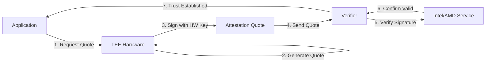
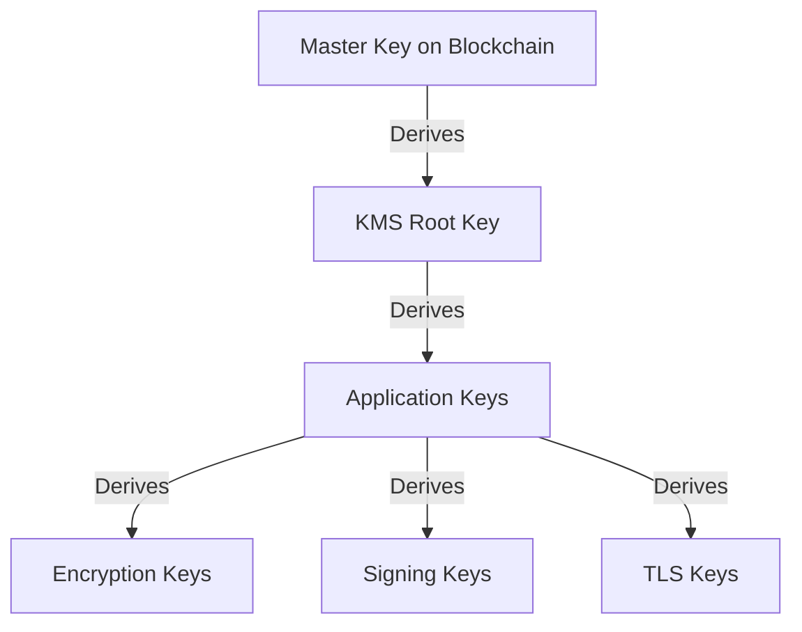
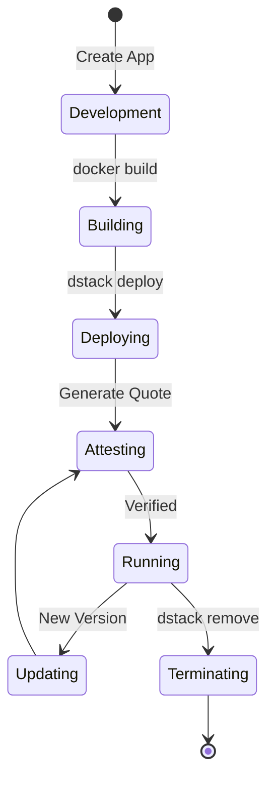

# Core Concepts Overview

Before diving into dstack's implementation details, it's important to understand the fundamental concepts that make secure application deployment possible. This page introduces the key ideas and terminology you'll encounter throughout the documentation.

## Trusted Execution Environments (TEEs)

At the heart of dstack is the concept of a Trusted Execution Environment - a secure area within a processor that ensures code and data loaded inside are protected.

<div className="bg-blue-50 p-6 rounded-lg my-4">
  <h3 className="font-semibold mb-3">What is a TEE?</h3>
  <p className="mb-3">
    A TEE is a hardware-based security feature that creates an isolated execution environment. Think of it as a secure vault within your computer where sensitive operations can happen without interference from the outside world.
  </p>
  <ul className="space-y-2">
    <li>• <strong>Hardware Isolation:</strong> Physical separation from the main system</li>
    <li>• <strong>Encrypted Memory:</strong> Data in memory is encrypted and inaccessible</li>
    <li>• <strong>Secure Boot:</strong> Only authorized code can run</li>
    <li>• <strong>Remote Attestation:</strong> Cryptographic proof of integrity</li>
  </ul>
</div>

### TEE Technologies

<table className="w-full my-4">
  <thead>
    <tr className="bg-gray-100">
      <th className="p-3 text-left">Technology</th>
      <th className="p-3 text-left">Vendor</th>
      <th className="p-3 text-left">Key Features</th>
      <th className="p-3 text-left">dstack Support</th>
    </tr>
  </thead>
  <tbody>
    <tr>
      <td className="p-3 font-semibold">Intel TDX</td>
      <td className="p-3">Intel</td>
      <td className="p-3">VM-level isolation, scalable</td>
      <td className="p-3 text-green-600">✓ Supported</td>
    </tr>
    <tr className="bg-gray-50">
      <td className="p-3 font-semibold">AMD SEV-SNP</td>
      <td className="p-3">AMD</td>
      <td className="p-3">VM encryption, memory integrity</td>
      <td className="p-3 text-yellow-600">Coming Soon</td>
    </tr>
    <tr>
      <td className="p-3 font-semibold">Intel SGX</td>
      <td className="p-3">Intel</td>
      <td className="p-3">Application enclaves, fine-grained</td>
      <td className="p-3 text-green-600">✓ Via compatibility</td>
    </tr>
    <tr className="bg-gray-50">
      <td className="p-3 font-semibold">ARM CCA</td>
      <td className="p-3">ARM</td>
      <td className="p-3">Realm-based isolation</td>
      <td className="p-3 text-yellow-600">Planned</td>
    </tr>
  </tbody>
</table>

## Confidential Virtual Machines (CVMs)

dstack uses Confidential VMs as the deployment unit for applications.

### What is a CVM?

A CVM is a virtual machine that runs within a TEE, providing:

<div className="grid grid-cols-1 md:grid-cols-3 gap-4 my-6">
  <div className="border rounded-lg p-4">
    <div className="text-2xl mb-2">🔒</div>
    <h4 className="font-semibold">Isolation</h4>
    <p className="text-sm text-gray-600">
      Complete isolation from host OS and other VMs
    </p>
  </div>
  <div className="border rounded-lg p-4">
    <div className="text-2xl mb-2">🔐</div>
    <h4 className="font-semibold">Encryption</h4>
    <p className="text-sm text-gray-600">
      Memory and state encrypted by hardware
    </p>
  </div>
  <div className="border rounded-lg p-4">
    <div className="text-2xl mb-2">✓</div>
    <h4 className="font-semibold">Attestation</h4>
    <p className="text-sm text-gray-600">
      Verifiable proof of code and configuration
    </p>
  </div>
</div>

### CVM vs Traditional VMs

| Aspect | Traditional VM | Confidential VM |
|--------|----------------|-----------------|
| **Memory Protection** | Accessible to hypervisor | Encrypted, inaccessible |
| **Trust Model** | Trust the infrastructure | Zero trust |
| **Performance** | Native speed | ~5-10% overhead |
| **Use Cases** | General computing | Sensitive workloads |

## Remote Attestation

Remote attestation is the process of cryptographically proving that code is running unmodified in a genuine TEE.

### How Attestation Works



### Components of Attestation

<div className="bg-green-50 p-6 rounded-lg my-4">
  <h4 className="font-semibold mb-3">Attestation Quote Contains:</h4>
  <ul className="space-y-2">
    <li>• <strong>Measurements:</strong> Cryptographic hashes of code and configuration</li>
    <li>• <strong>Hardware Identity:</strong> Unique TEE hardware identifier</li>
    <li>• <strong>Security Version:</strong> Firmware and microcode versions</li>
    <li>• <strong>Runtime Data:</strong> Application-specific information</li>
    <li>• <strong>Signature:</strong> Hardware-based cryptographic signature</li>
  </ul>
</div>

## Decentralized Key Management

dstack uses a unique approach to key management that avoids vendor lock-in and single points of failure.

### Traditional vs dstack KMS

<div className="grid grid-cols-1 md:grid-cols-2 gap-6 my-6">
  <div className="bg-red-50 p-4 rounded-lg">
    <h4 className="font-semibold text-red-800 mb-2">Traditional KMS</h4>
    <ul className="space-y-1 text-sm">
      <li>• Centralized key storage</li>
      <li>• Vendor-specific APIs</li>
      <li>• Single point of failure</li>
      <li>• Lock-in to provider</li>
    </ul>
  </div>
  <div className="bg-green-50 p-4 rounded-lg">
    <h4 className="font-semibold text-green-800 mb-2">dstack KMS</h4>
    <ul className="space-y-1 text-sm">
      <li>• Decentralized via blockchain</li>
      <li>• Standard interfaces</li>
      <li>• No single point of failure</li>
      <li>• Portable across providers</li>
    </ul>
  </div>
</div>

### Key Hierarchy



## Zero Trust Security Model

dstack implements a zero trust architecture where nothing is trusted by default.

### Trust Boundaries

<div className="bg-gray-50 p-6 rounded-lg my-4">
  <h4 className="font-semibold mb-3">What We Don't Trust:</h4>
  <div className="grid grid-cols-2 gap-4">
    <ul className="space-y-1">
      <li>❌ Host operating system</li>
      <li>❌ Hypervisor (outside TEE)</li>
      <li>❌ Network infrastructure</li>
      <li>❌ Storage systems</li>
    </ul>
    <ul className="space-y-1">
      <li>❌ System administrators</li>
      <li>❌ Cloud providers</li>
      <li>❌ Physical access</li>
      <li>❌ Other applications</li>
    </ul>
  </div>
</div>

### What We Do Trust

- ✅ **TEE Hardware:** Verified through attestation
- ✅ **Cryptographic Proofs:** Mathematical guarantees
- ✅ **Open Source Code:** Auditable and verifiable
- ✅ **Blockchain Consensus:** Decentralized agreement

## Content Addressing

dstack uses content addressing to ensure code integrity and enable verification.

### How It Works

```python
# Example: Content addressing in dstack
docker_image = "myapp:latest"
image_hash = sha256(docker_image_content)
# Hash: sha256:abc123...

deployment = {
    "app_id": derive_from_hash(image_hash),
    "compose_hash": sha256(docker_compose_content),
    "verified": attestation_includes(image_hash)
}
```

### Benefits

- **Immutability:** Content cannot be changed without changing the address
- **Verification:** Anyone can verify content matches its address
- **Caching:** Content can be cached and verified anywhere
- **Deduplication:** Identical content has the same address

## Application Lifecycle

Understanding how applications move through their lifecycle in dstack:



### Lifecycle Stages

1. **Development:** Write code using familiar tools
2. **Building:** Create Docker containers
3. **Deploying:** Submit to dstack for CVM creation
4. **Attesting:** Hardware generates proof of integrity
5. **Running:** Application serves requests securely
6. **Updating:** Deploy new versions with zero downtime
7. **Terminating:** Clean shutdown and resource cleanup

## Networking Concepts

dstack implements secure networking at multiple levels:

### Network Isolation

<div className="bg-blue-50 p-4 rounded-lg my-4">
  <h4 className="font-semibold mb-2">Network Layers:</h4>
  <ol className="space-y-2">
    <li><strong>1. Public Internet:</strong> HTTPS traffic from users</li>
    <li><strong>2. Gateway Layer:</strong> TLS termination and routing</li>
    <li><strong>3. WireGuard VPN:</strong> Encrypted tunnels to CVMs</li>
    <li><strong>4. CVM Internal:</strong> Container-to-container communication</li>
  </ol>
</div>

### Domain Management

dstack supports flexible domain routing:

- **Automatic:** `app-name.your-domain.com`
- **Custom:** Any domain via DNS TXT records
- **Direct:** `cvm-id.internal` for debugging

## Blockchain Integration

dstack uses blockchain for decentralized governance and trust:

### Smart Contracts

| Contract | Purpose | Key Functions |
|----------|---------|---------------|
| **KmsAuth** | KMS authorization | Register, verify, revoke |
| **AppAuth** | Application auth | Whitelist, measurements |
| **Governance** | Platform updates | Propose, vote, execute |

### Why Blockchain?

- **Decentralization:** No single controlling entity
- **Transparency:** All actions are auditable
- **Immutability:** Records cannot be altered
- **Consensus:** Agreement without central authority

## Key Takeaways

<div className="grid grid-cols-1 md:grid-cols-2 gap-4 mt-8">
  <div className="bg-blue-50 p-6 rounded-lg">
    <h3 className="font-semibold mb-3">🎯 Core Principles</h3>
    <ul className="space-y-2 text-sm">
      <li>• Hardware-based security (TEEs)</li>
      <li>• Zero trust architecture</li>
      <li>• Decentralized key management</li>
      <li>• Verifiable execution (attestation)</li>
      <li>• Developer-friendly abstractions</li>
    </ul>
  </div>
  <div className="bg-green-50 p-6 rounded-lg">
    <h3 className="font-semibold mb-3">✅ What This Enables</h3>
    <ul className="space-y-2 text-sm">
      <li>• Process sensitive data safely</li>
      <li>• Prove code integrity to users</li>
      <li>• Avoid vendor lock-in</li>
      <li>• Meet compliance requirements</li>
      <li>• Build trust through transparency</li>
    </ul>
  </div>
</div>

## Next Steps

Now that you understand the core concepts:

<CardGroup cols={3}>
  <Card title="Architecture Deep Dive" icon="sitemap" href="/concepts/architecture">
    Explore system design
  </Card>
  <Card title="Security Model" icon="shield" href="/concepts/security-model">
    Understand security features
  </Card>
  <Card title="Start Building" icon="hammer" href="/getting-started/first-deployment">
    Deploy your first app
  </Card>
</CardGroup>

