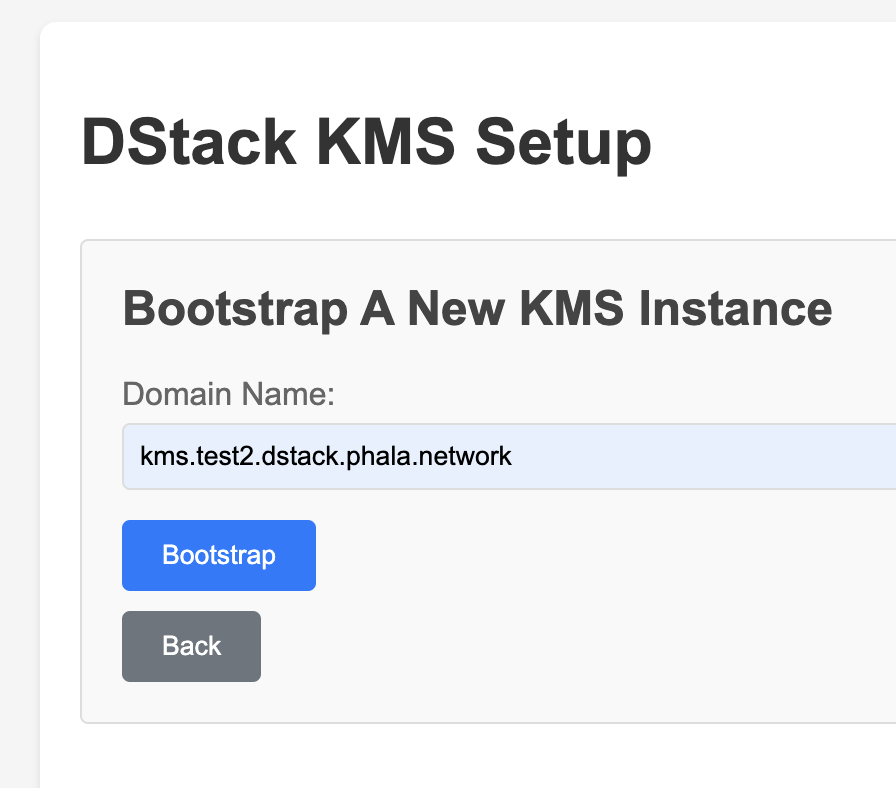
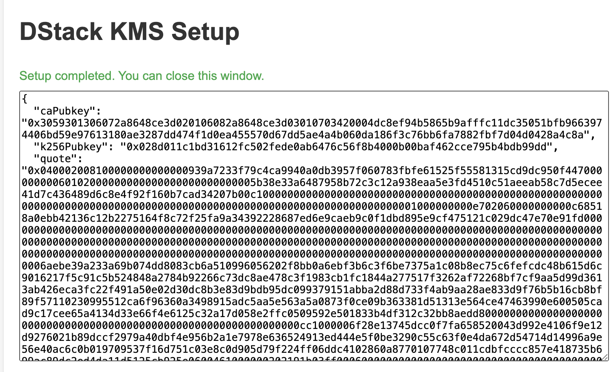
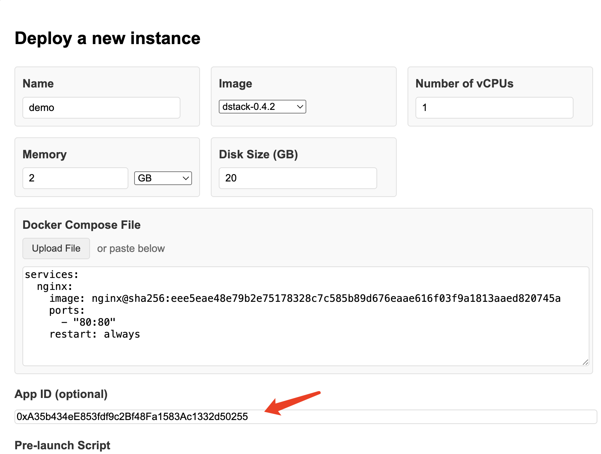
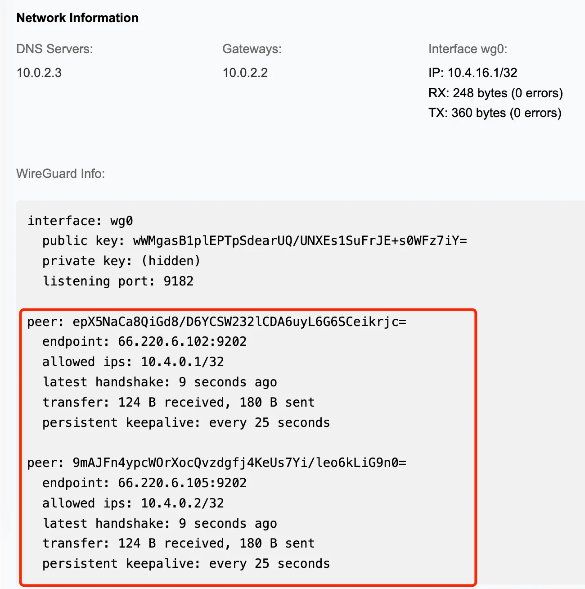

# Deploying dstack

This guide covers deploying dstack on bare metal TDX hosts.

## Overview

dstack can be deployed in two ways:

- **Dev Deployment**: All components run directly on the host. For local development and testing only - no security guarantees.
- **Production Deployment**: KMS and Gateway run as CVMs with hardware-rooted security. Uses auth server for authorization and OS image whitelisting. Required for any deployment where security matters.

## Prerequisites

**Hardware:**
- Bare metal TDX server ([setup guide](https://github.com/canonical/tdx))
- At least 16GB RAM, 100GB free disk space
- Public IPv4 address
- Optional: NVIDIA H100 or Blackwell GPU for [Confidential Computing](https://www.nvidia.com/en-us/data-center/solutions/confidential-computing/) workloads

**Network:**
- Domain with DNS access (for Gateway TLS)

> **Note:** See [Hardware Requirements](https://docs.phala.network/dstack/hardware-requirements) for server recommendations.

---

## Dev Deployment

This approach runs all components directly on the host for local development and testing.

> **Warning:** Dev deployment uses KMS in dev mode with no security guarantees. Do NOT use for production.

### Install Dependencies

```bash
# Ubuntu 24.04
sudo apt install -y build-essential chrpath diffstat lz4 wireguard-tools xorriso

# Install Rust
curl --proto '=https' --tlsv1.2 -sSf https://sh.rustup.rs | sh
```

### Build Configuration

```bash
git clone https://github.com/Dstack-TEE/meta-dstack.git --recursive
cd meta-dstack/
mkdir build && cd build
../build.sh hostcfg
```

Edit the generated `build-config.sh` for your environment. The minimal required changes are:

| Variable | Description |
|----------|-------------|
| `KMS_DOMAIN` | DNS domain for KMS RPC (e.g., `kms.example.com`) |
| `GATEWAY_DOMAIN` | DNS domain for Gateway RPC (e.g., `gateway.example.com`) |
| `GATEWAY_PUBLIC_DOMAIN` | Public base domain for app routing (e.g., `apps.example.com`) |

**TLS Certificates:**

The Gateway requires TLS certificates. Configure Certbot with Cloudflare:

```bash
CERTBOT_ENABLED=true
CF_API_TOKEN=<your-cloudflare-token>
```

The certificates will be obtained automatically via ACME DNS-01 challenge. The KMS auto-generates its own certificates during bootstrap.

Other variables like ports and CID pool settings have sensible defaults.

```bash
vim ./build-config.sh
../build.sh hostcfg
```

### Download Guest Image

```bash
../build.sh dl 0.5.5
```

### Run Components

Start in separate terminals:

1. **KMS**: `./dstack-kms -c kms.toml`
2. **Gateway**: `sudo ./dstack-gateway -c gateway.toml`
3. **VMM**: `./dstack-vmm -c vmm.toml`

> **Note:** This deployment uses KMS in dev mode without an auth server. For production deployments with proper security, see [Production Deployment](#production-deployment) below.

---

## Production Deployment

For production, deploy KMS and Gateway as CVMs with hardware-rooted security. Production deployments require:
- KMS running in a CVM (not on the host)
- Auth server for authorization (not dev mode)
- OS image whitelisting

For decentralized governance via smart contracts, see [On-Chain Governance](./onchain-governance.md).

### Production Checklist

**Required:**

1. Set up TDX host with dstack-vmm
2. Deploy KMS as CVM (with auth server + OS whitelist)
3. Deploy Gateway as CVM

**Optional Add-ons:**

4. [Zero Trust HTTPS](#4-zero-trust-https-optional)
5. [Certificate Transparency monitoring](#5-certificate-transparency-monitoring-optional)
6. [Multi-node deployment](#6-multi-node-deployment-optional)

---

### 1. Set Up TDX Host

Clone and build dstack-vmm:

```bash
git clone https://github.com/Dstack-TEE/dstack
cd dstack
cargo build --release -p dstack-vmm -p supervisor
mkdir -p vmm-data
cp target/release/dstack-vmm vmm-data/
cp target/release/supervisor vmm-data/
cd vmm-data/
```

Create `vmm.toml`:

```toml
address = "unix:./vmm.sock"
reuse = true
image_path = "./images"
run_path = "./run/vm"

[cvm]
kms_urls = []
gateway_urls = []
cid_start = 30000
cid_pool_size = 1000

[cvm.port_mapping]
enabled = true
address = "127.0.0.1"
range = [
    { protocol = "tcp", from = 1, to = 20000 },
    { protocol = "udp", from = 1, to = 20000 },
]

[host_api]
port = 9300
```

Download guest images from [meta-dstack releases](https://github.com/Dstack-TEE/meta-dstack/releases) and extract to `./images/`.

> For reproducible builds and verification, see [Security Guide](./security.md).

Start VMM:

```bash
./dstack-vmm -c vmm.toml
```

---

### 2. Deploy KMS as CVM

Production KMS requires three components running together:
- **KMS**: The key management service inside a CVM
- **auth-api**: Webhook server that validates requests against smart contracts
- **Ethereum RPC**: Access to the blockchain (via light client or external RPC)

#### Prerequisites: Deploy DstackKms Contract

Before deploying KMS, you need a DstackKms contract on an Ethereum-compatible network:

```bash
cd dstack/kms/auth-eth
npm install
npx hardhat compile
PRIVATE_KEY=<your-key> npx hardhat kms:deploy --with-app-impl --network <network>
```

Note the deployed contract address (e.g., `0xFE6C45aE66344CAEF5E5D7e2cbD476286D651875`).

#### Deploy KMS CVM

```bash
cd dstack/kms/dstack-app/
./deploy-to-vmm.sh
```

Edit the generated `.env` file:

```bash
# VMM connection
VMM_RPC=unix:../../vmm-data/vmm.sock

# Network configuration
KMS_RPC_ADDR=0.0.0.0:9201
GUEST_AGENT_ADDR=127.0.0.1:9205

# Auth server configuration (required for production)
KMS_CONTRACT_ADDR=0xFE6C45aE66344CAEF5E5D7e2cbD476286D651875
ETH_RPC_URL=https://rpc.phala.network

# OS image verification
OS_IMAGE=dstack-0.5.5
IMAGE_DOWNLOAD_URL=https://github.com/Dstack-TEE/meta-dstack/releases/download/v{version}/dstack-{version}.tar.gz

# Build reference
GIT_REV=HEAD
```

The compose file (`docker-compose.yaml`) includes:
- **auth-api**: Connects to the smart contract via `ETH_RPC_URL`
- **kms**: Configured with webhook auth mode pointing to auth-api

Run the script again to deploy:

```bash
./deploy-to-vmm.sh
```

Monitor startup:

```bash
tail -f ../../vmm-data/run/vm/<vm-id>/serial.log
```

Wait for `[  OK  ] Finished App Compose Service.`

#### Bootstrap KMS

Open `http://127.0.0.1:9201/` in your browser.

1. Click **Bootstrap**
2. Enter the domain for your KMS (e.g., `kms.example.com`)
3. Click **Finish setup**



The KMS will display its public key and TDX quote:



#### Whitelist OS Image

The OS image hash must be whitelisted in the DstackKms contract before apps can run:

```bash
cd dstack/kms/auth-eth
npx hardhat kms:add-image --network <network> 0x<os-image-hash>
```

The `os_image_hash` is in the `digest.txt` file from the [meta-dstack release](https://github.com/Dstack-TEE/meta-dstack/releases).

For detailed smart contract operations, see [On-Chain Governance](./onchain-governance.md).

---

### 3. Deploy Gateway as CVM

The Gateway must be registered as an app in the DstackKms contract before deployment.

#### Register Gateway App

```bash
cd dstack/kms/auth-eth
npx hardhat kms:create-app --network <network> --allow-any-device
```

Note the App ID from output (e.g., `0x32467b43BFa67273FC7dDda0999Ee9A12F2AaA08`).

Set it as the gateway app in the KMS contract:

```bash
npx hardhat kms:set-gateway --network <network> <app-id>
```

#### Deploy Gateway CVM

```bash
cd dstack/gateway/dstack-app/
./deploy-to-vmm.sh
```

Edit `.env`:

```bash
# VMM connection
VMM_RPC=unix:../../vmm-data/vmm.sock

# Cloudflare (for DNS-01 ACME challenge)
CF_API_TOKEN=your_cloudflare_api_token

# Domain configuration
SRV_DOMAIN=example.com
PUBLIC_IP=$(curl -s ifconfig.me)

# Gateway app ID (from registration above)
GATEWAY_APP_ID=0x32467b43BFa67273FC7dDda0999Ee9A12F2AaA08

# Gateway URLs
MY_URL=https://gateway.example.com:9202
BOOTNODE_URL=https://gateway.example.com:9202

# Other settings
ACME_STAGING=no  # Set to 'yes' for testing
OS_IMAGE=dstack-0.5.5
```

Run the script again - it will show the compose hash:

```bash
./deploy-to-vmm.sh
# Output: Compose hash: 0x700a50336df7c07c82457b116e144f526c29f6d8...
```

**Before pressing 'y'**, whitelist the compose hash:

```bash
cd ../../kms/auth-eth
npx hardhat app:add-hash --network <network> --app-id <gateway-app-id> 0x<compose-hash>
```

Then return and confirm deployment.

#### Update VMM Configuration

After Gateway is running, update `vmm.toml` with KMS and Gateway URLs:

```toml
[cvm]
kms_urls = ["https://kms.example.com:9201"]
gateway_urls = ["https://gateway.example.com:9202"]
```

Restart dstack-vmm to apply changes.

---

### 4. Zero Trust HTTPS (Optional)

Generate TLS certificates inside the TEE with automatic CAA record management.

Configure in `build-config.sh`:

```bash
GATEWAY_CERT=${CERBOT_WORKDIR}/live/cert.pem
GATEWAY_KEY=${CERBOT_WORKDIR}/live/key.pem
CF_API_TOKEN=<your-cloudflare-token>
ACME_URL=https://acme-v02.api.letsencrypt.org/directory
```

Run certbot:

```bash
RUST_LOG=info,certbot=debug ./certbot renew -c certbot.toml
```

This will:
- Create an ACME account
- Set CAA DNS records on Cloudflare
- Request and auto-renew certificates

---

### 5. Certificate Transparency Monitoring (Optional)

Monitor for unauthorized certificates issued to your domain.

```bash
cargo build --release -p ct_monitor
./target/release/ct_monitor \
  --gateway-uri https://<gateway-domain> \
  --domain <your-domain>
```

**How it works:**
1. Fetches known public keys from Gateway (`/acme-info` endpoint)
2. Queries crt.sh for certificates issued to your domain
3. Verifies each certificate's public key matches the known keys
4. Logs errors (❌) when certificates are issued to unknown public keys

The monitor runs in a loop, checking every 60 seconds. Integrate with your alerting system by monitoring stderr for error messages.

---

### 6. Multi-Node Deployment (Optional)

Scale by adding VMM nodes pointing to your existing KMS and Gateway.

On each additional TDX host:
1. Set up dstack-vmm (see step 1)
2. Configure `vmm.toml` with existing KMS/Gateway URLs
3. Start VMM

```toml
[cvm]
kms_urls = ["https://kms.example.com:9201"]
gateway_urls = ["https://gateway.example.com:9202"]
```

---

## Deploying Apps

After setup, deploy apps via the VMM dashboard or CLI.

### Register App

Each app needs to be registered in the DstackKms contract:

```bash
cd dstack/kms/auth-eth
npx hardhat kms:create-app --network <network> --allow-any-device
```

Note the App ID from output. Then whitelist your compose hash:

```bash
npx hardhat app:add-hash --network <network> --app-id <app-id> 0x<compose-hash>
```

For detailed smart contract operations, see [On-Chain Governance](./onchain-governance.md).

### Deploy via UI

Open `http://localhost:9080`:



- Select the OS image
- Enter the App ID (from registration above)
- Upload your `docker-compose.yaml`

After startup, click **Dashboard** to view:



---

## Troubleshooting

### Error: vhost-vsock: unable to set guest cid: Address already in use

The CID range conflicts with existing VMs.

1. Find used CIDs: `ps aux | grep 'guest-cid='`
2. Update `vmm.toml`:
   ```toml
   [cvm]
   cid_start = 33000
   cid_pool_size = 1000
   ```

### Error: Operation not permitted when building guest image

Ubuntu 23.10+ restricts unprivileged user namespaces:

```bash
sudo sysctl kernel.apparmor_restrict_unprivileged_userns=0
```
