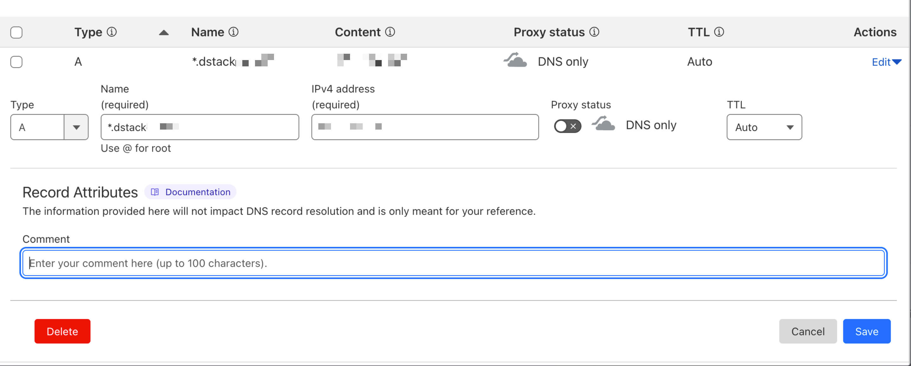

# Setup dstack-gateway for Production

> **This guide is for self-hosted deployments** on your own TDX hardware. For cloud deployments, see [Quickstart](./quickstart.md).

To set up dstack-gateway for production, you need a wildcard domain and SSL certificate.

## Step 1: Setup wildcard domain

Set up a second-level wildcard domain using Cloudflare; make sure to disable proxy mode and use **DNS Only**.



## Step 2: Request a Wildcard Domain SSL Certificate with Certbot

You need to get a Cloudflare API Key and ensure the API can manage this domain.

Open your `certbot.toml`, and update these fields:

- `acme_url`: change to `https://acme-v02.api.letsencrypt.org/directory`
- `cf_api_token`: Obtain from Cloudflare

## Step 3: Run Certbot Manually and Get First SSL Certificates

```shell
./certbot set-caa
./certbot renew
```

## Step 4: Update `gateway.toml`

Focus on these five fields in the `core.proxy` section:

- `cert_chain` & `cert_key`: Point to the certificate paths from the previous step
- `base_domain`: The wildcard domain for proxy
- `listen_addr` & `listen_port`: Listen to `0.0.0.0` and preferably `443` in production. If using another port, specify it in the URL

For example, if your base domain is `gateway.example.com`, app ID is `<app_id>`, listening on `80`, and dstack-gateway is on port 7777, the URL would be `https://<app_id>-80.gateway.example.com:7777`

### URL Format

The gateway supports the following URL format:
- `<app_id>[-<port>][<suffix>].<base_domain>`

Where:
- `<app_id>`: The application identifier
- `<port>`: Optional port number (defaults to 80 for HTTP, 443 for HTTPS)
- `<suffix>`: Optional suffix flags:
  - `s`: Enable TLS passthrough (proxy passes encrypted traffic directly to backend)
  - `g`: Enable HTTP/2 (gRPC) support (proxy advertises h2 via ALPN)

Examples:
- `<app_id>.gateway.example.com` - Default HTTP on port 80
- `<app_id>-8080.gateway.example.com` - HTTP on port 8080
- `<app_id>-s.gateway.example.com` - TLS passthrough on port 443
- `<app_id>-443s.gateway.example.com` - TLS passthrough on port 443
- `<app_id>-50051g.gateway.example.com` - HTTP/2/gRPC on port 50051

Note: The `s` and `g` suffixes cannot be used together

## Step 5: Adjust Configuration in `vmm.toml`

Open `vmm.toml` and adjust dstack-gateway configuration in the `gateway` section:

- `base_domain`: Same as `base_domain` from `gateway.toml`'s `core.proxy` section
- `port`: Same as `listen_port` from `gateway.toml`'s `core.proxy` section

## Admin API authentication

The gateway exposes a separate admin API (used for sync, WireGuard peer management, and other operator RPCs). Configure it in the `core.admin` section of `gateway.toml`:

```toml
[core.admin]
enabled = true
address = "0.0.0.0:9016"
# generate with: openssl rand -hex 32
admin_token = "<paste output of: openssl rand -hex 32>"
# alternatively, an Apache bcrypt htpasswd file (htpasswd -B -c admin.htpasswd admin)
# htpasswd_file = "/etc/dstack/gateway-admin.htpasswd"
insecure_no_auth = false
```

- `enabled`: enable the admin API server.
- `address`: bind address/port for the admin API.
- `admin_token`: shared admin token. It can also be supplied via the environment variables `DSTACK_GATEWAY_ADMIN_TOKEN` or `ADMIN_API_TOKEN` instead of the config file.
- `htpasswd_file`: path to an Apache bcrypt htpasswd file (create with `htpasswd -B -c admin.htpasswd admin`); only bcrypt entries are accepted. Can be used instead of, or alongside, `admin_token`.
- `insecure_no_auth`: development-only escape hatch that disables admin authentication. Never enable it on a network-reachable admin interface.

The admin server is fail-closed: if it is enabled with no `admin_token` and no `htpasswd_file`, and `insecure_no_auth` is `false`, it refuses to start rather than exposing an unauthenticated admin API.

Clients authenticate by sending `Authorization: Bearer <token>` or the `X-Admin-Token: <token>` header.

## Metrics

The admin server exposes Prometheus metrics at `GET /metrics`. It is part of the
admin API, so it requires the same credentials and is only reachable when
`core.admin.enabled` is true — the series name domains, node ids and instance
counts, which is topology that should not be readable without authentication.

```yaml
scrape_configs:
  - job_name: dstack-gateway
    static_configs:
      - targets: ["127.0.0.1:8011"]
    authorization:
      credentials: "<the admin token>"
```

Series worth alerting on:

| Metric | Why |
|---|---|
| `dstack_gateway_wg_syncconf_failures_total` | `wg syncconf` rejects the whole config file when one peer stanza is bad, so a non-zero rate means routing updates have stopped reaching the data plane while the gateway still looks healthy. |
| `dstack_gateway_kv_decode_failures_total` | A replicated record that fails to decode is skipped, which makes the CVM behind it silently unroutable. Labelled by key prefix. |
| `dstack_gateway_kv_peer_buffered_logs` | Entries still buffered for a peer. Sustained growth means that peer stopped acknowledging and the two nodes are drifting apart. |
| `dstack_gateway_cert_not_after_seconds` | Certificate expiry per domain; alert on `- time()` falling under the renewal window. |
| `dstack_gateway_kv_persist_failures_total` | Periodic snapshots are failing, so a restart replays a growing WAL. |
