> We've come a long way from the first steps of installing dstack. Now, let's deploy your first application.

> If you already have access to a dstack host (for example, someone else has installed and set up the hardware and dstack runtime for you), you can deploy your application directly to their dstack instance.  
>  
> If you need to review or complete the installation and setup steps for your own dstack host, go back to the previous section: [Step 4 – Install dstack Runtime](/docs/getting-started/install/step-4-install-dstack-runtime). That section covers the full dstack installation and build process before you reach this deployment guide.

## 4 – Deploy Your First Application
| Phase                | Description |
| -------------------- | -------------------------------------------------------------------------------------- |
| Configure Container | 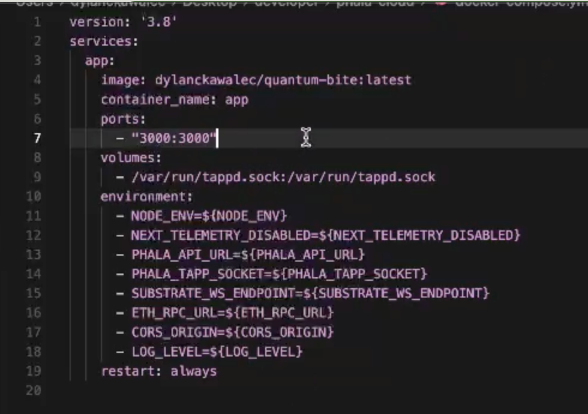 [Select container image and configure exposed ports](./install/step-install-guide/step13.png) |
| Basic Settings | 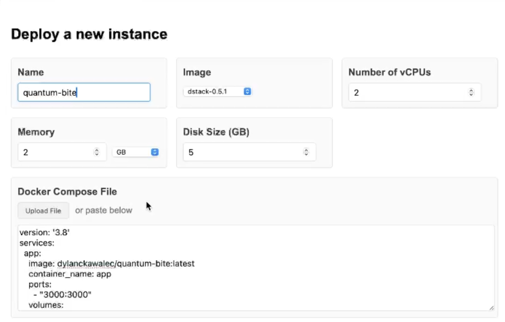 [Set application name and deployment type](./install/step-install-guide/step14.png) |
| Environment Security | 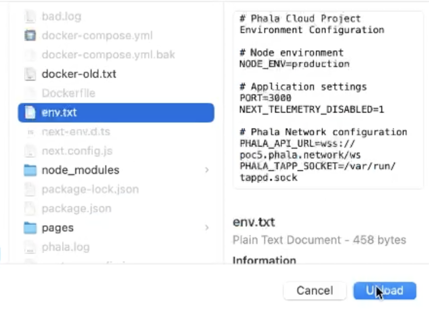 [Encrypt sensitive environment variables](./install/step-install-guide/step15.png) |
| Variable Review | 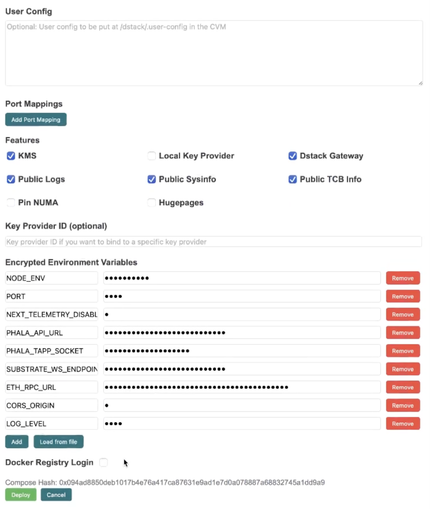 [Review and confirm environment configuration](./install/step-install-guide/step16.png) |
| Launch Application | 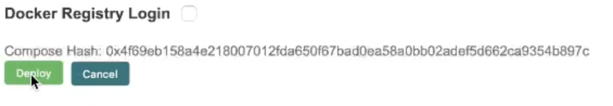 [Deploy application to dstack infrastructure](./install/step-install-guide/step17.png) |
| Deployment Status | 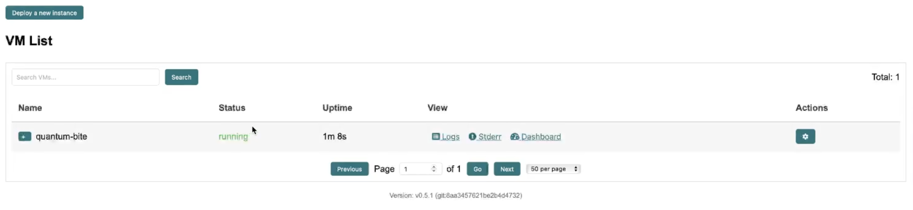 [Verify application appears in deployment list](./install/step-install-guide/step18.png) |

---

## 5 – Gateway Troubleshooting

| Check              | Description |
| ------------------ | -------------------------------------------------------------------------------------- |
| Environment Whitelist | 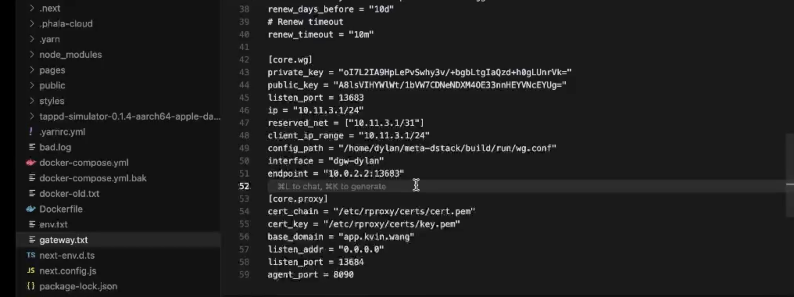 [Verify domain whitelist configuration in `.env` file](./install/step-install-guide/step19.png) |
| Gateway Configuration | 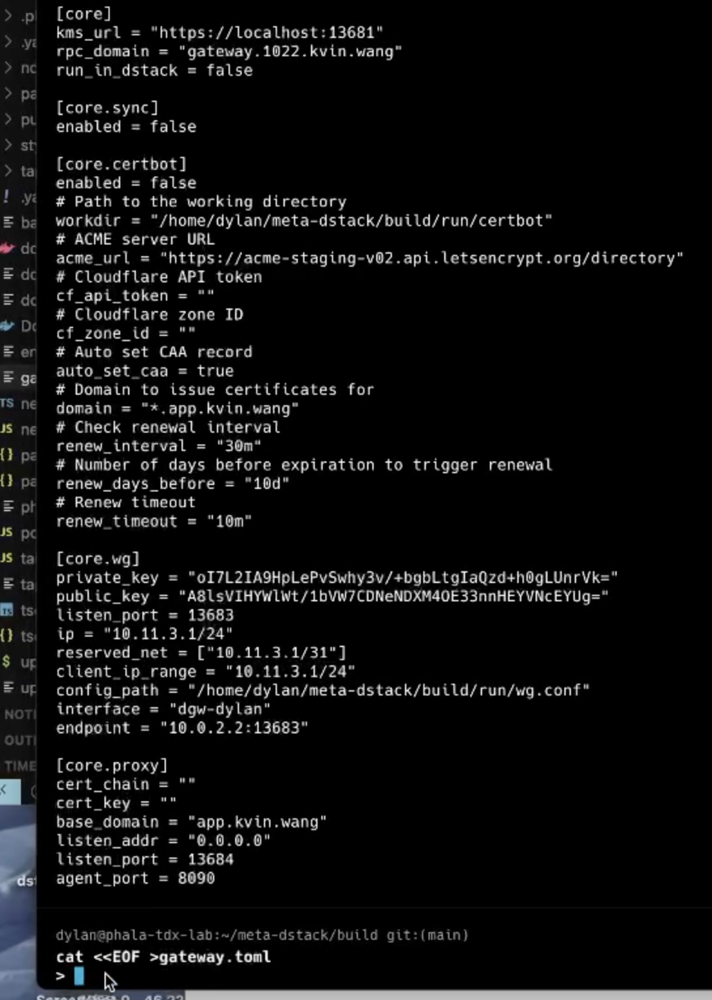 [Update gateway settings in `gateway.toml` configuration](./install/step-install-guide/step20.png) |
| Application Status | 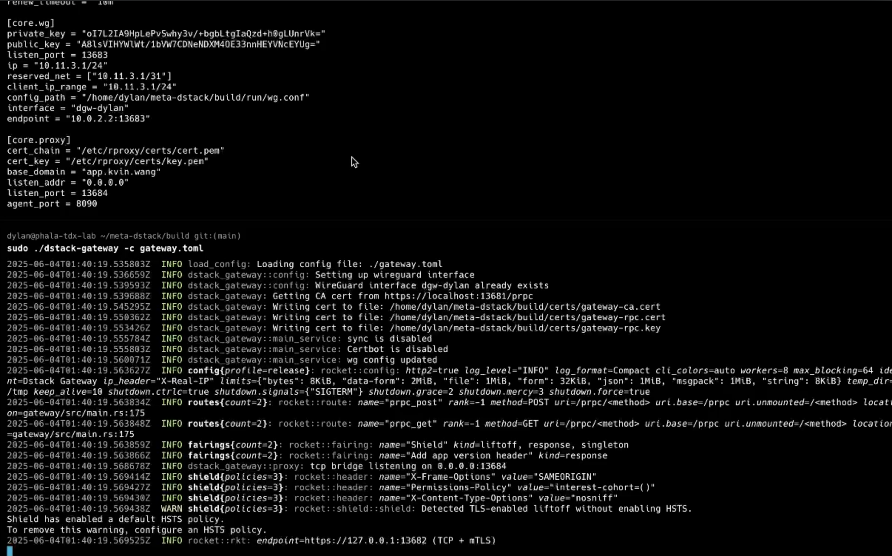 [Monitor application logs after gateway restart](./install/step-install-guide/step22.png) |

---

## 6 – Verify & Explore

| Verify          | Description |
| --------------- | ----------------------------------------------------------------------------------------------------- |
| VMM Status | 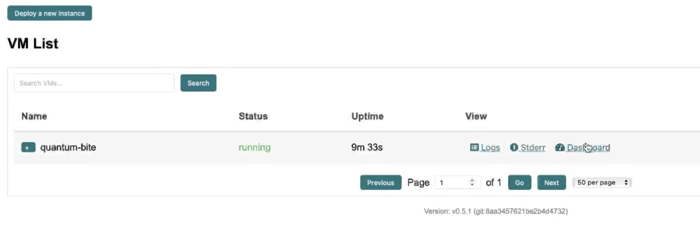 [Confirm application status in VMM dashboard](./install/step-install-guide/step23.png) |
| System Logs | 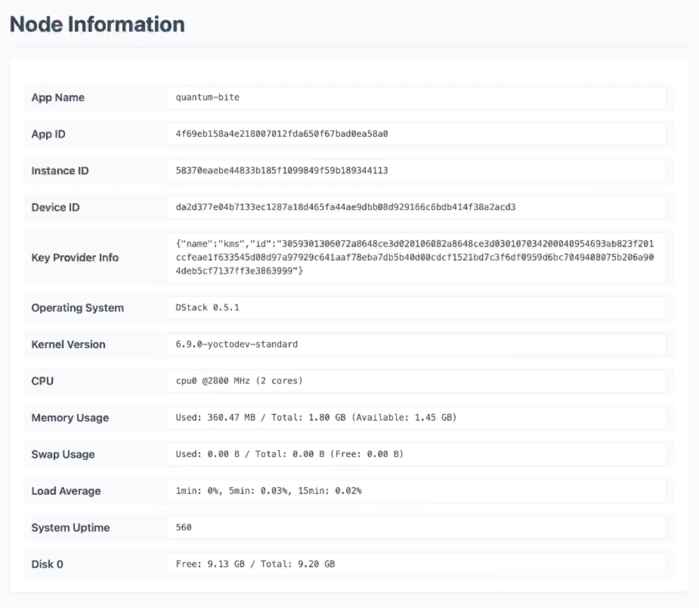 [Review node and application logging output](./install/step-install-guide/step24.png) |
| Live Monitoring | 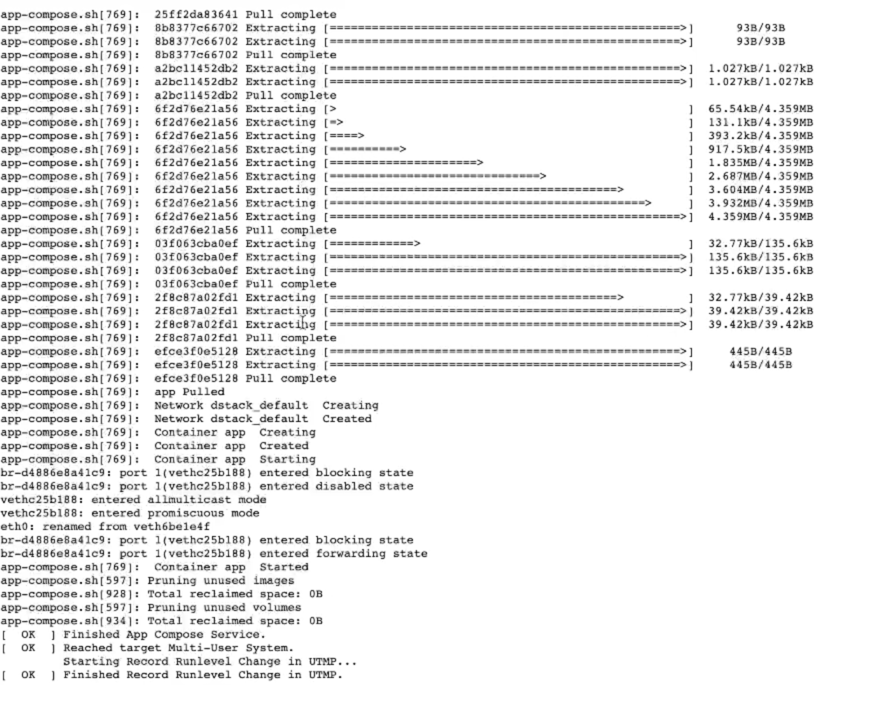 [Watch real-time application logs](./install/step-install-guide/step25.logs.png) |
| Access Check | 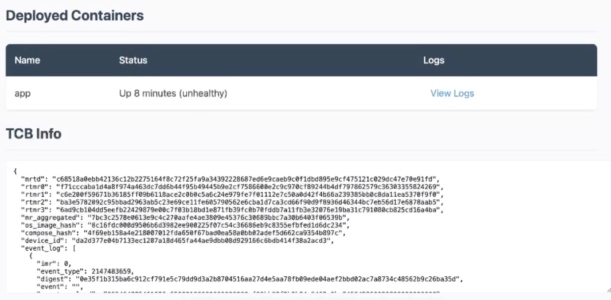 [Test application endpoint accessibility](./install/step-install-guide/step26.png) |
| Final Validation | 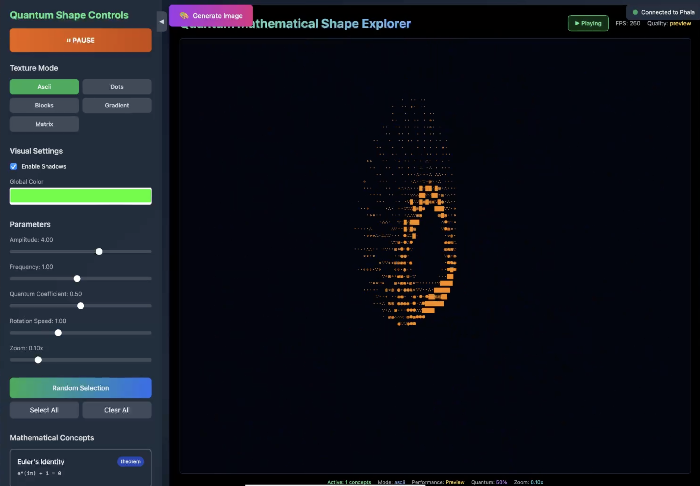 [Verify application renders correctly](./install/step-install-guide/step28.png) |
