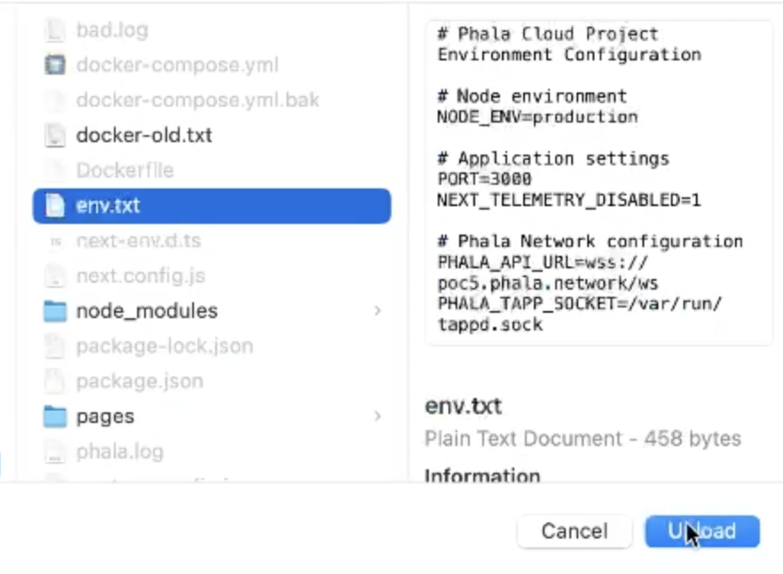
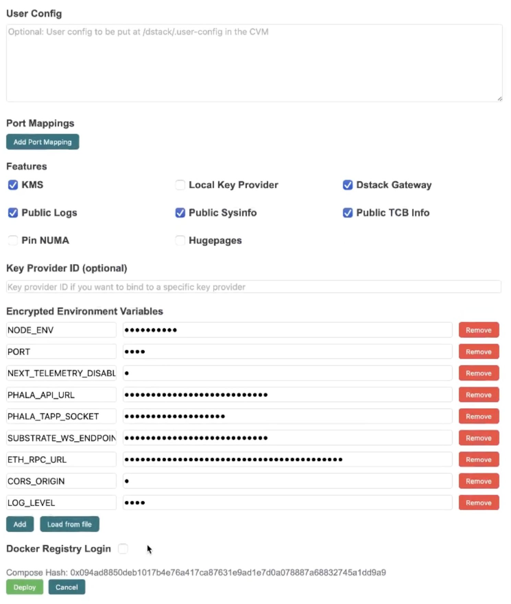
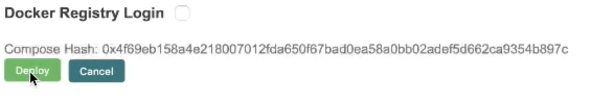
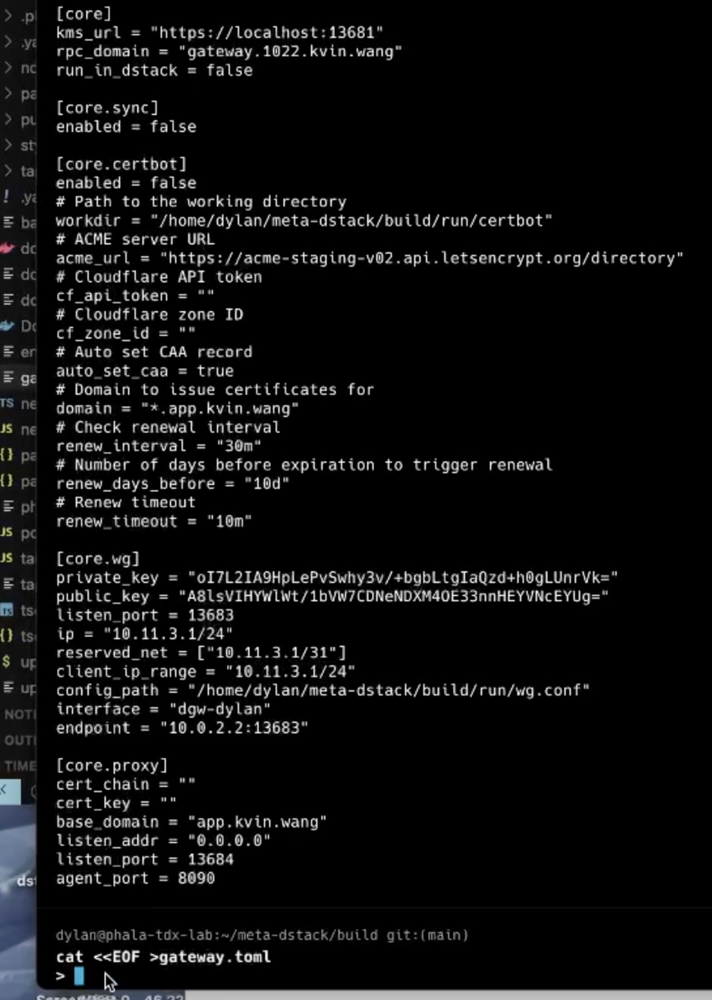
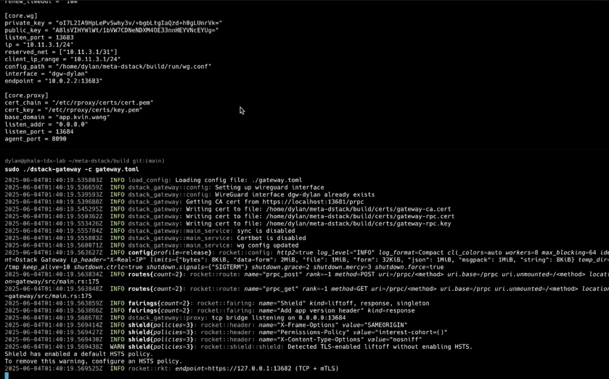
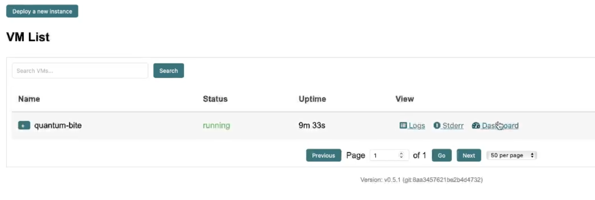
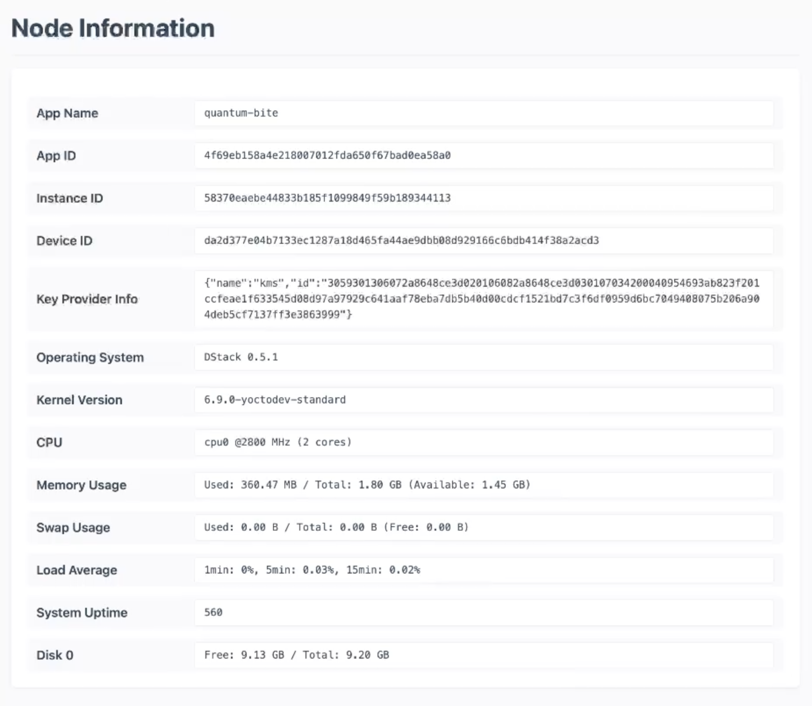

# Step 4: Install dstack Runtime

To install dstack, follow the latest instructions in the [official dstack README](https://github.com/Dstack-TEE/dstack/blob/master/README.md).

## Quick Start

### Prerequisites

- Bare metal Intel TDX server ([setup guide](https://github.com/canonical/tdx))
- Public IPv4 address
- 16GB+ RAM, 100GB+ disk
- Domain with DNS access (for HTTPS via dstack-gateway)

> **Note:** For hardware requirements and cloud deployment, see [Dstack Hardware Requirements](https://docs.phala.network/dstack/hardware-requirements) and [Phala Cloud Getting Started](https://docs.phala.network/phala-cloud/getting-started/sign-up-for-cloud-account).

# Build and play locally

## Installation Guide Screenshots

Below are all the step-by-step screenshots for the installation process. Follow them in order for a visual reference.

## Step 1: SSH into Your Server

| Step | Image |
|------|-------|
| ssh into your console  |  |
| Sign for fingerprint   |  |
| Install Wireguard   |  |

## Step 2: Terminal Commands for Deployment

| Step   | Image |
|--------|-------|
| Install Rustup Crates   |  |
|    |  |
| Git install the `meta-dstack`   |  |
| Make a Build config   |  |

## Step 3: Continue Deployment Steps

| Step | Image |
|------|-------|
| Build the host config using `$ ./build.sh hostcfg` script  |  |
| Build the `dl` at the domain address   |  |
| Build the guest agent for gateway access   |  |

## Step 4: Additional Setup Steps

| Step | Image |
|------|-------|
| Start the dstack `kms`  |  |
| Run the gateway instance |  |
| 11   |  |
| 12.0 |  |
| 12.1 |  |
| 12.2 |  |

## Step 5: Finalize Deployment

| Step | Image |
|------|-------|
| 13   |  |
| 14   |  |
| 15   |  |
| 16   |  |
| 17   |  |
| 18   |  |
| 19   |  |
| 20   |  |
| 21   |  |
| 22   |  |
| 23   |  |
| 24   |  |
| 25   |  |
| 26   |  |
| 27   |  |
| 28   |  |

