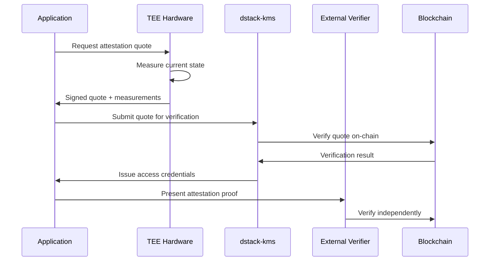
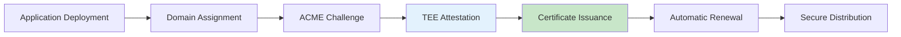
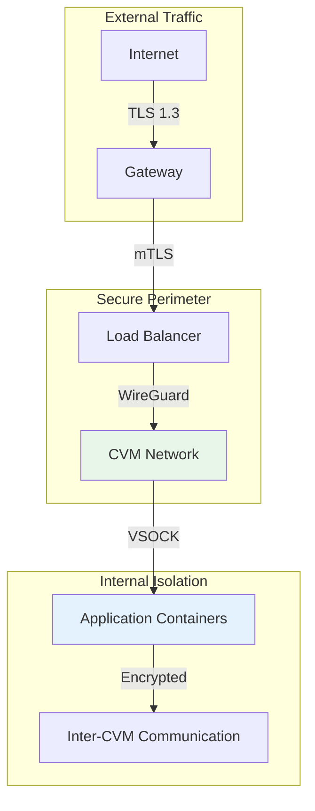

# Key Features

<page_summary>
This document provides a comprehensive examination of dstack's key features, analyzing how each capability contributes to the platform's mission of democratizing confidential computing. Beyond simple feature enumeration, we explore the technical implementation details, architectural decisions, and real-world implications of each capability. The features are presented in a hierarchical structure that reflects their interdependencies and collective contribution to the platform's security posture.
</page_summary>

<smoothly_flowing_prose_paragraphs>
The feature set of a confidential computing platform must balance seemingly contradictory requirements: providing robust security guarantees while maintaining operational simplicity, enabling hardware-level isolation while supporting flexible deployment patterns, and enforcing cryptographic verification while preserving performance. dstack's features represent careful engineering decisions that navigate these tensions, creating a cohesive platform that serves both security requirements and developer productivity.

Each feature in dstack builds upon foundational security primitives provided by hardware TEEs, extending them with practical capabilities required for production deployments. The platform's innovation lies not in individual features but in their integration—creating emergent properties that exceed the sum of their parts.
</smoothly_flowing_prose_paragraphs>

## Core Security Features

### 1. Hardware-Enforced Isolation

<Note>
Hardware isolation forms the bedrock of dstack's security model, providing guarantees that cannot be circumvented by software attacks.
</Note>

<smoothly_flowing_prose_paragraphs>
Traditional virtualization provides logical isolation between workloads, but privileged software (hypervisors, host OS) retains the ability to access guest memory. dstack leverages processor extensions that encrypt memory at the hardware level, making it cryptographically impossible for even privileged software to access protected data.
</smoothly_flowing_prose_paragraphs>

#### Technical Implementation

```rust
// Simplified representation of hardware isolation enforcement
pub struct IsolatedExecution {
    // Hardware-encrypted memory region
    encrypted_memory: EncryptedMemoryRegion,
    // Processor-managed encryption keys
    memory_encryption_key: HardwareKey,
    // Attestation measurements
    measurements: TrustedMeasurements,
}

impl IsolatedExecution {
    pub fn execute<T>(&self, computation: impl Fn() -> T) -> SecureResult<T> {
        // 1. Switch to encrypted memory context
        self.enter_secure_context()?;
        
        // 2. Execute computation with hardware protection
        let result = self.with_memory_encryption(|| {
            computation()
        });
        
        // 3. Generate attestation of execution
        let attestation = self.generate_attestation(&result)?;
        
        Ok(SecureResult { result, attestation })
    }
}
```

#### Security Guarantees

| Property | Guarantee | Mechanism |
|----------|-----------|-----------|
| Memory Confidentiality | AES-256 encryption | Hardware memory controller |
| Access Control | Cryptographic isolation | CPU access checks |
| Side-Channel Resistance | Reduced attack surface | Hardware mitigations |
| Physical Attack Protection | Memory bus encryption | On-die encryption engine |

### 2. Remote Attestation

<smoothly_flowing_prose_paragraphs>
Remote attestation provides cryptographic proof of the execution environment's state, enabling external parties to verify that applications run in genuine TEEs with expected configurations. dstack extends basic attestation with a comprehensive verification framework that simplifies integration while maintaining security properties.
</smoothly_flowing_prose_paragraphs>

#### Attestation Architecture



#### Attestation Components

<div className="grid grid-cols-1 md:grid-cols-2 gap-4 my-6">
  <div className="bg-blue-50 p-4 rounded-lg">
    <h4 className="font-semibold text-blue-900 mb-2">Quote Generation</h4>
    <p className="text-sm">Hardware generates unforgeable quotes containing:</p>
    <ul className="text-sm mt-2 space-y-1">
      <li>• Software measurements (hashes)</li>
      <li>• Security version numbers</li>
      <li>• Platform configuration</li>
      <li>• Unique hardware identity</li>
    </ul>
  </div>
  <div className="bg-green-50 p-4 rounded-lg">
    <h4 className="font-semibold text-green-900 mb-2">Verification Process</h4>
    <p className="text-sm">Multi-stage verification ensures authenticity:</p>
    <ul className="text-sm mt-2 space-y-1">
      <li>• Signature verification</li>
      <li>• Certificate chain validation</li>
      <li>• Measurement comparison</li>
      <li>• Freshness checking</li>
    </ul>
  </div>
</div>

### 3. Zero-Code Modification Deployment

<Highlight>
Existing containerized applications deploy to dstack without modification, preserving development investments while gaining security benefits.
</Highlight>

<smoothly_flowing_prose_paragraphs>
One of dstack's most significant innovations is enabling secure deployment of unmodified applications. Traditional TEE platforms require extensive code changes to adapt applications for enclave constraints. dstack eliminates this barrier through sophisticated runtime adaptation that transparently handles the complexities of secure execution.
</smoothly_flowing_prose_paragraphs>

#### Transparent Security Injection

```yaml
# Standard docker-compose.yml works without changes
version: '3.8'
services:
  webapp:
    image: nginx:latest
    ports:
      - "80:80"
    volumes:
      - ./html:/usr/share/nginx/html

# dstack automatically adds security layers:
# - Memory encryption
# - Network isolation  
# - Attestation generation
# - Secure key management
```

#### Runtime Adaptation Process

<Steps>
  <Step title="Container Analysis">
    dstack analyzes container requirements and dependencies
  </Step>
  <Step title="Security Policy Generation">
    Automatic creation of security policies based on container behavior
  </Step>
  <Step title="Runtime Injection">
    Security features injected at runtime without modifying container
  </Step>
  <Step title="Transparent Operation">
    Application runs normally while gaining TEE protection
  </Step>
</Steps>

## Platform Management Features

### 4. Decentralized Key Management

<smoothly_flowing_prose_paragraphs>
Cryptographic key management represents one of the most challenging aspects of secure systems. dstack's decentralized approach eliminates single points of failure while providing practical key lifecycle management. The integration with blockchain technology ensures that key operations are auditable and governed by consensus rather than central authority.
</smoothly_flowing_prose_paragraphs>

#### Key Management Architecture

```rust
// Decentralized key management implementation
pub struct DecentralizedKMS {
    // Local secure key storage
    local_keystore: SecureKeystore,
    // Blockchain integration
    blockchain: BlockchainClient,
    // Threshold cryptography
    threshold_scheme: ThresholdCrypto,
}

impl DecentralizedKMS {
    pub async fn provision_key(&self, policy: KeyPolicy) -> Result<KeyHandle> {
        // 1. Generate key shares using threshold cryptography
        let shares = self.threshold_scheme.generate_shares(
            policy.threshold,
            policy.total_shares
        )?;
        
        // 2. Distribute shares to TEE nodes
        let distribution = self.distribute_shares(shares).await?;
        
        // 3. Register on blockchain
        let tx = self.blockchain.register_key(KeyRegistration {
            policy: policy.clone(),
            distribution_proof: distribution.proof(),
            attestation: self.generate_attestation()?,
        }).await?;
        
        Ok(KeyHandle::new(tx.key_id))
    }
}
```

#### Key Management Features

| Feature | Implementation | Security Benefit |
|---------|----------------|------------------|
| Threshold Cryptography | k-of-n secret sharing | No single point of failure |
| Hardware-Backed Storage | TEE sealed storage | Keys never exist in plaintext |
| Blockchain Governance | Smart contract policies | Decentralized access control |
| Automatic Rotation | Policy-driven lifecycle | Reduced key exposure window |

### 5. Automated Certificate Management

<smoothly_flowing_prose_paragraphs>
The complexity of TLS certificate management often leads to security lapses in production systems. dstack automates the entire certificate lifecycle while maintaining security properties through integration with TEE attestation. This creates a unique capability: certificates that cryptographically prove they protect genuine secure endpoints.
</smoothly_flowing_prose_paragraphs>

#### Certificate Automation Pipeline



#### Implementation Details

<Tabs>
  <Tab title="Issuance">
    ```toml
    # Automatic certificate configuration
    [gateway.tls]
    provider = "letsencrypt"
    email = "admin@example.com"
    
    # Attestation-bound certificates
    [gateway.tls.attestation]
    required = true
    include_in_cert = true
    ```
  </Tab>
  <Tab title="Renewal">
    ```rust
    // Automated renewal with zero downtime
    async fn renew_certificate(&self) -> Result<()> {
        let new_cert = self.issue_certificate().await?;
        
        // Atomic certificate rotation
        self.gateway.rotate_certificate(new_cert).await?;
        
        // Update attestation bindings
        self.update_attestation_binding().await?;
        
        Ok(())
    }
    ```
  </Tab>
  <Tab title="Monitoring">
    ```yaml
    # Certificate monitoring and alerting
    alerts:
      - name: certificate_expiry
        condition: days_until_expiry < 30
        action: trigger_renewal
        
      - name: attestation_mismatch
        condition: cert_attestation != current_attestation
        action: reissue_certificate
    ```
  </Tab>
</Tabs>

### 6. Intuitive Web Dashboard

<Note>
Enterprise-grade security doesn't require command-line expertise. The dstack dashboard provides comprehensive visibility and control through an intuitive interface.
</Note>

<smoothly_flowing_prose_paragraphs>
The web dashboard represents dstack's commitment to operational accessibility. Built with modern web technologies and security best practices, it provides real-time visibility into the secure infrastructure while maintaining the principle of least privilege. Every dashboard action generates auditable attestations, ensuring that ease of use doesn't compromise security.
</smoothly_flowing_prose_paragraphs>

#### Dashboard Architecture

<div className="my-6">
  
</div>

#### Key Dashboard Features

<div className="grid grid-cols-1 md:grid-cols-3 gap-4 my-6">
  <div className="border rounded-lg p-4">
    <h4 className="font-semibold mb-2">🔍 Real-Time Monitoring</h4>
    <ul className="text-sm space-y-1">
      <li>• CVM health status</li>
      <li>• Resource utilization</li>
      <li>• Network topology</li>
      <li>• Security events</li>
    </ul>
  </div>
  <div className="border rounded-lg p-4">
    <h4 className="font-semibold mb-2">🚀 Deployment Management</h4>
    <ul className="text-sm space-y-1">
      <li>• Visual deployment flow</li>
      <li>• Policy configuration</li>
      <li>• Version control</li>
      <li>• Rollback capability</li>
    </ul>
  </div>
  <div className="border rounded-lg p-4">
    <h4 className="font-semibold mb-2">🔐 Security Controls</h4>
    <ul className="text-sm space-y-1">
      <li>• Attestation verification</li>
      <li>• Access control</li>
      <li>• Audit logs</li>
      <li>• Compliance reports</li>
    </ul>
  </div>
</div>

## Developer Experience Features

### 7. Language-Agnostic SDKs

<smoothly_flowing_prose_paragraphs>
While dstack enables zero-modification deployment, applications can achieve deeper integration through optional SDKs. These libraries provide idiomatic interfaces for attestation verification, secure communication, and policy enforcement across popular programming languages.
</smoothly_flowing_prose_paragraphs>

#### SDK Capabilities

```python
# Python SDK example
from dstack import SecureClient, AttestationPolicy

# Initialize client with automatic attestation
client = SecureClient(
    endpoint="https://api.example.com",
    policy=AttestationPolicy(
        min_tcb_level="current",
        required_measurements=["app_hash"],
        max_quote_age_seconds=300
    )
)

# All API calls automatically verify attestation
response = client.get("/sensitive-data")

# Access attestation details
print(f"Data protected by: {response.attestation.tee_type}")
print(f"Measurement: {response.attestation.measurements['app_hash']}")
```

#### Available SDKs

| Language | Package | Features |
|----------|---------|----------|
| Python | `dstack-sdk` | Async support, type hints, attestation helpers |
| JavaScript | `@dstack/sdk` | Promise-based, TypeScript definitions |
| Rust | `dstack` | Zero-copy attestation, async runtime |
| Go | `dstack-go` | Context-aware, concurrent verification |
| Java | `com.dstack.sdk` | Spring integration, annotation-based |

### 8. Secure Networking

<Highlight>
dstack implements defense-in-depth networking that combines encryption, authentication, and isolation at multiple layers.
</Highlight>

<smoothly_flowing_prose_paragraphs>
Network security in confidential computing extends beyond traditional encryption. dstack implements a multi-layered approach that ensures data protection in transit while maintaining performance and operational flexibility. The networking stack adapts to different deployment scenarios while preserving security properties.
</smoothly_flowing_prose_paragraphs>

#### Network Security Layers



#### Network Security Features

<div className="space-y-4 my-6">
  <div className="bg-gradient-to-r from-blue-50 to-blue-100 p-4 rounded-lg">
    <h4 className="font-semibold mb-2">End-to-End Encryption</h4>
    <p className="text-sm">All network traffic encrypted with forward secrecy, using hardware-accelerated cryptography where available.</p>
  </div>
  <div className="bg-gradient-to-r from-green-50 to-green-100 p-4 rounded-lg">
    <h4 className="font-semibold mb-2">Attestation-Based Authentication</h4>
    <p className="text-sm">Network peers must present valid attestation before establishing connections, preventing unauthorized access.</p>
  </div>
  <div className="bg-gradient-to-r from-purple-50 to-purple-100 p-4 rounded-lg">
    <h4 className="font-semibold mb-2">Micro-segmentation</h4>
    <p className="text-sm">Each CVM operates in its own network segment with granular access controls and traffic policies.</p>
  </div>
</div>

## Operational Excellence Features

### 9. High Availability

<smoothly_flowing_prose_paragraphs>
Production deployments demand resilience against failures. dstack's high availability features ensure that applications remain accessible even during hardware failures, network partitions, or maintenance operations. The platform achieves this while maintaining security properties—a significant technical challenge in confidential computing.
</smoothly_flowing_prose_paragraphs>

#### HA Architecture Components

| Component | HA Strategy | Security Preservation |
|-----------|-------------|----------------------|
| Control Plane | Multi-master with consensus | Attestation of all masters |
| Data Plane | Active-active CVMs | Synchronized attestation state |
| Key Management | Threshold cryptography | No single point of failure |
| Network Gateway | Anycast + health checks | Automatic failover with re-attestation |

### 10. Observability

<Note>
Monitoring secure systems requires balancing visibility with confidentiality. dstack provides comprehensive observability while preventing information leakage.
</Note>

#### Privacy-Preserving Metrics

```yaml
# Observability configuration with privacy controls
observability:
  metrics:
    # Aggregate metrics without exposing individual values
    aggregation_level: "cvm_group"
    
    # Differential privacy for sensitive metrics
    privacy_budget: 1.0
    noise_multiplier: 0.1
    
  logging:
    # Automatic redaction of sensitive data
    redact_patterns:
      - credit_card
      - ssn
      - api_key
      
    # Structured logging with security context
    include_attestation: true
    include_cvm_id: false  # Privacy protection
    
  tracing:
    # Distributed tracing with enclave boundaries
    propagate_context: true
    encrypt_spans: true
```

## Performance Optimization Features

### 11. Hardware Acceleration

<smoothly_flowing_prose_paragraphs>
The performance overhead of confidential computing can be significant without proper optimization. dstack leverages hardware acceleration features available in modern processors to minimize the performance impact of security features. This includes specialized instructions for cryptographic operations and optimized memory management for encrypted pages.
</smoothly_flowing_prose_paragraphs>

#### Acceleration Technologies

<div className="grid grid-cols-2 gap-4 my-6">
  <div className="bg-gray-50 p-4 rounded-lg">
    <h4 className="font-semibold mb-2">Cryptographic Acceleration</h4>
    <pre className="text-xs bg-white p-2 rounded mt-2">
AES-NI: 10x faster encryption
SHA Extensions: 4x faster hashing
RDRAND: Hardware RNG
RDSEED: True entropy source
    </pre>
  </div>
  <div className="bg-gray-50 p-4 rounded-lg">
    <h4 className="font-semibold mb-2">Memory Optimization</h4>
    <pre className="text-xs bg-white p-2 rounded mt-2">
Large Pages: Reduced TLB pressure
Page Pooling: Encrypted page reuse
Async I/O: Overlapped operations
Zero-copy: Eliminate redundant copies
    </pre>
  </div>
</div>

### 12. Elastic Scaling

<smoothly_flowing_prose_paragraphs>
Cloud-native applications require dynamic scaling based on load. dstack extends Kubernetes-style autoscaling to confidential workloads, ensuring that security properties are maintained during scale operations. This includes proper attestation of new instances and secure distribution of cryptographic materials.
</smoothly_flowing_prose_paragraphs>

#### Autoscaling Configuration

```yaml
# Secure autoscaling policy
apiVersion: autoscaling/v2
kind: HorizontalPodAutoscaler
metadata:
  name: secure-app-hpa
spec:
  scaleTargetRef:
    apiVersion: apps/v1
    kind: Deployment
    name: secure-app
  minReplicas: 2
  maxReplicas: 10
  metrics:
  - type: Resource
    resource:
      name: cpu
      target:
        type: Utilization
        averageUtilization: 70
  behavior:
    scaleUp:
      # Ensure attestation completes before traffic
      stabilizationWindowSeconds: 60
    scaleDown:
      # Graceful shutdown with key cleanup
      stabilizationWindowSeconds: 300
```

## Security Compliance Features

### 13. Audit Logging

<Highlight>
Comprehensive audit trails with cryptographic integrity protection ensure compliance with regulatory requirements while maintaining operational visibility.
</Highlight>

#### Audit Architecture

```rust
// Tamper-evident audit logging
pub struct SecureAuditLog {
    entries: Vec<AuditEntry>,
    merkle_tree: MerkleTree,
    blockchain_anchor: BlockchainClient,
}

impl SecureAuditLog {
    pub async fn log_event(&mut self, event: AuditEvent) -> Result<AuditProof> {
        // Create audit entry with attestation
        let entry = AuditEntry {
            timestamp: SystemTime::now(),
            event,
            attestation: self.generate_attestation()?,
            previous_hash: self.get_chain_head(),
        };
        
        // Update Merkle tree
        self.merkle_tree.insert(&entry);
        
        // Periodically anchor to blockchain
        if self.should_anchor() {
            let root = self.merkle_tree.root();
            self.blockchain_anchor.submit(root).await?;
        }
        
        Ok(self.generate_proof(&entry))
    }
}
```

### 14. Compliance Automation

<smoothly_flowing_prose_paragraphs>
Regulatory compliance in confidential computing requires demonstrable evidence of security controls. dstack automates compliance reporting by continuously collecting attestation evidence and generating audit-ready reports that prove adherence to security policies.
</smoothly_flowing_prose_paragraphs>

#### Supported Compliance Frameworks

| Framework | Automated Controls | Evidence Generation |
|-----------|-------------------|---------------------|
| GDPR | Data locality, encryption, access logs | Continuous attestation reports |
| HIPAA | PHI encryption, access controls | Audit trails with integrity proofs |
| PCI-DSS | Network segmentation, key management | Cryptographic evidence of isolation |
| SOC 2 | Security monitoring, incident response | Real-time compliance dashboard |

## Integration Features

### 15. CI/CD Pipeline Integration

<smoothly_flowing_prose_paragraphs>
Modern software development relies on automated deployment pipelines. dstack integrates seamlessly with existing CI/CD tools while adding security verification steps. This ensures that only authorized code runs in production TEEs, with cryptographic proof of the deployment process.
</smoothly_flowing_prose_paragraphs>

#### Pipeline Integration Example

```yaml
# GitLab CI/CD with dstack
stages:
  - build
  - test
  - security-scan
  - deploy-secure

deploy-to-tee:
  stage: deploy-secure
  script:
    # Build container with provenance
    - docker build -t $IMAGE_TAG .
    - docker push $IMAGE_TAG
    
    # Generate software bill of materials
    - syft $IMAGE_TAG -o json > sbom.json
    
    # Deploy with attestation verification
    - dstack deploy \
        --image $IMAGE_TAG \
        --sbom sbom.json \
        --policy production-policy.yaml \
        --verify-attestation \
        --require-approval
  environment:
    name: production-tee
    url: https://secure.example.com
```

## Conclusion

<smoothly_flowing_prose_paragraphs>
The features presented in this document represent a carefully orchestrated system designed to make confidential computing accessible without compromising security. Each capability builds upon hardware security primitives while addressing practical operational requirements. The true innovation of dstack lies not in any single feature but in their integration—creating a platform where security enhances rather than impedes productivity.

As the confidential computing landscape evolves, dstack's feature set will expand to address new use cases and security requirements. The platform's modular architecture ensures that new capabilities can be added while maintaining backward compatibility and security guarantees. This positions dstack as not just a current solution but a foundation for the future of secure computing.
</smoothly_flowing_prose_paragraphs>

## Feature Availability Matrix

<div className="overflow-x-auto my-6">
  <table className="min-w-full text-sm">
    <thead className="bg-gray-100">
      <tr>
        <th className="p-2 text-left">Feature</th>
        <th className="p-2 text-center">Community</th>
        <th className="p-2 text-center">Enterprise</th>
        <th className="p-2 text-center">Cloud</th>
      </tr>
    </thead>
    <tbody>
      <tr>
        <td className="p-2 border">Hardware Isolation</td>
        <td className="p-2 border text-center">✓</td>
        <td className="p-2 border text-center">✓</td>
        <td className="p-2 border text-center">✓</td>
      </tr>
      <tr className="bg-gray-50">
        <td className="p-2 border">Remote Attestation</td>
        <td className="p-2 border text-center">✓</td>
        <td className="p-2 border text-center">✓</td>
        <td className="p-2 border text-center">✓</td>
      </tr>
      <tr>
        <td className="p-2 border">Web Dashboard</td>
        <td className="p-2 border text-center">Basic</td>
        <td className="p-2 border text-center">Advanced</td>
        <td className="p-2 border text-center">Full</td>
      </tr>
      <tr className="bg-gray-50">
        <td className="p-2 border">High Availability</td>
        <td className="p-2 border text-center">-</td>
        <td className="p-2 border text-center">✓</td>
        <td className="p-2 border text-center">✓</td>
      </tr>
      <tr>
        <td className="p-2 border">Enterprise Support</td>
        <td className="p-2 border text-center">-</td>
        <td className="p-2 border text-center">✓</td>
        <td className="p-2 border text-center">✓</td>
      </tr>
    </tbody>
  </table>
</div>

## Ready to Experience These Features?

<div className="mt-8 flex gap-4">
  <a href="/docs/getting-started/installation" className="bg-blue-600 text-white px-6 py-3 rounded-lg hover:bg-blue-700">
    Get Started →
  </a>
  <a href="/docs/concepts/architecture" className="bg-gray-200 text-gray-800 px-6 py-3 rounded-lg hover:bg-gray-300">
    Architecture Overview
  </a>
</div> 