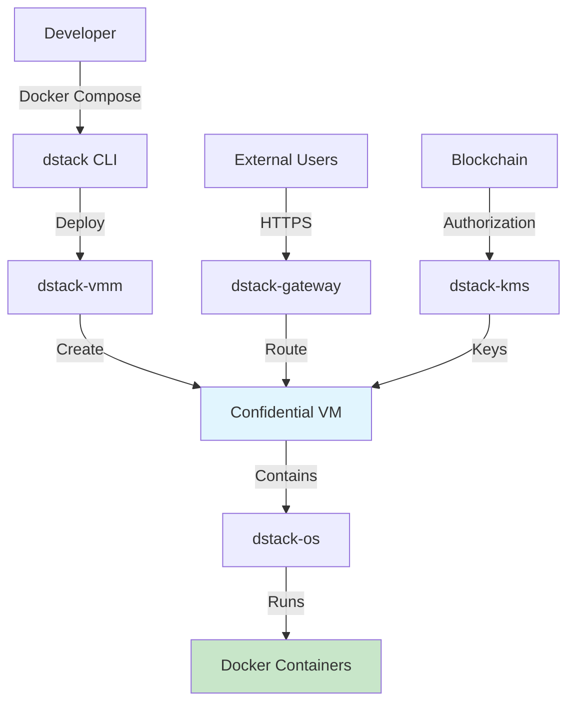

# What is dstack?

dstack is an open-source platform that simplifies the deployment of containerized applications to Trusted Execution Environments (TEEs), specifically using Confidential VMs (CVMs). It bridges the gap between traditional application development and secure computing, making TEE technology accessible to developers without requiring deep expertise in hardware security.

## The Problem dstack Solves

In today's digital landscape, protecting sensitive data and ensuring computational integrity is paramount. However, deploying applications to secure hardware environments like TEEs has traditionally been complex, requiring:

- Deep understanding of hardware security features
- Complex configuration and setup procedures
- Significant code modifications
- Vendor-specific implementations that create lock-in

dstack eliminates these barriers by providing a developer-friendly abstraction layer that works with familiar tools and workflows.

## How dstack Works

dstack takes your existing Docker containers and runs them securely within Confidential Virtual Machines (CVMs) powered by Intel TDX technology. Here's the simplified flow:

  

    

      

        

          1
        

        

          <h4 className="font-semibold">Package Your Application</h4>
          
Use standard Docker containers and docker-compose.yml files

        

      

      

        

          2
        

        

          <h4 className="font-semibold">Deploy with dstack</h4>
          
dstack converts your container to a secure CVM image

        

      

      

        

          3
        

        

          <h4 className="font-semibold">Run Securely</h4>
          
Your application runs in a hardware-isolated environment with encrypted memory

        

      

      

        

          4
        

        

          <h4 className="font-semibold">Verify & Attest</h4>
          
Remote attestation proves your code is running unmodified in a genuine TEE

        

      

    

  

## Key Components

dstack consists of several core components that work together:

| Component | Purpose |
|-----------|---------|
| **dstack-vmm** | Manages the lifecycle of Confidential VMs |
| **dstack-gateway** | Handles secure HTTPS routing and TLS termination |
| **dstack-kms** | Manages encryption keys with blockchain integration |
| **dstack CLI** | Command-line tool for deployment and management |

## What Makes dstack Unique?

### 1. **Developer-First Approach**
- Use familiar Docker workflows
- Minimal code changes required
- Standard docker-compose.yml support

### 2. **Hardware Agnostic**
- Not tied to specific TEE implementations
- Portable across different hardware vendors
- Future-proof architecture

### 3. **Decentralized Security**
- Blockchain-controlled key management
- No single point of trust
- Transparent governance via smart contracts

### 4. **Zero Trust Architecture**
- End-to-end encryption
- Remote attestation for every component
- Verifiable security at every layer

## Use Cases

dstack is ideal for:

<CardGroup cols={2}>
  <Card title="Financial Services" icon="dollar-sign">
    Process sensitive financial data with hardware-guaranteed isolation
  </Card>
  <Card title="Healthcare" icon="heart">
    Handle patient data in compliance with privacy regulations
  </Card>
  <Card title="AI/ML Workloads" icon="brain">
    Train models on sensitive data without exposing it
  </Card>
  <Card title="Multi-party Computation" icon="users">
    Enable secure collaboration without sharing raw data
  </Card>
</CardGroup>

## Technical Architecture

## Who Should Use dstack?

- **Developers** who want to add security to their applications without complexity
- **Enterprises** needing to protect sensitive workloads
- **Startups** building privacy-first applications
- **Researchers** working with confidential data

## Ready to Get Started?

Ready to deploy your first secure application? Follow our [Quick Start Guide](/docs/getting-started/first-deployment) to get up and running in minutes.

  <a href="/docs/getting-started/installation" className="bg-blue-600 text-white px-6 py-3 rounded-lg hover:bg-blue-700">
    Install dstack →
  </a>
  <a href="/docs/concepts/architecture" className="bg-gray-200 text-gray-800 px-6 py-3 rounded-lg hover:bg-gray-300">
    Learn Architecture
  </a>

 