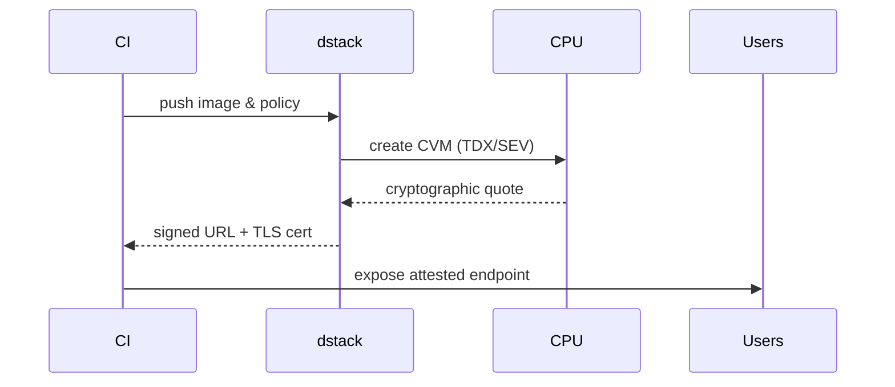

# What is dstack?

<page_summary>
**dstack** converts the raw power of modern Trusted Execution Environments (TEEs) into a push‑button workflow that feels just like shipping ordinary containers.  Applications run inside hardware‑isolated *Confidential VMs* (CVMs), yet developers interact with Docker, REST, and familiar CI/CD.  The result is cloud infrastructure that keeps customer data encrypted at rest, in transit, *and while it is being processed*—without rewriting code or trusting the cloud operator.
</page_summary>

---

## Why dstack exists

Cloud computing was built on an unspoken bargain: *trust us with your plaintext and we’ll give you scale*.  As data becomes more sensitive and regulation tighter, that bargain no longer works.  TEEs—including Intel TDX, AMD SEV‑SNP, and ARM CCA—finally make it possible to run code on encrypted data, but they arrive as low‑level CPU features, not developer platforms.  dstack supplies the missing platform layer: it packages those hardware controls into everyday DevOps primitives, so organisations can adopt confidential computing without assembling a cryptography team.

<div className="grid md:grid-cols-2 gap-6 my-8">
  <div className="p-6 bg-gray-50 rounded-lg shadow">
    <h3 className="font-semibold mb-2">Before dstack</h3>
    <p className="text-sm leading-relaxed">
      Teams wrestle with vendor‑specific SDKs, bespoke attestation flows, and opaque
      debugging.  Security policies live in wikis; secrets sprawl across pipelines; audits are
      point‑in‑time PDFs.  Most projects stall before reaching production.
    </p>
  </div>
  <div className="p-6 bg-emerald-50 rounded-lg shadow">
    <h3 className="font-semibold mb-2">With dstack</h3>
    <p className="text-sm leading-relaxed">
      A container image, a YAML policy, and a `dstack deploy` are enough to launch a fully
      attested workload.  Keys, certificates, and evidence are managed automatically, and
      dashboards show real‑time cryptographic proof that the service is running exactly the
      code you pushed—nowhere else.
    </p>
  </div>
</div>

---

## Architecture at a glance


1. **Hardware Security Layer** — CPU isolates CVM memory with encryption and integrity trees.
2. **Orchestration Layer** — dstack Scheduler allocates CVMs, injects measurements, and streams attestation evidence.
3. **Service Mesh** — Sidecars terminate TLS, verify peer attestations, and feed privacy‑preserving metrics.
4. **Developer Interfaces** — REST API, CLI, and web dashboard expose a Kubernetes‑like UX without exposing secrets.

Every layer is open source, so auditors can examine the exact code path from API call to enclave launch.

---

## Developer, Security, Business lenses

<Tabs>
  <Tab title="Developer Experience">
    <p>Push a container, supply an optional policy file, and dstack does the rest.  Build, test, and deploy stay unchanged; the only visible difference is a signed attestation URL you can feed to clients or CI tests.</p>
  </Tab>
  <Tab title="Security Posture">
    <p>Workloads inherit a hardware root of trust.  Memory remains encrypted even from the host kernel; attestation proofs are checked on every service‑to‑service call; secrets are sealed to the enclave so database passwords never touch disk.</p>
  </Tab>
  <Tab title="Enterprise Outcomes">
    <p>dstack avoids vendor lock‑in by targeting open TEE standards.  Compliance teams gain continuous evidence instead of annual snapshots, and the migration path is incremental—start with a single sensitive service, then expand.</p>
  </Tab>
</Tabs>

---

## How a deployment works



*The quote is signed inside the chip and can be verified by anyone without trusting dstack.*

---

## Growing into confidentiality

<Steps>
  <Step title="Level 0">Run the same container, no policy—observe baseline metrics.</Step>
  <Step title="Level 1">Enable TEE isolation with a one‑line policy.</Step>
  <Step title="Level 2">Make your app verify the peer’s attestation token.</Step>
  <Step title="Level 3">Seal secrets to the enclave and encrypt all persistent storage.</Step>
</Steps>

Because each level builds on the last, teams can harden services iteratively instead of rewriting everything at once.

---

## Performance and footprint

| Workload profile | Typical overhead | What dstack optimises |
|------------------|------------------|-----------------------|
| CPU‑bound microservice | 5‑10 % | Pin hot data, minimise exits |
| Memory analytics job | 10‑18 % | Batch page faults, reuse encrypted pages |
| I/O‑heavy ETL | 15‑25 % | Async pipelines, vectorised crypto |

dstack’s scheduler bins similar workloads together and chooses CPU features (TDX vs SEV) that minimise cost for the SLA you set.

Minimum host: 8 physical cores, 32 GB RAM, NVMe storage, and a TEE‑capable microcode revision.

---

## Secure multi‑service example

```yaml
docker-compose:
  version: "3.9"
  services:
    api:
      image: registry/my-api:1.4
      security_policy:
        attestation: strict
        secrets: sealed
    db:
      image: postgres:secure
      security_policy:
        isolation: maximum
        storage: encrypted
```

The same file works on any cluster that advertises TEE support; dstack translates the policy into the right CPU instructions and certificates.

---

## Real‑world impact

### Healthcare research
Researchers can combine encrypted medical datasets across hospitals without ever moving raw records off‑prem.  Analytics run in CVMs, results are shared, yet no institution sees the other’s patient data.

### Financial trading
Quant teams deploy proprietary models to co‑located data centres while cryptographically proving to regulators that market data is kept segregated from strategy code.

### Gen‑AI model serving
Large language models with sensitive IP weights run inside enclaves, so hosting providers cannot dump parameters, and customers can supply private prompts without leaking them to the operator.

---

## dstack vs other approaches

| | dstack | Raw TEE SDK | Homomorphic Enc. | Software enclaves |
|---|---|---|---|---|
| Security anchor | CPU hardware | CPU hardware | Math only | Obfuscated SW |
| Dev effort | Docker push | Rewrite in C/ASM | Redesign algorithms | Recompile |
| Overhead | 5‑25 % | 5‑15 % | 100‑10,000× | 20‑50 % |
| Portability | Any TEE cloud | Tied to vendor | CPU‑agnostic | OS‑specific |

TEEs give the strongest guarantees with practical performance; dstack is the shortest on‑ramp to TEEs.

---

## Where to go next

<div className="grid grid-cols-1 md:grid-cols-2 gap-4 mt-6">
  <a href="/docs/quickstart" className="block p-5 bg-blue-50 rounded-lg hover:bg-blue-100 transition">
    <strong className="text-blue-800">Quick Start</strong><br/>
    Launch your first CVM in ten minutes.
  </a>
  <a href="/docs/concepts/architecture" className="block p-5 bg-green-50 rounded-lg hover:bg-green-100 transition">
    <strong className="text-green-800">Architecture Deep Dive</strong><br/>
    Explore schedulers, quotes, and policy engine.
  </a>
  <a href="/docs/concepts/security-model" className="block p-5 bg-purple-50 rounded-lg hover:bg-purple-100 transition">
    <strong className="text-purple-800">Security Model</strong><br/>
    Threat model, crypto primitives, formal proofs.
  </a>
  <a href="/docs/tutorials/python-example" className="block p-5 bg-orange-50 rounded-lg hover:bg-orange-100 transition">
    <strong className="text-orange-800">Hands‑on Tutorial</strong><br/>
    Build and attest a Python microservice end‑to‑end.
  </a>
</div>

---

## TL;DR

> **dstack** is the missing developer platform for confidential computing: push containers, get hardware‑backed privacy, keep using the tooling you love.
