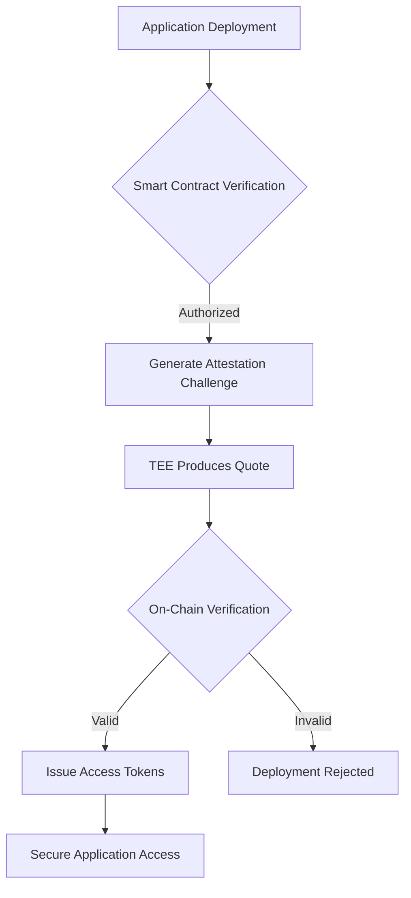

# What is dstack?

<page_summary>
dstack is an open-source orchestration platform that transforms the deployment of secure applications within Trusted Execution Environments (TEEs) from a specialized cryptographic exercise into a standardized operational workflow. By abstracting the complexity of hardware security features while preserving their guarantees, dstack enables organizations to leverage confidential computing without requiring deep expertise in TEE-specific implementations. This document provides a comprehensive technical overview of the platform's architecture, design philosophy, and position within the broader confidential computing ecosystem.
</page_summary>

<smoothly_flowing_prose_paragraphs>
The fundamental challenge in modern cloud computing lies in the trust asymmetry between data owners and infrastructure providers. Traditional security models require data owners to trust that cloud providers will protect their data from both external threats and internal access. This trust requirement becomes increasingly problematic as data sensitivity grows and regulatory frameworks tighten. Confidential computing promises to resolve this asymmetry by enabling computation on encrypted data within hardware-enforced secure enclaves, yet the complexity of implementing these solutions has limited their adoption.

dstack emerges as the critical bridge between the theoretical promise of confidential computing and its practical implementation. The platform recognizes that the primary barrier to TEE adoption is not the hardware availability but the operational complexity of deploying and managing secure applications. By providing familiar interfaces—Docker containers, REST APIs, web dashboards—atop sophisticated security primitives, dstack democratizes access to hardware-based security guarantees.
</smoothly_flowing_prose_paragraphs>

## Conceptual Foundation

<Note>
dstack operates on the principle of "transparent security enhancement"—applications gain hardware-enforced protection without requiring architectural modifications or specialized development practices.
</Note>

### The Trust Problem in Cloud Computing

<smoothly_flowing_prose_paragraphs>
To understand dstack's significance, we must first examine the trust relationships in traditional cloud computing:

1. **Infrastructure Trust**: Users must trust cloud providers not to access their data
2. **Software Trust**: Applications assume the underlying OS and hypervisor are secure
3. **Operational Trust**: DevOps teams trust that security policies are correctly implemented
4. **Regulatory Trust**: Compliance requires demonstrable data protection measures

Each of these trust relationships represents a potential vulnerability. Data breaches, insider threats, and supply chain attacks exploit these trust assumptions. Confidential computing, enabled by hardware features like Intel TDX, AMD SEV-SNP, and ARM CCA, promises to eliminate these trust requirements by providing cryptographically verifiable execution environments.
</smoothly_flowing_prose_paragraphs>

### The Implementation Gap

Despite the availability of TEE hardware, adoption remains limited due to:

<div className="grid grid-cols-1 md:grid-cols-2 gap-4 my-6">
  <div className="bg-red-50 p-4 rounded-lg">
    <h4 className="font-semibold text-red-900 mb-2">Technical Complexity</h4>
    <ul className="text-sm space-y-1">
      <li>• Low-level programming requirements</li>
      <li>• Complex attestation protocols</li>
      <li>• Hardware-specific implementations</li>
      <li>• Limited debugging capabilities</li>
    </ul>
  </div>
  <div className="bg-orange-50 p-4 rounded-lg">
    <h4 className="font-semibold text-orange-900 mb-2">Operational Challenges</h4>
    <ul className="text-sm space-y-1">
      <li>• Incompatible with existing workflows</li>
      <li>• Steep learning curve</li>
      <li>• Limited tooling ecosystem</li>
      <li>• Difficult performance optimization</li>
    </ul>
  </div>
</div>

## The dstack Solution

<smoothly_flowing_prose_paragraphs>
dstack addresses the implementation gap through a carefully designed abstraction layer that preserves security guarantees while providing operational familiarity. The platform's architecture reflects a deep understanding of both the cryptographic requirements of secure computing and the practical needs of modern DevOps workflows.
</smoothly_flowing_prose_paragraphs>

### Core Architecture

<div className="my-8">
  
</div>

The dstack architecture comprises four primary layers:

#### 1. Hardware Security Layer
<Highlight>
The foundation of dstack's security model lies in hardware-enforced isolation provided by processor TEE features.
</Highlight>

- **Intel TDX (Trust Domain Extensions)**: Provides VM-level isolation with memory encryption
- **AMD SEV-SNP (Secure Encrypted Virtualization)**: Offers similar protections on AMD platforms
- **ARM CCA (Confidential Compute Architecture)**: Emerging standard for ARM-based systems

#### 2. Platform Orchestration Layer

The orchestration layer manages the lifecycle of confidential workloads:

```rust
// Simplified representation of CVM orchestration
pub struct ConfidentialVM {
    id: Uuid,
    attestation: AttestationReport,
    network: SecureNetworkConfig,
    resources: ResourceAllocation,
}

impl ConfidentialVM {
    pub async fn deploy(&self, container: ContainerSpec) -> Result<Deployment> {
        // 1. Verify container integrity
        let measurements = self.measure_container(&container)?;
        
        // 2. Allocate secure resources
        let resources = self.allocate_resources()?;
        
        // 3. Establish secure channels
        let network = self.setup_secure_network()?;
        
        // 4. Launch with attestation
        self.launch_with_attestation(measurements, resources, network).await
    }
}
```

#### 3. Service Mesh Layer

dstack implements a security-aware service mesh that handles:

- **Secure Ingress**: TLS termination with automatic certificate management
- **Service Discovery**: Attestation-based service registry
- **Load Balancing**: Security-aware traffic distribution
- **Observability**: Privacy-preserving metrics and logging

#### 4. Developer Interface Layer

The top layer provides familiar interfaces:

- **REST API**: Comprehensive programmatic access
- **Web Dashboard**: Visual deployment and management
- **CLI Tools**: Command-line workflow integration
- **SDKs**: Language-specific libraries for attestation-aware applications

### Key Innovations

<smoothly_flowing_prose_paragraphs>
dstack's value proposition extends beyond simple abstraction. The platform introduces several key innovations that advance the state of confidential computing:
</smoothly_flowing_prose_paragraphs>

#### 1. Composable Security

Rather than requiring monolithic secure applications, dstack enables composition of secure services:

```yaml
# Example: Secure multi-tier application
version: '3.8'
services:
  frontend:
    image: webapp:latest
    security_policy:
      attestation: required
      network: encrypted
      
  api:
    image: api-server:latest
    security_policy:
      attestation: strict
      secrets: sealed
      
  database:
    image: postgres:secure
    security_policy:
      attestation: strict
      storage: encrypted
      isolation: maximum
```

#### 2. Progressive Security Enhancement

Applications can adopt security features incrementally:

<Steps>
  <Step title="Level 0: Standard Deployment">
    Deploy existing containers without modification
  </Step>
  <Step title="Level 1: Basic Isolation">
    Enable TEE execution with default policies
  </Step>
  <Step title="Level 2: Attestation Integration">
    Add attestation verification to application logic
  </Step>
  <Step title="Level 3: Full Confidentiality">
    Implement end-to-end encryption with sealed storage
  </Step>
</Steps>

#### 3. Decentralized Trust Architecture

<smoothly_flowing_prose_paragraphs>
Unlike traditional PKI-based trust models, dstack implements a decentralized trust architecture leveraging blockchain technology for critical security decisions. This approach eliminates single points of failure and enables autonomous security policy enforcement.
</smoothly_flowing_prose_paragraphs>



## Technical Specifications

### System Requirements

<div className="bg-gray-50 p-6 rounded-lg my-6">
  <h4 className="font-semibold mb-4">Minimum Hardware Requirements</h4>
  <div className="grid grid-cols-2 gap-6">
    <div>
      <h5 className="font-medium text-gray-700 mb-2">Processor</h5>
      <ul className="text-sm space-y-1">
        <li>• Intel Xeon Scalable (4th Gen) with TDX</li>
        <li>• AMD EPYC (3rd Gen) with SEV-SNP</li>
        <li>• Minimum 8 physical cores</li>
      </ul>
    </div>
    <div>
      <h5 className="font-medium text-gray-700 mb-2">Memory & Storage</h5>
      <ul className="text-sm space-y-1">
        <li>• 32GB ECC RAM minimum</li>
        <li>• 500GB NVMe SSD</li>
        <li>• Hardware RNG support</li>
      </ul>
    </div>
  </div>
</div>

### Performance Characteristics

<smoothly_flowing_prose_paragraphs>
The performance impact of confidential computing varies based on workload characteristics. dstack's optimizations minimize overhead while maintaining security guarantees:
</smoothly_flowing_prose_paragraphs>

| Workload Type | Typical Overhead | Optimization Strategy |
|---------------|------------------|----------------------|
| CPU-Intensive | 5-10% | Batch processing, cache optimization |
| Memory-Intensive | 10-20% | Page pooling, encrypted memory reuse |
| I/O-Intensive | 15-30% | Async I/O, batched encryption |
| Network-Heavy | 10-15% | Connection pooling, protocol optimization |

### Security Guarantees

dstack provides the following cryptographic guarantees:

1. **Confidentiality**: Data remains encrypted in memory, inaccessible to privileged software
2. **Integrity**: Code and data modifications are detectable through attestation
3. **Authenticity**: Cryptographic proof of genuine TEE execution
4. **Freshness**: Protection against replay attacks through nonce-based attestation
5. **Non-repudiation**: Blockchain-anchored audit trails

## Use Cases and Applications

<smoothly_flowing_prose_paragraphs>
The convergence of operational simplicity and strong security guarantees enables new categories of applications previously impractical or impossible:
</smoothly_flowing_prose_paragraphs>

### Healthcare and Genomics

<div className="bg-blue-50 border-l-4 border-blue-400 p-4 my-4">
  <h4 className="font-semibold text-blue-800">Secure Multi-Institutional Research</h4>
  <p className="text-sm mt-2">
    Enable collaborative analysis of sensitive patient data across institutions without exposing individual records. Researchers can run algorithms on combined datasets while maintaining HIPAA compliance and patient privacy.
  </p>
</div>

### Financial Services

<div className="bg-green-50 border-l-4 border-green-400 p-4 my-4">
  <h4 className="font-semibold text-green-800">Confidential Trading Systems</h4>
  <p className="text-sm mt-2">
    Deploy high-frequency trading algorithms and risk models in shared infrastructure without revealing proprietary strategies. Enable secure multi-party computation for regulatory reporting.
  </p>
</div>

### Artificial Intelligence

<div className="bg-purple-50 border-l-4 border-purple-400 p-4 my-4">
  <h4 className="font-semibold text-purple-800">Privacy-Preserving ML Training</h4>
  <p className="text-sm mt-2">
    Train machine learning models on sensitive datasets without exposing training data. Protect both model intellectual property and data privacy throughout the ML lifecycle.
  </p>
</div>

## Comparison with Alternatives

<smoothly_flowing_prose_paragraphs>
Understanding dstack's position in the confidential computing landscape requires comparison with alternative approaches:
</smoothly_flowing_prose_paragraphs>

<div className="overflow-x-auto my-6">
  <table className="min-w-full">
    <thead className="bg-gray-100">
      <tr>
        <th className="p-3 text-left">Approach</th>
        <th className="p-3 text-left">Security Level</th>
        <th className="p-3 text-left">Operational Complexity</th>
        <th className="p-3 text-left">Performance Impact</th>
        <th className="p-3 text-left">Flexibility</th>
      </tr>
    </thead>
    <tbody className="text-sm">
      <tr>
        <td className="p-3 border font-medium">dstack</td>
        <td className="p-3 border text-green-600">Hardware-enforced</td>
        <td className="p-3 border text-green-600">Low (Docker-compatible)</td>
        <td className="p-3 border text-yellow-600">5-30%</td>
        <td className="p-3 border text-green-600">High</td>
      </tr>
      <tr className="bg-gray-50">
        <td className="p-3 border font-medium">Raw TEE SDKs</td>
        <td className="p-3 border text-green-600">Hardware-enforced</td>
        <td className="p-3 border text-red-600">Very High</td>
        <td className="p-3 border text-green-600">5-15%</td>
        <td className="p-3 border text-yellow-600">Medium</td>
      </tr>
      <tr>
        <td className="p-3 border font-medium">Homomorphic Encryption</td>
        <td className="p-3 border text-green-600">Mathematical</td>
        <td className="p-3 border text-yellow-600">High</td>
        <td className="p-3 border text-red-600">100-10,000x</td>
        <td className="p-3 border text-red-600">Low</td>
      </tr>
      <tr className="bg-gray-50">
        <td className="p-3 border font-medium">Software Enclaves</td>
        <td className="p-3 border text-yellow-600">Software-based</td>
        <td className="p-3 border text-green-600">Medium</td>
        <td className="p-3 border text-yellow-600">20-50%</td>
        <td className="p-3 border text-green-600">High</td>
      </tr>
    </tbody>
  </table>
</div>

## Future Directions

<smoothly_flowing_prose_paragraphs>
The dstack platform continues to evolve in response to advances in hardware capabilities and emerging use cases. Current research and development focuses on:
</smoothly_flowing_prose_paragraphs>

### Near-Term Roadmap (6-12 months)

- **Multi-Cloud Federation**: Seamless deployment across heterogeneous TEE platforms
- **Advanced Scheduling**: ML-driven workload placement optimization
- **Enhanced Observability**: Privacy-preserving distributed tracing
- **Compliance Automation**: Built-in support for GDPR, HIPAA, PCI-DSS

### Long-Term Vision (2-5 years)

- **Quantum-Resistant Security**: Post-quantum cryptographic primitives
- **Edge Computing Integration**: TEE support for IoT and edge devices
- **Interoperability Standards**: Industry-wide confidential computing protocols
- **Autonomous Security**: Self-healing security policies using AI

## Getting Started with dstack

<smoothly_flowing_prose_paragraphs>
The journey to secure computing with dstack begins with understanding your security requirements and mapping them to platform capabilities. We recommend a phased approach:
</smoothly_flowing_prose_paragraphs>

<Steps>
  <Step title="Assessment Phase">
    Evaluate your applications' security requirements and compliance needs
  </Step>
  <Step title="Proof of Concept">
    Deploy a non-critical application to familiarize yourself with the platform
  </Step>
  <Step title="Pilot Deployment">
    Migrate a security-sensitive workload with limited scope
  </Step>
  <Step title="Production Rollout">
    Expand deployment based on pilot learnings and performance metrics
  </Step>
  <Step title="Advanced Integration">
    Implement attestation-aware features and multi-party computation
  </Step>
</Steps>

## Conclusion

<smoothly_flowing_prose_paragraphs>
dstack represents a fundamental shift in how we approach secure computing. By making hardware-based security accessible through familiar operational patterns, the platform enables a future where data privacy is guaranteed by physics rather than policy. The implications extend beyond technical architecture to reshape business models, regulatory frameworks, and trust relationships in the digital economy.

The platform's success lies not in the sophistication of its cryptographic implementations but in their invisibility to end users. Just as HTTPS made encryption ubiquitous by making it transparent, dstack aims to make confidential computing the default rather than the exception. In doing so, it paves the way for a more secure, private, and trustworthy digital infrastructure.
</smoothly_flowing_prose_paragraphs>

## Next Steps

Ready to begin your journey with dstack? Explore these resources:

<div className="grid grid-cols-1 md:grid-cols-2 gap-4 mt-8">
  <a href="/docs/quickstart" className="block p-6 bg-blue-50 rounded-lg hover:bg-blue-100 transition-colors">
    <h3 className="font-semibold text-blue-900 mb-2">Quick Start Guide</h3>
    <p className="text-sm text-blue-700">Deploy your first secure application in 10 minutes</p>
  </a>
  <a href="/docs/concepts/architecture" className="block p-6 bg-green-50 rounded-lg hover:bg-green-100 transition-colors">
    <h3 className="font-semibold text-green-900 mb-2">Architecture Deep Dive</h3>
    <p className="text-sm text-green-700">Understand the technical implementation details</p>
  </a>
  <a href="/docs/concepts/security-model" className="block p-6 bg-purple-50 rounded-lg hover:bg-purple-100 transition-colors">
    <h3 className="font-semibold text-purple-900 mb-2">Security Model</h3>
    <p className="text-sm text-purple-700">Explore cryptographic foundations and threat model</p>
  </a>
  <a href="/docs/tutorials/python-example" className="block p-6 bg-orange-50 rounded-lg hover:bg-orange-100 transition-colors">
    <h3 className="font-semibold text-orange-900 mb-2">Practical Tutorial</h3>
    <p className="text-sm text-orange-700">Build a secure application step by step</p>
  </a>
</div> 