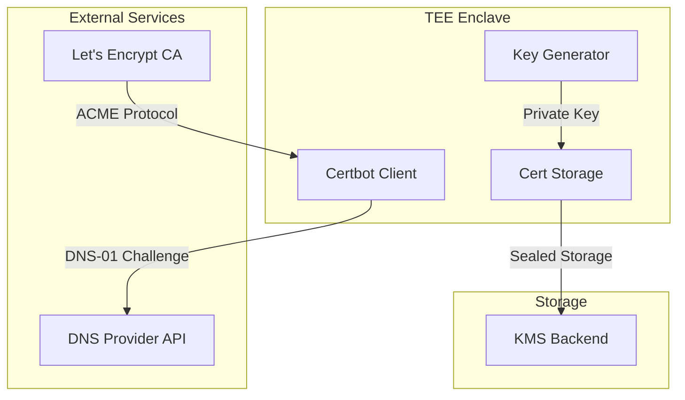

# Certbot TEE Security Analysis

<Callout type="info" icon="certificate">
**Component**: `certbot` | [View Source](https://github.com/Dstack-TEE/dstack/tree/master/certbot)
</Callout>

<page_summary>
The certbot component implements ACME protocol client functionality within the TEE, enabling automated certificate issuance and renewal from Let's Encrypt while ensuring private keys never leave the hardware-protected enclave. This module handles DNS-01 challenges, CAA record management, and secure key storage with attestation-based access control.
</page_summary>

## Overview

The TEE-native certbot implementation provides:

- **Enclave-resident ACME client**: Full protocol support without external dependencies
- **Hardware-sealed private keys**: Generated and used exclusively within TEE
- **Automated DNS management**: CAA records and challenge responses
- **Attestation-bound certificates**: Links certificates to enclave measurements

## Security Architecture

### Trust Model



### Key Security Properties

<SecurityInsight>
The certbot implementation ensures that:
1. Private keys are generated using hardware RNG within the enclave
2. ACME account keys are sealed to enclave measurements
3. DNS API credentials are protected by attestation-based access
4. Certificate renewal happens automatically without manual intervention
</SecurityInsight>

## Implementation Details

### ACME Client Core

The ACME implementation ([source](https://github.com/Dstack-TEE/dstack/blob/master/certbot/src/acme_client.rs)) handles:

```rust
// From certbot/src/acme_client.rs
pub struct AcmeClient {
    // Account key sealed to enclave
    account_key: SealedKey,
    // ACME directory URLs
    directory: Directory,
    // HTTP client with attestation
    client: AttestationHttpClient,
}

impl AcmeClient {
    pub async fn new_order(&self, domains: &[String]) -> Result<Order> {
        // 1. Create order with identifiers
        let order = self.create_order(domains).await?;
        
        // 2. Complete challenges
        for authz in &order.authorizations {
            self.complete_dns_challenge(authz).await?;
        }
        
        // 3. Finalize with CSR
        let csr = self.generate_csr(domains)?;
        self.finalize_order(&order, csr).await
    }
}
```

### DNS Challenge Handler

DNS-01 challenge automation ([source](https://github.com/Dstack-TEE/dstack/blob/master/certbot/src/dns_provider.rs)):

```rust
// From certbot/src/dns_provider.rs
pub trait DnsProvider: Send + Sync {
    async fn add_txt_record(&self, name: &str, value: &str) -> Result<()>;
    async fn remove_txt_record(&self, name: &str) -> Result<()>;
    async fn wait_for_propagation(&self, name: &str, value: &str) -> Result<()>;
}

pub struct CloudflareDns {
    // API credentials sealed in enclave
    api_token: SealedString,
    zone_id: String,
}
```

### Certificate Storage

Secure certificate persistence ([source](https://github.com/Dstack-TEE/dstack/blob/master/certbot/src/storage.rs)):

```rust
// From certbot/src/storage.rs
pub struct CertStorage {
    kms: Arc<dyn KeyManagementService>,
    attestation: AttestationQuote,
}

impl CertStorage {
    pub async fn store_certificate(
        &self,
        domain: &str,
        cert: Certificate,
        key: PrivateKey,
    ) -> Result<()> {
        // Seal private key to enclave measurements
        let sealed_key = self.kms.seal_key(
            &key,
            &self.attestation.measurements,
        )?;
        
        // Store with versioning
        self.kms.put(
            &format!("cert/{}/key", domain),
            &sealed_key,
        ).await?;
        
        Ok(())
    }
}
```

## Threat Analysis

### Attack Surface

| Threat Vector | Mitigation | Residual Risk |
|---------------|------------|---------------|
| ACME account compromise | Hardware-sealed account keys | Physical attacks |
| DNS hijacking | DNSSEC validation + CAA | BGP hijacking |
| Key exfiltration | TEE memory encryption | Side channels |
| Renewal failures | Multi-path retry logic | CA downtime |
| Challenge replay | Time-bound tokens | Clock skew |

### Security Boundaries

1. **Network Boundary**: TLS 1.3 for all external communication
2. **Process Boundary**: Isolated enclave process
3. **Storage Boundary**: Encrypted and authenticated persistence

## CAA Record Management

The certbot automatically manages CAA records to restrict issuance:

```rust
// From certbot/src/caa_manager.rs
pub async fn enforce_caa_policy(
    dns: &dyn DnsProvider,
    domain: &str,
    account_uri: &str,
) -> Result<()> {
    // Set restrictive CAA record
    let caa_record = format!(
        "0 issue \"letsencrypt.org; accounturi={}\"",
        account_uri
    );
    
    dns.add_caa_record(domain, &caa_record).await?;
    
    // Also set iodef for monitoring
    let iodef = "0 iodef \"mailto:security@example.com\"";
    dns.add_caa_record(domain, iodef).await
}
```

## Integration Points

### Gateway Integration

The certbot provides certificates to the gateway through secure channels:

1. **Certificate Updates**: Push model with attestation verification
2. **Key Access**: Gateway requests keys with valid attestation
3. **Renewal Notifications**: Event-driven architecture

### Monitoring Integration

Certificate transparency monitoring integration:

```rust
// From certbot/src/ct_integration.rs
pub async fn submit_to_ct_logs(cert: &Certificate) -> Result<Vec<SignedCertificateTimestamp>> {
    let scts = vec![];
    
    for log in &CT_LOG_SERVERS {
        match log.submit_chain(cert).await {
            Ok(sct) => scts.push(sct),
            Err(e) => warn!("CT submission failed: {}", e),
        }
    }
    
    Ok(scts)
}
```

## Performance Characteristics

| Operation         | Latency    | Frequency      |
|-------------------|------------|---------------|
| New certificate   | 30-60s     | On demand     |
| Renewal check     | under 100ms     | Every hour    |
| DNS propagation   | 10-120s    | Per challenge |
| Key generation    | ~50ms      | Per certificate |

## Configuration Security

### Secure Configuration Loading

```rust
// From certbot/src/config.rs
#[derive(Deserialize)]
pub struct CertbotConfig {
    // ACME endpoints
    #[serde(default = "default_acme_url")]
    pub acme_url: String,
    
    // Contact email (public)
    pub email: String,
    
    // DNS provider config (sealed)
    #[serde(skip)]
    pub dns_credentials: Option<SealedCredentials>,
    
    // Renewal settings
    pub renewal_days_before_expiry: u32,
}
```

## Best Practices

<Tabs>
  <Tab title="Deployment">
    - Use staging ACME endpoint for testing
    - Configure multiple DNS providers for redundancy
    - Monitor certificate expiry proactively
    - Implement graceful degradation for renewal failures
  </Tab>
  <Tab title="Security">
    - Rotate ACME account keys periodically
    - Audit CAA records regularly
    - Monitor CT logs for all certificates
    - Use separate accounts per environment
  </Tab>
</Tabs>

## Monitoring & Observability

### Metrics Collection

```rust
// From certbot/src/metrics.rs
pub struct CertbotMetrics {
    certificates_issued: Counter,
    renewal_attempts: Counter,
    renewal_failures: Counter,
    dns_challenge_duration: Histogram,
}
```

### Audit Events

All certificate operations generate audit events:

- **Certificate Requested**: Domain, requester, timestamp
- **Challenge Completed**: Type, duration, result
- **Certificate Issued**: Serial, validity, CT SCTs
- **Renewal Triggered**: Reason, old cert details

## Common Issues & Troubleshooting

<Warning>
**Rate Limits**: Let's Encrypt enforces strict rate limits. The certbot implements exponential backoff and caching to avoid hitting limits.
</Warning>

### Debugging Commands

```bash
# Check certificate status
certbot status --domain example.com

# Force renewal (testing)
certbot renew --force --domain example.com

# Verify DNS configuration
certbot test-dns --domain example.com

# Show account details
certbot show-account
```

## References

- [ACME Protocol RFC 8555](https://datatracker.ietf.org/doc/html/rfc8555)
- [Let's Encrypt Rate Limits](https://letsencrypt.org/docs/rate-limits/)
- [CAA Record RFC 8659](https://datatracker.ietf.org/doc/html/rfc8659)
- [dstack Certbot Design](https://github.com/Dstack-TEE/dstack/blob/master/certbot/DESIGN.md)

<div className="mt-8 p-4 bg-yellow-50 rounded-lg border border-yellow-200">
  <p className="text-sm text-yellow-800">
    <strong>Next Component:</strong> Explore certificate verification in <a href="/docs/security-research/cert-client-security" className="underline">cert-client security</a>.
  </p>
</div> 