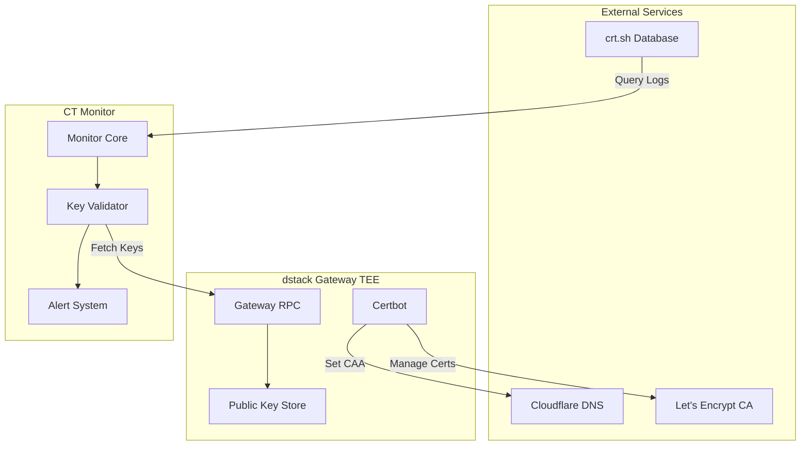

# Certificate Transparency Monitor Security Analysis

<Callout type="info" icon="magnifying-glass">
**Component**: `ct_monitor` | [View Source](https://github.com/Dstack-TEE/dstack/tree/master/ct_monitor)
</Callout>

<page_summary>
The ct_monitor component provides Certificate Transparency monitoring for dstack domains by querying crt.sh and validating certificates against known public keys from the dstack-gateway. It implements real-time monitoring, public key validation, and automated alerting to protect against certificate misissuance attacks within the TEE security model.
</page_summary>

## Overview

The CT monitor provides:

- **CT log monitoring**: Queries crt.sh database for domain certificates [1](#0-0) 
- **Public key validation**: Verifies certificates against gateway-managed keys [2](#0-1) 
- **Domain pattern matching**: Monitors specific domains for unauthorized issuance [3](#0-2) 
- **Real-time alerting**: Immediate detection of unauthorized certificates [4](#0-3) 

## Security Architecture

### Monitoring Architecture

### Security Model

<SecurityInsight>
The CT monitor provides defense through:
1. Continuous monitoring of Certificate Transparency logs via crt.sh
2. Validation against TEE-managed public keys from dstack-gateway
3. CAA DNS records restricting certificate issuance to authorized accounts
4. RA-TLS attestation embedding for certificate authenticity verification
</SecurityInsight>

## Implementation Details

### Core Monitoring Logic

The CT monitor operates by querying the crt.sh database and validating certificates against known public keys [5](#0-4) . The monitor fetches known public keys from the dstack-gateway RPC endpoint [6](#0-5)  and validates each certificate's public key against this trusted set [7](#0-6) .

### Domain Validation

Domain validation ensures only legitimate domains are monitored using regex pattern matching [3](#0-2) . The monitor processes CT log entries sequentially, tracking the last checked entry to avoid reprocessing [8](#0-7) .

### Public Key Verification

The system maintains a trusted set of public keys retrieved from the gateway's ACME information endpoint [9](#0-8) . The gateway exposes historical certificate public keys through the certbot working directory [10](#0-9) .

## Certificate Management Integration

### ACME Certificate Lifecycle

The certbot component manages the complete ACME certificate lifecycle within the TEE [11](#0-10) . It automatically creates ACME accounts, sets CAA records, and manages certificate renewal [12](#0-11) .

### CAA Record Management

CAA records are automatically configured to restrict certificate issuance to the dstack-gateway ACME account [13](#0-12) . This provides the first line of defense against unauthorized certificate issuance by restricting which Certificate Authorities can issue certificates for monitored domains.

### RA-TLS Integration

Certificates can embed TEE attestation quotes using custom X.509 extensions [14](#0-13) . The system supports embedding quotes, event logs, and application IDs in certificates for enhanced verification [15](#0-14) .

## Security Considerations

### Threat Model Analysis

**Certificate Misissuance**: The primary threat is unauthorized certificate issuance for dstack domains. The system mitigates this through:
- CAA records restricting authorized CAs
- CT log monitoring for detection
- Public key validation against TEE-managed keys

**DNS Manipulation**: CAA records can be modified if DNS is compromised. The CT monitor provides detection capabilities even if CAA protections are bypassed.

**CT Log Reliability**: The monitor depends on crt.sh data availability. The system currently lacks multi-source redundancy for CT log data.

### Cryptographic Security

The system uses ECDSA P-256 keys for certificate signing [16](#0-15)  and validates signatures using ring cryptography library [17](#0-16) . Certificate signing requests require proper authentication and verification [18](#0-17) .

## Performance & Operational Security

### Monitoring Frequency

The CT monitor operates with a 60-second polling interval [19](#0-18) , fetching up to 10,000 log entries per query [20](#0-19) . This provides reasonable detection latency while avoiding rate limiting.

### Error Handling

The system implements robust error handling for network failures, invalid certificates, and missing public keys [21](#0-20) . Critical errors are logged for investigation while maintaining service continuity.

## Configuration Security

### Gateway Integration

The monitor requires secure communication with the dstack-gateway RPC endpoint. Configuration includes gateway URI and domain specifications [22](#0-21) . The gateway provides ACME account information and historical public keys through authenticated RPC calls [9](#0-8) .

### Certbot Configuration

Certbot integrates with Cloudflare for DNS challenges and CAA management [13](#0-12) . The configuration includes ACME server URLs, Cloudflare credentials, and certificate management parameters.

## TEE Security Guarantees

### Attestation Integration

The system embeds Intel TDX attestation quotes in certificates to prove TEE execution [23](#0-22) . This provides cryptographic proof that certificates were generated within a verified TEE environment.

### Key Protection

Certificate private keys remain sealed within the TEE environment. The gateway manages key material and exposes only public key information for CT monitoring validation [24](#0-23) .

## Limitations and Recommendations

### Current Limitations

1. **Single Source Dependency**: Relies solely on crt.sh for CT data
2. **Basic Alerting**: Simple error logging without sophisticated notification channels
3. **No Automated Response**: Manual intervention required for unauthorized certificates
4. **Limited Scalability**: Sequential processing of CT entries

### Security Recommendations

1. **Multi-Source Monitoring**: Integrate multiple CT log sources for redundancy
2. **Enhanced Alerting**: Implement webhook/email notifications for critical events
3. **Automated Response**: Add capability for automatic certificate revocation
4. **Rate Limiting**: Implement backoff strategies for crt.sh API limits

## Integration Examples

The CT monitor integrates with the broader dstack security architecture through the gateway RPC interface. It validates certificates against the trusted public key set maintained by the certbot component within the TEE environment.

## Metrics & Observability

### Key Security Metrics

- Certificate validation success/failure rates
- Unauthorized certificate detection events  
- CT log query latency and success rates
- Gateway RPC communication health

## References

- [Certificate Transparency RFC 6962](https://datatracker.ietf.org/doc/html/rfc6962)
- [crt.sh Certificate Search](https://crt.sh/)
- [Intel TDX Attestation](https://www.intel.com/content/www/us/en/developer/tools/trust-domain-extensions/overview.html)
- [ACME Protocol RFC 8555](https://datatracker.ietf.org/doc/html/rfc8555)

  

    <strong>Next Component:</strong> Explore TEE attestation verification in <a href="/docs/security-research/ra-tls-security" className="underline">RA-TLS security analysis</a>.
  

