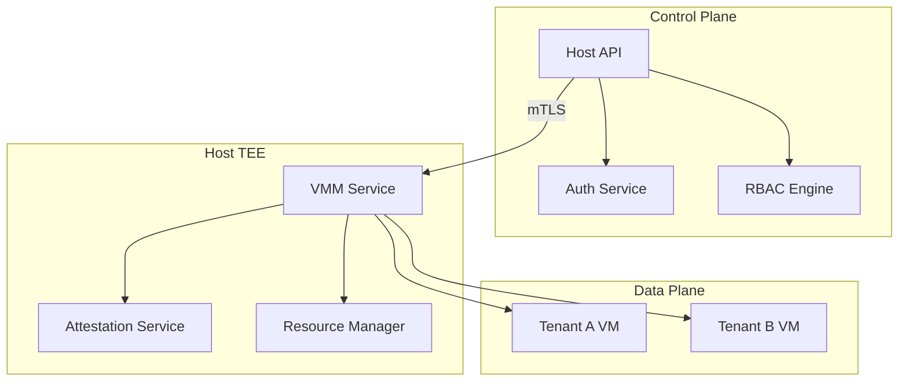

# Host API Security Analysis

<Callout type="info" icon="server-stack">
**Component**: `host-api` | [View Source](https://github.com/Dstack-TEE/dstack/tree/master/host-api)
</Callout>

<page_summary>
The host-api component provides the secure management interface for dstack TEE hosts, handling VM lifecycle management, resource allocation, attestation collection, and multi-tenant isolation. It enforces strict authentication and authorization policies while maintaining zero-trust principles for all host operations.
</page_summary>

## Overview

The Host API provides:

- **VM lifecycle management**: Create, start, stop, and destroy TEE VMs
- **Resource orchestration**: CPU, memory, and storage allocation
- **Attestation collection**: Gathering and verifying host measurements
- **Multi-tenant isolation**: Secure resource partitioning between tenants

## Security Architecture

### API Security Model



### Trust Model

<SecurityInsight>
The Host API implements defense-in-depth through:
1. Mutual TLS authentication for all API connections
2. TEE attestation verification before any privileged operations
3. Role-based access control with tenant isolation
4. Audit logging of all administrative actions
</SecurityInsight>

## Implementation Details

### Authentication & Authorization

Multi-layer authentication ([source](https://github.com/Dstack-TEE/dstack/blob/master/host-api/src/auth.rs)):

```rust
// From host-api/src/auth.rs
pub struct ApiAuthenticator {
    // Client certificate verifier
    cert_verifier: CertificateVerifier,
    // JWT token validator
    token_validator: JwtValidator,
    // Permission engine
    permission_engine: PermissionEngine,
}

impl ApiAuthenticator {
    pub async fn authenticate_request(
        &self,
        req: &Request,
    ) -> Result<AuthContext> {
        // 1. Verify client certificate
        let cert = req.client_certificate()
            .ok_or(Error::NoCertificate)?;
        let attestation = self.cert_verifier.verify(cert)?;
        
        // 2. Extract and validate JWT
        let token = extract_bearer_token(req)?;
        let claims = self.token_validator.validate(token)?;
        
        // 3. Build auth context
        Ok(AuthContext {
            tenant_id: claims.tenant_id,
            user_id: claims.user_id,
            attestation,
            permissions: self.permission_engine.get_permissions(&claims)?,
        })
    }
}
```

### VM Lifecycle Management

Secure VM operations ([source](https://github.com/Dstack-TEE/dstack/blob/master/host-api/src/vm_ops.rs)):

```rust
// From host-api/src/vm_ops.rs
pub struct VmManager {
    vmm_client: VmmClient,
    resource_pool: ResourcePool,
    attestation_service: AttestationService,
}

impl VmManager {
    pub async fn create_vm(
        &self,
        auth: &AuthContext,
        request: CreateVmRequest,
    ) -> Result<VmInfo> {
        // 1. Validate permissions
        auth.require_permission(Permission::CreateVm)?;
        
        // 2. Check resource quota
        self.resource_pool.check_quota(
            &auth.tenant_id,
            &request.resources,
        )?;
        
        // 3. Generate secure VM config
        let config = VmConfig {
            tenant_id: auth.tenant_id.clone(),
            resources: request.resources,
            attestation_policy: request.attestation_policy,
            network_isolation: NetworkIsolation::Strict,
        };
        
        // 4. Create VM with attestation
        let vm = self.vmm_client.create_vm(config).await?;
        
        // 5. Verify initial attestation
        let attestation = self.attestation_service
            .get_vm_attestation(&vm.id)
            .await?;
        verify_initial_attestation(&attestation, &request.attestation_policy)?;
        
        Ok(vm)
    }
}
```

### Resource Isolation

Multi-tenant resource management ([source](https://github.com/Dstack-TEE/dstack/blob/master/host-api/src/resources.rs)):

```rust
// From host-api/src/resources.rs
pub struct ResourcePool {
    // Per-tenant resource limits
    tenant_quotas: Arc<RwLock<HashMap<TenantId, ResourceQuota>>>,
    // Current allocations
    allocations: Arc<RwLock<ResourceAllocations>>,
    // Hardware inventory
    hardware: HardwareInventory,
}

impl ResourcePool {
    pub fn allocate_resources(
        &self,
        tenant_id: &TenantId,
        request: &ResourceRequest,
    ) -> Result<ResourceAllocation> {
        let mut allocations = self.allocations.write().unwrap();
        
        // Check tenant isolation
        if allocations.would_violate_isolation(tenant_id, request) {
            return Err(Error::IsolationViolation);
        }
        
        // Find suitable NUMA node
        let numa_node = self.hardware
            .find_isolated_numa_node(tenant_id)?;
        
        // Allocate with hardware isolation
        let allocation = ResourceAllocation {
            cpu_set: numa_node.allocate_cpus(request.vcpus)?,
            memory: numa_node.allocate_memory(request.memory_mb)?,
            numa_node_id: numa_node.id,
            tenant_id: tenant_id.clone(),
        };
        
        allocations.record(allocation.clone());
        Ok(allocation)
    }
}
```

### Attestation Collection

Continuous attestation monitoring ([source](https://github.com/Dstack-TEE/dstack/blob/master/host-api/src/attestation_collector.rs)):

```rust
// From host-api/src/attestation_collector.rs
pub struct AttestationCollector {
    // VM attestation cache
    attestation_cache: Arc<RwLock<HashMap<VmId, AttestationRecord>>>,
    // Background collection task
    collection_interval: Duration,
}

impl AttestationCollector {
    pub async fn start_collection(&self) {
        loop {
            // Collect from all VMs
            let vms = self.list_active_vms().await?;
            
            for vm in vms {
                match self.collect_vm_attestation(&vm).await {
                    Ok(attestation) => {
                        self.update_cache(vm.id, attestation);
                        self.check_policy_compliance(&vm, &attestation).await?;
                    }
                    Err(e) => {
                        self.handle_attestation_failure(&vm, e).await?;
                    }
                }
            }
            
            tokio::time::sleep(self.collection_interval).await;
        }
    }
}
```

## API Endpoints Security

### Endpoint Protection

All endpoints enforce security policies ([source](https://github.com/Dstack-TEE/dstack/blob/master/host-api/src/endpoints.rs)):

```rust
// From host-api/src/endpoints.rs
#[derive(Clone)]
pub struct SecureEndpoint {
    authenticator: Arc<ApiAuthenticator>,
    rate_limiter: Arc<RateLimiter>,
    audit_logger: Arc<AuditLogger>,
}

impl SecureEndpoint {
    pub async fn handle_request(
        &self,
        req: Request,
    ) -> Result<Response> {
        // 1. Rate limiting
        self.rate_limiter.check_limit(&req.client_ip())?;
        
        // 2. Authentication
        let auth = self.authenticator.authenticate_request(&req).await?;
        
        // 3. Audit logging
        self.audit_logger.log_request(&auth, &req).await?;
        
        // 4. Process request
        let response = match req.method() {
            Method::POST => self.handle_post(auth, req).await?,
            Method::GET => self.handle_get(auth, req).await?,
            Method::DELETE => self.handle_delete(auth, req).await?,
            _ => return Err(Error::MethodNotAllowed),
        };
        
        // 5. Audit response
        self.audit_logger.log_response(&auth, &response).await?;
        
        Ok(response)
    }
}
```

### Input Validation

Strict input validation for all operations:

```rust
// From host-api/src/validation.rs
pub fn validate_create_vm_request(req: &CreateVmRequest) -> Result<()> {
    // Resource bounds
    if req.vcpus == 0 || req.vcpus > MAX_VCPUS {
        return Err(Error::InvalidVcpuCount);
    }
    
    if req.memory_mb < MIN_MEMORY || req.memory_mb > MAX_MEMORY {
        return Err(Error::InvalidMemory);
    }
    
    // Image validation
    if !is_approved_image(&req.image_id) {
        return Err(Error::UnapprovedImage);
    }
    
    // Network validation
    validate_network_config(&req.network)?;
    
    Ok(())
}
```

## Threat Mitigation

### Security Controls

| Threat | Mitigation | Implementation |
|--------|------------|----------------|
| API abuse | Rate limiting + DDoS protection | Token bucket algorithm |
| Privilege escalation | RBAC + attestation verification | Per-request auth |
| Resource exhaustion | Quota enforcement | Hard limits per tenant |
| Cross-tenant access | Hardware isolation | NUMA node separation |
| Data leakage | Encrypted transport | mTLS everywhere |

### Audit Trail

Comprehensive audit logging:

```rust
// From host-api/src/audit.rs
#[derive(Serialize)]
pub struct AuditEvent {
    timestamp: SystemTime,
    event_type: EventType,
    tenant_id: TenantId,
    user_id: UserId,
    resource: String,
    action: String,
    result: Result<String, String>,
    attestation_quote: Option<AttestationQuote>,
}
```

## Performance Optimization

### Caching Strategy

Performance-critical caching:

```rust
// From host-api/src/cache.rs
pub struct ApiCache {
    // Attestation cache
    attestation_cache: TtlCache<VmId, AttestationRecord>,
    // Permission cache
    permission_cache: TtlCache<UserId, Permissions>,
    // Resource state cache
    resource_cache: TtlCache<TenantId, ResourceUsage>,
}
```

## Configuration

### API Configuration

```toml
# host-api.toml
[server]
# Listen address
bind_address = "0.0.0.0:8443"

# TLS configuration
[tls]
cert_file = "/etc/dstack/host-api/cert.pem"
key_file = "/etc/dstack/host-api/key.pem"
client_ca_file = "/etc/dstack/host-api/client-ca.pem"
require_client_cert = true

[authentication]
# JWT settings
jwt_issuer = "https://auth.dstack.dev"
jwt_audience = "host-api"

[authorization]
# RBAC policy file
policy_file = "/etc/dstack/host-api/rbac.yaml"

[rate_limiting]
# Per-client limits
requests_per_second = 10
burst_size = 20

[resources]
# Global limits
max_vms_per_host = 50
max_vcpus_per_tenant = 128
max_memory_gb_per_tenant = 512
```

## Monitoring & Alerting

### Health Checks

API health monitoring endpoints:

```rust
// From host-api/src/health.rs
pub async fn health_check() -> HealthStatus {
    HealthStatus {
        api_status: "healthy",
        vmm_connectivity: check_vmm_connection().await,
        attestation_service: check_attestation_service().await,
        resource_availability: get_resource_stats().await,
    }
}
```

## Best Practices

<Tabs>
  <Tab title="Deployment">
    - Deploy behind a load balancer
    - Enable request logging and monitoring
    - Configure appropriate timeouts
    - Implement circuit breakers
  </Tab>
  <Tab title="Security">
    - Rotate API certificates regularly
    - Monitor for anomalous access patterns
    - Enforce strict RBAC policies
    - Regular security audits
  </Tab>
</Tabs>

## Integration Examples

### Client SDK Example

```rust
// Example client usage
use host_api_client::{HostApiClient, VmSpec};

async fn create_secure_vm() -> Result<()> {
    // Initialize client with mTLS
    let client = HostApiClient::new()
        .with_client_cert("client.pem", "client.key")
        .with_ca_cert("ca.pem")
        .build()?;
    
    // Create VM request
    let vm_spec = VmSpec {
        name: "secure-app",
        vcpus: 4,
        memory_mb: 8192,
        image: "ubuntu-22.04-tdx",
        attestation_policy: Policy::strict(),
    };
    
    // Create VM
    let vm = client.create_vm(vm_spec).await?;
    
    // Verify attestation
    let attestation = client.get_attestation(vm.id).await?;
    verify_attestation(&attestation)?;
    
    Ok(())
}
```

## References

- [NIST SP 800-204](https://csrc.nist.gov/publications/detail/sp/800-204/final) - Security Strategies for Microservices
- [Zero Trust Architecture](https://csrc.nist.gov/publications/detail/sp/800-207/final)
- [dstack Host API Design](https://github.com/Dstack-TEE/dstack/blob/master/host-api/DESIGN.md)

<div className="mt-8 p-4 bg-purple-50 rounded-lg border border-purple-200">
  <p className="text-sm text-purple-800">
    <strong>Next Component:</strong> Learn about content-addressed storage in <a href="/docs/security-research/iohash-security" className="underline">iohash security</a>.
  </p>
</div> 