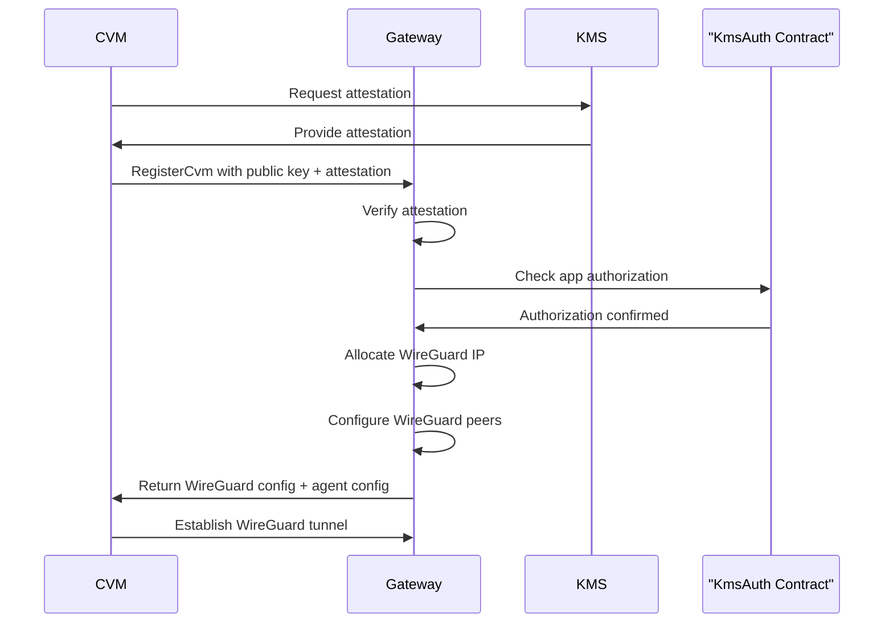

# Gateway CVM Registration and Attestation

CVM registration represents the cornerstone of trust establishment in confidential computing environments. Unlike traditional virtual machine deployment where trust is assumed based on administrative controls, confidential virtual machines must cryptographically prove their integrity before being granted access to any cluster resources. This process, known as remote attestation, creates a hardware-backed chain of trust that extends from the silicon level up through the hypervisor, operating system, and application layers.

The dstack gateway's CVM registration process is designed around the principle that trust must be earned and continuously validated, not assumed. Every CVM that wishes to join the cluster must not only prove that it's running genuine, unmodified code inside a trusted execution environment, but also demonstrate that it has been explicitly authorized by the cluster's governance mechanisms. This dual requirement of technical validity and policy compliance ensures that only legitimate, secure workloads can participate in the confidential computing cluster.

What sets dstack's approach apart is its integration of multiple security technologies into a seamless registration workflow. Remote attestation provides cryptographic proof of CVM integrity, WireGuard establishes encrypted communication channels, and blockchain-based authorization contracts ensure that access decisions are transparent and auditable. This layered security model creates multiple opportunities to detect and prevent unauthorized access attempts while maintaining operational simplicity for legitimate users.

## Gateway CVM Registration Process

a CVM, or confidential virtual machine, is a virtual machine that runs inside a trusted execution environment (TEE) such as Intel TDX, providing hardware-enforced isolation and cryptographic protection for its code and data—even from the host or hypervisor. in dstack, CVMs are the core compute units that participate in the secure cluster, and their integrity is critical for trustless operation between nodes.

to ensure that only trusted CVMs can join and communicate within the gateway cluster, every CVM must go through a registration process. this process requires the CVM to prove its trustworthiness via remote attestation (demonstrating it is running genuine, unmodified code inside a TEE) and to establish a secure, encrypted network channel using wireguard tunnels. wireguard provides authenticated, high-performance VPN connections between the gateway and each registered CVM, ensuring that all traffic is protected from eavesdropping or tampering.

this registration process is essential for enabling trustless synchronization and secure communication between nodes in the dstack gateway architecture—only CVMs that have passed attestation and are properly registered are allowed to participate in the cluster and exchange state or data.

### Remote Attestation Verification

remote attestation verification is a critical security step in the gateway's CVM registration process. its primary purpose is to ensure that only trusted, hardware-backed confidential virtual machines (CVMs) are allowed to join the cluster. this mechanism prevents unauthorized or potentially compromised VMs from gaining access to sensitive network resources, enforcing a strong trust boundary at the point of entry.

conceptually, remote attestation is a cryptographic protocol where a CVM proves to the gateway that it is running genuine, unmodified code inside a trusted execution environment (TEE), such as Intel TDX. the CVM generates an attestation report (or "quote") that includes measurements of its software stack and environment, which are then cryptographically signed by the TEE hardware. this report serves as verifiable evidence of the CVM's integrity and identity.

the gateway's [RegisterCvm RPC endpoint](https://github.com/Dstack-TEE/dstack/blob/45ebd05a25ad4ffacce3b8f003e4f5a8b609b2e2/gateway/src/main_service.rs#L12C1-L17C3) (see the `RegisterCvmRequest` and related types) is responsible for handling CVM registration requests. as part of this process, the endpoint requires the CVM to submit its attestation evidence. the gateway then performs a series of verification steps:

- it validates the cryptographic signature of the attestation report to ensure it was produced by genuine TEE hardware.
- it checks the measurements and configuration values in the report against expected values, confirming that the CVM is running approved code and has not been tampered with.
- it verifies that the attestation is fresh and not a replay of an old or compromised report.

in addition to these technical checks, the gateway also integrates with the KMS authorization system. using the built-in auth client, the gateway cross-references the attestation evidence with known KMS authorization contracts. this step ensures that the CVM is not only technically valid, but also explicitly authorized to join the cluster according to organizational policy.

only after all these verification steps succeed does the gateway allow the CVM to complete registration and participate in the secure network. this layered approach to attestation and authorization is fundamental to maintaining the security and integrity of the gateway cluster.

### WireGuard Network Configuration

WireGuard is a modern, high-performance VPN protocol that provides secure, encrypted tunnels between network peers using state-of-the-art cryptography. In the dstack gateway architecture, WireGuard is used to establish private, authenticated connections between the gateway and registered confidential virtual machines (CVMs), ensuring that all traffic within the cluster is protected from eavesdropping and tampering.

After a CVM successfully completes remote attestation and registration, the gateway allocates an IP address for the CVM from a configured address pool and generates a WireGuard peer configuration. This configuration includes the CVM's public key, the gateway's endpoint information, and the allowed IP ranges for secure communication. These parameters ensure that only authorized CVMs can participate in the cluster and that network isolation is strictly enforced.

The WireGuard network settings—such as the interface, listen port, key material, and IP ranges—are defined in the gateway's configuration file. For a detailed example of these settings, see the [gateway.toml configuration](https://github.com/Dstack-TEE/dstack/blob/45ebd05a/gateway/gateway.toml), specifically the `[core.wg]` section. This configuration governs how the gateway manages WireGuard peers, allocates client IPs, and maintains secure connectivity for all registered CVMs.

  the following diagram illustrates the CVM registration and secure network setup process: the confidential virtual machine (CVM) first requests attestation from the KMS, which provides the attestation evidence. the CVM then registers with the gateway, submitting its public key and attestation. the gateway verifies the attestation, checks application authorization with the KmsAuth contract, and upon confirmation, allocates a WireGuard IP and configures WireGuard peers. finally, the gateway returns the WireGuard and agent configuration to the CVM, which then establishes a secure WireGuard tunnel with the gateway.

