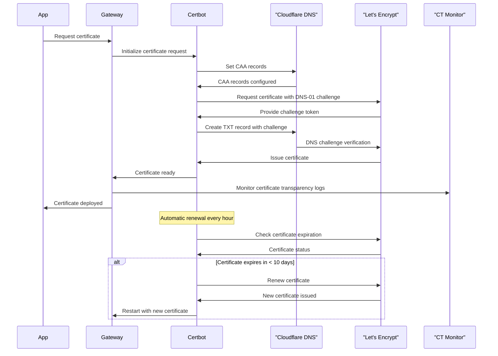

# Gateway Security Overview

In confidential computing architectures, the gateway serves as the critical security perimeter - the trusted bridge between the external world and the confidential virtual machines (CVMs) operating within trusted execution environments. Unlike traditional network gateways that primarily route traffic, a confidential computing gateway must establish, verify, and maintain cryptographic trust relationships while ensuring that only authenticated and authorized entities can access the secure cluster.

The dstack gateway represents a paradigm shift in secure network architecture, combining automated certificate lifecycle management with hardware-backed attestation verification. This creates a zero-trust security model where every connection, whether from external clients or internal CVMs, must be cryptographically verified before being granted access to confidential workloads.

Understanding the gateway's role is fundamental to comprehending dstack's security model: it's not just a network entry point, but a comprehensive security orchestrator that manages identity, encryption, and access control for confidential computing environments. Every certificate issued, every attestation verified, and every connection established flows through carefully designed security protocols that maintain the integrity of the entire system.

## Advanced Certificate Management

The dstack gateway implements comprehensive certificate management through an integrated certbot system that handles automatic certificate provisioning and renewal using Let's Encrypt's ACME protocol.

Certificate management in confidential computing goes far beyond traditional TLS certificates. In dstack's architecture, certificates serve multiple critical functions: they establish secure communication channels, verify the identity of CVMs through RA-TLS (Remote Attestation Transport Layer Security), and provide cryptographic evidence that can be audited and verified by third parties. The gateway's certificate management system is designed to handle these complex requirements while maintaining operational simplicity and security.

The automated nature of dstack's certificate management eliminates human error and ensures consistent security posture across the entire cluster. By integrating directly with Let's Encrypt and DNS providers, the system can respond to security incidents, rotate certificates proactively, and maintain compliance with industry standards without manual intervention.

### Certificate Lifecycle Management

The gateway's certificate management system uses a dedicated CertBot struct that automatically handles the entire certificate lifecycle. The system runs in a continuous loop with configurable renewal intervals , executing post-renewal hooks when certificates are successfully updated.([certbot.rs#L44](https://github.com/Dstack-TEE/dstack/blob/45ebd05a25ad4ffacce3b8f003e4f5a8b609b2e2/certbot/src/bot.rs#L44)).

The system supports automatic account creation, certificate issuance, and renewal with configurable intervals. The renewal process is implemented as a background loop ([certbot.rs#L118](https://github.com/Dstack-TEE/dstack/blob/45ebd05a25ad4ffacce3b8f003e4f5a8b609b2e2/certbot/src/bot.rs#L118)), which periodically checks certificate status and triggers renewal as needed. After a successful renewal, an optional post-renewal hook can be executed for custom actions, with errors and statuses logged for observability.

### DNS-01 Challenge with Cloudflare Integration

The certificate validation process uses DNS-01 challenges, leveraging Cloudflare's DNS API for automated record management. The integration is implemented via the `Dns01Client::new_cloudflare` method, which initializes the DNS-01 client with the configured Cloudflare zone ID and API token ([see source](https://github.com/Dstack-TEE/dstack/blob/45ebd05a25ad4ffacce3b8f003e4f5a8b609b2e2/certbot/src/bot.rs#L76)). This enables the gateway to programmatically create and clean up TXT records required for ACME validation, ensuring seamless and secure certificate issuance.

the system can automatically set CAA (Certificate Authority Authorization) records to enhance security, as implemented in [certbot/src/bot.rs#L61](https://github.com/Dstack-TEE/dstack/blob/45ebd05a25ad4ffacce3b8f003e4f5a8b609b2e2/certbot/src/bot.rs#L61).

### Automatic Renewal Process

Certificates are automatically renewed based on configurable expiration thresholds . The renewal process includes timeout protection and hook execution for post-renewal tasks . The default configuration sets renewal intervals to 1 hour and renewal before expiration to 10 days .

The gateway's certificate renewal logic is implemented as an automated process that periodically checks certificate validity and triggers renewal when the expiration threshold is reached. This is handled in the CertBot component, which logs each renewal check and invokes the ACME client to perform the renewal if needed ([see source](https://github.com/Dstack-TEE/dstack/blob/45ebd05a25ad4ffacce3b8f003e4f5a8b609b2e2/certbot/src/bot.rs#L176)). The renewal interval and expiration threshold are fully configurable, ensuring certificates are always refreshed before expiry without manual intervention.

the renewal process includes timeout protection and, if a post-renewal hook is configured, executes it using a shell command. the system logs when the hook is run, and if the hook fails (either by returning a non-zero status or by failing to execute), an error message is logged with details about the failure.

