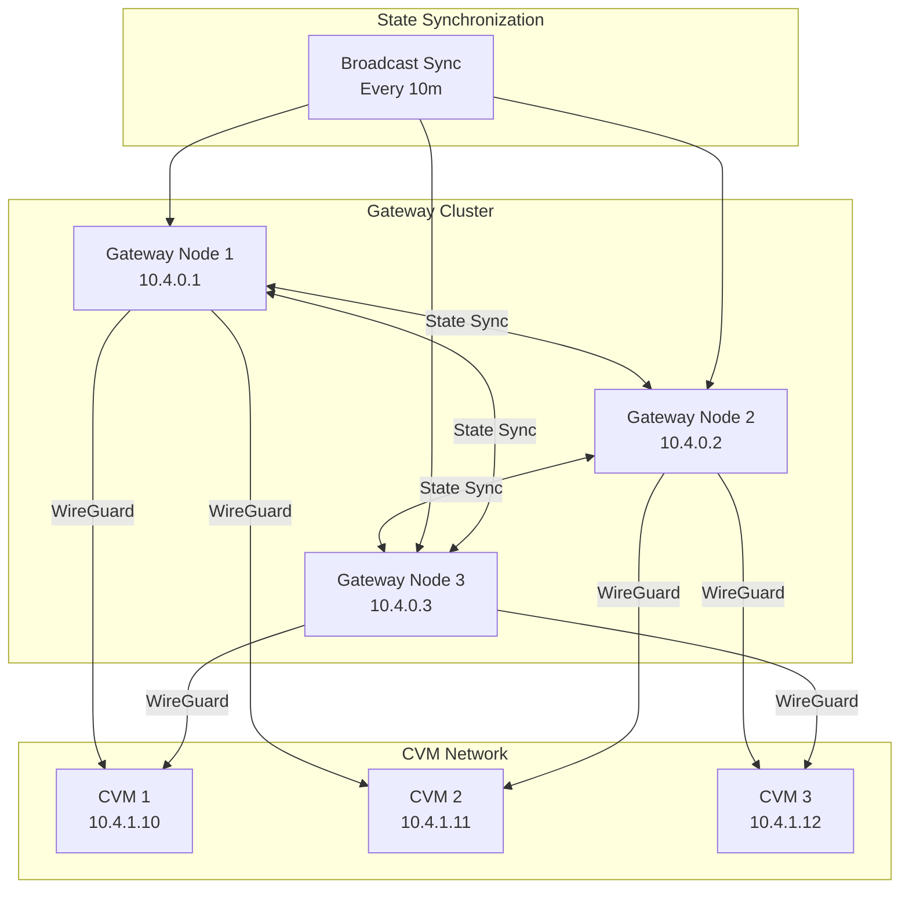

## Gateway Cluster Topology and State Synchronization

The dstack gateway supports distributed deployment through a cluster architecture where multiple gateway nodes synchronize their state to provide redundancy and load balancing.

### Cluster State Management

The gateway maintains its cluster state using a central `ProxyStateMut` structure ([see source](https://github.com/Dstack-TEE/dstack/blob/45ebd05a25ad4ffacce3b8f003e4f5a8b609b2e2/gateway/src/main_service.rs#L57)). This state includes information about other gateway nodes (`nodes`), registered applications (`apps`), CVM instances (`instances`), allocated network addresses, and additional internal tracking fields. By synchronizing this structured state across the cluster, the gateway ensures consistent knowledge of node membership, application registrations, and CVM instance assignments.

each gateway node tracks other nodes in the cluster using a `GatewayNodeInfo` structure ([see source](https://github.com/Dstack-TEE/dstack/blob/45ebd05a25ad4ffacce3b8f003e4f5a8b609b2e2/gateway/src/main_service.rs#L49)), which includes the node's id, url, WireGuard peer information, and last-seen timestamp.

### State Synchronization Protocol

Gateway node state synchronization is achieved via secure RPC channels with mutual TLS authentication, ensuring both confidentiality and strong peer verification. The synchronization client (`SyncClient`) initiates connections to peer nodes using a purpose-built RPC client that strictly enforces certificate-based authentication and validates application identity ([sync client handshake and validation logic](https://github.com/Dstack-TEE/dstack/blob/45ebd05a25ad4ffacce3b8f003e4f5a8b609b2e2/gateway/src/main_service/sync_client.rs#L31C1-L63C6)).  
During the handshake, the client checks that the remote node presents a valid TLS certificate and that the application ID matches the expected cluster identity. If the app ID does not match, the connection is immediately rejected and a log entry records the error.  
This rigorous validation mechanism ensures that only properly authenticated and authorized gateway nodes can participate in the state sync protocol, effectively blocking unauthorized or misconfigured nodes from joining the cluster.

The state sync protocol is engineered for resilience, with built-in timeout protection and comprehensive error handling as detailed in the [sync client async logic](https://github.com/Dstack-TEE/dstack/blob/45ebd05a25ad4ffacce3b8f003e4f5a8b609b2e2/gateway/src/main_service/sync_client.rs#L65C5-L85C6). When a node initiates a sync with a peer, it logs the attempt, enforces a timeout on the operation, and monitors for both timeout and RPC-level errors. If synchronization fails—due to timeout, network issues, or any other error—the system logs the failure with diagnostic details and continues operating, ensuring that cluster stability is not compromised by transient faults or misbehaving nodes. This design guarantees robust, fault-tolerant state propagation across the gateway cluster.

### Node Recycling and Health Monitoring

the gateway automatically removes ("recycles") stale nodes from the cluster based on their last-seen timestamp. as implemented in [main_service.rs#L439C4-L452C10](https://github.com/Dstack-TEE/dstack/blob/45ebd05a25ad4ffacce3b8f003e4f5a8b609b2e2/gateway/src/main_service.rs#L439C4-L452C10), the recycling logic iterates over all known nodes and checks if the time since their last_seen exceeds the configured node_timeout. if a node is considered stale and is not the current node itself, it is removed from the cluster state. this ensures that only healthy, recently active nodes remain in the cluster, improving reliability and preventing issues from unresponsive or disconnected peers.

 node health monitoring is configured in the gateway's toml file under the `[core.recycle]` section ([see gateway.toml](https://github.com/Dstack-TEE/dstack/blob/45ebd05a/gateway/gateway.toml)), which sets parameters such as `interval`, `timeout`, and especially `node_timeout` (e.g., `node_timeout = "10m"`). the gateway tracks each node's last-seen timestamp and automatically recycles (removes) nodes that have not been seen within the `node_timeout` period. this mechanism is implemented in the gateway service using the `GatewayNodeInfo` structure and is part of the cluster state management logic, relying on the gateway's internal state synchronization and recycling packages.

