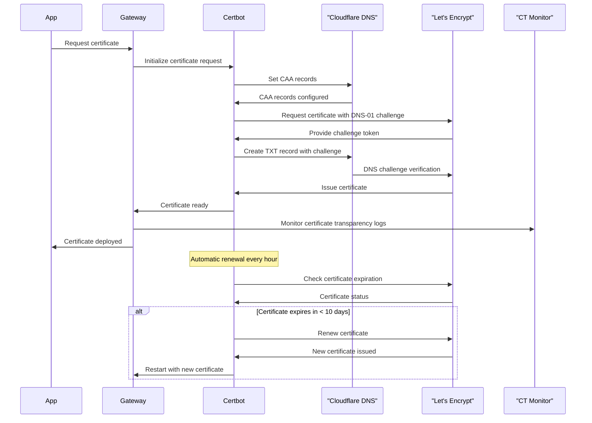
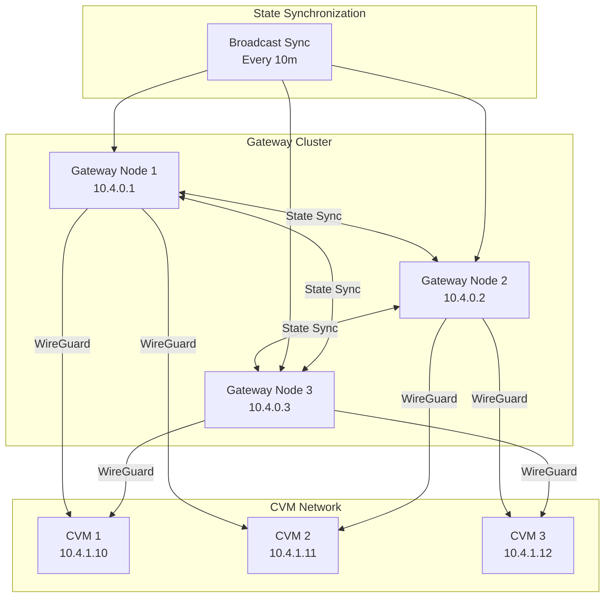
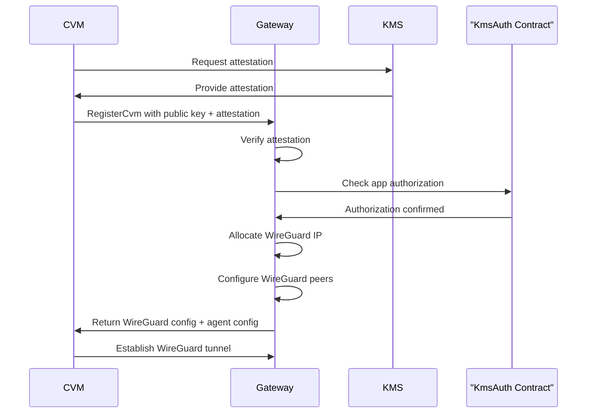

# dstack Gateway Security Architecture

This document provides a comprehensive overview of the dstack gateway's security architecture, covering certificate management, cluster topology, CVM registration, and connection strategies.

## Advanced Certificate Management

The dstack gateway implements comprehensive certificate management through an integrated certbot system that handles automatic certificate provisioning and renewal using Let's Encrypt's ACME protocol.

### Certificate Lifecycle Management

The gateway's certificate management system uses a dedicated CertBot component that automatically handles the entire certificate lifecycle [1](#0-0) . The system supports automatic account creation, certificate issuance, and renewal with configurable intervals [2](#0-1) .

### DNS-01 Challenge with Cloudflare Integration

The certificate validation process uses DNS-01 challenges through Cloudflare DNS API integration [3](#0-2) . The system can automatically set CAA (Certificate Authority Authorization) records to enhance security [4](#0-3) .

### Automatic Renewal Process

Certificates are automatically renewed based on configurable expiration thresholds [5](#0-4) . The renewal process includes timeout protection and hook execution for post-renewal tasks [6](#0-5) .

### RA-TLS Certificate Generation

When running in dstack environment, the gateway uses the guest agent for secure certificate generation with remote attestation capabilities [7](#0-6) . This ensures certificates are generated within the trusted execution environment.

## Gateway Cluster Topology and State Synchronization

The dstack gateway supports distributed deployment through a cluster architecture where multiple gateway nodes synchronize their state to provide redundancy and load balancing.

### Cluster State Management

The gateway maintains cluster state including information about other gateway nodes, registered applications, and CVM instances [8](#0-7) . Each gateway node tracks other nodes in the cluster with their WireGuard peer information and last-seen timestamps [9](#0-8) .

### State Synchronization Protocol

State synchronization between gateway nodes uses secure RPC communication with mutual TLS authentication [10](#0-9) . The synchronization process includes timeout protection and error handling [11](#0-10) .

### Node Recycling and Health Monitoring

The gateway implements automatic node recycling to remove stale nodes from the cluster [12](#0-11) . Node health is monitored through last-seen timestamps with configurable timeout thresholds [13](#0-12) .

## Gateway CVM Registration Process

The CVM (Confidential Virtual Machine) registration process involves remote attestation verification and secure network configuration through WireGuard tunnels.

### Remote Attestation Verification

The gateway implements a RegisterCvm RPC endpoint that verifies CVM attestations before allowing registration [14](#0-13) . The verification process includes checking the attestation against known KMS authorization contracts using the integrated auth client [15](#0-14) .

### WireGuard Network Configuration

Upon successful registration, the gateway allocates IP addresses from configured ranges and sets up WireGuard peer configurations [16](#0-15) . The WireGuard configuration includes public keys, endpoints, and allowed IP ranges for secure communication [17](#0-16) .

### IP Address Allocation

The gateway maintains a pool of allocated IP addresses and ensures no conflicts occur during CVM registration [18](#0-17) . Reserved network ranges are respected to avoid conflicts with gateway infrastructure.

## Gateway Connection Strategies and Load Balancing

The dstack gateway implements intelligent connection management with multiple strategies for distributing traffic across available CVM instances.

### Top-N Selection Strategy

The primary connection strategy uses a top-N selection algorithm that prioritizes instances based on recent WireGuard handshake times [19](#0-18) . The algorithm sorts instances by handshake elapsed time and selects the top N most recently active instances [20](#0-19) .

### Direct Instance Selection

For direct instance access, the gateway provides a direct lookup mechanism that bypasses load balancing [21](#0-20) . This allows applications to connect directly to specific CVM instances when needed.

### Fallback Strategies

When the top-N selection fails or when connect_top_n is set to 0, the gateway falls back to random selection [22](#0-21) . The random selection includes health checks based on WireGuard handshake status [23](#0-22) .

### Connection Health Monitoring

The gateway monitors connection health through WireGuard handshake tracking and connection counting [24](#0-23) . Stale instances are automatically recycled based on configurable timeout thresholds [25](#0-24) .

### Certificate Transparency Monitoring

The gateway integrates with a Certificate Transparency monitoring system that continuously monitors CT logs to detect unauthorized certificate issuance [26](#0-25) . The system validates that only certificates with known public keys are issued, providing protection against certificate-based attacks [27](#0-26) .

<table className="w-full my-4">
  <thead>
    <tr className="bg-gray-100">
      <th className="p-3 text-left">Strategy</th>
      <th className="p-3 text-left">Algorithm</th>
      <th className="p-3 text-left">Health Check</th>
      <th className="p-3 text-left">Fallback</th>
    </tr>
  </thead>
  <tbody>
    <tr>
      <td className="p-3 font-mono">top_n_selection</td>
      <td className="p-3">Latest handshake priority</td>
      <td className="p-3">WireGuard handshake time</td>
      <td className="p-3">Random selection</td>
    </tr>
    <tr className="bg-gray-50">
      <td className="p-3 font-mono">direct_instance</td>
      <td className="p-3">Instance ID lookup</td>
      <td className="p-3">Connection counter</td>
      <td className="p-3">App-level routing</td>
    </tr>
    <tr>
      <td className="p-3 font-mono">localhost_mode</td>
      <td className="p-3">Local development</td>
      <td className="p-3">TCP connection</td>
      <td className="p-3">127.0.0.1:port</td>
    </tr>
    <tr className="bg-gray-50">
      <td className="p-3 font-mono">dns_resolution</td>
      <td className="p-3">TXT record lookup</td>
      <td className="p-3">DNS availability</td>
      <td className="p-3">Connection timeout</td>
    </tr>
  </tbody>
</table>

## Cryptographic Security Implementation

### TLS Configuration and Crypto Providers

The gateway uses rustls with the ring cryptographic provider for all TLS operations [28](#0-27) . Certificate generation leverages RA-TLS capabilities when running in TEE environments, with fallback to KMS-based certificate authority for self-signed certificates [29](#0-28) .

### Proxy Security Architecture

The gateway implements both TLS termination and TLS passthrough modes based on SNI analysis [30](#0-29) . Connection handling includes comprehensive timeout management and secure connection lifecycle management [31](#0-30) .

## Notes

This document covers the security architecture of the dstack gateway, which serves as the entry point for external traffic to applications running in Confidential Virtual Machines. The gateway provides comprehensive security through automated certificate management, secure cluster communication, remote attestation verification, and intelligent load balancing. The implementation uses industry-standard protocols like ACME, WireGuard, and mutual TLS authentication to ensure secure communication throughout the system.

The configuration parameters mentioned in this document can be customized through the gateway configuration file [32](#0-31) , allowing operators to tune the security and performance characteristics according to their specific deployment requirements.

The security model is built on the principle of zero trust, where every component must be authenticated and authorized before being granted access to the network. Remote attestation ensures that only genuine TEE instances can register with the gateway, while Certificate Transparency monitoring provides ongoing security assurance against certificate-based attacks.