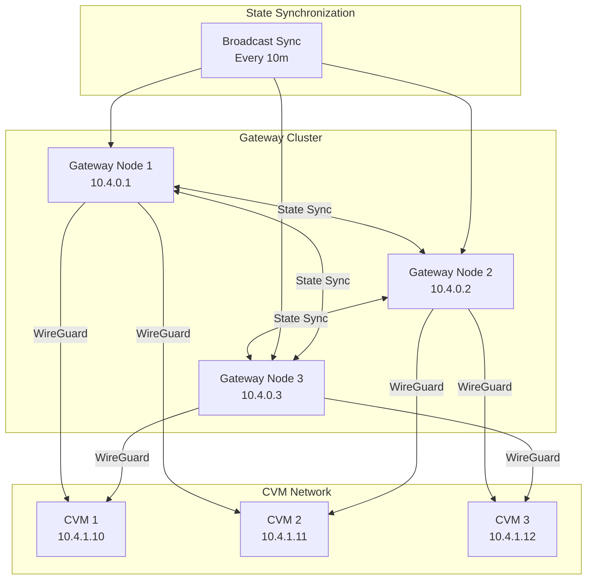
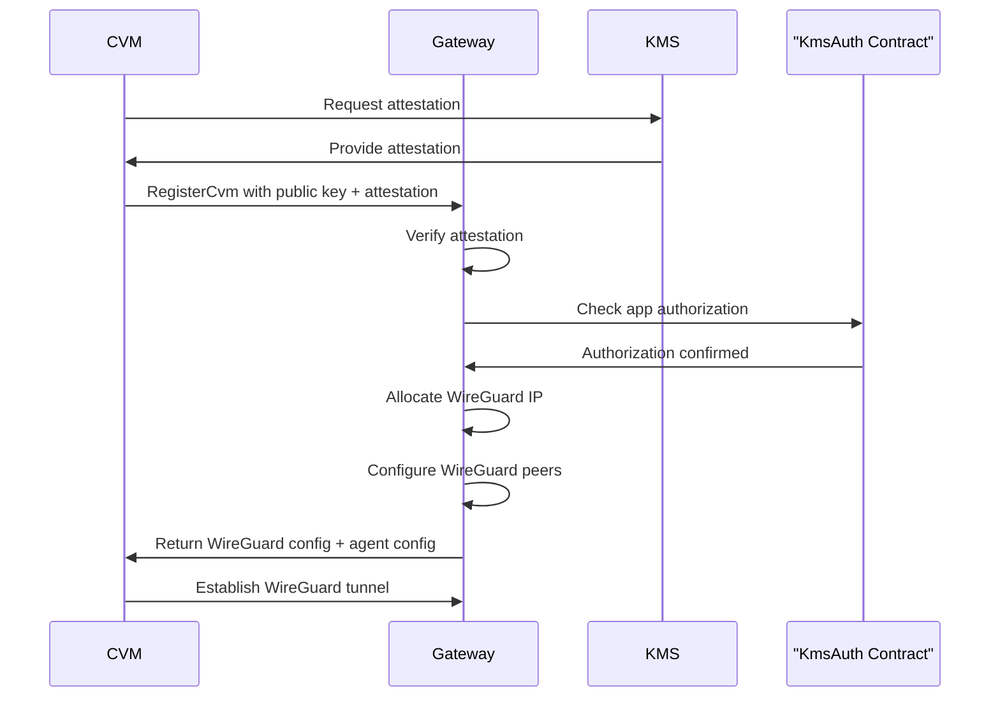

## Gateway Cluster Topology and State Synchronization

The dstack gateway supports distributed deployment through a cluster architecture where multiple gateway nodes synchronize their state to provide redundancy and load balancing.

### Cluster State Management

The gateway maintains its cluster state using a central `ProxyStateMut` structure ([see source](https://github.com/Dstack-TEE/dstack/blob/45ebd05a25ad4ffacce3b8f003e4f5a8b609b2e2/gateway/src/main_service.rs#L57)). This state includes information about other gateway nodes (`nodes`), registered applications (`apps`), CVM instances (`instances`), allocated network addresses, and additional internal tracking fields. By synchronizing this structured state across the cluster, the gateway ensures consistent knowledge of node membership, application registrations, and CVM instance assignments.

each gateway node tracks other nodes in the cluster using a `GatewayNodeInfo` structure ([see source](https://github.com/Dstack-TEE/dstack/blob/45ebd05a25ad4ffacce3b8f003e4f5a8b609b2e2/gateway/src/main_service.rs#L49)), which includes the node's id, url, WireGuard peer information, and last-seen timestamp.

### State Synchronization Protocol

Gateway node state synchronization is achieved via secure RPC channels with mutual TLS authentication, ensuring both confidentiality and strong peer verification. The synchronization client (`SyncClient`) initiates connections to peer nodes using a purpose-built RPC client that strictly enforces certificate-based authentication and validates application identity ([sync client handshake and validation logic](https://github.com/Dstack-TEE/dstack/blob/45ebd05a25ad4ffacce3b8f003e4f5a8b609b2e2/gateway/src/main_service/sync_client.rs#L31C1-L63C6)).  
During the handshake, the client checks that the remote node presents a valid TLS certificate and that the application ID matches the expected cluster identity. If the app ID does not match, the connection is immediately rejected and a log entry records the error.  
This rigorous validation mechanism ensures that only properly authenticated and authorized gateway nodes can participate in the state sync protocol, effectively blocking unauthorized or misconfigured nodes from joining the cluster.

The state sync protocol is engineered for resilience, with built-in timeout protection and comprehensive error handling as detailed in the [sync client async logic](https://github.com/Dstack-TEE/dstack/blob/45ebd05a25ad4ffacce3b8f003e4f5a8b609b2e2/gateway/src/main_service/sync_client.rs#L65C5-L85C6). When a node initiates a sync with a peer, it logs the attempt, enforces a timeout on the operation, and monitors for both timeout and RPC-level errors. If synchronization fails—due to timeout, network issues, or any other error—the system logs the failure with diagnostic details and continues operating, ensuring that cluster stability is not compromised by transient faults or misbehaving nodes. This design guarantees robust, fault-tolerant state propagation across the gateway cluster.

### Node Recycling and Health Monitoring

the gateway automatically removes ("recycles") stale nodes from the cluster based on their last-seen timestamp. as implemented in [main_service.rs#L439C4-L452C10](https://github.com/Dstack-TEE/dstack/blob/45ebd05a25ad4ffacce3b8f003e4f5a8b609b2e2/gateway/src/main_service.rs#L439C4-L452C10), the recycling logic iterates over all known nodes and checks if the time since their last_seen exceeds the configured node_timeout. if a node is considered stale and is not the current node itself, it is removed from the cluster state. this ensures that only healthy, recently active nodes remain in the cluster, improving reliability and preventing issues from unresponsive or disconnected peers.

 node health monitoring is configured in the gateway's toml file under the `[core.recycle]` section ([see gateway.toml](https://github.com/Dstack-TEE/dstack/blob/45ebd05a/gateway/gateway.toml)), which sets parameters such as `interval`, `timeout`, and especially `node_timeout` (e.g., `node_timeout = "10m"`). the gateway tracks each node's last-seen timestamp and automatically recycles (removes) nodes that have not been seen within the `node_timeout` period. this mechanism is implemented in the gateway service using the `GatewayNodeInfo` structure and is part of the cluster state management logic, relying on the gateway's internal state synchronization and recycling packages.




--- 
## Gateway CVM Registration Process

a CVM, or confidential virtual machine, is a virtual machine that runs inside a trusted execution environment (TEE) such as Intel TDX, providing hardware-enforced isolation and cryptographic protection for its code and data—even from the host or hypervisor. in dstack, CVMs are the core compute units that participate in the secure cluster, and their integrity is critical for trustless operation between nodes.

to ensure that only trusted CVMs can join and communicate within the gateway cluster, every CVM must go through a registration process. this process requires the CVM to prove its trustworthiness via remote attestation (demonstrating it is running genuine, unmodified code inside a TEE) and to establish a secure, encrypted network channel using wireguard tunnels. wireguard provides authenticated, high-performance VPN connections between the gateway and each registered CVM, ensuring that all traffic is protected from eavesdropping or tampering.

this registration process is essential for enabling trustless synchronization and secure communication between nodes in the dstack gateway architecture—only CVMs that have passed attestation and are properly registered are allowed to participate in the cluster and exchange state or data.

### Remote Attestation Verification

remote attestation verification is a critical security step in the gateway's CVM registration process. its primary purpose is to ensure that only trusted, hardware-backed confidential virtual machines (CVMs) are allowed to join the cluster. this mechanism prevents unauthorized or potentially compromised VMs from gaining access to sensitive network resources, enforcing a strong trust boundary at the point of entry.

conceptually, remote attestation is a cryptographic protocol where a CVM proves to the gateway that it is running genuine, unmodified code inside a trusted execution environment (TEE), such as Intel TDX. the CVM generates an attestation report (or "quote") that includes measurements of its software stack and environment, which are then cryptographically signed by the TEE hardware. this report serves as verifiable evidence of the CVM's integrity and identity.

the gateway's [RegisterCvm RPC endpoint](https://github.com/Dstack-TEE/dstack/blob/45ebd05a25ad4ffacce3b8f003e4f5a8b609b2e2/gateway/src/main_service.rs#L12C1-L17C3) (see the `RegisterCvmRequest` and related types) is responsible for handling CVM registration requests. as part of this process, the endpoint requires the CVM to submit its attestation evidence. the gateway then performs a series of verification steps:

- it validates the cryptographic signature of the attestation report to ensure it was produced by genuine TEE hardware.
- it checks the measurements and configuration values in the report against expected values, confirming that the CVM is running approved code and has not been tampered with.
- it verifies that the attestation is fresh and not a replay of an old or compromised report.

in addition to these technical checks, the gateway also integrates with the KMS authorization system. using the built-in auth client, the gateway cross-references the attestation evidence with known KMS authorization contracts. this step ensures that the CVM is not only technically valid, but also explicitly authorized to join the cluster according to organizational policy.

only after all these verification steps succeed does the gateway allow the CVM to complete registration and participate in the secure network. this layered approach to attestation and authorization is fundamental to maintaining the security and integrity of the gateway cluster.

### WireGuard Network Configuration

WireGuard is a modern, high-performance VPN protocol that provides secure, encrypted tunnels between network peers using state-of-the-art cryptography. In the dstack gateway architecture, WireGuard is used to establish private, authenticated connections between the gateway and registered confidential virtual machines (CVMs), ensuring that all traffic within the cluster is protected from eavesdropping and tampering.

After a CVM successfully completes remote attestation and registration, the gateway allocates an IP address for the CVM from a configured address pool and generates a WireGuard peer configuration. This configuration includes the CVM's public key, the gateway's endpoint information, and the allowed IP ranges for secure communication. These parameters ensure that only authorized CVMs can participate in the cluster and that network isolation is strictly enforced.

The WireGuard network settings—such as the interface, listen port, key material, and IP ranges—are defined in the gateway's configuration file. For a detailed example of these settings, see the [gateway.toml configuration](https://github.com/Dstack-TEE/dstack/blob/45ebd05a/gateway/gateway.toml), specifically the `[core.wg]` section. This configuration governs how the gateway manages WireGuard peers, allocates client IPs, and maintains secure connectivity for all registered CVMs.


<span style={{ color: '#6B7280' }}>
  the following diagram illustrates the CVM registration and secure network setup process: the confidential virtual machine (CVM) first requests attestation from the KMS, which provides the attestation evidence. the CVM then registers with the gateway, submitting its public key and attestation. the gateway verifies the attestation, checks application authorization with the KmsAuth contract, and upon confirmation, allocates a WireGuard IP and configures WireGuard peers. finally, the gateway returns the WireGuard and agent configuration to the CVM, which then establishes a secure WireGuard tunnel with the gateway.
</span>


---


## Gateway Connection Strategies and Load Balancing

if you aren't familiar with the concept of a gateway in confidential computing, it's the component that acts as a secure entry point for network traffic destined for confidential virtual machines (CVMs) within a cluster. the gateway is responsible for authenticating, authorizing, and securely routing connections to the appropriate CVM instances, enforcing both network isolation and policy controls.

connection strategies in this context refer to the algorithms and mechanisms the gateway uses to decide *which* CVM instance should handle a given incoming connection. this is especially important in environments where multiple CVMs are available for the same application or service, and the system must balance load, optimize performance, and maintain security guarantees.

the dstack gateway implements a set of advanced connection management strategies to efficiently distribute traffic and maintain high availability:

- **top-n selection**: the gateway tracks the most recent WireGuard handshake times for all registered CVMs. when a new connection request arrives, it sorts the available instances by handshake recency and selects the top N most recently active CVMs. this approach prioritizes instances that are known to be healthy and responsive, reducing connection latency and avoiding stale or disconnected peers.
- **direct instance selection**: for scenarios requiring deterministic routing (such as session stickiness or debugging), the gateway allows direct lookup and connection to a specific CVM instance by its unique identifier, bypassing the load balancer.
- **randomized fallback**: if the top-n selection yields no healthy candidates (e.g., all are stale or unreachable), or if the configuration disables top-n, the gateway falls back to random selection among all available CVMs, with additional health checks based on WireGuard handshake status to avoid routing to dead peers.
- **connection health monitoring**: the gateway continuously monitors the health of each CVM connection using WireGuard handshake timestamps and connection counters. instances that fail to respond or become stale are automatically removed or recycled according to configurable timeout policies.
- **certificate transparency monitoring**: to defend against certificate-based attacks, the gateway integrates with a certificate transparency (CT) monitoring system, ensuring that only certificates with known, authorized public keys are accepted for CVM connections.

these strategies work together to provide robust, secure, and efficient connection management for confidential workloads, ensuring that only healthy, authorized CVMs receive traffic and that the system can adapt to failures or dynamic scaling events in real time.

Below are several recommended connection management strategies available in the dstack gateway. Each approach is designed to address different operational and security needs, and can be selected or combined based on your deployment requirements:

1. **Top-N Selection Strategy**  
   the primary connection strategy in the dstack gateway uses a top-n selection algorithm that prioritizes confidential virtual machine (CVM) instances based on recent WireGuard handshake times ([main_service.rs:286-335](https://github.com/Dstack-TEE/dstack/blob/45ebd05a25ad4ffacce3b8f003e4f5a8b609b2e2/gateway/src/main_service.rs#L286)). when a new connection request arrives, the gateway checks the latest handshake times for all CVMs associated with the requested application, sorts these instances by handshake elapsed time, and selects the top N most recently active instances (as configured by `connect_top_n`). this ensures that traffic is routed to peers that are known to be alive and responsive, minimizing latency and avoiding stale or unreachable instances.

   the algorithm for sorting and selecting the top N instances is implemented as follows ([main_service.rs:329-334](https://github.com/Dstack-TEE/dstack/blob/45ebd05a25ad4ffacce3b8f003e4f5a8b609b2e2/gateway/src/main_service.rs#L329C5-L335C6)):

   [See implementation in gateway/src/main_service.rs (permalink)](https://github.com/Dstack-TEE/dstack/blob/45ebd05a25ad4ffacce3b8f003e4f5a8b609b2e2/gateway/src/main_service.rs#L329C5-L335C6):

   ```rust
   instances.sort_by(|a, b| a.1.cmp(&b.1));
   instances.truncate(n);
   Ok(instances
       .into_iter()
       .map(|(ip, _, counter)| AddressInfo { ip, counter })
       .collect())
   ```

   if the top-n cache is still valid (i.e., not expired), the gateway reuses the cached selection for efficiency. if handshake data cannot be retrieved (for example, due to an error), the gateway logs a warning and falls back to random selection among available instances. if `connect_top_n` is set to 0, the system also defaults to random selection. for localhost development, a special case routes traffic directly to `127.0.0.1`.

   for implementation details, see [`select_top_n_hosts`](https://github.com/Dstack-TEE/dstack/blob/45ebd05a25ad4ffacce3b8f003e4f5a8b609b2e2/gateway/src/main_service.rs#L286).

2. **Direct Instance Selection**  
   sometimes you need to connect to a specific CVM instance instead of letting the gateway's load balancer decide. this is useful for debugging, session stickiness, or when deterministic routing is required. the dstack gateway enables this by allowing you to provide the unique identifier of a CVM instance; when you do, the gateway bypasses its normal load balancing and routes the connection directly to that instance. this gives you precise control over which CVM handles your request.

   the direct instance selection logic is implemented by checking for a specific instance ID and, if present, returning the corresponding connection details. see the implementation in [`main_service.rs` (permalink)](https://github.com/Dstack-TEE/dstack/blob/45ebd05a25ad4ffacce3b8f003e4f5a8b609b2e2/gateway/src/main_service.rs#L329C5-L335C6). this mechanism ensures that applications or operators can always target a particular CVM when needed, without interference from the load balancer.

3. **Fallback Strategies**  
   if the top-n selection does not return any healthy CVMs (for example, if all candidates are stale, unreachable, or if `connect_top_n` is set to 0), the gateway switches to a fallback strategy. 
   
   [See fallback implementation in gateway/src/main_service.rs (permalink)](https://github.com/Dstack-TEE/dstack/blob/45ebd05a25ad4ffacce3b8f003e4f5a8b609b2e2/gateway/src/main_service.rs#L301):

   ```rust
   if n == 0 {
            // fallback to random selection
            return Ok(self.random_select_a_host(id).unwrap_or_default());
        }
   ```
   
   in this mode, the gateway randomly selects from all available CVMs, but before making a selection, it checks the WireGuard handshake status for each instance to verify health ([see implementation](https://github.com/Dstack-TEE/dstack/blob/45ebd05a25ad4ffacce3b8f003e4f5a8b609b2e2/gateway/src/main_service.rs#L337C5-L350C1)). only CVMs with recent, valid handshakes are considered eligible, so traffic is never routed to dead or unresponsive instances even when falling back to random selection.


4. **connection health monitoring**  
   the gateway continuously monitors the health of each CVM instance by tracking WireGuard handshake timestamps and connection activity. if an instance is found to be stale—meaning its last handshake exceeds a configurable timeout—the gateway automatically recycles and removes it from the active pool. this recycling and removal process is logged (see [main_service.rs:454-485](https://github.com/Dstack-TEE/dstack/blob/45ebd05a25ad4ffacce3b8f003e4f5a8b609b2e2/gateway/src/main_service.rs#L454C7-L485C6)), ensuring visibility and auditability. after recycling, the WireGuard peer set is reconfigured to reflect the updated state, so only healthy, responsive CVMs are available for new connections. 

   these health check and recycling behaviors are fully configurable in the gateway’s toml configuration file, especially under the `[core.recycle]` section. for example:
   ```toml
   [core.recycle]
   enabled = true
   interval = "5m"
   timeout = "10h"
   node_timeout = "10m"
   ```
   for a complete reference configuration, see the [gateway.toml example](https://github.com/Dstack-TEE/dstack/blob/45ebd05a/gateway/gateway.toml).
   you can adjust the recycling interval, timeouts, and enable/disable the feature as needed for your deployment. this automated health monitoring and recycling mechanism helps maintain a robust, reliable set of CVM endpoints without manual intervention.

5. **Certificate Transparency Monitoring**  
   To defend against certificate-based attacks, the gateway integrates with a Certificate Transparency (CT) monitoring system. This system continuously checks CT logs for unauthorized certificate issuance and ensures that only certificates with known, authorized public keys are accepted for CVM connections. This provides an additional layer of protection against malicious or misissued certificates.


---


## Cryptographic Security Implementation

### TLS Configuration and Crypto Providers

The gateway uses rustls with the ring cryptographic provider for all TLS operations [28](#0-27) . Certificate generation leverages RA-TLS capabilities when running in TEE environments, with fallback to KMS-based certificate authority for self-signed certificates [29](#0-28) .

### Proxy Security Architecture

The gateway implements both TLS termination and TLS passthrough modes based on SNI analysis [30](#0-29) . Connection handling includes comprehensive timeout management and secure connection lifecycle management [31](#0-30) .

## Notes

This document covers the security architecture of the dstack gateway, which serves as the entry point for external traffic to applications running in Confidential Virtual Machines. The gateway provides comprehensive security through automated certificate management, secure cluster communication, remote attestation verification, and intelligent load balancing. The implementation uses industry-standard protocols like ACME, WireGuard, and mutual TLS authentication to ensure secure communication throughout the system.

The configuration parameters mentioned in this document can be customized through the gateway configuration file [32](#0-31) , allowing operators to tune the security and performance characteristics according to their specific deployment requirements.

The security model is built on the principle of zero trust, where every component must be authenticated and authorized before being granted access to the network. Remote attestation ensures that only genuine TEE instances can register with the gateway, while Certificate Transparency monitoring provides ongoing security assurance against certificate-based attacks.