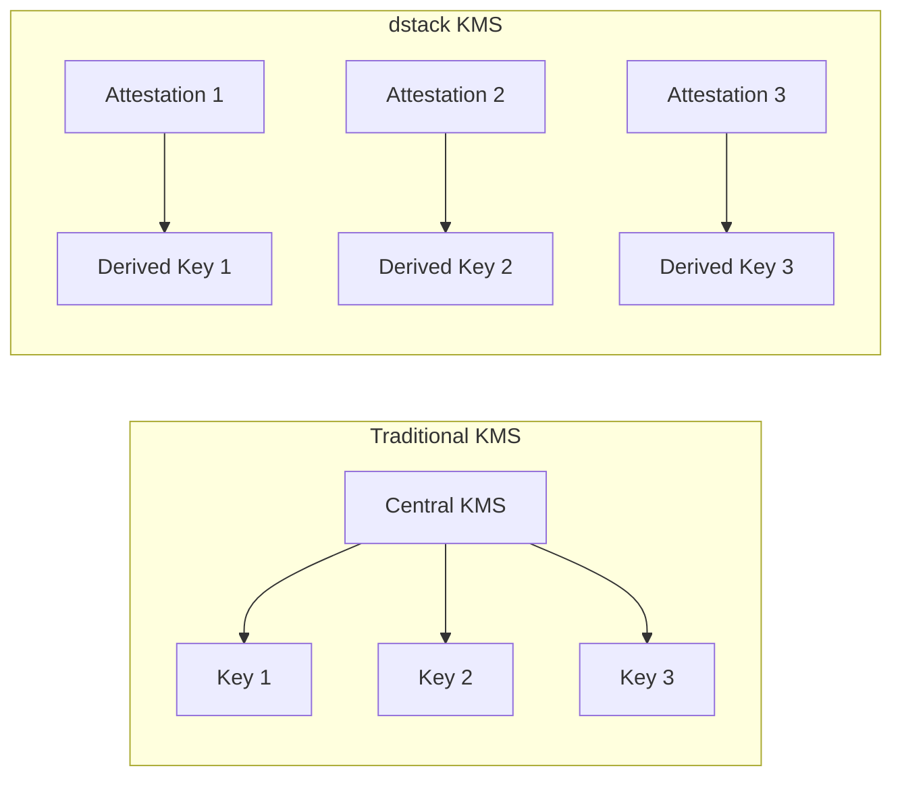

# KMS Security Architecture

<Callout type="info" icon="key">
**Component**: `dstack-kms` | [View Source](https://github.com/Dstack-TEE/dstack/tree/master/kms)
</Callout>

## Overview

The Key Management Service (KMS) implements decentralized, attestation-based key management for dstack. Unlike traditional centralized KMS solutions, dstack-kms operates through hardware-backed key derivation using Intel TDX attestation. The system derives keys deterministically from hardware measurements, eliminating single points of failure while providing cryptographic guarantees. [1](#0-0) 

## Why Decentralized Key Management?

### The Problem with Centralized KMS

Traditional key management systems create critical vulnerabilities through centralized storage and trust requirements. The dstack approach eliminates these issues by deriving keys on-demand from hardware attestation data rather than storing them centrally.

### dstack's Solution

The system supports three security modes with increasing trust guarantees: Non-KMS Mode (ephemeral keys), Local-Key-Provider Mode (SGX-sealed keys), and KMS Mode (blockchain-authorized keys with upgrade capability). [2](#0-1) 

## Security Architecture

### Hardware-Backed Key Derivation Model

The core security foundation relies on HKDF-SHA256 key derivation using hardware measurements as input key material. The system uses a salt value "RATLS" and context data including application identifiers to ensure key isolation. [3](#0-2) 

Key derivation occurs through hierarchical key expansion where parent keys generate child keys using specific context data. This ensures deterministic key generation while maintaining cryptographic separation between applications. [4](#0-3) 

### Trust Model

The security model establishes trust through four fundamental principles:

1. **Hardware Root**: Keys derived from CPU measurements (MRTD) and runtime measurements (RTMR0-3) [5](#0-4) 
2. **No Persistence**: Keys regenerated on demand from attestation data
3. **Attestation Gated**: Only verified CVMs with valid TDX quotes can access keys [6](#0-5) 
4. **Deterministic**: Same measurements produce identical keys across instances

## Implementation Details

### Cryptographic Key Hierarchy

The system implements a hierarchical key structure where the KMS maintains root keys that derive application-specific keys. The root CA key generates X.509 certificates while the K256 root key creates Ethereum-compatible signing keys. [7](#0-6) 

Application keys are derived using context data that includes app ID and instance ID, ensuring cryptographic isolation between different applications and instances. [8](#0-7) 

### Secure Key Generation Process

The key generation process begins with TDX attestation verification where the system validates the quote signature, checks TCB status, and replays event logs to verify runtime measurements. [9](#0-8) 

After successful attestation, the system derives multiple key types for different purposes including disk encryption keys, environment encryption keys, and signing keys. Each key serves a specific cryptographic purpose with appropriate usage restrictions. [10](#0-9) 

## Security Properties

### Cryptographic Guarantees

The implementation provides comprehensive cryptographic protection through multiple algorithms and standards:

**Confidentiality**: Environment encryption uses X25519 key exchange with ChaCha20-Poly1305 for authenticated encryption [11](#0-10) 

**Integrity**: Message authentication uses Keccak256 hashing with ECDSA signatures for tamper detection [12](#0-11) 

**Authenticity**: ECDSA P-256 signatures provide non-repudiation using K256 elliptic curve cryptography [13](#0-12) 

**Forward Secrecy**: Keys are derived fresh from attestation data rather than persisted long-term

### Attack Resistance

The architecture resists multiple attack vectors through defense-in-depth strategies:

**Key Extraction**: Keys exist only within TEE memory and are never persisted to disk in plaintext

**Replay Attacks**: Fresh nonces and timestamps prevent replay of attestation data [14](#0-13) 

**Rollback**: Version binding in measurements prevents downgrade attacks [15](#0-14) 

**Side Channels**: Constant-time operations in cryptographic libraries mitigate timing attacks

## Integration with Blockchain Authorization

### Smart Contract Security Controls

The system integrates with Ethereum-compatible blockchains through KmsAuth and AppAuth smart contracts that provide decentralized authorization policies. The KmsAuth contract maintains registries of allowed KMS instances, OS images, and application configurations. [16](#0-15) 

Application-specific authorization occurs through AppAuth contracts that control allowed compose hashes, device restrictions, and upgrade policies. The contract implements owner-based access control with the ability to permanently disable upgrades for enhanced security. [17](#0-16) 

### Attestation Verification Pipeline

The authorization pipeline validates applications through multiple checkpoints: TDX quote verification, measurement validation against allowed lists, and smart contract permission checks before key provisioning. [18](#0-17) 

## Certificate Management and RA-TLS

### Remote Attestation TLS Implementation

The system implements Remote Attestation TLS (RA-TLS) where X.509 certificates embed TDX quotes and event logs as custom extensions. This enables cryptographic verification of both certificate authenticity and underlying TEE measurements. [19](#0-18) 

Certificate signing requests include attestation data that is cryptographically verified before certificate issuance. The verification process ensures that only legitimate TEE applications can obtain valid certificates. [20](#0-19) 

### Custom OID Extensions

The implementation uses custom Object Identifiers (OIDs) to embed security-critical data within certificates: quote data (1.3.6.1.4.1.62397.1.1), event logs (1.3.6.1.4.1.62397.1.2), application identifiers (1.3.6.1.4.1.62397.1.3), and certificate usage restrictions (1.3.6.1.4.1.62397.1.4). [21](#0-20) 

## Verification Procedures

### Security Audit Methodology

For comprehensive security verification, auditors should examine the attestation verification logic that validates TDX quotes, checks measurement whitelists, and ensures proper event log replay. The system provides deterministic key derivation that can be verified through repeated operations with identical inputs. [22](#0-21) 

### Measurement Validation Process

The verification process requires validating four categories of measurements: MRTD (virtual firmware), RTMR0 (hardware configuration), RTMR1 (kernel), RTMR2 (boot parameters), and RTMR3 (application data). Each measurement type serves a specific security purpose in establishing the trust chain. [23](#0-22) 

Independent verification is possible by building the OS image from source code and calculating expected measurements using the dstack-mr tool, then comparing against live attestation data. [24](#0-23) 

## Performance and Scalability

### Cryptographic Performance

The key derivation process using HKDF-SHA256 provides efficient key generation with minimal computational overhead. The system supports concurrent key derivation operations while maintaining cryptographic security guarantees.

### Distributed KMS Architecture

The KMS supports self-replication where new instances can obtain root keys from existing instances through authenticated channels. This enables horizontal scaling while maintaining security through attestation-based authentication. [25](#0-24) 

## Security Best Practices

### Key Usage Guidelines

Applications should follow the principle of least privilege by requesting only necessary keys and implementing proper key rotation policies. The system provides purpose-specific keys that should be used only for their intended cryptographic operations.

### Attestation Policy Management

Organizations should maintain strict attestation policies that specify allowed measurements, TCB versions, and application configurations. Regular policy reviews ensure continued security as the threat landscape evolves.

### Monitoring and Auditing

The system supports comprehensive audit logging of key derivation events, attestation validations, and authorization decisions. Organizations should implement monitoring for anomalous access patterns and policy violations.

## Integration Security Considerations

### Application Integration

Applications must properly verify certificate chains and validate attestation data when establishing trust relationships. The signature verification process requires checking the complete chain from the message signature back to the registered KMS root key. [26](#0-25) 

### Network Security

All KMS communications occur over RA-TLS connections that provide mutual authentication and transport security. The system validates both client and server attestation before establishing secure channels.

## Threat Model and Limitations

### Assumed Threats

The security model assumes attackers may compromise host systems, network infrastructure, and external services while maintaining trust in TEE hardware, attestation infrastructure, and properly configured smart contracts.

### Security Boundaries

The system protects against unauthorized key access, attestation forgery, and policy bypass while requiring proper TEE hardware, secure boot processes, and trusted attestation verification.

## References and Further Investigation

For detailed security analysis, examine the core cryptographic implementations in the ra-tls module, key derivation functions in the KMS service, and attestation verification logic. The smart contract implementations provide authorization policy enforcement mechanisms.

**Primary Security Components:**
- Key Derivation: [27](#0-26) 
- Attestation Verification: [28](#0-27) 
- Certificate Management: [29](#0-28) 
- Authorization Logic: [30](#0-29) 

**Security Standards and References:**
- NIST SP 800-56C Rev. 2 for Key Derivation Functions
- RFC 5869 for HMAC-based Key Derivation Function (HKDF)
- Intel TDX Attestation Specification
- Ethereum Smart Contract Security Best Practices

  

    <strong>Next Component:</strong> See how derived keys protect traffic in the <a href="/docs/security-research/gateway-security" className="underline">Gateway security architecture</a>.
  

## References

- [NIST SP 800-56C Rev. 2](https://csrc.nist.gov/publications/detail/sp/800-56c/rev-2/final)
- [dstack KMS Design](https://github.com/Dstack-TEE/dstack/blob/master/kms/DESIGN.md)
- [Key Derivation Functions](https://nvlpubs.nist.gov/nistpubs/Legacy/SP/nistspecialpublication800-108.pdf)

  

    <strong>Next Component:</strong> See how derived keys protect traffic in the <a href="/docs/security-research/gateway-security" className="underline">Gateway security architecture</a>.
  

 