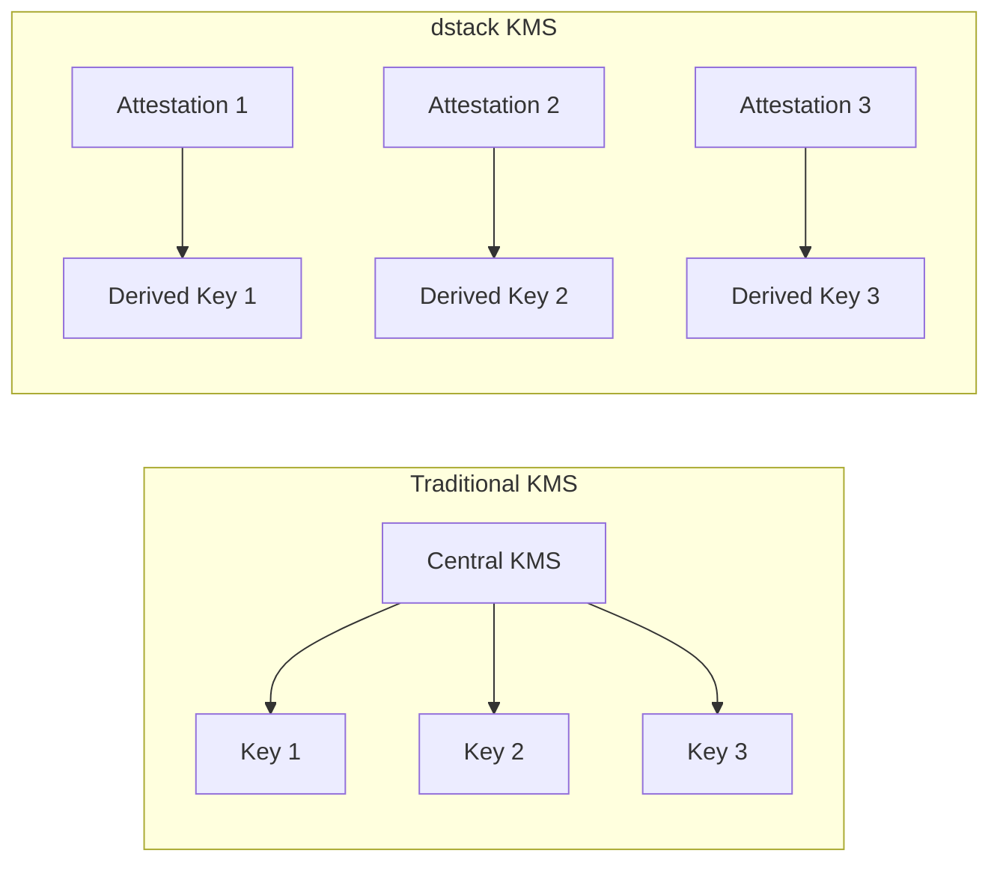

# KMS Security Architecture

<Callout type="info" icon="key">
**Component**: `dstack-kms` | [View Source](https://github.com/Dstack-TEE/dstack/tree/master/kms)
</Callout>

## Overview

The Key Management Service (KMS) implements decentralized, attestation-based key management for dstack. Unlike traditional centralized KMS solutions, dstack-kms:

- Derives keys from hardware measurements
- Requires attestation for key access
- Eliminates single points of failure
- Provides deterministic key generation

## Why Decentralized Key Management?

### The Problem with Centralized KMS

Traditional key management systems create critical vulnerabilities:

1. **Single point of failure**: One compromised KMS exposes all keys
2. **Trust requirements**: Must trust the KMS operator
3. **Availability risks**: KMS downtime blocks all operations
4. **Vendor lock-in**: Keys tied to specific providers

### dstack's Solution



## Security Architecture

### Key Derivation Model

```rust
// From kms/src/derive.rs
pub fn derive_key(
    attestation: &AttestationQuote,
    key_id: &KeyId,
    context: &[u8],
) -> Result<DerivedKey> {
    // 1. Verify attestation validity
    verify_attestation(attestation)?;
    
    // 2. Extract measurements
    let measurements = attestation.get_measurements();
    
    // 3. Derive key using HKDF
    let key_material = hkdf_derive(
        measurements.mrtd,
        measurements.mrconfigid,
        key_id,
        context,
    )?;
    
    Ok(DerivedKey::new(key_material))
}
```

### Trust Model

1. **Hardware Root**: Keys derived from CPU measurements
2. **No Persistence**: Keys regenerated on demand
3. **Attestation Gated**: Only verified CVMs can access keys
4. **Deterministic**: Same measurements = same keys

## Implementation Details

### Key Hierarchy

```
Root Key (Hardware Sealed)
    ├── Encryption Keys
    │   ├── Data Encryption Key (DEK)
    │   └── Key Encryption Key (KEK)
    ├── Signing Keys
    │   ├── Certificate Signing
    │   └── Code Signing
    └── Application Keys
        ├── Database Keys
        └── API Keys
```

### Secure Key Generation

```rust
// From kms/src/keygen.rs
pub struct KeyDerivationParams {
    // Base measurements from attestation
    mrtd: [u8; 48],
    mrconfigid: [u8; 48],
    
    // Key-specific parameters
    key_id: KeyId,
    algorithm: KeyAlgorithm,
    key_usage: KeyUsage,
    
    // Additional entropy
    nonce: [u8; 32],
}

impl KeyDerivationParams {
    pub fn derive(&self) -> Result<Key> {
        // Combine all inputs
        let mut kdf_input = Vec::new();
        kdf_input.extend_from_slice(&self.mrtd);
        kdf_input.extend_from_slice(&self.mrconfigid);
        kdf_input.extend_from_slice(&self.key_id.to_bytes());
        kdf_input.extend_from_slice(&self.nonce);
        
        // Derive key material
        let key_material = Hkdf::<Sha384>::new(None, &kdf_input)
            .expand(&self.algorithm.info(), self.algorithm.key_size())?;
            
        Ok(Key::new(self.algorithm, key_material))
    }
}
```

## Security Properties

### Cryptographic Guarantees

| Property | Implementation |
|----------|----------------|
| **Confidentiality** | AES-256-GCM encryption |
| **Integrity** | HMAC-SHA384 |
| **Authenticity** | ECDSA P-384 signatures |
| **Forward Secrecy** | Ephemeral key generation |
| **Key Isolation** | Per-CVM key derivation |

### Attack Resistance

1. **Key Extraction**: Keys never exist outside TEE
2. **Replay Attacks**: Fresh nonces in derivation
3. **Rollback**: Version binding in measurements
4. **Side Channels**: Constant-time operations

## Integration with Blockchain

### Anchor Points

```rust
// From kms/src/blockchain.rs
pub struct KeyAnchor {
    // On-chain commitment
    measurement_hash: H256,
    block_height: u64,
    timestamp: u64,
    
    // Verification data
    merkle_proof: Vec<H256>,
    attestation_quote: Vec<u8>,
}
```

This provides:
- Immutable audit trail
- Timestamp verification
- Cross-system key coordination
- Decentralized trust anchor

## Verification Procedures

### For Security Auditors

<Tabs>
  <Tab title="Key Derivation Audit">
    ```bash
    # Verify key derivation determinism
    kms-audit derive --attestation quote1.bin \
                     --key-id "app-key-1" \
                     --repeat 100
    
    # Check for consistency
    kms-audit verify-determinism --results audit.log
    
    # Validate no key material leakage
    kms-audit memory-scan --pid $(pgrep dstack-kms)
    ```
  </Tab>
  <Tab title="Attestation Verification">
    ```bash
    # Verify attestation before key release
    kms-audit attestation --quote quote.bin \
                         --policy policy.json
    
    # Check measurement whitelist
    kms-audit measurements --allowed-list approved.txt
    
    # Monitor key access patterns
    kms-audit access-log --tail -f
    ```
  </Tab>
</Tabs>

## Best Practices

### Key Usage Guidelines

1. **Principle of Least Privilege**
   - Derive minimal keys needed
   - Use specific key IDs for each purpose
   - Implement key rotation policies

2. **Attestation Policies**
   ```json
   {
     "required_measurements": {
       "mrtd": ["0x1234...", "0x5678..."],
       "min_tcb_version": "1.5.0"
     },
     "key_permissions": {
       "encryption": ["app-1", "app-2"],
       "signing": ["cert-manager"]
     }
   }
   ```

3. **Monitoring & Auditing**
   - Log all key derivation events
   - Monitor for anomalous access patterns
   - Regular attestation policy reviews

## Performance Considerations

| Operation | Latency | Throughput |
|-----------|---------|------------|
| Key derivation | ~10ms | 100 ops/sec |
| Attestation verify | ~50ms | 20 ops/sec |
| Encryption (AES-256) | ~1μs/KB | 1GB/sec |
| Signing (ECDSA) | ~5ms | 200 ops/sec |

## Code Examples

### Secure Key Usage Pattern

```rust
// From kms/examples/secure_usage.rs
pub async fn encrypt_sensitive_data(
    data: &[u8],
    attestation: AttestationQuote,
) -> Result<EncryptedData> {
    // 1. Derive encryption key
    let key = kms::derive_key(
        &attestation,
        &KeyId::new("data-encryption"),
        b"encryption-context",
    )?;
    
    // 2. Generate unique nonce
    let nonce = generate_nonce();
    
    // 3. Encrypt with associated data
    let ciphertext = key.encrypt_aead(
        data,
        &nonce,
        &attestation.measurements.to_bytes(),
    )?;
    
    // 4. Key is automatically zeroized on drop
    Ok(EncryptedData {
        ciphertext,
        nonce,
        key_id: KeyId::new("data-encryption"),
    })
}
```

## Common Pitfalls

<Warning>
**Never** cache derived keys outside the KMS. Always re-derive from attestation to maintain security guarantees.
</Warning>

### Anti-Patterns to Avoid

1. ❌ Storing keys in environment variables
2. ❌ Logging key material
3. ❌ Using static key IDs across deployments
4. ❌ Skipping attestation verification

## References

- [NIST SP 800-56C Rev. 2](https://csrc.nist.gov/publications/detail/sp/800-56c/rev-2/final)
- [dstack KMS Design](https://github.com/Dstack-TEE/dstack/blob/master/kms/DESIGN.md)
- [Key Derivation Functions](https://nvlpubs.nist.gov/nistpubs/Legacy/SP/nistspecialpublication800-108.pdf)

<div className="mt-8 p-4 bg-purple-50 rounded-lg border border-purple-200">
  <p className="text-sm text-purple-800">
    <strong>Next Component:</strong> See how derived keys protect traffic in the <a href="/docs/security-research/gateway-security" className="underline">Gateway security architecture</a>.
  </p>
</div> 