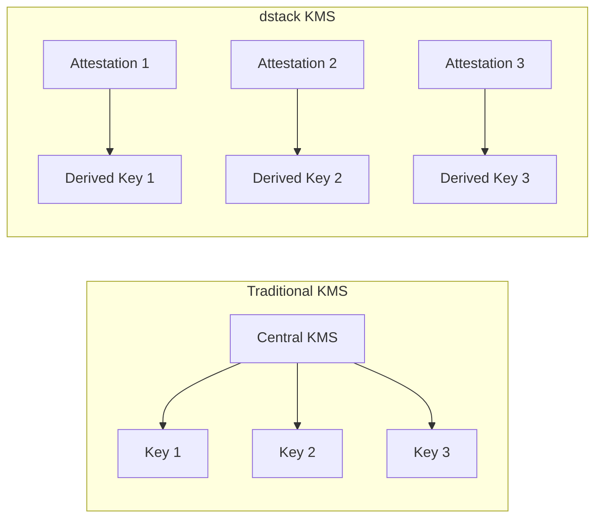

# KMS Security Architecture

**Component:** `dstack-kms` ([source](https://github.com/Dstack-TEE/dstack/tree/master/kms))

## Overview

dStack's Key Management Service (KMS) is the backbone of cryptographic trust in the platform, providing decentralized, hardware-rooted key management for confidential workloads. Unlike traditional KMS solutions that rely on perimeter-based trust and static secrets, dStack KMS fuses Intel TDX hardware attestation, deterministic key derivation, and on-chain authorization to deliver provable, auditable, and scalable key management.

## Architectural Synthesis

dStack KMS represents a paradigm shift in key management: every cryptographic operation is tightly bound to attested hardware state and explicit authorization logic enforced by decentralized smart contracts. This eliminates the risks of centralized storage and static access control lists, ensuring that both key issuance and key usage are independently verifiable and cryptographically auditable.

Instead of storing static secrets, all application and workload keys are derived on-demand from real-time attestation evidence. This enables robust horizontal scaling, flexible workload upgrades, and fine-grained policy governance, all without sacrificing cryptographic assurance. The result is a KMS architecture that delivers both strong confidentiality and transparent, externally verifiable integrity for distributed, cloud-native, and confidential workloads.

## Why Decentralized Key Management?

### Centralization Risks

Traditional KMS solutions introduce single points of failure in both storage and trust. A compromise of the central KMS or its database can expose all managed keys. By contrast, dStack derives all application keys on demand, directly from hardware attestation data, eliminating the risk of key theft via database or infrastructure compromise.

### dStack's Approach

dStack KMS supports three security modes—**non-kms (ephemeral keys), local-key-provider (SGX-sealed keys), and full kms mode (blockchain-authorized, upgradeable keys)**. Each mode is described in the [KMS README overview](https://github.com/Dstack-TEE/dstack/blob/45ebd05a/kms/README.md#overview).

> This overview sets the stage for a deep dive into each architectural and security component of dStack's KMS. Continue reading the following sections for a comprehensive understanding of how each layer contributes to the overall security model.
