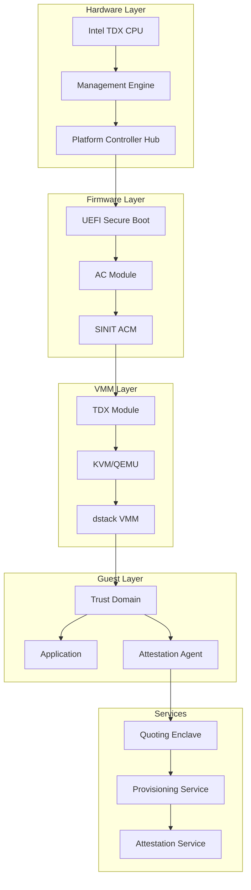
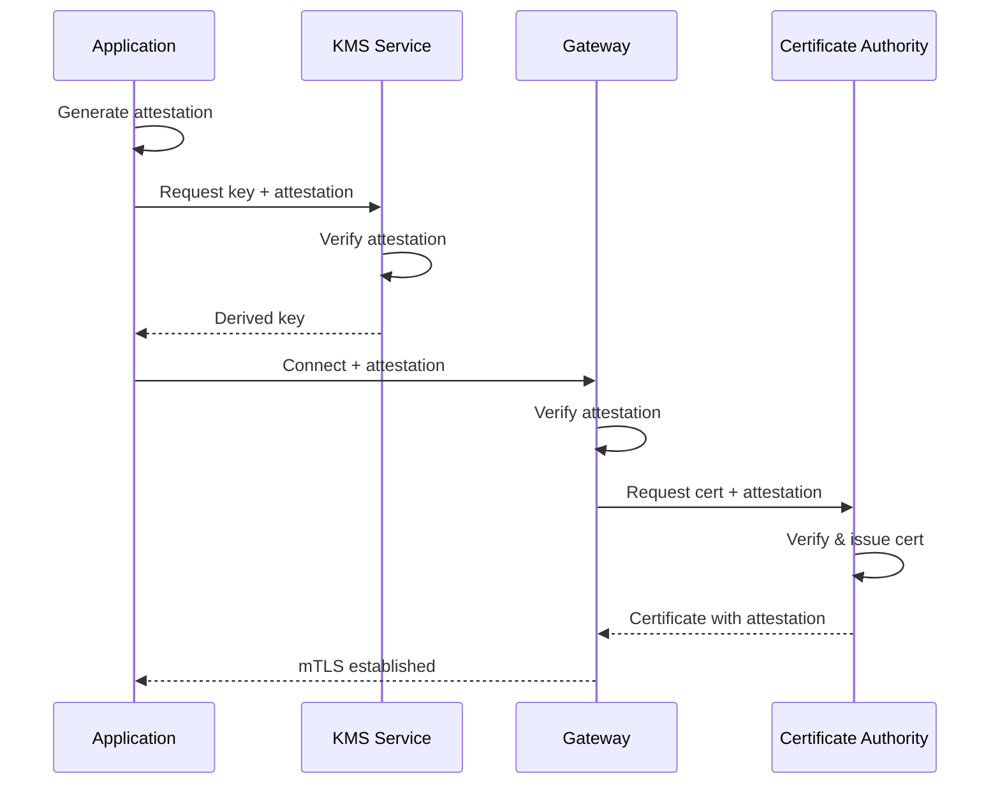

# TDX Attestation System Overview

<Callout type="info" icon="shield-check">
**System Overview** | [Architecture Docs](https://github.com/Dstack-TEE/dstack/tree/master/docs/attestation)
</Callout>

<page_summary>
This page provides a comprehensive overview of the complete TDX attestation system in dstack, including the trust chain from hardware to application, attestation flow between components, and integration patterns for building secure applications on the platform.
</page_summary>

## System Architecture

### Complete Attestation Stack



## Trust Chain

### Hardware Root of Trust

The attestation trust chain begins at the CPU:

1. **CPU Identity**: Each Intel TDX CPU has unique keys fused during manufacturing
2. **Microcode**: Signed microcode updates maintain security properties
3. **TDX Module**: Measured and loaded by ACM (Authenticated Code Module)
4. **TD Measurement**: Hardware-generated measurements of guest state

### Measurement Types

```rust
// Comprehensive measurement structure
pub struct TdxMeasurements {
    // Initial TD measurement
    mrtd: Measurement,
    
    // Configuration measurement
    mrconfigid: Measurement,
    
    // Owner measurement
    mrowner: Measurement,
    
    // Owner configuration
    mrownerconfig: Measurement,
    
    // Runtime measurements (4 registers)
    rtmr: [Measurement; 4],
    
    // Service TD measurements
    servtd_hash: Option<Measurement>,
}
```

## Attestation Flow

### End-to-End Process

<Steps>
  <Step title="TD Initialization">
    VMM creates TD with initial configuration and measurements
  </Step>
  <Step title="Guest Boot">
    Secure boot process extends measurements into RTMR registers
  </Step>
  <Step title="Quote Generation">
    Application requests attestation quote from TDX module
  </Step>
  <Step title="Quote Signing">
    Quoting Enclave signs the quote with Intel-provisioned keys
  </Step>
  <Step title="Verification">
    Verifier checks signature, measurements, and certificate chain
  </Step>
</Steps>

### Detailed Quote Generation

```rust
// From attestation-system/src/quote_generation.rs
pub async fn generate_full_quote(
    user_data: &[u8],
) -> Result<CompleteQuote> {
    // 1. Get TD report from hardware
    let td_report = get_td_report(user_data)?;
    
    // 2. Send to Quoting Enclave
    let qe_report = send_to_qe(td_report).await?;
    
    // 3. Get PCK certificate
    let pck_cert = get_pck_certificate().await?;
    
    // 4. Build quote structure
    let quote = Quote {
        header: QuoteHeader::new(VERSION, ATT_KEY_TYPE),
        report: td_report,
        signature: qe_report.signature,
        auth_data: AuthData {
            signature: qe_report.qe_signature,
            cert_chain: build_cert_chain(pck_cert)?,
        },
    };
    
    Ok(CompleteQuote {
        quote,
        collateral: get_collateral().await?,
    })
}
```

## Component Integration

### Inter-Component Attestation



### Service Dependencies

Each dstack component depends on attestation:

1. **VMM**: Provides initial measurements
2. **KMS**: Derives keys from measurements
3. **Gateway**: Embeds attestation in certificates
4. **Certbot**: Proves TEE residence for certificate issuance
5. **Host API**: Verifies client attestation for API access

## Verification Infrastructure

### Multi-Stage Verification

```rust
// From attestation-system/src/verification.rs
pub struct AttestationVerifier {
    // Intel root certificates
    root_ca: Certificate,
    // Trusted measurements
    trusted_measurements: HashSet<Measurement>,
    // TCB info cache
    tcb_cache: TcbInfoCache,
}

impl AttestationVerifier {
    pub async fn verify_quote(
        &self,
        quote: &Quote,
        expected_data: Option<&[u8]>,
    ) -> Result<VerificationResult> {
        // 1. Verify quote structure
        self.verify_quote_format(quote)?;
        
        // 2. Verify signature chain
        self.verify_signature_chain(&quote.auth_data)?;
        
        // 3. Check TCB status
        let tcb_status = self.check_tcb_status(quote).await?;
        
        // 4. Verify measurements
        self.verify_measurements(&quote.report)?;
        
        // 5. Check user data if provided
        if let Some(data) = expected_data {
            self.verify_report_data(&quote.report, data)?;
        }
        
        Ok(VerificationResult {
            tcb_status,
            measurements: extract_measurements(&quote.report),
            platform_info: self.get_platform_info(quote),
        })
    }
}
```

### TCB Recovery

Handling TCB recovery events:

```rust
// From attestation-system/src/tcb_recovery.rs
pub enum TcbStatus {
    UpToDate,
    ConfigurationNeeded,
    OutOfDate,
    Revoked,
}

pub async fn handle_tcb_recovery(
    quote: &Quote,
) -> Result<TcbRecoveryAction> {
    let tcb_info = fetch_tcb_info(&quote.auth_data).await?;
    
    match tcb_info.status {
        TcbStatus::ConfigurationNeeded => {
            // Requires BIOS/microcode update
            TcbRecoveryAction::UpdateRequired(tcb_info.advisory_ids)
        }
        TcbStatus::OutOfDate => {
            // Security patches available
            TcbRecoveryAction::PatchAvailable(tcb_info.patches)
        }
        TcbStatus::Revoked => {
            // Critical security issue
            TcbRecoveryAction::Reject
        }
        TcbStatus::UpToDate => {
            TcbRecoveryAction::Accept
        }
    }
}
```

## Attestation Policies

### Policy Definition

```yaml
# attestation-policy.yaml
apiVersion: attestation.dstack.dev/v1
kind: AttestationPolicy
metadata:
  name: production-policy
spec:
  # Required TDX features
  required_features:
    - SEPT_VE_DISABLE
    - TDX_DEBUG_DISABLED
  
  # Minimum versions
  min_versions:
    tdx_module: "1.5.0"
    microcode: "0x8e"
  
  # Allowed measurements
  measurements:
    mrtd:
      - "0xabc123..."
      - "0xdef456..."
    mrconfigid:
      - "0x789abc..."
  
  # TCB requirements
  tcb:
    accept_configuration_needed: false
    max_tcb_age_days: 30
```

### Policy Enforcement

```rust
// From attestation-system/src/policy.rs
pub struct PolicyEngine {
    policies: HashMap<String, AttestationPolicy>,
}

impl PolicyEngine {
    pub fn evaluate(
        &self,
        policy_name: &str,
        attestation: &AttestationResult,
    ) -> PolicyDecision {
        let policy = &self.policies[policy_name];
        
        // Check features
        for feature in &policy.required_features {
            if !attestation.has_feature(feature) {
                return PolicyDecision::Deny(
                    format!("Missing required feature: {}", feature)
                );
            }
        }
        
        // Check measurements
        if !policy.measurements.matches(&attestation.measurements) {
            return PolicyDecision::Deny(
                "Measurement mismatch".to_string()
            );
        }
        
        // Check TCB
        if !policy.tcb.is_acceptable(&attestation.tcb_status) {
            return PolicyDecision::Deny(
                "TCB requirements not met".to_string()
            );
        }
        
        PolicyDecision::Allow
    }
}
```

## Performance Optimization

### Caching Strategy

```rust
// From attestation-system/src/cache.rs
pub struct AttestationCache {
    // Quote cache with TTL
    quote_cache: TtlCache<QuoteId, CachedQuote>,
    // Verification result cache
    verification_cache: TtlCache<QuoteHash, VerificationResult>,
    // TCB info cache
    tcb_cache: TcbInfoCache,
}

impl AttestationCache {
    pub fn cache_quote(&mut self, quote: Quote) -> QuoteId {
        let id = QuoteId::from(&quote);
        let cached = CachedQuote {
            quote,
            timestamp: SystemTime::now(),
            ttl: Duration::from_secs(300), // 5 minutes
        };
        
        self.quote_cache.insert(id.clone(), cached);
        id
    }
}
```

## Monitoring & Debugging

### Attestation Events

```rust
// From attestation-system/src/monitoring.rs
#[derive(Debug, Serialize)]
pub struct AttestationEvent {
    timestamp: SystemTime,
    event_type: AttestationEventType,
    td_uuid: Option<Uuid>,
    result: Result<String, String>,
    measurements: Option<MeasurementSummary>,
}

pub enum AttestationEventType {
    QuoteGenerated,
    QuoteVerified,
    PolicyEvaluated,
    TcbUpdated,
    VerificationFailed(String),
}
```

### Debug Tools

```bash
# Attestation debugging commands
dstack attestation debug --quote quote.bin
dstack attestation verify --quote quote.bin --policy prod.yaml
dstack attestation decode --td-report report.bin
dstack attestation measure --vm-id <uuid>
```

## Best Practices

<Tabs>
  <Tab title="Development">
    - Use test attestation keys during development
    - Implement attestation mocking for unit tests
    - Log all attestation events for debugging
    - Cache attestation results appropriately
  </Tab>
  <Tab title="Production">
    - Enforce strict attestation policies
    - Monitor TCB status continuously
    - Implement attestation failure alerts
    - Regular policy reviews and updates
  </Tab>
</Tabs>

## Security Considerations

### Common Pitfalls

1. **Quote Freshness**: Always verify quote age to prevent replay attacks
2. **TCB Updates**: Monitor and apply TCB recovery updates promptly
3. **Policy Drift**: Regularly update policies for new measurements
4. **Clock Synchronization**: Ensure accurate time for quote validation

### Advanced Threats

| Threat | Mitigation | Notes |
|--------|------------|-------|
| Quote relay attacks | Nonce binding | Include fresh nonce in report data |
| Measurement prediction | Randomization | Use random inputs during build |
| TCB downgrade | Version enforcement | Minimum version requirements |
| Side channels | Constant-time ops | Careful implementation required |

## References

- [Intel TDX Attestation Architecture](https://www.intel.com/content/www/us/en/developer/articles/technical/intel-tdx-attestation-architecture-specification.html)
- [Remote Attestation Procedures](https://download.01.org/intel-sgx/latest/dcap-latest/linux/docs/TDX_Attestation_Procedures.pdf)
- [dstack Attestation Design](https://github.com/Dstack-TEE/dstack/blob/master/docs/attestation/DESIGN.md)

<div className="mt-8 p-4 bg-blue-100 rounded-lg border border-blue-300">
  <p className="text-sm text-blue-800">
    <strong>Summary:</strong> The TDX attestation system provides the cryptographic foundation for trust in dstack, enabling secure communication and data protection across all platform components through hardware-rooted attestation.
  </p>
</div> 