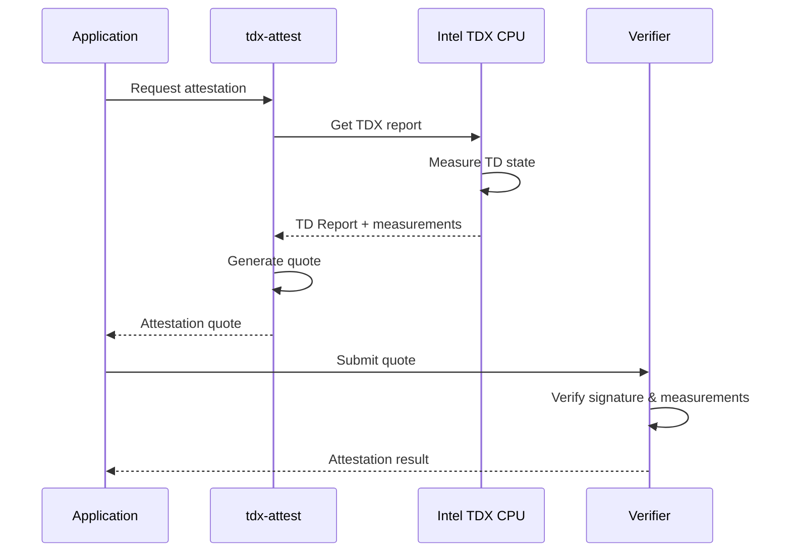

# TDX Attestation Security Analysis

<Callout type="info" icon="fingerprint">
**Component**: `tdx-attest` | [View Source](https://github.com/Dstack-TEE/dstack/tree/master/tdx-attest)
</Callout>

## Overview

The `tdx-attest` crate provides the foundational trust anchor for dstack by implementing Intel Trust Domain Extensions (TDX) remote attestation. This component generates cryptographic proofs that verify:

- Code integrity and measurements
- Hardware TEE presence and configuration
- Runtime isolation guarantees
- Platform security state

## Security Architecture

### Attestation Flow



### Key Security Properties

1. **Hardware-Rooted Trust**
   - CPU generates unforgeable TD reports
   - Private attestation key sealed in hardware
   - Measurements include all security-critical code

2. **Measurement Chain**
   ```rust
   // From tdx-attest/src/lib.rs
   pub struct TdReport {
       // CPU-generated measurements
       mr_config_id: [u8; 48],
       mr_owner: [u8; 48],
       mr_owner_config: [u8; 48],
       // Runtime measurements
       rtmr: [[u8; 48]; 4],
   }
   ```

3. **Quote Generation**
   - ECDSA-384 signatures using Intel provisioned keys
   - Includes nonce for freshness guarantees
   - Binds attestation to specific challenger

## Implementation Analysis

### Core Attestation API

The attestation interface exposes minimal surface area to reduce attack vectors:

```rust
// Simplified from actual implementation
pub fn get_attestation(user_data: &[u8]) -> Result<Quote> {
    // 1. Generate TD report with user data
    let td_report = generate_td_report(user_data)?;
    
    // 2. Request quote from QE (Quoting Enclave)
    let quote = request_quote(td_report)?;
    
    // 3. Return attestation quote
    Ok(quote)
}
```

### Security-Critical Code Paths

1. **Report Generation** ([source](https://github.com/Dstack-TEE/dstack/blob/master/tdx-attest/src/report.rs))
   - Direct CPU instruction (`TDCALL[TDG.MR.REPORT]`)
   - No software intermediaries
   - Includes caller-provided nonce

2. **Quote Verification** ([source](https://github.com/Dstack-TEE/dstack/blob/master/tdx-attest/src/verify.rs))
   - Validates ECDSA signature
   - Checks certificate chain to Intel root
   - Verifies measurements against policy

## Threat Model

### In-Scope Threats
- **Malicious hypervisor**: Cannot forge attestation
- **Runtime attacks**: Detected via RTMR changes
- **Rollback attacks**: Prevented by TCB version checks
- **Man-in-the-middle**: Mitigated by nonce binding

### Out-of-Scope Threats
- Physical CPU attacks
- Intel infrastructure compromise
- Side-channel attacks (partially mitigated)

## Verification Procedures

### For Security Auditors

1. **Verify Quote Structure**
   ```bash
   # Parse and inspect quote
   tdx-attest parse-quote --file quote.bin
   
   # Output includes:
   # - Header version and attestation key type
   # - TD measurements (MRTD, RTMR values)
   # - Signature and certificate chain
   ```

2. **Validate Measurements**
   ```bash
   # Compare against known-good values
   tdx-attest verify --quote quote.bin \
     --mrconfig <expected> \
     --mrtd <expected>
   ```

3. **Certificate Chain Verification**
   - Root: Intel TDX Root CA
   - Intermediate: Platform CA
   - Leaf: Attestation signing key

## Cryptographic Details

### Algorithms
- **Signing**: ECDSA P-384 with SHA-384
- **Key Derivation**: HKDF-SHA384
- **Report MAC**: AES-256-CMAC

### Key Security Parameters
```rust
const REPORT_DATA_SIZE: usize = 64;  // User data in report
const NONCE_SIZE: usize = 16;        // Freshness guarantee
const QUOTE_MIN_SIZE: usize = 1020;  // Minimum valid quote
```

## Integration with dstack

The attestation module integrates with other components:

1. **VMM**: Provides initial measurements
2. **KMS**: Uses attestation for key release
3. **Gateway**: Includes quotes in TLS certificates

## Security Best Practices

<Tabs>
  <Tab title="For Developers">
    - Always verify quotes before trusting remote parties
    - Include fresh nonces in attestation requests
    - Validate entire certificate chain
    - Check TCB status for known vulnerabilities
  </Tab>
  <Tab title="For Operators">
    - Monitor Intel security advisories
    - Update microcode regularly
    - Implement quote caching carefully
    - Log all attestation events
  </Tab>
</Tabs>

## Known Limitations

1. **Performance**: Quote generation takes ~100ms
2. **Availability**: Requires Intel infrastructure
3. **Privacy**: Some metadata exposed in quotes

## References

- [Intel TDX Module 1.5 Specification](https://www.intel.com/content/www/us/en/developer/articles/technical/intel-trust-domain-extensions.html)
- [TDX Attestation Architecture](https://download.01.org/intel-sgx/latest/dcap-latest/linux/docs/TDX_Attestation_Architecture.pdf)
- [dstack Attestation Design Doc](https://github.com/Dstack-TEE/dstack/blob/master/attestation.md)

<div className="mt-8 p-4 bg-blue-50 rounded-lg border border-blue-200">
  <p className="text-sm text-blue-800">
    <strong>Next Component:</strong> Learn how attestation integrates with the <a href="/docs/security-research/vmm-security" className="underline">VMM security architecture</a>.
  </p>
</div> 