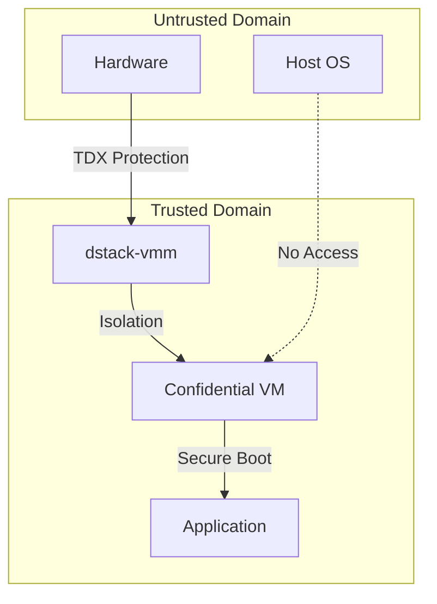

# VMM Security Architecture

`dstack-vmm` ([source](https://github.com/Dstack-TEE/dstack/tree/master/vmm))

The Virtual Machine Monitor (VMM) within the Dstack ecosystem, known specifically as dstack-vmm, serves as the central orchestrator managing the lifecycle and operations of Confidential Virtual Machines (CVMs) running in secure execution environments enabled by Intel Trust Domain Extensions (TDX). Acting as an advanced hypervisor management layer, dstack-vmm abstracts and simplifies the deployment of containerized applications within hardware-enforced trusted boundaries, providing unified mechanisms for VM provisioning, resource allocation, and operational control. It seamlessly integrates key security services, including cryptographic measurement and attestation workflows, through interaction with the Key Management Service (dstack-kms), and ensures secure connectivity via the gateway component (dstack-gateway). With clearly defined interfaces spanning RPC, web-based consoles, and CLI, the VMM enables robust, automated, and flexible management suited for confidential computing environments. Built upon foundational trust in Intel TDX hardware, dstack-vmm’s architecture leverages sophisticated measurement and attestation models, establishing secure execution contexts even amidst potentially compromised host systems, thus combining comprehensive security assurances with practical usability.

## Overview

The `dstack-vmm` serves as the primary security boundary between untrusted host infrastructure and confidential workloads. Its implementation is located in [`vmm/src/main.rs`](https://github.com/Dstack-TEE/dstack/blob/45ebd05a25ad4ffacce3b8f003e4f5a8b609b2e2/vmm/src/main.rs). Built upon QEMU/KVM with Intel TDX extensions, the VMM enforces hardware-backed memory isolation, manages the secure lifecycle of confidential VMs, generates attestation measurements, and mediates resource access—all within a Rust-based architecture designed for robust security guarantees.


---

## Security Model

### Trust Boundaries

*The security model for dstack-vmm is built around strict trust boundaries that separate the untrusted host environment from the confidential workloads running inside secure virtual machines. This model ensures that only the components within the trusted domain—protected by hardware-based isolation—can access sensitive data and operations, while the host and hardware outside this boundary are treated as untrusted. The following diagram illustrates these boundaries and the protections in place:*




### Intel TDX Hardware Security Properties

The VMM leverages Intel TDX (Trust Domain Extensions) to provide hardware-enforced confidential computing. TDX automatically applies AES-256 memory encryption to all guest memory pages and ensures cryptographic integrity, preventing unauthorized modification ([Intel TDX Whitepaper §3.2](https://www.intel.com/content/dam/develop/external/us/en/documents/tdx-whitepaper-final9-17.pdf?utm_source=chatgpt.com)).

Beyond memory encryption, TDX enforces CPU-state isolation by capturing the full register context inside Secure Arbitration Mode (SEAM) and preventing any host-initiated register inspection or tampering during VM exits and entries ([Linux Kernel TDX Documentation](https://www.kernel.org/doc/html/next/x86/tdx.html?utm_source=chatgpt.com)). Address-Translation Integrity protects the guest’s page tables against injection or replay attacks by verifying each update through the Runtime TDX Measurement Registers (RTMRs), which accumulate progressive hashes of firmware, bootloader, kernel, and critical components into a measured-boot chain of trust ([Intel Trust Authority – TD Integrity](https://docs.trustauthority.intel.com/main/articles/concept-td-integrity.html?utm_source=chatgpt.com)).

To instantiate a TDX-protected CVM in QEMU, the VMM configures the VM to use the `q35` machine type—a modern Intel ICH9-style chipset emulation that supports PCI-Express, LPC, and all device models required for confidential computing. Legacy platforms like `i440fx` or `microvm` lack the necessary PCIe infrastructure and cannot host TDX guests ([Intel TDX Whitepaper §2.3](https://cdrdv2-public.intel.com/690419/TDX-Whitepaper-February2022.pdf?utm_source=chatgpt.com); [Wikipedia: Trust Domain Extensions](https://en.wikipedia.org/wiki/Trust_Domain_Extensions?utm_source=chatgpt.com)).

In Dstack’s QEMU wrapper (see [`vmm/src/app/qemu.rs` at commit 45ebd05…#L320](https://github.com/Dstack-TEE/dstack/blob/45ebd05a25ad4ffacce3b8f003e4f5a8b609b2e2/vmm/src/app/qemu.rs#L320)), the invocation appears as:

```rust
command
    .arg("-machine")
    .arg("q35,kernel-irqchip=split,confidential-guest-support=tdx,hpet=off");

let tdx_object = if cfg.use_mrconfigid {
    // Compute mrconfigid for attestation binding...
    format!("tdx-guest,id=tdx,mrconfigid={mrconfigid}")
} else {
    "tdx-guest,id=tdx".to_string()
};
command.arg("-object").arg(tdx_object);
```

* **`confidential-guest-support=tdx`** engages the TDX firmware interface.
* **`kernel-irqchip=split`** offloads interrupt emulation to the kernel’s KVM module for precise delivery under SEAM protection.
* **`hpet=off`** disables legacy timers that can conflict with TDX’s secure interrupt handling.
* **`-object tdx-guest,id=tdx[,mrconfigid=…]`** initializes the Intel TDX guest context and, if supplied, binds the computed MRCONFIGID for attestation.

Finally, the VMM integrates with **dstack-kms** to automate remote attestation: it retrieves Intel TDX quotes—cryptographically signed bundles that bind the RTMR measurement chain to a public key—allowing external verifiers to validate the CVM’s boot sequence and runtime integrity before provisioning secrets. By combining AES-XTS memory encryption, SHA-3 MAC integrity, CPU-state isolation, address-translation integrity, and end-to-end attestation, Intel TDX provides a robust hardware-rooted security foundation that the Dstack VMM orchestrates for confidential computing environments.


## TDX Measurement and Attestation Framework

To ensure that confidential workloads are only executed in a secure and trusted environment, Dstack VMM relies on a robust measurement and attestation process built on Intel TDX. This framework combines a tamper-evident measurement chain with flexible, policy-driven key management. The result: your confidential workloads are launched only on verified hardware and receive cryptographic materials strictly according to policy—never anywhere else.

Before any confidential VM is allowed to run, Dstack VMM must demonstrate that both its hardware and software stack match expected, untampered states. This is achieved through Intel TDX’s Runtime Measurement Registers (RTMRs), which establish a “chain of trust” by cryptographically hashing each stage of the VM’s boot and runtime process:

### 1. Building the Measurement Chain
- **MRTD (Measurement Register for Trust Domain)**  
  The first anchor in our chain: it records a digest of the TDX firmware (TDVF) itself, ensuring we started from the correct trusted foundation [1](#1-0).  
- **RTMR0 (Firmware & Launch Environment)**  
  Captures post-boot firmware bytes and microcode patches, guaranteeing that no rogue microcode or modified SEAM loader was injected [2](#1-1).  
- **RTMR1 (Bootloader & Kernel)**  
  Records the bootloader image and Linux kernel measurement, preventing kernel-level rootkits or patched initrd from slipping through [3](#1-2).  
- **RTMR2 (Initial Userspace & Drivers)**  
  Hashes early userspace components (e.g., initramfs, critical drivers) so that only audited, integrity-checked drivers can execute [4](#1-3).  
- **RTMR3 (Application Manifests & Runtime Libraries)**  
  Extends the chain into higher-level artifacts—application manifests, container images, and dynamic libraries—locking down the exact code you intended to run [5](#1-4).

### 2. Verifying the Chain via Remote Attestation
1. **Quote Generation**  
   The VMM requests a TDX quote, which bundles the current RTMR values with a cryptographic signature from the CPU’s on-die attestation key.  
2. **Quote Validation**  
   An external verifier compares RTMR0–RTMR2 against known-good measurements (e.g., firmware and kernel hashes) and then **replays** the recorded events for RTMR3 to confirm that the exact application content was loaded [6](#1-5).  
3. **Trust Decision**  
   Only if every measurement matches expected values does the verifier signal Dstack VMM to release decryption keys—ensuring that your code runs on a pristine, hardware-backed root of trust.

## dstack-vmm Key Management Integration

Once the Dstack VMM has established a trustworthy execution environment, it must provision encryption keys and certificates to the VM. This is handled by the integrated **dstack-kms**, which supports three flexible boot-time modes:

### 1. Non-KMS Mode (Ephemeral Keys)
- **Use Case:** Development or one-off test VMs where long-term key persistence isn’t needed.  
- **Behavior:** The VMM generates a fresh key pair inside the VM on each launch; keys are discarded at shutdown.  
- **Trust Model:** Relies solely on TDX isolation—no external key authority.

### 2. Local-Key-Provider Mode (SGX-style Sealing)
- **Use Case:** Closed-loop environments where you want keys on-disk but encrypted under hardware.  
- **Behavior:** The VM uses a local sealing key (derived from its TDX identity) to wrap application secrets. On reboot, the same VM can unseal without contacting a remote service.  
- **Trust Model:** Assumes the host disk is untrusted, but the TDX chip enforces secret confidentiality.

### 3. KMS Mode (Remote Key Authority)
- **Use Case:** Production and multi-tenant clouds requiring centralized key governance and audit trails.  
- **Behavior:** After attestation, Dstack VMM authenticates to the dstack-kms service and requests VM-specific certificates and symmetric keys. The KMS verifies the quote, checks policies (e.g., which application IDs are allowed), and only then issues key material over an encrypted channel.  
- **Trust Model:** Combines hardware-rooted attestation with organizational policy—allowing fine-grained access control and monitoring.

### Hierarchical Key Derivation
Regardless of mode, Dstack KMS uses a strict hierarchy:
1. **Root Key** (held in HSM)  
2. **Zone Key** (per tenant or environment)  
3. **VM Key** (derivation bound to RTMR values and VM ID)  
4. **Application Certificates** (leaf keys signed by the VM Key)  
This structure ensures that a compromise at one layer does not leak keys for other tenants or VMs [11](#1-10).

### Attestation Validation Workflow
1. **Quote Receipt:** Dstack VMM hands the TDX quote and measurement log to KMS.  
2. **Integrity Checks:** The KMS replays RTMR events, matches hashes against policy-approved lists, and verifies the CPU signature.  
3. **Policy Enforcement:** Smart contracts or policy engines decide if this VM’s measurements satisfy application requirements.  
4. **Key Issuance:** On success, KMS returns wrapped keys and certificates, which the VMM injects into the VM over a secure vsock channel [12](#1-11).

---

## Implementation Security Details

### Device Isolation Architecture

The VMM enforces a restrictive device model by utilizing only paravirtualized drivers, significantly reducing the attack surface. For network connectivity, it exclusively employs `virtio-net-pci` devices configured with user-mode networking, which provides automatic NAT isolation and port forwarding, as implemented in [qemu.rs#L295](https://github.com/Dstack-TEE/dstack/blob/45ebd05a25ad4ffacce3b8f003e4f5a8b609b2e2/vmm/src/app/qemu.rs#L295).

Storage is confined to `virtio-blk-pci` devices, and direct hardware passthrough is not permitted for storage or other peripherals. The sole exception is for GPU resources, which are attached using VFIO and protected by IOMMU, as detailed in [qemu.rs#L427](https://github.com/Dstack-TEE/dstack/blob/45ebd05a25ad4ffacce3b8f003e4f5a8b609b2e2/vmm/src/app/qemu.rs#L427).

### Memory Security Implementation

Memory isolation is enforced by TDX hardware encryption and secure Extended Page Tables (EPT). When GPU resources are attached, the VMM configures memory backends with hugepage support and applies NUMA-aware memory binding to optimize both security and performance. This is implemented in [`qemu.rs#L379`](https://github.com/Dstack-TEE/dstack/blob/45ebd05a25ad4ffacce3b8f003e4f5a8b609b2e2/vmm/src/app/qemu.rs#L379), where the VMM dynamically assigns memory and CPU resources across NUMA nodes based on GPU placement, ensuring that each NUMA node receives dedicated hugepage-backed memory and CPU allocations, and memory is bound to the appropriate host NUMA node for isolation.

After TD finalization, all guest memory is cryptographically protected and becomes inaccessible to the host, preventing memory snooping attacks.

### Communication Security Channels

Inter-VM communication is restricted to `vhost-vsock-pci` devices, which provide a secure communication channel between host and guest domains, as implemented in [qemu.rs#L358](https://github.com/Dstack-TEE/dstack/blob/45ebd05a25ad4ffacce3b8f003e4f5a8b609b2e2/vmm/src/app/qemu.rs#L358).

The VMM exposes host API services to confidential VMs using vsock addressing (see [app.rs#L487](https://github.com/Dstack-TEE/dstack/blob/45ebd05a25ad4ffacce3b8f003e4f5a8b609b2e2/vmm/src/app.rs#L487)), allowing secure communication channels (e.g., `vsock://2:{port}/api`) without exposing network interfaces to the guest or external attack surfaces.

## Attestation and Verification Mechanisms

### TDX Quote Generation and Validation

The dstack attestation system performs quote verification using Intel's DCAP Quote Verification Library (QVL), as implemented in [ra-tls/src/attestation.rs#L304](https://github.com/Dstack-TEE/dstack/blob/45ebd05a25ad4ffacce3b8f003e4f5a8b609b2e2/ra-tls/src/attestation.rs#L304). The verification process includes checking the quote signature, fetching collateral from PCCS servers, and replaying event logs to ensure RTMR values match the reported measurements. If the replayed RTMRs do not match the values in the quote, or if the report data does not match expectations, the verification fails. TCB attributes are also validated to prevent debug mode execution and ensure the integrity of the attestation chain.

The system validates TCB attributes to prevent debug mode execution, following the logic in [ra-tls/src/attestation.rs#L346](https://github.com/Dstack-TEE/dstack/blob/45ebd05a25ad4ffacce3b8f003e4f5a8b609b2e2/ra-tls/src/attestation.rs#L346), and verifies measurement registers against expected values.

### Event Log Integrity Validation

Runtime measurements are validated by replaying event logs to reconstruct the RTMR values, following the logic in [ra-tls/src/attestation.rs#L422](https://github.com/Dstack-TEE/dstack/blob/45ebd05a25ad4ffacce3b8f003e4f5a8b609b2e2/ra-tls/src/attestation.rs#L422). For each RTMR (0–3), the system iterates through the event log, validates each event digest, and extends the measurement using SHA-384 hashing of the previous value and the event digest. This process ensures the cryptographic integrity of the measurement chain. Event logs are stored in JSON format with cryptographic digests, allowing third parties to independently verify application execution integrity.

### Blockchain-Based Authorization

The security model integrates with Ethereum-compatible smart contracts for authorization decisions, as described in the [KMS implementation documentation](https://github.com/Dstack-TEE/dstack/blob/45ebd05a/kms/README.md#kms-implementation). The `KmsAuth` contract maintains registries of allowed application measurements, OS images, and KMS instance measurements. This approach provides decentralized trust anchors independent of any single authority, enabling transparent and auditable security policies.

## Resource Protection and DoS Prevention

### Resource Isolation Controls

The VMM implements strict resource isolation to defend against resource exhaustion attacks. Administrators can configure maximum limits for vCPUs and memory allocated to each VM on a per-host basis, with default values specified in [`vmm.toml#L28`](https://github.com/Dstack-TEE/dstack/blob/45ebd05a25ad4ffacce3b8f003e4f5a8b609b2e2/vmm/vmm.toml#L28). Disk space allocation is also subject to configurable upper bounds, ensuring that no single VM can consume excessive storage. Additionally, network bandwidth usage can be restricted at the host level, providing further protection against denial-of-service scenarios and ensuring fair resource distribution across all VMs.

### Input Validation and Sanitization

All VM configuration parameters are strictly validated before processing. For instance, image names are limited to a maximum of 64 characters, must only contain alphanumeric characters, underscores, hyphens, or periods, and cannot include directory traversal patterns like `..`. This validation logic is implemented as shown in [app.rs#L141](https://github.com/Dstack-TEE/dstack/blob/45ebd05a25ad4ffacce3b8f003e4f5a8b609b2e2/vmm/src/app.rs#L141). These checks prevent invalid or malicious image names and block directory traversal attacks.

GPU device specifications are validated against PCI addressing formats to prevent injection attacks, following the logic in \[qemu.rs#L558]\([https://github.com/Dstack-TEE/dstack/blob/45ebd05a25](https://github.com/Dstack-TEE/dstack/blob/45ebd05a25)
### API Security and Rate Limiting

The VMM exposes REST APIs through the Rocket framework, with support for authentication tokens and rate limiting as specified in [`vmm.toml#L62C1-L64C12`](https://github.com/Dstack-TEE/dstack/blob/45ebd05a25ad4ffacce3b8f003e4f5a8b609b2e2/vmm/vmm.toml#L62C1-L64C12). Authentication can be enabled or disabled, and tokens are defined in the `[auth]` section of the configuration file.

API access is restricted to specific token sets, and the system offers both Unix socket and network-based communication channels to support various deployment security requirements.

## Security Verification Procedures

### Measurement Validation Process

Security verification begins by building the base OS image from source, establishing known-good measurement values. The [dstack-mr tool](https://github.com/Dstack-TEE/dstack/blob/45ebd05a/attestation.md#22-determining-expected-mrs) is used to calculate expected values for MRTD, RTMR0, RTMR1, and RTMR2, based on the chosen CPU and memory configuration. RTMR3 validation is performed by replaying the event log, ensuring that application-specific measurements are consistent with deployment expectations.

### Cryptographic Chain of Trust

The system implements a hierarchical trust model. The TDX module serves as the hardware root of trust, validating virtual firmware measurements stored in MRTD. The virtual firmware then measures and verifies the Linux kernel, which subsequently measures the initramfs and application components. This creates an unbroken, cryptographically verifiable chain of trust, from hardware all the way up to the application layer. For more detail on the measurement and attestation process, see the [attestation documentation](https://github.com/Dstack-TEE/dstack/blob/45ebd05a/attestation.md).

### Third-Party Verification Capabilities

Applications can use simplified verification by validating KMS-signed certificates, instead of performing full quote verification. The KMS maintains root keys registered in blockchain contracts, supporting signature chain validation—so applications can prove authenticity using KMS-signed credentials. For more on this process, see [validating apps via the KMS auth chain](https://github.com/Dstack-TEE/dstack/blob/45ebd05a/kms/README.md#validating-apps-via-the-kms-auth-chain). This approach reduces verification complexity while still maintaining cryptographic assurance.

## Integration Security Architecture

### KMS Integration Security

The VMM integrates with KMS instances using RA-TLS connections, enabling mutual authentication using TDX quotes. Key derivation uses application-specific identifiers derived from TDX measurements, ensuring cryptographic isolation even for applications running on the same host. For a full explanation of the key derivation process and API usage, see the [getAppKey documentation](https://github.com/Dstack-TEE/dstack/blob/45ebd05a/kms/README.md#getappkey). The platform supports both ephemeral keys for stateless workloads and persistent keys for applications that require continuity.

### Gateway Communication Security

All external communication is routed through the dstack-gateway component, which manages TLS termination and certificate validation. Gateway endpoints are selected dynamically based on the VM and host configuration, following the logic in [app.rs#L467](https://github.com/Dstack-TEE/dstack/blob/45ebd05a25ad4ffacce3b8f003e4f5a8b609b2e2/vmm/src/app.rs#L467). The gateway verifies TDX quotes for all incoming connections and only forwards traffic to confidential VMs that have successfully attested. This provides strong network-level isolation while enabling external access to authorized workloads.

### Certificate Management

TLS certificates are generated via KMS-signed certificate signing requests, creating a PKI hierarchy rooted in hardware-protected keys. The VMM validates certificate chains during connection setup to ensure that all endpoints are cryptographically authenticated. Certificate lifecycle management—including automatic renewal and revocation—is managed through the KMS RPC interface (see [the rpc interface documentation](https://github.com/Dstack-TEE/dstack/blob/45ebd05a/kms/README.md#the-rpc-interface)).

## Threat Model and Risk Assessment

### Mitigated Attack Vectors

This architecture offers comprehensive protection against memory-based attacks by enforcing AES-256 encryption and hardware key management. Hypervisor compromise is mitigated through TDX measurement validation and strict attestation requirements. DMA attacks are prevented using IOMMU for GPU resources and by eliminating direct hardware access for other devices. Exposure to side-channel attacks is minimized by the exclusive use of paravirtualized drivers and limited device exposure.

### Residual Security Considerations

Some residual risks remain. Timing-based side-channel attacks are an ongoing area of research and may require application-level countermeasures. Power analysis attacks require physical access and are largely outside the scope of software-based protections. Microarchitectural vulnerabilities must be addressed with continual microcode and hardware updates. The security model assumes trusted execution of the TDX module and underlying platform hardware.

### Security Monitoring and Incident Response

The VMM implements detailed logging of security-relevant events—including VM lifecycle changes, attestation failures, and resource limit violations—via the [`vm_event_report`](https://github.com/Dstack-TEE/dstack/blob/45ebd05a25ad4ffacce3b8f003e4f5a8b609b2e2/vmm/src/app.rs#L376) function. This system records events, enforces limits on event body size, and tracks types such as `boot.progress`, `boot.error`, and `shutdown.progress` for each VM. Unknown or malformed events are logged for further investigation. Aggregated logs enable detection of abnormal patterns that could indicate compromise attempts. The measurement-based architecture ensures cryptographic audit trails for effective forensic analysis.

## Performance and Security Trade-offs

Memory encryption with TDX introduces an estimated 5% performance overhead, but provides strong protection against host-level attacks. Nested page tables offer robust memory isolation with minimal additional overhead. Device emulation reduces attack surface compared to hardware passthrough, though it can affect performance for I/O-intensive workloads. Measurement validation incurs only minimal runtime overhead, ensuring continuous integrity without major impact.

## Supporting Documentation

- [Intel TDX Architecture Specification](https://www.intel.com/content/www/us/en/developer/tools/trust-domain-extensions/documentation.html)
- [dstack GitHub Repository](https://github.com/Dstack-TEE/dstack)
- [TDX Quote Verification Library](https://github.com/intel/SGXDataCenterAttestationPrimitives)

<div className="mt-8 p-4 bg-green-50 rounded-lg border border-green-200">
  <p className="text-sm text-green-800">
    <strong>Next Component:</strong> Explore how the VMM integrates with <a href="/docs/security-research/kms-security" className="underline">KMS for secure key management</a> and <a href="/docs/security-research/attestation-architecture" className="underline">attestation verification</a>.
  </p>
</div>