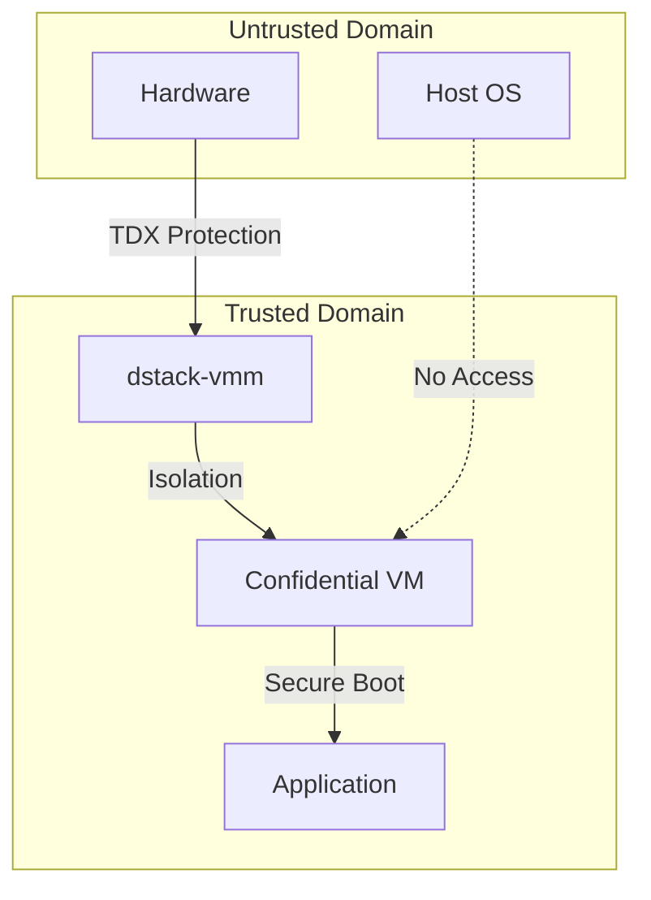

# VMM Security Architecture

<Callout type="info" icon="server">
**Component**: `dstack-vmm` | [View Source](https://github.com/Dstack-TEE/dstack/tree/master/vmm)
</Callout>

## Overview

The Virtual Machine Manager (VMM) is the critical security boundary between untrusted host infrastructure and confidential workloads. Built on QEMU/KVM with TDX extensions, it provides:

- Hardware-enforced memory isolation
- Secure VM lifecycle management
- Attestation measurement generation
- Resource access mediation

## Security Model

### Trust Boundaries



### Key Security Properties

1. **Memory Encryption**
   ```rust
   // From vmm/src/config.rs
   pub struct TdxConfig {
       // Hardware-enforced memory encryption
       memory_encryption: MemoryEncryptionType::TDX,
       // Integrity protection for all guest memory
       integrity_protection: true,
       // Secure EPT (Extended Page Tables)
       secure_ept: true,
   }
   ```

2. **Measurement Generation**
   - Initial TD measurement (MRTD)
   - Configuration measurement (MRCONFIGID)
   - Runtime measurements (RTMR)

3. **Device Isolation**
   - Virtio devices with restricted DMA
   - No direct hardware passthrough
   - Paravirtualized drivers only

## Implementation Details

### VM Creation Flow

```rust
// Simplified from vmm/src/vm_manager.rs
pub async fn create_cvm(config: VmConfig) -> Result<Vm> {
    // 1. Initialize TDX module
    let tdx = TdxModule::init()?;
    
    // 2. Create TD with measurements
    let td = tdx.create_td(TdParams {
        attributes: TdAttributes::default(),
        xfam: ExtendedFeatures::default(),
    })?;
    
    // 3. Load guest firmware
    td.load_firmware(&config.firmware)?;
    
    // 4. Finalize measurements
    td.finalize()?;
    
    Ok(Vm::new(td))
}
```

### Security-Critical Components

1. **Guest Memory Management** ([source](https://github.com/Dstack-TEE/dstack/blob/master/vmm/src/memory.rs))
   - Encrypted memory regions
   - Secure page allocation
   - No host access after TD finalization

2. **Virtual Device Security** ([source](https://github.com/Dstack-TEE/dstack/blob/master/vmm/src/devices.rs))
   - Minimal device surface
   - Input validation on all I/O
   - Rate limiting for DoS prevention

## Threat Analysis

### Mitigated Threats

| Threat | Mitigation |
|--------|------------|
| Host memory snooping | AES-256 memory encryption |
| Hypervisor tampering | TD measurement verification |
| DMA attacks | IOMMU protection + virtio isolation |
| VM escape | Minimal attack surface + fuzzing |
| Side channels | Limited device exposure |

### Residual Risks

1. **Timing attacks**: Partially mitigated via constant-time operations
2. **Power analysis**: Hardware-dependent protection
3. **Microarchitectural attacks**: Ongoing research area

## Verification Procedures

### Security Audit Checklist

<Tabs>
  <Tab title="Configuration Audit">
    ```bash
    # Verify TDX is enabled
    dstack-vmm status --show-tdx
    
    # Check VM isolation
    dstack-vmm audit --vm-id <id> \
      --check-memory-encryption \
      --check-device-isolation
    
    # Validate measurements
    dstack-vmm measure --vm-id <id>
    ```
  </Tab>
  <Tab title="Runtime Monitoring">
    ```bash
    # Monitor security events
    journalctl -u dstack-vmm -f | grep SECURITY
    
    # Check resource limits
    dstack-vmm limits --show-all
    
    # Verify no unauthorized access
    auditctl -w /var/lib/dstack/vms -p rwxa
    ```
  </Tab>
</Tabs>

## Resource Limits & DoS Prevention

```toml
# From vmm/config/security.toml
[limits]
max_memory_per_vm = "32GB"
max_vcpus_per_vm = 16
max_vms_per_host = 10
max_io_bandwidth = "1Gbps"

[rate_limiting]
api_requests_per_second = 100
vm_operations_per_minute = 10
```

## Integration Points

### KMS Integration
- Sealed key release based on measurements
- Runtime attestation for key refresh
- Secure key injection via TD API

### Gateway Communication
- TLS with mutual authentication
- Certificate pinning for API endpoints
- Encrypted control plane messages

## Best Practices

<Note>
**Critical**: Never expose VMM management APIs to untrusted networks. Use the gateway for all external communication.
</Note>

### Deployment Guidelines

1. **Hardware Requirements**
   - Intel CPU with TDX support
   - UEFI Secure Boot enabled
   - Latest microcode updates

2. **Network Isolation**
   - Dedicated management network
   - Firewall rules for API access
   - No direct internet connectivity

3. **Monitoring & Logging**
   - Security event aggregation
   - Anomaly detection for VM behavior
   - Regular measurement verification

## Code Security Patterns

### Input Validation Example
```rust
// From vmm/src/api/handlers.rs
pub fn validate_vm_config(config: &VmConfig) -> Result<()> {
    // Validate memory size
    if config.memory_mb < MIN_MEMORY || config.memory_mb > MAX_MEMORY {
        return Err(Error::InvalidMemorySize);
    }
    
    // Validate CPU count
    if config.vcpus == 0 || config.vcpus > MAX_VCPUS {
        return Err(Error::InvalidVcpuCount);
    }
    
    // Validate firmware path (prevent directory traversal)
    let firmware_path = normalize_path(&config.firmware)?;
    if !firmware_path.starts_with(FIRMWARE_DIR) {
        return Err(Error::InvalidFirmwarePath);
    }
    
    Ok(())
}
```

## Performance vs Security Tradeoffs

| Feature | Security Impact | Performance Impact |
|---------|----------------|-------------------|
| Memory encryption | High protection | ~5% overhead |
| Nested page tables | Isolation | ~2% overhead |
| Device emulation | Attack surface reduction | Variable |
| Measurement updates | Attestation freshness | Minimal |

## References

- [QEMU TDX Support](https://qemu.readthedocs.io/en/latest/system/i386/tdx.html)
- [KVM TDX Patches](https://lore.kernel.org/kvm/)
- [dstack VMM Design](https://github.com/Dstack-TEE/dstack/blob/master/vmm/DESIGN.md)

<div className="mt-8 p-4 bg-green-50 rounded-lg border border-green-200">
  <p className="text-sm text-green-800">
    <strong>Next Component:</strong> Explore how the VMM integrates with <a href="/docs/security-research/kms-security" className="underline">KMS for secure key management</a>.
  </p>
</div> 